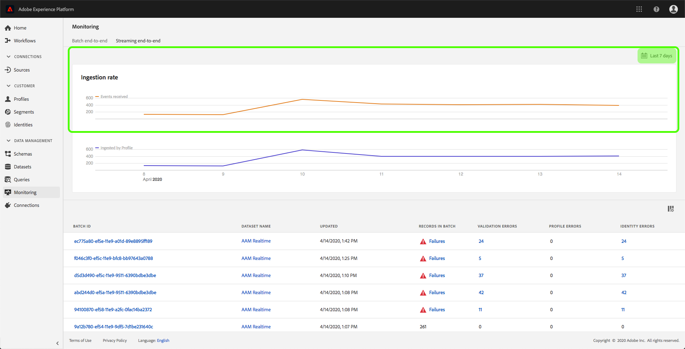

# 监控数据摄取

数据摄取允许您将数据摄取到Adobe Experience Platform。 您可以使用批量摄取，它允许您使用各种文件类型（如CSV）插入数据；或者流摄取，它允许您使用流端点将数据实时摄取到平台。

本用户指南提供了如何在Adobe Experience Platform用户界面中监控数据的步骤。 本指南要求您具有Adobe ID和对Adobe Experience Platform的访问权限。

## 监控端到端的流数据摄取

在 [Experience Platform UI](https://platform.adobe.com)，单击左侧导航菜单上的“ **监视** ”，然后单击 **端到端的流化**。

此时 *将显示“端对端监视* ”流页面。 此工作区提供了一个图表，显示平台接收的流事件率，一个图表，显示由实时客户用户档案成功处理的流事件率 ，以及详细的传入数据列表。

默认情况下，顶部图表显示过去七天的摄取率。 可通过单击高亮显示的按钮来调整此日期范围以显示不同时间段。

底部图显示了过去七天内按用户档案成功处理流事件的速率。 可通过单击高亮显示的按钮来调整此日期范围以显示不同时间段。

> [!NOTE] 要使数据显示在此图上，必须明确启用数 **据** ，以进行用户档案。 要了解如何为用户档案启用流数据，请阅读数据 [集用户指南](../../catalog/datasets/user-guide.md#enable-a-dataset-for-real-time-customer-profile)。

图形下方是所有流摄取记录的列表，这些记录与上面显示的日期范围相对应。 每个列出的批次显示其ID、数据集名称（上次更新时）、批次中的记录数以及错误数（如果有）。 您可以单击任何记录以了解有关该记录的更多详细信息。

### 查看流记录

在查看成功流化记录的详细信息时，会显示所摄取的记录数、文件大小、摄取开始和结束时间等信息。

失败的流记录的详细信息显示与成功记录相同的信息。

此外，失败的记录提供了有关处理批时出现的错误的详细信息。 在以下示例中，验证目录中的datasetId时出现系统错误。

## 监控批量端对端数据摄取

在 [Experience Platform UI中](https://platform.adobe.com)，单击左 **侧导航菜** 单上的“监视”。

出 **现“批端到端监视** ”页，显示先前摄取的批的列表。 您可以单击任何批以了解有关该记录的更多详细信息。

### 查看批

查看成功批次的详细信息时，会显示所摄取的记录数、文件大小、摄取开始和结束时间等信息。

失败批的详细信息显示与成功批相同的信息，添加失败的记录数。

此外，失败的批提供了有关在处理批时出现的错误的详细信息。 在以下示例中，摄取的批次出错，因为它使用了未知字段 `_experience`。

