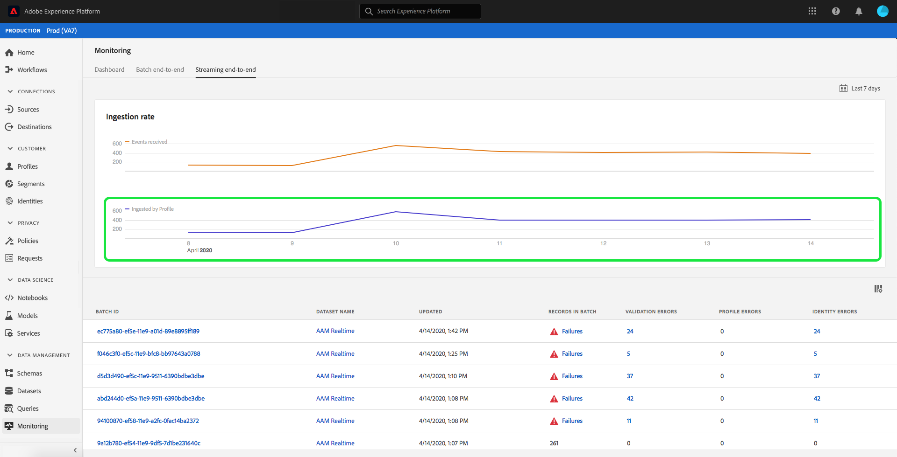

# 监控数据摄取

数据摄取允许您将数据摄取到Adobe Experience Platform。 您可以使用批量摄取(允许您使用各种文件类型（如CSV）插入数据)，或使用流式摄取(允许您将数据摄取到 [!DNL Platform] 实时使用流端点。

本用户指南提供了有关如何在Adobe Experience Platform用户界面中监控数据的步骤。 本指南要求您拥有Adobe ID并访问Adobe Experience Platform。

## 监控端到端数据流摄取 {#monitor-streaming-end-to-end-data-ingestion}

>[!CONTEXTUALHELP]
>id="platform_ingestion_streaming_ingestionrate"
>title="摄取率"
>abstract="每秒成功处理的事件的数目。"
>text="Learn more in the documentation"
>additional-url="http://www.adobe.com/go/monitor-dataflows-en" text="在 UI 中监测源的数据流"

>[!TIP]
>
>要计算特定日期的事件总数，请使用的表达式： `total events / day = ingestion rate * 60 * 60 * 24`.

在 [Experience PlatformUI](https://platform.adobe.com)，选择 **[!UICONTROL 监控]** 在左侧导航菜单中，然后是 **[!UICONTROL 流式处理端到端]**.

的 **[!UICONTROL 流式处理端到端]** 监视页面。 此工作区提供了一个图表，用于显示接收流式处理事件的速率 [!DNL Platform]，一个图表，用于显示已成功处理的流式处理事件的速率 [[!DNL Real-Time Customer Profile]](../../profile/home.md)，以及传入数据的详细列表。

默认情况下，顶部图表显示过去七天的摄取率。 通过选择突出显示的按钮，可以调整此日期范围以显示各种时间段。

下图显示成功处理流式处理事件的速率(按 [!DNL Profile] 过去七天。 通过选择突出显示的按钮，可以调整此日期范围以显示各种时间段。

>[!NOTE]
>
>要在此图表上显示数据，数据必须为 **显式** 为 [!DNL Profile]. 了解如何为 [!DNL Profile]，阅读 [datasets用户指南](../../catalog/datasets/user-guide.md#enable-a-dataset-for-real-time-customer-profile).

图表下方是与上面显示的日期范围对应的所有流摄取记录的列表。 列出的每个批次都会显示其ID、数据集名称、上次更新时的数据集名称、该批次中的记录数以及错误数（如果有）。 您可以选择任何记录以了解有关该记录的更多详细信息。

### 查看流记录

在查看成功流式处理记录的详细信息时，会显示摄取的记录数、文件大小、摄取开始时间和结束时间等信息。

失败的流记录的详细信息显示与成功记录相同的信息。

此外，失败的记录会提供有关处理批处理时发生的错误的详细信息。 在以下示例中，转换或验证数据时发生解析错误。

>[!NOTE]
>
>如果摄取的行中存在错误，则这些行将 **not** 删除，除非生成的消息导致XDM无效。

## 监控批量端到端数据摄取

在 [[!DNL Experience Platform UI]](https://platform.adobe.com)，选择 **[!UICONTROL 监控]** 中。

的 **[!UICONTROL 批量端到端]** “监视”页面，其中显示了先前摄取的批的列表。 您可以选择任意批，以了解有关该记录的更多详细信息。

### 查看批次

查看成功批的详细信息时，会显示摄取的记录数、文件大小、摄取开始时间和结束时间等信息。

失败批次的详细信息显示与成功批次相同的信息，并添加失败记录数。

此外，失败的批次会提供有关处理批次时发生的错误的详细信息。 在以下示例中，摄取的批次出错，因为它具有人员的最大身份数。

>[!NOTE]
>
>如果摄取的行中存在错误，则这些行将 **not** 删除，除非生成的消息导致XDM无效。

