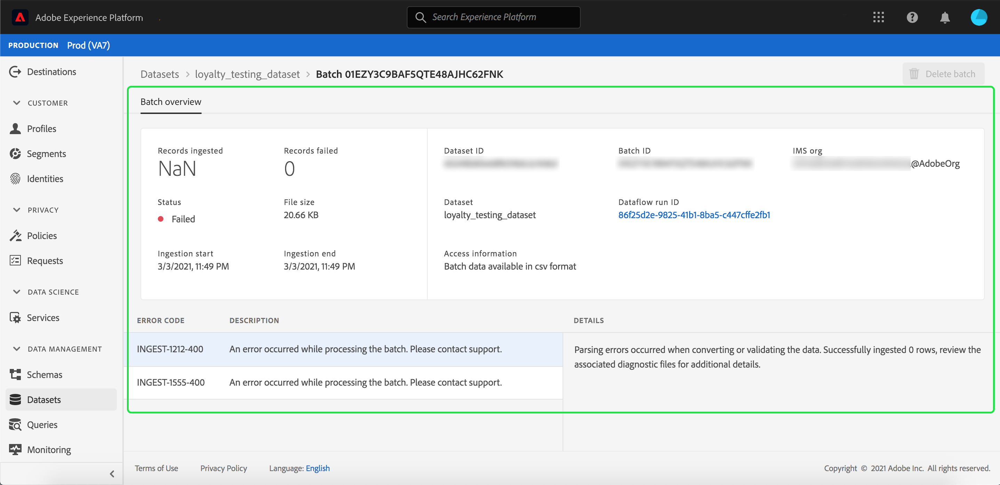

# 监控数据摄取

数据摄取允许您将数据摄取到Adobe Experience Platform。 您可以使用批处理摄取(允许您使用各种文件类型（如CSV）插入数据)或流摄取（允许您使用流端点将数据实时摄取到[!DNL Platform]）。

本用户指南提供了如何在Adobe Experience Platform用户界面中监控数据的步骤。 本指南要求您拥有Adobe ID并访问Adobe Experience Platform。

## 监控端对端数据流摄取

在[Experience PlatformUI](https://platform.adobe.com)中，选择左侧导航菜单中的&#x200B;**[!UICONTROL Monitoring]**，然后选择&#x200B;**[!UICONTROL Streaming end-to-end]**。

将显示&#x200B;**[!UICONTROL Streaming end-to-end]**&#x200B;监视页面。 此工作区提供一个图表，显示[!DNL Platform]接收流事件的速率，一个图表，显示[[!DNL Real-time Customer Profile]](../../profile/home.md)成功处理的流事件的速率，以及传入数据的详细列表。

默认情况下，顶部图表显示过去七天的摄取率。 通过选择高亮显示的按钮，可以调整此日期范围以显示各种时间段。

下图显示了过去七天内[!DNL Profile]成功处理流事件的速率。 通过选择高亮显示的按钮，可以调整此日期范围以显示各种时间段。

>[!NOTE]
>
>要使数据显示在此图表上，数据必须为[!DNL Profile]启用显式&#x200B;**。**&#x200B;要了解如何为[!DNL Profile]启用流数据，请阅读[数据集用户指南](../../catalog/datasets/user-guide.md#enable-a-dataset-for-real-time-customer-profile)。

图形下方是所有流式摄取记录的列表，这些记录与上面显示的日期范围相对应。 每个列出的批次在上次更新时显示其ID、数据集名称、批次中的记录数以及错误数（如果有）。 您可以选择任何记录以了解有关该记录的更多详细信息。

### 查看流记录

查看成功流式传输记录的详细信息时，会显示诸如所摄取的记录数、文件大小、摄取开始和结束时间等信息。

失败的流记录的详细信息显示与成功记录相同的信息。

此外，失败的记录提供了有关处理批时发生的错误的详细信息。 在以下示例中，转换或验证数据时发生了分析错误。

## 监控批处理端对端数据获取

在[[!DNL Experience Platform UI]](https://platform.adobe.com)中，选择左侧导航菜单上的&#x200B;**[!UICONTROL Monitoring]**。

将显示&#x200B;**[!UICONTROL Batch end-to-end]**&#x200B;监视页，其中显示以前摄取的批的列表。 您可以选择任何批以了解有关该记录的更多详细信息。

### 查看批

查看成功批处理的详细信息时，会显示所摄取的记录数、文件大小、摄取开始和结束时间等信息。

失败批处理的详细信息显示与成功批处理相同的信息，添加失败的记录数。

此外，失败的批次提供有关处理批次时发生的错误的详细信息。 在以下示例中，摄取的批次出错，因为它具有该人员的最大身份数。

