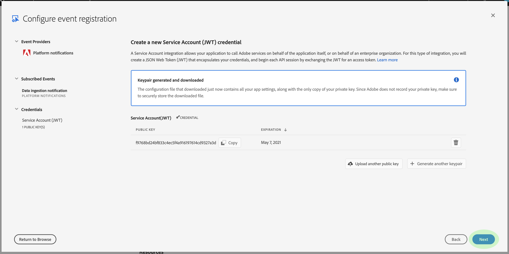

# 数据获取通知

将数据引入Adobe Experience Platform的过程由多个步骤组成。 确定需要引入平台的数据文件后，摄取过程开始并连续执行每个步骤，直到成功摄取或失败。 可以使用Adobe Experience Platform Data Ingestion API或 [使用Experience Platform用户界面启动](https://www.adobe.io/apis/experienceplatform/home/api-reference.html#!acpdr/swagger-specs/ingest-api.yaml) “摄取过程”。

加载到平台中的数据必须经过多个步骤才能到达其目标、数据湖或实时客户用户档案数据存储。 每个步骤都包括处理数据、验证数据，然后在将数据传递到下一步之前存储数据。 根据所摄取的数据量，这可能会成为一个耗时的过程，并且始终有由于验证、语义或处理错误而导致该过程失败的可能。 在故障事件，需要修复数据问题，然后必须使用更正的数据文件重新启动整个摄取过程。

为了帮助监视摄取过程，Experience Platform允许订阅一组在该过程的每个步骤发布的事件，通知您所摄取数据的状态和任何可能的故障。

## 可用状态通知事件

以下是可订阅的可用数据获取状态通知列表。

>[!NOTE] 只为所有数据获取通知提供一个事件主题。 为了区分不同的状态，可以使用事件代码。

| 平台服务 | 状态 | 事件描述 | 事件代码 |
| ---------------- | ------ | ----------------- | ---------- |
| 数据登陆 | success | 摄取——批处理成功 | ing_load_success |
| 数据登陆 | 失败 | 摄取——批处理失败 | ing_load_failure |
| 实时客户资料 | success | 用户档案服务——数据加载批处理成功 | ps_load_success |
| 实时客户资料 | 失败 | 用户档案服务——数据加载批处理失败 | ps_load_failure |
| 身份图 | success | 标识图——数据加载批成功 | ig_load_success |
| 身份图 | 失败 | 标识图——数据加载批处理失败 | ig_load_failure |

## 通知有效负荷模式

数据摄取通知事件模式是一个体验数据模型(XDM)模式，包含提供有关所摄取数据状态的详细信息的字段和值。 请访问公共XDM GitHub回购协议，以视图最新通知 [有效负荷模式](https://github.com/adobe/xdm/blob/master/schemas/common/notifications/ingestion.schema.json)。

## 订阅数据获取状态通知

通 [过Adobe I/O事件](https://www.adobe.io/apis/experienceplatform/events.html)，您可以使用网络挂接订阅多种通知类型。 以下各节概述了使用Adobe开发人员控制台为数据获取事件订阅平台通知的步骤。

### 在Adobe开发人员控制台中创建新项目

转到 [Adobe Developer Console](https://www.adobe.com/go/devs_console_ui) ，使用您的Adobe ID登录。 接下来，按照教程中概述的步 [骤操作，在Adobe](https://www.adobe.io/apis/experienceplatform/console/docs.html#!AdobeDocs/adobeio-console/master/projects-empty.md) Developer Console文档中创建空项目。

### 将Experience Platform事件添加到项目

创建新项目后，导航到该项目的概述屏幕。 在此处，单击“ **[!UICONTROL 添加事件]**”。

将出 _[!UICONTROL 现“添加事件]_”对话框。 单击**[!UICONTROL  Experience Platform ]**，以过滤可用选项的列表，然后单击**[!UICONTROL &#x200B;平台通知&#x200B;]**，再单**[!UICONTROL &#x200B;击下一步&#x200B;]**。

下一个屏幕显示一列表事件类型进行订阅。 选择 **[!UICONTROL 数据获取通知]**，然后单击 **[!UICONTROL 下一步]**。

下一个屏幕会提示您创建JSON Web令牌(JWT)。 您可以选择自动生成密钥对，或上传您自己在终端中生成的公钥。

就本教程而言，将遵循第一个选项。 单击“生成键 **[!UICONTROL 对”选项框]**，然后单击 **[!UICONTROL 右下角的]** “生成键对”按钮。

当密钥对生成时，浏览器会自动下载该密钥对。 您必须自己存储此文件，因为它不会保留在开发人员控制台中。

下一个屏幕允许您查看新生成的密钥对的详细信息。 单击&#x200B;**[!UICONTROL 下一步]**&#x200B;以继续。

在下一个屏幕中，提供事件注册的名称和说明。 最佳实践是创建一个唯一、易于识别的名称，以帮助区分此事件注册与同一项目中的其他客户。

在同一屏幕的下方，您可以选择配置如何接收事件。 **[!UICONTROL Webhook]** 允许您提供自定义Webhook地址来接收事件，而 **[!UICONTROL Runtime操作]** 则允许您使用Adobe I/O [Runtime进行相同操作](https://www.adobe.io/apis/experienceplatform/runtime/docs.html)。

本教程将跳过此可选配置步骤。 完成后，单击“保 **[!UICONTROL 存配置的事件]** ”以完成事件注册。

随后将显示新创建的事件注册的详细信息页面，您可以在该页面中查看接收的事件、执行调试跟踪并编辑其配置。

## 后续步骤

将平台通知注册到项目后，您便可以视图从项目仪表板收到的事件。 有关如何跟 [踪事件的详细说明](https://www.adobe.io/apis/experienceplatform/events/docs.html#!adobedocs/adobeio-events/master/support/tracing.md) ，请参阅“跟踪Adobe I/O事件”指南。
