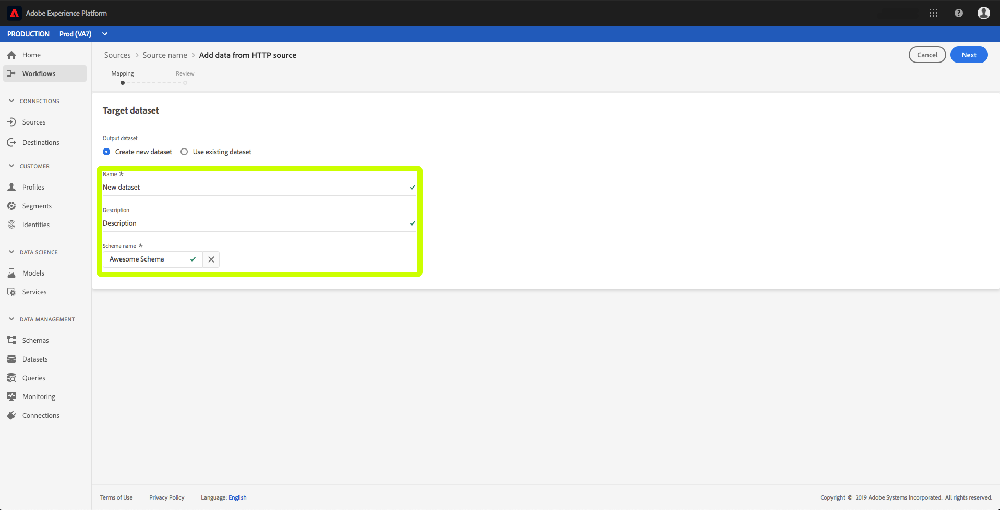

# 使用UI创建流连接

此UI指南将帮助您使用Adobe Experience Platform创建流连接。

## 入门指南

要将流数据开始 [!DNL Experience Platform]到，您必须先创建流HTTP连接。 创建流连接时，您需要提供关键详细信息，如流数据源，以及您是否打算从受信任（已验证）或不受信任的（未验证）源发送数据。

注册流连接后，您将有一个唯一的URL，可用于将数据流化到 [!DNL Platform]。

请注意，要完成本指南，您需要访问Adobe Experience Platform。 如果您无权访问，请在继 [!DNL Platform]续操作之前与您的系统管理员联系。

## 创建流连接

登录UI后，单 [!DNL Experience Platform] 击“ **[!UICONTROL 源]** ”以打 **[!UICONTROL 开“目录]** ”选项卡。 此页将可用的源类型显示为单个卡，每个卡都包含一个气泡，该气泡显示从与数据集的流连接创建的数据流数。

在“源 **[!UICONTROL ”页]** ，单击 **[!UICONTROL HTTP API]**，然 **[!UICONTROL 后单击Connect源]**。

出 **[!UICONTROL 现“Connect to HTTP]** ”屏幕。 在“ **[!UICONTROL 服务详细信息]**”下，为新 **[!UICONTROL 流连接]** 提供名称 **[!UICONTROL 和说明]** 。

在“ **[!UICONTROL 帐户身份验证]**”下，为流连接选择以下配置属性：

- **[!UICONTROL 身份验证]:** 流连接是否需要身份验证。 身份验证确保从可信源收集数据。 建议在处理个人身份信息(PII)时启用此选项。
- **[!UICONTROL XDM模式兼容性]:** 此流连接是否将发送与XDM事件兼容的模式。 默认情况下，此属性处于打 **开状态**。

选择完配置属性后，单击“ **[!UICONTROL Connect]**”。 您的流式HTTP连接现已创建，现在可在“源”工作区的“浏 **[!UICONTROL 览]** ”选项卡下 **[!UICONTROL 查看]** 。

在“浏 **[!UICONTROL 览]** ”选项卡中，您可以单击新创建的流式HTTP连接并视图该连接的详细信息。

通过单击连接名称的超链接，您可以通过单击选择数据来配置要连接的数据集，从而选择要显 **[!UICONTROL 示的数据]**。

您可以创 [建新数据集](#create-a-new-dataset) , [或使用现有数据集](#use-an-existing-dataset)。

### 创建新数据集

要创建新数据集，请提 **[!UICONTROL 供]** Name ****、 **[!UICONTROL Description]** ，以及数据集的目标模式。

插入所有详细信息并单击“ **[!UICONTROL 下一步]**”后，您可以查看提供的详细信息，然 **[!UICONTROL 后单击]** “完成”将数据集连接到流HTTP连接。

### 使用现有数据集

要使用现有数据集，请选择“输 **[!UICONTROL 出”数据集名称]**。

单击“ **[!UICONTROL 下一]**&#x200B;步”后 **[!UICONTROL ，您可以查看详细信息，然后单击“完]** 成”将所选数据集连接到流HTTP连接。

## 后续步骤

通过本教程，您已创建了流式HTTP连接，使您能够使用流式端点访问各种 [!DNL Data Ingestion] API。 有关在API中创建流连接的说明，请阅读创建 [流连接教程](../tutorials/create-streaming-connection.md)。
