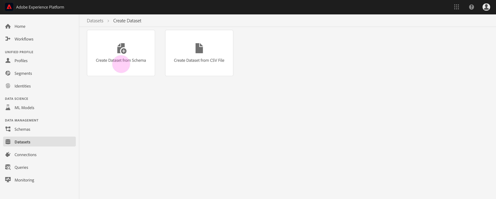

# 将数据引入Adobe Experience Platform

Adobe Experience Platform允许您将数据作为批处理文件轻松导入到平台中。 要摄取的数据的示例可包括来自CRM系统（例如镶木文件）中的平面文件的用户档案数据或符合模式注册表中的已知体验数据模型(XDM)模式的数据。

## 入门指南

要完成本教程，您必须具有Experience Platform的访问权限。 如果您无权访问Experience Platform中的IMS组织，请在继续操作之前与系统管理员联系。

如果您希望使用Data Ingestion API收录数据，请首先阅读 [Batch Ingestion开发人员指南](../batch-ingestion/api-overview.md)。

## 数据集工作区

Experience Platform中的数据集工作区允许您视图和管理IMS组织创建的所有数据集，并创建新数据集。

视图数据集工作区，方法是 **单击左侧导航** 中的数据集。 数据集包含数据集的列表，包括显示 _Name_、 _Source_ (date and time)的列、 _Source_、 ______ SourceBatch、And Last StatusAdast(数据模式)的列，例如日期和创建的上次更新的“上次更新时间”的时间。

>[!NOTE] 单击搜索栏旁边的筛选器图标以使用筛选功能仅视图那些启用用户档案的数据集。

## 创建数据集

要创建数据集，请单击“ **数据集** ”工作区右上角的“创建数据集”。

在“创 **建数据集** ”屏幕上，选择“从模式创建数据集”还是“从CSV文件创建数据集”。

在本教程中，将使用模式创建数据集。 单击 **从模式创建数据集** ，继续。

## 选择数据集模式

在“选 **择模式** ”屏幕上，单击要使用的模式旁边的单选按钮，以选择模式。 在本教程中，将使用“忠诚度成员”模式创建数据集。 使用搜索栏筛选模式是查找所寻找的准确模式的有用方法。

选择要使用的模式旁边的单选按钮后，单击“下一 **步”**。

## 配置数据集

在“配 **置数据集** ”屏幕上，您需要为数据集指定名称 **，并且可能还提供数据集的** 描述 **** 。

**数据集名称上的注释：**

- 数据集名称应简短且具有描述性，以便以后可以在库中轻松找到数据集。
- 数据集名称必须是唯一的，这意味着该名称也应足够具体，以便将来不会重用。
- 最好使用描述字段提供有关数据集的其他信息，因为这可能有助于其他用户将来区分不同的数据集。

数据集有名称和说明后，单击“完 **成”**。

## 数据集活动

现在已创建空数据集，并且您已返回到“数据集”工作区 **中的“数据集活动** ”选项卡。 您应当在工作区的左上角看到数据集的名称，并看到通知“尚未添加批次”。 由于您尚未向此数据集添加任何批，因此应该这样做。

在数据集的右侧，您将看到与新数据集相关的 **Info**______________ AS、ADD、AD D和A D表名称、AD D模式名称、A D D源、A D流和A D等新工作区的标签信息。 “信息”选项卡还包含有关数据集创建时间及其上次修 _改_ 日期 _的信息_ 。

“信息”选项卡中还有一个 _用户档案切换_ ，用于启用数据集以与实时客户用户档案一起使用。 此切换和实时客户用户档案的使用将在下一节中有更详细的说明。

## 为实时客户用户档案启用数据集

数据集用于将数据引入Experience Platform，数据最终用于识别个人并整合来自多个来源的信息。 拼凑信息称为实时客户用户档案。 为了让平台了解实时用户档案中应包含哪些信息，可以使用用户档案切换来标记数据集以包 **含** 。

默认情况下，此切换处于关闭状态。 如果选择打开用户档案，则所有摄取到数据集中的数据都将用于帮助识别个人并拼接其实时用户档案。

要了解有关实时客户用户档案和使用身份的更多信息，请查阅 [Identity Service文档](../../identity-service/home.md) 。

要为实时客户用户档案启用数据集，请单击“信息 **** ”选项卡中的 **用户档案切换** 。

将显示一个对话框，要求您确认是否要为实时客户用户档案启用数据集。

单击 **启用** ，切换将变为蓝色，表示它已打开。

## 向数据集添加数据

数据可以通过多种不同的方式添加到数据集中。 您可以选择使用Data Ingestion API或ETL合作伙伴，如Unifi或Informatica。 在本教程中，将使用UI中的“添加数据”选项 **卡将数据添加** 到数据集。

要开始向数据集添加数据，请单击“添加数 **据”选项卡** 。 您现在可以拖放文件或浏览计算机以查找要添加的文件。

>[!NOTE] 平台支持两种文件类型以获取数据，分别采用镶木地板或JSON。 一次最多可以添加五个文件，每个文件的最大文件大小为10 GB。

## 上传文件

拖放（或浏览并选择）要上传的镶木地板或JSON文件后，平台将立即开始处理该文件，并且“ **Uploading** ”(添加数据 **)选项卡上将显示一个“Uploading** ”（上传）对话框，其中显示文件上传的进度。

## 数据集指标

文件完成上传后，“数据集 **活动** ”选项卡不再显示“尚未添加批次”。 现在，“数据集活动”选项卡显示数据集度量。 由于尚未加载批，因此所有度量在此阶段都将显示“0”。

该选项卡的底部有一个列表，显示刚刚通过“向数据集添加数据”过程摄取的 _数据的批量ID_ 。 还包括与批相关的信息，包括 _摄取日期_ 、摄取的 _记录数和当前批状_&#x200B;态 __。

## 批详细信息

单击批 _ID以视图批_ 概述 ****，显示有关该批的其他详细信息。 批完成加载后，有关该批的信息将更新以显示“摄取的记录数”和“ _文件_ ” _大小_。 “状 _态_ ”也将更改为“成功”或“失败”。 如果批处理失败，“错 _误代码_ ”部分将包含有关摄取过程中任何错误的详细信息。

有关批量摄取的详细信息和常见问题解答，请参阅“批量摄取” [疑难解答指南](../batch-ingestion/troubleshooting.md)。

要返回到“数 **据集活动** ”屏幕，请单击痕迹导航中的数据集名称(_Loyalty Details_)。

## 预览数据集

数据集准备就绪后，“数据集 **预览** ”选项卡顶部会显 **示一个活动数据集** 。

单击 **预览数据集** ，打开一个对话框，其中显示数据集中的样本数据。 如果使用模式创建数据集，则数据集模式的详细信息将显示在预览的左侧。 您可以使用箭头展开模式以查看模式结构。 预览数据中的每个列标题都表示数据集中的一个字段。

## 后续步骤

现在，您已创建数据集并成功将数据摄取到Experience Platform中，您可以重复这些步骤以创建新数据集或将更多数据摄取到现有数据集中。

要了解有关批量摄取的更多信息，请阅读批 [量摄取概述](../batch-ingestion/overview.md)。
