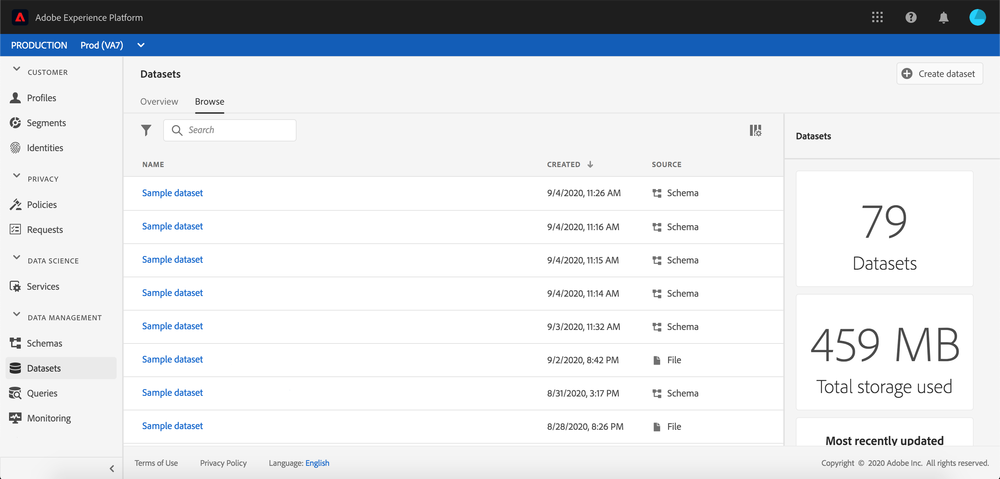

# 将数据引入Adobe Experience Platform

Adobe Experience Platform允许您将数据轻松导入 [!DNL Platform] 为批处理文件。 要摄取的用户档案的示例可包括来自CRM系统中的平面文件（例如镶木文件）的数据或符合模式注册中的已知( [!DNL Experience Data Model] XDM)模式的数据。

## 入门指南

要完成本教程，您必须具有访问权限 [!DNL Experience Platform]。 如果您无权访问中的IMS组织，请在继 [!DNL Experience Platform]续操作之前与系统管理员联系。

如果您希望使用Data Ingestion API收集数据，请首先阅读Batch Ingestion开 [发人员指南](../batch-ingestion/api-overview.md)。

## 数据集工作区

其中的数据集 [!DNL Experience Platform] 工作区允许您视图和管理IMS组织创建的所有数据集，并创建新数据集。

视图数据集工作区 **[!UICONTROL ，方法]** 是单击左侧导航中的数据集。 数据集工作区包含一列表数据集，包括显示名称、创建（日期和时间）、源、模式和上次批处理状态的列，以及上次更新数据集的日期和时间。

>[!NOTE]
>
>单击搜索栏旁边的筛选器图标，以使用筛选功能仅视图那些启用的数据集 [!DNL Profile]。

## 创建数据集

要创建数据集，请单 **[!UICONTROL 击“数据集]** ”工作区右上角的“创建数据集”。

在“创 **[!UICONTROL 建数据集]** ”屏幕上，选择“从模式创[!UICONTROL 建数据集]”还是“从CSV[!UICONTROL 文件创建数据集]”。

在本教程中，将使用模式创建数据集。 单击 **[!UICONTROL 从模式创建数据集]** ，继续。

## 选择数据集模式

在“选 **[!UICONTROL 择模式]** ”屏幕上，通过单击要使用的模式旁边的单选按钮来选择模式。 在本教程中，将使用Loyalty Members模式创建数据集。 使用搜索栏筛选模式是找到您正在寻找的确切模式的有用方法。

选择要使用的模式旁的单选按钮后，单击“下一 **[!UICONTROL 步”]**。

## 配置数据集

在“配 **[!UICONTROL 置数据集]** ”屏幕上，您将需要为数据集指定名称，并可能还提供数据集的描述。

**数据集名称的注释：**

- 数据集名称应简短且具有描述性，以便以后可以在库中轻松找到该数据集。
- 数据集名称必须唯一，这意味着它也应足够具体，以便将来不再重用。
- 最好使用描述字段提供有关数据集的其他信息，因为这可能有助于其他用户将来区分不同数据集。

数据集有名称和说明后，单击“完 **[!UICONTROL 成”]**。

## 数据集活动

现在已创建空数据集，您已返回到“数据集”工 **[!UICONTROL 作区中的]** “数据集活动”选项卡。 您应当在工作区的左上角看到数据集的名称，并显示通知“尚未添加批次”。 由于尚未向此数据集添加任何批，因此应该设置此值。

在“数据集”工作区的右侧，您将看到“信 **[!UICONTROL 息]** ”选项卡，其中包含与新数据集相关的信息，如数据集ID、名称、描述、表名、模式、流和源。 “信息”选项卡还包括有关数据集创建时间及其上次修改日期的信息。

“信息”选项卡中还有 **[!UICONTROL 用户档案]** 切换选项，用于启用数据集以与一起使用 [!DNL Real-time Customer Profile]。 此切换的使用 [!DNL Real-time Customer Profile]将在后面的部分中进行更详细的说明。

## 为 [!DNL Real-time Customer Profile]

数据集用于将数据引入 [!DNL Experience Platform]数据中，而数据最终用于识别个体并整合来自多个来源的信息。 拼凑信息称为 [!DNL Real-Time Customer Profile]。 为了了 [!DNL Platform] 解应包含哪些信息，可 [!DNL Real-Time Profile]以使用用户档案切换标记要包 **[!UICONTROL 含的数]** 据集。

默认情况下，此切换关闭。 如果选择打开， [!DNL Profile]则所有摄取到数据集中的数据都将用于帮助识别个人并将其拼接在一起 [!DNL Real-Time Profile]。

要进一步了解 [!DNL Real-time Customer Profile] 和使用身份，请查阅Identity [Service文档](../../identity-service/home.md) 。

要启用数据集 [!DNL Real-time Customer Profile]，请单击“ **[!UICONTROL 信息]** ”选项卡中 **[!UICONTROL 的用户档案]** 切换。

将显示一个对话框，要求您确认要为启用数据集 [!DNL Real-time Customer Profile]。

单击 **[!UICONTROL “启]** 用”，切换将变为蓝色，表示它已打开。

## 将数据添加到数据集

数据可以通过多种不同的方式添加到数据集中。 您可以选择使 [!DNL Data Ingestion] 用API或ETL合作伙伴， [!DNL Unifi] 如或 [!DNL Informatica]。 在本教程中，将使用UI中的添加数据选 **[!UICONTROL 项卡]** ，将数据添加到数据集。

要开始向数据集添加数据，请单击“添加 **[!UICONTROL 数据]** ”选项卡。 您现在可以拖放文件或浏览计算机以查找要添加的文件。

>[!NOTE]
>
>平台支持两种文件类型进行数据获取，分别采用镶木地板或JSON。 一次最多可以添加五个文件，每个文件的最大文件大小为10 GB。

## 上传文件

拖放（或浏览并选择）要上传的镶木或JSON文件后，将立 [!DNL Platform] 即开始处理该文件，并且“ **[!UICONTROL 上传]** ”对话框将显示在“添加数 **[!UICONTROL 据]** ”选项卡上，其中显示文件上传的进度。

## 数据集指标

文件上传完毕后，“数 **[!UICONTROL 据集活动]** ”选项卡不再显示“尚未添加批”。 现在，“数据集 **[!UICONTROL 活动]** ”选项卡显示数据集指标。 由于尚未加载批，因此所有指标在此阶段都将显示“0”。

该选项卡的底部有一个列表，显示 **[!UICONTROL 刚通过]** “将数据添加到数据集” [过程摄取的数据的批ID](#add-data-to-dataset) 。 还包括与批相关的信息，包括摄取日期、摄取的记录数和当前批状态。

## 批详细信息

单击批 **[!UICONTROL ID以视图]** “批 **[!UICONTROL 概述”，显]**&#x200B;示有关该批的其他详细信息。 完成批处理加载后，有关该批处理的信息将更新，以显示所摄取的记录数和文件大小。 状态还将更改为“成功”或“失败”。 如果批处理失败，“ **[!UICONTROL 错误代码]** ”部分将包含有关获取过程中任何错误的详细信息。

有关批量摄取的更多信息和常见问题，请参阅批 [量摄取疑难解答指南](../batch-ingestion/troubleshooting.md)。

要返回到“数 **[!UICONTROL 据集活动]** ”屏幕，请单击痕迹导航中的数&#x200B;**[!UICONTROL 据集名称(]** Loyalty Details)。

## 预览数据集

数据集准备就绪后，“数据集 **[!UICONTROL 预览]** ”选项卡的顶 **[!UICONTROL 部将显示]** “活动数据集”。

单击 **[!UICONTROL 预览数据集]** ，打开一个对话框，其中显示数据集中的样本数据。 如果数据集是使用模式创建的，则数据集模式的详细信息将显示在预览的左侧。 您可以使用箭头展开模式以查看模式结构。 预览数据中的每个列标题都表示数据集中的一个字段。

## 后续步骤和其他资源

现在，您已创建数据集并成功将数据 [!DNL Experience Platform]摄取到其中，您可以重复这些步骤以创建新数据集或将更多数据摄取到现有数据集中。

要进一步了解批摄取，请阅读批摄 [取概述](../batch-ingestion/overview.md) ，并通过观看以下视频补充您的学习。

>[!WARNING]
>
>以 [!DNL Platform] 下视频中显示的UI已过期。 有关最新的UI屏幕截图和功能，请参阅上面的文档。

>[!VIDEO](https://video.tv.adobe.com/v/27269?quality=12&learn=on)