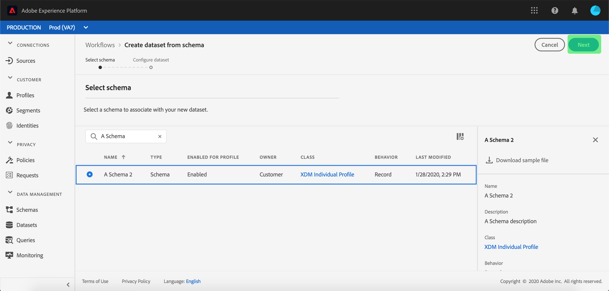

# 将数据引入Adobe Experience Platform

Adobe Experience Platform允许您将数据作为批处理文件轻松导入[!DNL Platform]。 要摄取的用户档案的示例可包括来自CRM系统中的平面文件（如Parke文件）的模式数据或符合模式注册表中的已知[!DNL Experience Data Model](XDM)的数据。

## 入门指南

要完成本教程，您必须具有对[!DNL Experience Platform]的访问权限。 如果您无权访问[!DNL Experience Platform]中的IMS组织，请在继续操作前与系统管理员联系。

如果您希望使用数据摄取API来摄取数据，请首先阅读[批摄取开发人员指南](../batch-ingestion/api-overview.md)。

## 数据集工作区

[!DNL Experience Platform]中的数据集工作区允许您视图和管理IMS组织创建的所有数据集，以及创建新数据集。

视图数据集工作区，方法是单击左侧导航中的&#x200B;**[!UICONTROL 数据集]**。 数据集工作区包含一列表数据集，包括显示名称、创建（日期和时间）、源、模式和上次批处理状态的列，以及上次更新数据集的日期和时间。

>[!NOTE]
>
>单击搜索栏旁边的筛选器图标，以使用筛选功能仅视图那些为[!DNL Profile]启用的数据集。

## 创建数据集

要创建数据集，请单击“数据集”工作区右上角的&#x200B;**[!UICONTROL 创建数据集]**。

在&#x200B;**[!UICONTROL 创建数据集]**&#x200B;屏幕上，选择“[!UICONTROL 从模式]创建数据集”还是“[!UICONTROL 从CSV文件]创建数据集”。

在本教程中，将使用模式创建数据集。 单击&#x200B;**[!UICONTROL 从模式]**&#x200B;创建数据集以继续。

## 选择数据集模式

在&#x200B;**[!UICONTROL 选择模式]**&#x200B;屏幕上，单击要使用的模式旁边的单选按钮，选择模式。 在本教程中，将使用Loyalty Members模式创建数据集。 使用搜索栏筛选模式是找到您正在寻找的确切模式的有用方法。

选择要使用的模式旁的单选按钮后，单击&#x200B;**[!UICONTROL 下一步]**。

## 配置数据集

在&#x200B;**[!UICONTROL 配置数据集]**&#x200B;屏幕上，您将需要为数据集指定名称，并且还可能提供数据集的描述。

**数据集名称的注释：**

- 数据集名称应简短且具有描述性，以便以后可以在库中轻松找到该数据集。
- 数据集名称必须唯一，这意味着它也应足够具体，以便将来不再重用。
- 最好使用描述字段提供有关数据集的其他信息，因为这可能有助于其他用户将来区分不同数据集。

数据集有名称和说明后，单击&#x200B;**[!UICONTROL 完成]**。

## 数据集活动

现在已创建空数据集，您已返回到“数据集”工作区中的&#x200B;**[!UICONTROL “数据集活动”]**&#x200B;选项卡。 您应当在工作区的左上角看到数据集的名称，并显示通知“尚未添加批次”。 由于尚未向此数据集添加任何批，因此应该设置此值。

在“数据集”工作区的右侧，您将看到&#x200B;**[!UICONTROL 信息]**&#x200B;选项卡，其中包含与新数据集相关的信息，如数据集ID、名称、描述、表名、模式、流和源。 “信息”选项卡还包括有关数据集创建时间及其上次修改日期的信息。

“信息”选项卡中还有&#x200B;**[!UICONTROL 用户档案]**&#x200B;切换，用于启用数据集以与[!DNL Real-time Customer Profile]一起使用。 此切换的使用和[!DNL Real-time Customer Profile]将在后面的一节中有更详细的说明。

## 为[!DNL Real-time Customer Profile]启用数据集

数据集用于将数据引入[!DNL Experience Platform]中，而数据最终用于识别个人并整合来自多个来源的信息。 拼合在一起的信息称为[!DNL Real-Time Customer Profile]。 为了[!DNL Platform]了解[!DNL Real-Time Profile]中应包括哪些信息，可以使用&#x200B;**[!UICONTROL 用户档案]**&#x200B;切换来标记数据集以包含这些信息。

默认情况下，此切换关闭。 如果选择打开[!DNL Profile]，则所有摄取到数据集中的数据都将用于帮助识别个人并将其[!DNL Real-Time Profile]拼接在一起。

要了解有关[!DNL Real-time Customer Profile]和使用身份的更多信息，请查阅[Identity Service](../../identity-service/home.md)文档。

要为[!DNL Real-time Customer Profile]启用数据集，请单击&#x200B;**[!UICONTROL 信息]**&#x200B;选项卡中的&#x200B;**[!UICONTROL 用户档案]**&#x200B;切换。

将显示一个对话框，要求您确认要为[!DNL Real-time Customer Profile]启用数据集。

单击&#x200B;**[!UICONTROL 启用]**，切换将变为蓝色，表示已打开。

## 将数据添加到数据集

数据可以通过多种不同的方式添加到数据集中。 您可以选择使用[!DNL Data Ingestion] API或ETL合作伙伴，如[!DNL Unifi]或[!DNL Informatica]。 在本教程中，将使用UI中的&#x200B;**[!UICONTROL 添加数据]**&#x200B;选项卡将数据添加到数据集。

要开始向数据集添加数据，请单击&#x200B;**[!UICONTROL 添加数据]**&#x200B;选项卡。 您现在可以拖放文件或浏览计算机以查找要添加的文件。

>[!NOTE]
>
>平台支持两种文件类型进行数据获取，Parke或JSON。 一次最多可以添加五个文件，每个文件的最大文件大小为10 GB。

## 上传文件

拖放（或浏览并选择）要上传的Parke或JSON文件后，[!DNL Platform]将立即开始处理该文件，**[!UICONTROL 上传]**&#x200B;对话框将显示在&#x200B;**[!UICONTROL 添加数据]**&#x200B;选项卡上，其中显示文件上传的进度。

## 数据集指标

文件上传完成后，**[!UICONTROL 数据集活动]**&#x200B;选项卡不再显示“尚未添加批次”。 相反，**[!UICONTROL 数据集活动]**&#x200B;选项卡现在显示数据集度量。 由于尚未加载批，因此所有指标在此阶段都将显示“0”。

该选项卡的底部有一个列表，显示刚刚通过[&quot;向数据集添加数据&quot;](#add-data-to-dataset)过程摄取的数据的&#x200B;**[!UICONTROL 批ID]**。 还包括与批相关的信息，包括摄取日期、摄取的记录数和当前批状态。

## 批详细信息

单击&#x200B;**[!UICONTROL 批ID]**&#x200B;以视图&#x200B;**[!UICONTROL 批概述]**，显示有关该批的其他详细信息。 完成批处理加载后，有关该批处理的信息将更新，以显示所摄取的记录数和文件大小。 状态还将更改为“成功”或“失败”。 如果批处理失败，**[!UICONTROL 错误代码]**&#x200B;部分将包含有关摄取过程中所有错误的详细信息。

有关批量摄取的详细信息和常见问题，请参阅[批量摄取疑难解答指南](../batch-ingestion/troubleshooting.md)。

要返回&#x200B;**[!UICONTROL 数据集活动]**&#x200B;屏幕，请单击痕迹导航中的数据集名称（**[!UICONTROL 忠诚度详细信息]**）。

## 预览数据集

数据集准备就绪后，**[!UICONTROL 数据集预览]**&#x200B;选项卡顶部会显示一个指向&#x200B;**[!UICONTROL 活动数据集]**&#x200B;的选项。

单击&#x200B;**[!UICONTROL 预览数据集]**&#x200B;以打开一个对话框，显示数据集中的样本数据。 如果数据集是使用模式创建的，则数据集模式的详细信息将显示在预览的左侧。 您可以使用箭头展开模式以查看模式结构。 预览数据中的每个列标题都表示数据集中的一个字段。

## 后续步骤和其他资源

现在，您已创建数据集并成功将数据引入[!DNL Experience Platform]，您可以重复这些步骤以创建新数据集或将更多数据引入现有数据集。

要了解有关批量摄取的更多信息，请阅读[批量摄取概述](../batch-ingestion/overview.md)，通过观看以下视频来补充您的学习。

>[!WARNING]
>
>以下视频中显示的[!DNL Platform] UI已过期。 有关最新的UI屏幕截图和功能，请参阅上面的文档。

>[!VIDEO](https://video.tv.adobe.com/v/27269?quality=12&learn=on)