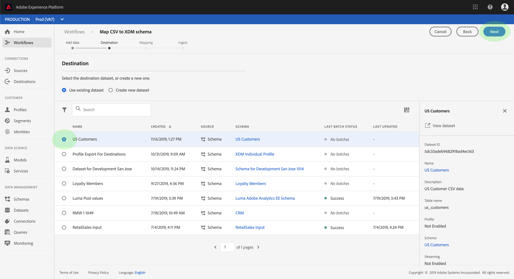
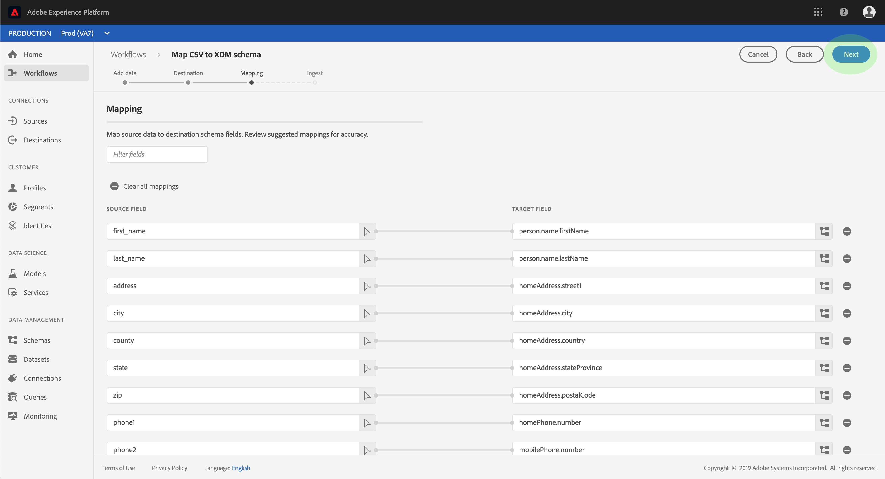
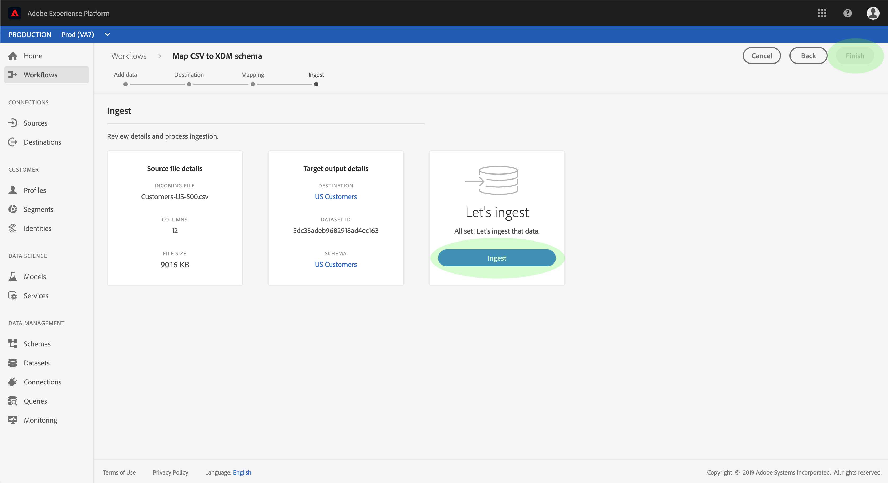

# 将CSV文件映射到XDM模式

要将CSV数据引入Adobe Experience Platform，必须将数据映射到体验数据模型(XDM)模式。 本教程介绍如何使用Experience Platform用户界面将CSV文件映射到XDM模式。

此外，本教程的附录还提供了有关使用映射函数的更 [多信息](#mapping-functions)。

## 入门指南

本教程需要对Adobe Experience Platform的以下组件有充分的了解：

- [体验数据模型(XDM System)](../../xdm/home.md):Experience Platform组织客户体验数据的标准化框架。
- [批量摄取](../batch-ingestion/overview.md):平台从用户提供的数据文件中摄取数据的方法。

本教程还要求您已创建数据集以将CSV数据收录到中。 有关在UI中创建数据集的步骤，请参阅数 [据摄取教程](./ingest-batch-data.md)。

## 添加数据

在Experience Platform UI中，单击左侧导 **航中的工作流** ，然后单击 **将CSV映射到XDM模式**。 在出现的右边栏中，单击“启 **动”**。

将显 _示将CSV映射到XDM模式工作流_ ，从添加数据步 _骤开始_ 。

将CSV文件拖放到提供的空间中，或单击“浏 **览** ”直接选择文件。 上 _传文件后_ ，将显示示例数据部分，其中显示前十行数据。 确认数据已按预期上传后，单击“下 **一步”**。

## 选择目标

将出 _现目标_ 步骤。 从提供的列表中，选择将CSV数据摄取到的数据集，然后单击“下 **一步”**。

## 将CSV字段映射到XDM模式字段

将出 _现映射_ 步骤。 CSV文件的列列列在“源字段”下 _方_，其相应的XDM模式字段列在“ _目标字段”下_。 未选择的目标字段以红色列出。

要将CSV列映射到XDM字段，请单击该列的相应模式字段旁边的目标图标。

出现 _“选择模式字段_ ”窗口。 在此，您可以导航XDM模式的结构，并找到要将CSV列映射到的字段。 单击XDM字段以将其选中，然后单击“ **选择**”。

将重 _新显示_ “映射”屏幕，所选XDM字段现在显示在“ _目标”字段下_。

如果不希望映射特定的CSV列，则可以通过单击目标字段旁边的删除 **图标** ，删除映射。 如果要添加新映射，请单击 **列表底部的** “添加新映射”。

在映射字段时，您还可以包含函数以根据输入源字段计算值。 有关详细 [信息，请参阅](#mapping-functions) 附录中的映射函数部分。

重复上述步骤以继续将CSV列映射到XDM字段。 完成后，单击“下 **一步**”。

## 摄取数据

此时 _会显示“收录_ ”步骤，允许您查看源文件和目标数据集的详细信息。 单击 **“收录** ”以开始收录CSV数据。 根据CSV文件的大小，此过程可能需要几分钟时间。 摄取完成后，屏幕会更新，指示成功或失败。 Click **Finish** to complete the workflow.

## 后续步骤

通过遵循本教程，您已成功将平面CSV文件映射到XDM模式，并将其引入平台。 此数据现在可供下游平台服务(如实时客户用户档案)使用。 有关更 [多信息，请参阅实时客户用户档案概述](../../profile/home.md) 。

## 附录

以下部分提供了有关将CSV列映射到XDM字段的其他信息。

### 映射函数

某些映射函数可用于基于在源字段中输入的内容计算和计算值。 要使用函数，请在“源字段”下键入 _该函数_ ，并输入相应的语法和输入。

例如，要连接 **城市****CSV和国家／地区** CSV字段，并将它们分配到城市 **XDM字段，请将源字段设置为**`concat(city, ", ", county)`。

下表列表了所有支持的映射函数，包括示例表达式及其结果输出。

| 函数 | 描述 | 示例表达式 | 样本输出 |
| -------- | ----------- | ----------------- | ------------- |
| concat | 连接给定字符串。 | concat(&quot;Hi, &quot;, &quot;there&quot;, &quot;!&quot;) | `"Hi, there!"` |
| 爆炸 | 根据正则表达式拆分字符串并返回部分数组。 | explode（&quot;你好！&quot;, &quot; &quot;） | `["Hi,", "there"]` |
| instr | 返回子字符串的位置／索引。 | instr(&quot;adobe.com&quot;, &quot;com&quot;) | 6 |
| replacestr | 替换搜索字符串（如果原始字符串中存在）。 | replacestr(&quot;This is a string re test&quot;, &quot;re&quot;, &quot;replace&quot;) | &quot;这是字符串替换测试&quot; |
| substr | 返回给定长度的子字符串。 | substr(&quot;This is a substring test&quot;, 7, 8) | &quot; a subst&quot; |
| lower / lcase | 将字符串转换为小写。 | lower(&quot;HeLLo&quot;) lcase(&quot;HeLLo&quot;) | “hello” |
| upper / ucase | 将字符串转换为大写。 | upper(&quot;HeLLo&quot;) ucase(&quot;HeLLo&quot;) | “你好” |
| 拆分 | 在分隔符上拆分输入字符串。 | split(&quot;Hello world&quot;, &quot; &quot;) | `["Hello", "world"]` |
| 加入 | 使用分隔符连接对象列表。 | `join(" ", ["Hello", "world"]`) | “你好世界” |
| 凝聚 | 返回给定列表中的第一个非空对象。 | coalesce(null、null、null、“first”、null、“second”) | “first” |
| 解码 | 如果给定一个键和一列表键值对作为数组拼合，则函数在找到键时返回该值，如果数组中存在默认值，则返回默认值。 | decode(&quot;k2&quot;, &quot;k1&quot;, &quot;v1&quot;, &quot;k2&quot;, &quot;v2&quot;, &quot;default&quot;) | &quot;v2&quot; |
| if | 计算给定的布尔表达式，并基于结果返回指定值。 | if(&quot;s&quot;。equalsIgnoreCase(&quot;S&quot;), &quot;True&quot;, &quot;False&quot;) | &quot;True&quot; |
| min | 返回给定参数的最小值。 使用自然排序。 | min(3, 1, 4) | 1 |
| max | 返回给定参数的最大值。 使用自然排序。 | max(3, 1, 4) | 4 |
| first | 检索第一个给定参数。 | first(&quot;1&quot;, &quot;2&quot;, &quot;3&quot;) | &quot;1&quot; |
| last | 检索最后一个给定参数。 | last(&quot;1&quot;, &quot;2&quot;, &quot;3&quot;) | &quot;3&quot; |
| uuid / guid | 生成伪随机ID。 | uuid() guid() | {UNIQUE_ID} |
| now | 检索当前时间。 | now() | `2019-10-23T10:10:24.556-07:00[America/Los_Angeles]` |
| timestamp | 检索当前Unix时间。 | timestamp() | 1571850624571 |
| 格式 | 根据指定的格式设置输入日期的格式。 | format({DATE}, &quot;yyyy-MM-dd HH:mm:ss&quot;) | &quot;2019-10-23 11:24:35&quot; |
| dformat | 根据指定的格式将时间戳转换为日期字符串。 | dformat(1571829875, &quot;dd-MMM-yyyy hh:mm&quot;) | 《2019年10月23日11:24》 |
| date | 将日期字符串转换为ZonedDateTime对象（ISO 8601格式）。 | date（&quot;2019年10月23日11:24&quot;） | “2019-10-23T11:24:00+00:00” |
| date_part | 检索日期的部分。 支持以下组件值：   “年”“年”、“年”、“第 ”季度 “第2季度”、“年”、“  “日”、“日”、“d”周”                                      “黄”周“黄”周“黄”周“黄”周“黄”周“黄”周“黄”周“黄”周“黄”周“黄”周”周“黄”周“黄”周”周“黄”4“hh12”“mi”“mi”“mi”“第二”“mi”“mi”“mi”“mi”“mi”“mi”“mi””“mi”“mi”“mi””“mi”“mi””“mi””“mi””“mi””“m”””“m””””“m”””“m””“m”””“m”””“m””“”””””“m”“””“”””“m”“”“”””“”“”“”””“”“”“””“”””””“””“””“”“”“”””“”“””””“”“”“””“””””“”“”“”“””“””””””“”””“”“”“”””“”“”“”””“”“””“”“”“””” | date_part(date(&quot;2019-10-17 11:55:12&quot;), &quot;MM&quot;) | 10 |
| set_date_part | 在给定日期替换组件。 接受以下组件：     &quot;year&quot;&quot;yar&quot;&quot;yy&quot;&quot;ym&quot;  &quot;ymm &quot; &quot;  &quot;mmm&quot;&quot;&quot;ym&quot;&quot;&quot;&quot;小时&quot;&quot;Mi&quot;Mi&quot;&quot;N&quot;             &quot;N&quot;第二&quot;&quot;经销的&quot;第二&quot;YYYY&quot; | set_date_part(&quot;m&quot;, 4, date(&quot;2016-11-09T11:44:44.797&quot;) | “2016-04-09T11:44:44.797” |
| make_date_time / make_timestamp | 从部分创建日期。 | make_date_time(2019, 10, 17, 11, 55, 12, 999, &quot;America/Los_Angeles&quot;) | `2019-10-17T11:55:12.0&#x200B;00000999-07:00[America/Los_Angeles]` |
| current_timestamp | 返回当前时间戳。 | current_timestamp() | 1571850624571 |
| current_date | 返回不带时间组件的当前日期。 | current_date() | 《2019年11月18日》 |