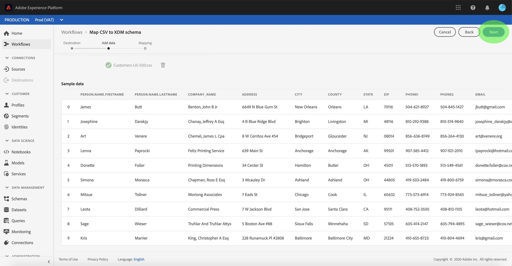

# 将CSV文件映射到XDM模式

要将CSV数据引入[!DNL Adobe Experience Platform]中，必须将数据映射到[!DNL Experience Data Model](XDM)模式。 本教程介绍如何使用[!DNL Platform]用户界面将CSV文件映射到XDM模式。

此外，本教程的附录还提供了有关使用[映射函数](#mapping-functions)的更多信息。

## 入门指南

本教程需要对[!DNL Platform]的以下组件有一定的了解：

- [[!DNL Experience Data Model (XDM System)]](../../xdm/home.md):组织客户体验数 [!DNL Platform] 据的标准化框架。
- [[!DNL Batch ingestion]](../batch-ingestion/overview.md):从用户提供的 [!DNL Platform] 数据文件中摄取数据的方法。

本教程还要求您已创建数据集以将CSV数据引入。 有关在UI中创建数据集的步骤，请参阅[数据摄取教程](./ingest-batch-data.md)。

## 选择目标

登录到[[!DNL Adobe Experience Platform]](https://platform.adobe.com)，然后从左侧导航栏中选择&#x200B;**[!UICONTROL 工作流]**&#x200B;以访问&#x200B;**[!UICONTROL 工作流]**&#x200B;工作区。

在&#x200B;**[!UICONTROL 工作流]**&#x200B;屏幕中，在&#x200B;**[!UICONTROL 数据摄取]**&#x200B;部分选择&#x200B;**[!UICONTROL 将CSV映射到XDM模式]**，然后选择&#x200B;**[!UICONTROL 启动]**。

将显示&#x200B;**[!UICONTROL 将CSV映射到XDM模式]**&#x200B;工作流，从&#x200B;**[!UICONTROL 目标]**&#x200B;步骤开始。 选择要收录到的入站数据的数据集。 您可以使用现有数据集或创建新数据集。

**使用现有数据集**

要将CSV数据引入现有数据集，请选择&#x200B;**[!UICONTROL 使用现有数据集]**。 您可以使用搜索函数或通过滚动面板中现有数据集的列表来检索现有数据集。

要将CSV数据引入新数据集，请选择&#x200B;**[!UICONTROL 创建新数据集]**，并在提供的字段中输入数据集的名称和说明。 通过使用搜索函数或滚动模式提供的列表来选择模式。 选择&#x200B;**[!UICONTROL 下一步]**&#x200B;以继续。

## 添加数据

出现&#x200B;**[!UICONTROL 添加数据]**&#x200B;步骤。 将CSV文件拖放到提供的空间中，或选择&#x200B;**[!UICONTROL 选择文件]**&#x200B;以手动输入CSV文件。

上载文件后，将显示&#x200B;**[!UICONTROL 示例数据]**&#x200B;部分，其中显示前十行数据。 确认数据已按预期上载后，选择&#x200B;**[!UICONTROL 下一步]**。

## 将CSV字段映射到XDM模式字段

出现&#x200B;**[!UICONTROL 映射]**&#x200B;步骤。 CSV文件的列列列在&#x200B;**[!UICONTROL 源字段]**&#x200B;下，其对应的XDM模式字段列在&#x200B;**[!UICONTROL 目标字段]**&#x200B;下。

[!DNL Platform] 自动根据您选择的目标模式或数据集为自动映射字段提供智能建议。您可以手动调整映射规则以适合您的用例。

要接受所有自动生成的映射值，请选中标有“[!UICONTROL 接受所有目标字段]”的复选框。

有时，源模式有多个推荐可用。 出现这种情况时，映射卡会显示最突出的推荐，后跟一个蓝色圆圈，其中包含可用的其他推荐数。 选择灯泡图标将显示其他推荐的列表。 您可以通过选中要映射到的推荐旁的复选框，选择其中一个替代推荐。

或者，您也可以选择手动将源模式映射到目标模式。 将鼠标悬停在要映射的源模式上，然后选择加号图标。

出现“**[!UICONTROL 将源映射到目标字段]**”弹出窗口。 从此处，您可以选择要映射的字段，然后选择&#x200B;**[!UICONTROL 保存]**&#x200B;以添加新映射。

如果要删除其中一个映射，请将鼠标悬停在该映射上，然后选择减号图标。

### 添加计算字段

计算字段允许根据输入模式中的属性创建值。 然后，可将这些值分配给目标模式中的属性，并提供名称和说明以便更轻松地引用。

选择&#x200B;**[!UICONTROL 添加计算字段]**&#x200B;按钮以继续。

出现&#x200B;**[!UICONTROL 创建计算字段]**&#x200B;面板。 左对话框包含计算字段中支持的字段、函数和运算符。 选择一个选项卡以开始向表达式编辑器添加函数、字段或运算符。

| 选项卡 | 描述 |
| --------- | ----------- |
| 字段 | “字段”选项卡列表源模式中可用的字段和属性。 |
| 函数 | 函数选项卡列表可用于转换数据的函数。 要进一步了解可在计算字段中使用的函数，请阅读[上的《使用数据准备（映射器）函数](../../data-prep/functions.md)的指南》。 |
| 运算符 | “运算符”选项卡列表可用于转换数据的运算符。 |

您可以使用中心的表达式编辑器手动添加字段、函数和运算符。 选择要开始创建表达式的编辑器。

选择&#x200B;**[!UICONTROL 保存]**&#x200B;以继续。

映射屏幕将随新创建的源字段重新显示。 应用相应的目标字段并选择&#x200B;**[!UICONTROL 完成]**&#x200B;以完成映射。

## 监控数据获取

映射和创建CSV文件后，您可以监视通过它摄取的数据。 有关监视数据摄取的详细信息，请参阅教程中的[监视数据摄取](../../ingestion/quality/monitor-data-ingestion.md)。

## 后续步骤

通过遵循本教程，您已成功将平面CSV文件映射到XDM模式，并将其引入[!DNL Platform]。 此数据现在可供下游[!DNL Platform]服务（如[!DNL Real-time Customer Profile]）使用。 有关详细信息，请参阅[[!DNL Real-time Customer Profile]](../../profile/home.md)的概述。
