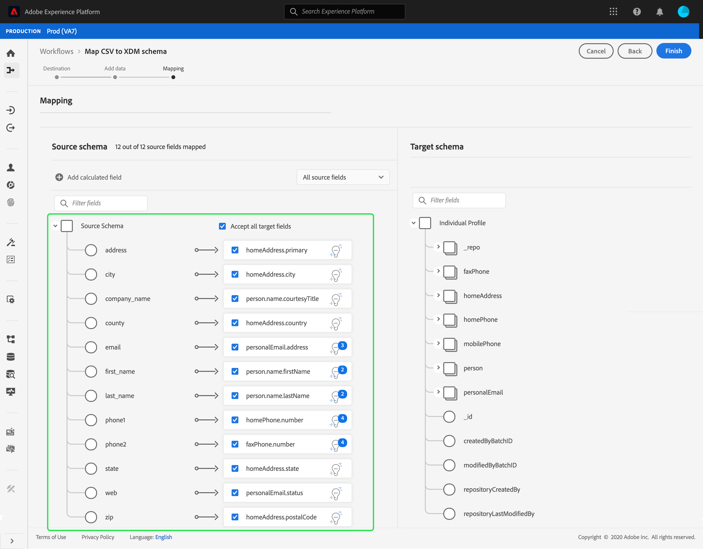

# 将CSV文件映射到现有XDM架构

>[!NOTE]
>
>本文档介绍如何将CSV文件映射到现有XDM架构。 有关如何使用AI生成的架构推荐工具（当前为测试版）的信息，请参阅[使用机器学习推荐映射CSV文件](./recommendations.md)上的文档。

为了将CSV数据摄取到[!DNL Adobe Experience Platform]，该数据必须映射到[!DNL Experience Data Model] (XDM)架构。 本教程介绍如何使用[!DNL Experience Platform]用户界面将CSV文件映射到XDM架构。

## 快速入门

本教程需要您对[!DNL Experience Platform]的以下组件有一定的了解：

- [[!DNL Experience Data Model (XDM System)]](../../../xdm/home.md)： [!DNL Experience Platform]用于组织客户体验数据的标准化框架。
- [批量摄取](../../batch-ingestion/overview.md)： [!DNL Experience Platform]从用户提供的数据文件中摄取数据的方法。
- [Adobe Experience Platform数据准备](../../batch-ingestion/overview.md)：一套功能，允许您映射和转换摄取的数据以符合XDM架构。 有关[数据准备函数](../../../data-prep/functions.md)的文档与架构映射特别相关。

此外，本教程还要求您已创建一个数据集以将CSV数据摄取到中。 有关在UI中创建数据集的步骤，请参阅[数据引入教程](../ingest-batch-data.md)。

## 选择目标

登录到[[!DNL Adobe Experience Platform]](https://platform.adobe.com)，然后从左侧导航栏中选择&#x200B;**[!UICONTROL 工作流]**&#x200B;以访问&#x200B;**[!UICONTROL 工作流]**&#x200B;工作区。

从&#x200B;**[!UICONTROL 工作流]**&#x200B;屏幕的&#x200B;**[!UICONTROL 数据摄取]**&#x200B;部分下，选择&#x200B;**[!UICONTROL 将CSV映射到XDM架构]**，然后选择&#x200B;**[!UICONTROL 启动]**。

出现&#x200B;**[!UICONTROL 将CSV映射到XDM架构]**&#x200B;工作流，从&#x200B;**[!UICONTROL 目标]**&#x200B;步骤开始。 选择要引入的集客数据的数据集。 您可以使用现有数据集或创建新数据集。

**使用现有数据集**

要将CSV数据摄取到现有数据集，请选择&#x200B;**[!UICONTROL 使用现有数据集]**。 您可以使用搜索函数或通过滚动面板中的现有数据集列表来检索现有数据集。

要将CSV数据摄取到新数据集中，请选择&#x200B;**[!UICONTROL 创建新数据集]**，然后在提供的字段中输入数据集的名称和描述。 使用搜索功能或滚动浏览提供的架构列表来选择架构。 选择&#x200B;**[!UICONTROL 下一步]**&#x200B;以继续。

## 添加数据

出现&#x200B;**[!UICONTROL 添加数据]**&#x200B;步骤。 将CSV文件拖放到所提供的空间中，或选择&#x200B;**[!UICONTROL 选择文件]**&#x200B;以手动输入CSV文件。

上传文件后将显示&#x200B;**[!UICONTROL 示例数据]**&#x200B;部分，显示前十行数据。 确认数据已按预期上传后，选择&#x200B;**[!UICONTROL 下一步]**。

## 将CSV字段映射到XDM架构字段

出现&#x200B;**[!UICONTROL 映射]**&#x200B;步骤。 CSV文件的列列列在&#x200B;**[!UICONTROL Source字段]**&#x200B;下，其对应的XDM架构字段列在&#x200B;**[!UICONTROL 目标字段]**&#x200B;下。

[!DNL Experience Platform]会根据您选择的目标架构或数据集，自动为自动映射的字段提供智能推荐。 您可以手动调整映射规则以适合您的用例。

要接受所有自动生成映射值，请选中标记为“[!UICONTROL 接受所有目标字段]”的复选框。

有时，源架构有多个推荐可用。 发生这种情况时，映射卡显示最突出的推荐，后跟一个蓝色圆圈，其中包含可用的其他推荐数。 选择灯泡图标将显示其他建议的列表。 通过选中要映射到的推荐旁边的复选框，您可以选择替代推荐之一。

或者，您可以选择手动将源架构映射到目标架构。 将鼠标悬停在要映射的源架构上，然后选择加号图标。

出现&#x200B;**[!UICONTROL 将源映射到目标字段]**&#x200B;弹出框。 在此处，您可以选择要映射的字段，然后&#x200B;**[!UICONTROL 保存]**&#x200B;以添加新映射。

如果要删除其中一个映射，请将鼠标悬停在该映射上，然后选择减号图标。

### 添加计算字段 {#add-calculated-field}

计算字段允许根据输入架构中的属性创建值。 然后，可以将这些值分配给目标架构中的属性，并提供名称和描述以便更轻松地引用。

选择&#x200B;**[!UICONTROL 添加计算字段]**&#x200B;按钮以继续。

此时将显示&#x200B;**[!UICONTROL 创建计算字段]**&#x200B;面板。 左侧对话框包含计算字段中支持的字段、函数和运算符。 选择其中一个选项卡，开始向表达式编辑器添加函数、字段或运算符。

| 选项卡 | 描述 |
| --------- | ----------- |
| 字段 | 字段选项卡列出了源架构中可用的字段和属性。 |
| 功能 | 函数选项卡列出了可用于转换数据的函数。 若要了解有关可在计算字段中使用的函数的更多信息，请阅读有关[使用数据准备（映射器）函数](../../../data-prep/functions.md)的指南。 |
| 操作员 | 运算符选项卡列出了可用于转换数据的运算符。 |

您可以使用位于中心的表达式编辑器手动添加字段、函数和运算符。 选择编辑器以开始创建表达式。

选择&#x200B;**[!UICONTROL 保存]**&#x200B;以继续。

此时会重新显示映射屏幕，其中包含新创建的源字段。 应用相应的目标字段并选择&#x200B;**[!UICONTROL 完成]**&#x200B;以完成映射。

## 监测数据摄取

映射和创建CSV文件后，您可以监视通过该文件摄取的数据。 有关监视数据引入的详细信息，请参阅有关[监视数据引入](../../../ingestion/quality/monitor-data-ingestion.md)的教程。

## 后续步骤

通过遵循本教程，您已成功将平面CSV文件映射到XDM架构并将其摄取到[!DNL Experience Platform]。 此数据现在可以由下游[!DNL Experience Platform]服务（如[!DNL Real-Time Customer Profile]）使用。 有关详细信息，请参阅[[!DNL Real-Time Customer Profile]](../../../profile/home.md)的概述。

>[!TIP]
>
>您还可以使用机器学习(ML)算法，从架构工作区中&#x200B;**根据示例数据**&#x200B;生成架构。 此工作流会根据文件的结构和内容自动创建新架构，确保架构与数据的格式匹配。 在为大型复杂数据集定义结构、字段和数据类型时，这可以节省时间并提高准确性。 有关此工作流的详细信息，请参阅[ML辅助模式创建指南](../../../xdm/ui/ml-assisted-schema-creation.md)。
