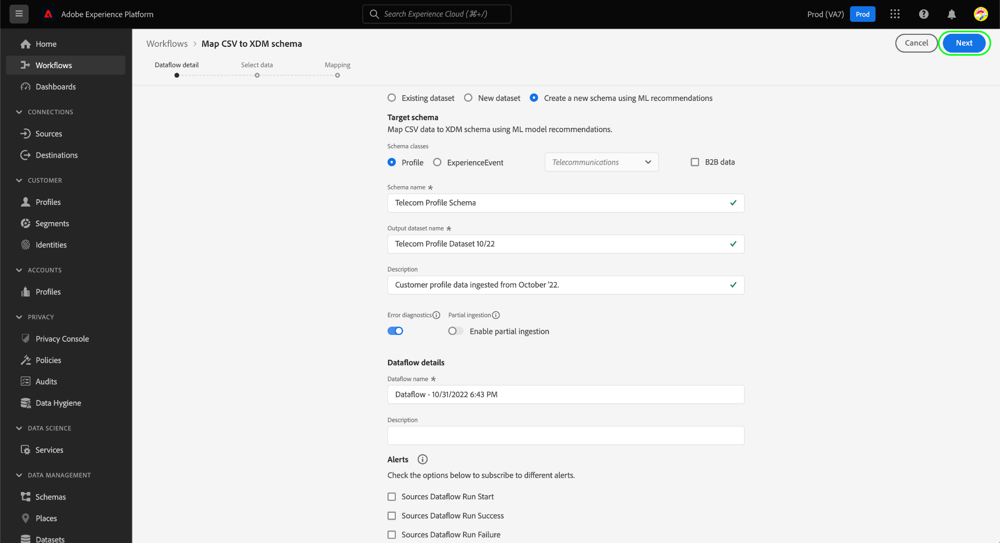

# 使用人工智能生成的推荐将CSV文件映射到XDM架构

>[!NOTE]
>
>有关Experience Platform中一般可用的CSV映射功能的信息，请参阅文档[将CSV文件映射到现有架构](./existing-schema.md)。

为了将CSV数据摄取到[!DNL Adobe Experience Platform]，该数据必须映射到[!DNL Experience Data Model] (XDM)架构。 您可以选择映射到[现有架构](./existing-schema.md)，但如果您不知道确切要使用哪个架构或应如何构建该架构，则可以在Experience Platform UI中使用基于机器学习(ML)模型的动态推荐。

## 快速入门

本教程需要您对[!DNL Experience Platform]的以下组件有一定的了解：

* [[!DNL Experience Data Model (XDM System)]](../../../xdm/home.md)： [!DNL Experience Platform]用于组织客户体验数据的标准化框架。
   * 您必须至少了解XDM](../../../xdm/home.md#data-behaviors)中[行为的概念，以便决定要将数据映射到[!UICONTROL Profile]类（记录行为）还是[!UICONTROL ExperienceEvent]类（时间序列行为）。
* [批量摄取](../../batch-ingestion/overview.md)： [!DNL Experience Platform]从用户提供的数据文件中摄取数据的方法。
* [Adobe Experience Platform数据准备](../../batch-ingestion/overview.md)：一套功能，允许您映射和转换摄取的数据以符合XDM架构。 有关[数据准备函数](../../../data-prep/functions.md)的文档与架构映射特别相关。

## 提供数据流详细信息

在Experience Platform UI的左侧导航中选择&#x200B;**[!UICONTROL 源]**。 在&#x200B;**[!UICONTROL 目录]**&#x200B;视图中，导航到&#x200B;**[!UICONTROL 本地系统]**&#x200B;类别。 在&#x200B;**[!UICONTROL 本地文件上传]**&#x200B;下，选择&#x200B;**[!UICONTROL 添加数据]**。

![Experience Platform UI中的[!UICONTROL 源]目录，正在选择[!UICONTROL 本地文件上传]下的[!UICONTROL 添加数据]。](../../images/tutorials/map-csv-recommendations/local-file-upload.png)

出现&#x200B;**[!UICONTROL 映射CSV XDM架构]**&#x200B;工作流，从&#x200B;**[!UICONTROL 数据流详细信息]**&#x200B;步骤开始。

选择&#x200B;**[!UICONTROL 使用ML推荐]**&#x200B;创建新架构，从而显示新控件。 为要映射的CSV数据选择合适的类（[!UICONTROL 配置文件]或[!UICONTROL ExperienceEvent]）。 您可以选择使用下拉菜单为您的企业选择相关的行业，如果提供的类别不适用于您，则将其留空。 如果您的组织在[企业对企业(B2B)](../../../xdm/tutorials/relationship-b2b.md)模型下运营，请选中&#x200B;**[!UICONTROL B2B data]**&#x200B;复选框。

![选择了ML推荐选项的[!UICONTROL 数据流详细信息]步骤。 已为类选择[!UICONTROL 配置文件]，为行业选择[!UICONTROL 电信]](../../images/tutorials/map-csv-recommendations/select-class-and-industry.png)

在此处，为将从CSV数据创建的架构提供名称，并为将包含在该架构下摄取的数据的输出数据集提供名称。

您可以选择在继续之前为数据流配置以下附加功能：

| 输入名称 | 描述 |
| --- | --- |
| [!UICONTROL 描述] | 数据流的描述。 |
| [!UICONTROL 错误诊断] | 启用后，将为新摄取的批次生成错误消息，在获取[API](../../batch-ingestion/api-overview.md)中的相应批次时可以查看这些错误消息。 |
| [!UICONTROL 部分摄取] | 启用后，将在指定的错误阈值内摄取新批次数据的有效记录。 利用此阈值，可配置在整个批处理失败之前可接受的错误百分比。 |
| [!UICONTROL 数据流详细信息] | 为将CSV数据导入Experience Platform的数据流提供名称和可选描述。 启动此工作流时，会自动为数据流分配默认名称。 更改名称是可选的。 |
| [!UICONTROL 警报] | 从[产品内警报](../../../observability/alerts/overview.md)的列表中选择您希望在数据流启动后收到的数据流状态。 |

{style="table-layout:auto"}

完成数据流配置后，选择&#x200B;**[!UICONTROL 下一步]**。

]

## 选择数据

在&#x200B;**[!UICONTROL 选择数据]**&#x200B;步骤中，使用左列上传CSV文件。 您可以选择&#x200B;**[!UICONTROL 选择文件]**&#x200B;打开文件资源管理器对话框以从中选择文件，也可以直接将文件拖放到列上。

![在[!UICONTROL 选择数据]步骤中突出显示的[!UICONTROL 选择文件]按钮和拖放区域。](../../images/tutorials/map-csv-recommendations/upload-files.png)

上传文件后，会显示一个示例数据部分，该部分显示收到的数据的前10行，以便您验证是否已正确上传。 选择&#x200B;**[!UICONTROL 下一步]**&#x200B;以继续。

## 配置架构映射

运行ML模型可根据数据流配置和上传的CSV文件生成新架构。 该过程完成后，[!UICONTROL 映射]步骤将填充为显示每个单独字段的映射以及生成的架构结构的完全可导航视图。

![UI中的[!UICONTROL 映射]步骤，显示映射的所有CSV字段以及生成的架构结构。](../../images/tutorials/map-csv-recommendations/schema-generated.png)

>[!NOTE]
>
>在源到目标字段映射工作流中，您可以根据各种条件筛选架构中的所有字段。 默认行为是显示所有映射的字段。 要更改显示的字段，请选择搜索输入字段旁边的筛选器图标，然后从下拉选项中进行选择。  {width="100" zoomable="yes"}

从此处，您可以根据需要选择[编辑字段映射](#edit-mappings)或[更改它们与](#edit-schema)关联的字段组。 满足要求后，选择&#x200B;**[!UICONTROL 完成]**&#x200B;以完成映射并启动您之前配置的数据流。 CSV数据会引入到系统中，并根据生成的架构结构填充数据集，以供下游Experience Platform服务使用。

![正在选择[!UICONTROL 完成]按钮，正在完成CSV映射过程。](../../images/tutorials/map-csv-recommendations/finish-mapping.png)

### 编辑字段映射 {#edit-mappings}

使用字段映射预览可编辑现有映射或将其完全删除。 有关如何在UI中管理映射集的更多信息，请参阅数据准备映射的[UI指南](../../../data-prep/ui/mapping.md#mapping-interface)。

### 编辑字段组 {#edit-field-groups}

CSV字段使用ML模型自动映射到现有XDM字段组。 如果要更改任何特定CSV字段的字段组，请选择架构树旁边的&#x200B;**[!UICONTROL 编辑]**。

![架构树旁边正在选择[!UICONTROL Edit]按钮。](../../images/tutorials/map-csv-recommendations/edit-schema-structure.png)

此时将显示一个对话框，允许您编辑映射中任何字段的显示名称、数据类型和字段组。 选择源字段旁边的编辑图标（）以在选择&#x200B;**[!UICONTROL 应用]**&#x200B;之前编辑其右列的详细信息。

调整完源字段的架构建议后，选择&#x200B;**[!UICONTROL 保存]**&#x200B;以应用更改。

## 后续步骤

本指南介绍了如何使用人工智能生成的推荐将CSV文件映射到XDM架构，从而允许您通过批量摄取将数据引入Experience Platform。

有关将CSV文件映射到现有架构的步骤，请参阅[现有架构映射工作流](./existing-schema.md)。 有关通过预建源连接将数据实时流式传输到Experience Platform的信息，请参阅[源概述](../../../sources/home.md)。

您还可以使用机器学习(ML)算法&#x200B;**根据示例CSV数据**&#x200B;生成架构。 此工作流会根据CSV文件的结构和内容自动创建新架构。 这个新创建的架构与您的数据格式匹配，可在为大型复杂数据集定义结构、字段和数据类型时为您节省时间并提高准确性。 有关此工作流的详细信息，请参阅[ML辅助模式创建指南](../../../xdm/ui/ml-assisted-schema-creation.md)。
