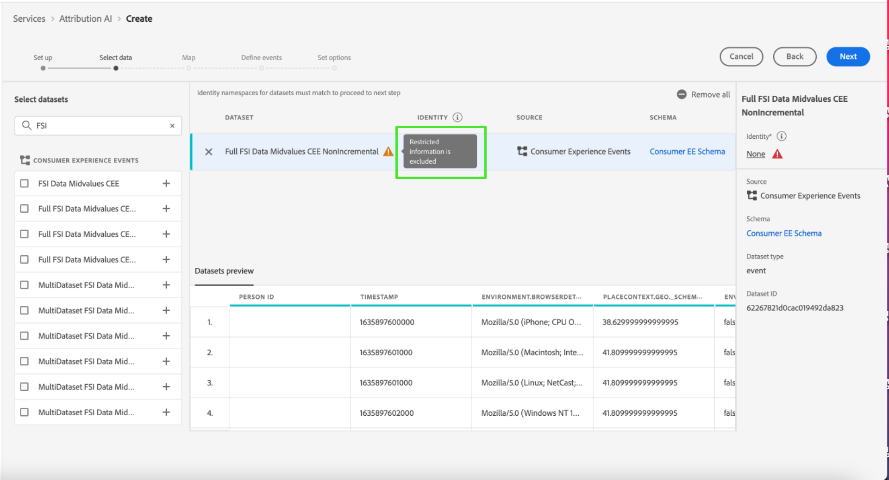
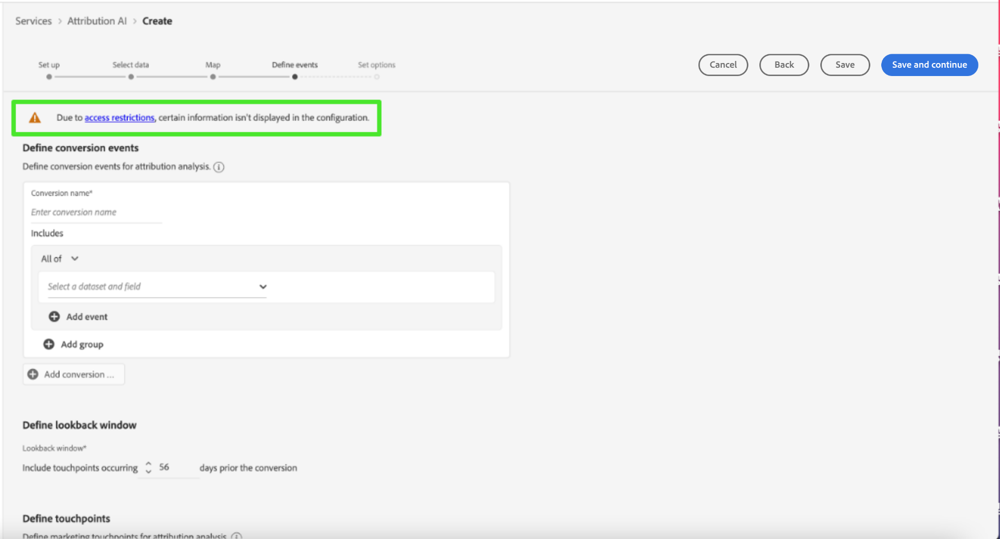

# 归因人工智能中的访问控制

归因人工智能的访问控制通过[Adobe Admin Console](https://adminconsole.adobe.com/)中的Adobe Experience Platform提供。 此功能利用Admin Console中的产品配置文件，它将用户与权限和沙盒关联起来。

有关访问控制的详细信息，请参阅[访问控制概述](../../../access-control/home.md)。

## 基于属性的访问控制

>[!IMPORTANT]
>
>基于属性的访问控制当前仅在有限版本中可用。

[基于属性的访问控制](../../../access-control/abac/overview.md)是Adobe Experience Platform的一项功能，它使管理员能够根据属性控制对特定对象和/或功能的访问。 属性可以是添加到对象的元数据，例如添加到架构字段或区段的标签。 管理员定义包括管理用户访问权限的属性的访问策略。

此功能允许您使用定义组织或数据使用范围的标签来标记Experience Data Model (XDM)架构字段。 同时，管理员可以使用用户和角色管理界面定义围绕XDM架构字段的访问策略，并更好地管理授予用户或用户组（内部、外部或第三方用户）的访问权限。 此外，基于属性的访问控制允许管理员管理对特定区段的访问。

通过基于属性的访问控制，管理员可以控制用户在所有Experience Platform工作流和资源中对敏感个人数据(SPD)和个人身份信息(PII)的访问。 管理员可以定义仅有权访问特定字段以及与这些字段对应的数据的用户角色。

由于基于属性的访问控制，某些字段和功能可能会受到访问限制，并且对于某些归因人工智能服务模型不可用。 示例包括“Identity”、“Score Definition”和“Clone”。

在归因人工智能工作区&#x200B;**分析页面**&#x200B;的顶部，侧边栏中显示的详细信息具有受限访问权限。

如果在&#x200B;**[!UICONTROL 创建模型工作流]**&#x200B;页面上选择具有受限架构的数据集，则数据集名称旁边会显示一个警告符号，消息为： [!UICONTROL 已排除受限信息]。

当您在&#x200B;**[!UICONTROL 创建模型工作流]**&#x200B;页面上预览具有受限架构的数据集时，会显示一条警告，让您知道[!UICONTROL 由于访问限制，某些信息不会显示在数据集预览中。]

创建包含受限信息的模型并继续&#x200B;**[!UICONTROL 定义目标]**&#x200B;步骤后，顶部将显示警告： [!UICONTROL 由于访问限制，某些信息不会显示在配置中。]

## 后续步骤

通过阅读本指南，您已了解[!DNL Experience Platform]中访问控制的主要原则。 您现在可以继续阅读[访问控制用户指南](../overview.md)，以了解有关如何使用[!DNL Admin Console]创建产品配置文件和为[!DNL Experience Platform]分配权限的详细步骤。
