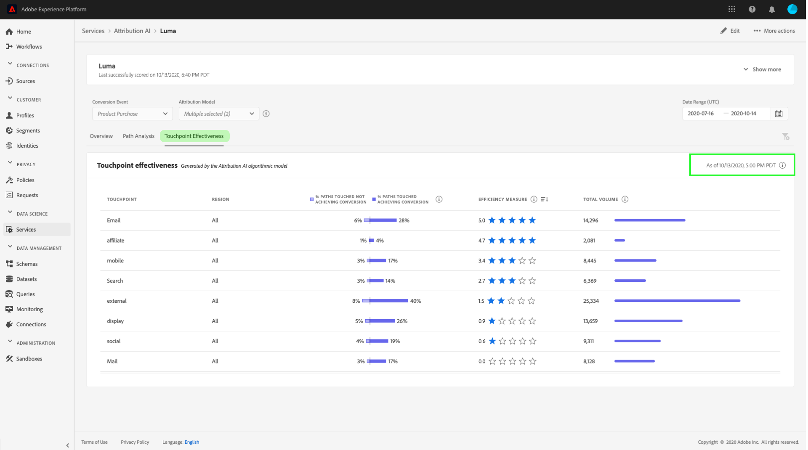

# 在Attribution AI中发现见解

Attribution AI服务实例提供见解，可用于协助作出和衡量与营销业绩和投资回报率相关的营销决策。 选择服务实例可提供可视化和过滤器，以帮助您了解客户历程每个阶段每个客户互动的影响。

本文档用作在AdobeIntelligent Services用户界面中与服务实例见解交互的指南。

## 快速入门

为了利用Attribution AI见解，您需要具有成功运行状态的服务实例。 若要创建新的服务实例，请访问[Attribution AI用户界面指南](./user-guide.md)。 如果您最近创建了一个服务实例，但该实例仍在训练和评分中，请留出24小时以使它完成运行。

## 服务实例分析概述

在[!DNL Adobe Experience Platform] UI的左侧导航中选择&#x200B;**[!UICONTROL 服务]**。 出现&#x200B;**[!UICONTROL 服务]**&#x200B;浏览器并显示可用的Adobe智能服务。 在Attribution AI的容器中，选择&#x200B;**[!UICONTROL 打开]**。

此时将显示“Attribution AI服务”页。 此页列出了Attribution AI的服务实例并显示它们的相关信息，包括实例的名称、转换事件、实例的运行频率以及上次更新的状态。 选择服务实例名称以开始。

>[!NOTE]
>
>只能选择已完成成功评分运行的服务实例。

接下来，将会显示该服务实例的见解页面，其中为您提供了可视化图表和许多用于与数据交互的过滤器。 在本指南中，将更详细地解释可视化图表和过滤器。

### 服务实例详细信息

要查看服务实例的其他详细信息，请选择右上角的&#x200B;**[!UICONTROL 显示更多]**。

将显示一个详细列表。 有关列出的任何属性的详细信息，请访问[Attribution AI用户指南](./user-guide.md)。

### 编辑实例

要编辑实例，请在右上角导航中选择&#x200B;**[!UICONTROL 编辑]**。

此时会显示“编辑”对话框，您可以在该对话框中编辑实例的名称、描述和评分频率。 如果实例状态被禁用，则无法编辑评分频率。 要确认更改并关闭对话框，请选择右下角的&#x200B;**[!UICONTROL 保存]**。

### 更多操作 {#more-actions}

**[!UICONTROL 更多操作]**&#x200B;按钮位于&#x200B;**[!UICONTROL 编辑]**&#x200B;旁边的右上角导航区域中。 选择&#x200B;**[!UICONTROL 更多操作]**&#x200B;将打开一个下拉菜单，允许您选择以下操作之一：

- **[!UICONTROL 克隆]**：克隆实例。
- **[!UICONTROL 删除]**：删除实例。
- **[!UICONTROL 下载摘要数据]**：下载包含摘要数据的CSV文件。
- **[!UICONTROL 访问得分]**：选择&#x200B;**[!UICONTROL 访问得分]**&#x200B;会将您重定向到Attribution AI教程的[访问得分](./download-scores.md)。
- **[!UICONTROL 查看运行历史记录]**：出现一个弹出窗口，其中包含与服务实例关联的所有评分运行的列表。

## 筛选数据

Attribution AI分析允许您过滤数据并根据所选过滤器自动更新UI可视化图表。

### 转化事件

在Attribution AI中创建新实例时，必填字段之一为“转化事件”。 转化事件是确定营销活动（如电子商务订单、店内购买和网站访问）影响的业务目标。

在该实例中，**[!UICONTROL 转化事件]**&#x200B;下拉列表允许您选择为实例定义的任何事件，以筛选数据。 选择特定事件会将UI可视化更改为仅填充属于这些事件的转化。

### 归因模型

选择&#x200B;**[!UICONTROL 归因模型]**&#x200B;将打开一个下拉菜单，其中包含所有可用的不同归因模型。 可以选择多个模型来比较结果。 有关不同归因模型及其工作方式的更多信息，请访问[Attribution AI](./overview.md)概述，其中包含包含每个模型相关信息的表。

### 区域

>[!NOTE]
>
>只有在创建服务实例时执行了Attribution AI用户界面指南中的可选步骤[基于区域的建模](./user-guide.md#region-based-modeling-optional)时，此筛选器才会出现。

此过滤器允许您选择在实例创建过程中设置的任何区域。

### 添加过滤器

您可以通过选择&#x200B;**筛选器**&#x200B;图标以打开&#x200B;**[!UICONTROL 添加筛选器]**&#x200B;弹出框来添加其他筛选器。 通过&#x200B;**[!UICONTROL 添加过滤器]**&#x200B;弹出框，可按渠道、地理位置、媒体类型和产品进行过滤。 弹出框仅填充适用于服务实例的过滤器。 例如，如果您未提供地理数据或媒体类型，则这些过滤器属性将无法用于您的实例。

- **[!UICONTROL 渠道]：**&#x200B;选择该渠道属性允许您筛选任何可用的营销渠道。 您可以选择多个渠道来进行比较。
- **[!UICONTROL 地理位置]：**&#x200B;选择地理位置属性允许您根据基于区域的模型筛选国家/地区代码。 根据您的数据，此过滤器可能存在也可能不存在。 国家/地区代码的长度为两个字符。 在[此处](https://datahub.io/core/country-list)查看完整的国家/地区代码列表。
- **[!UICONTROL 媒体类型]：**&#x200B;选择媒体类型属性允许您过滤任何定义的媒体类型。
- **[!UICONTROL 产品]：**&#x200B;选择产品属性允许您从创建实例时最初摄取的任何产品中进行筛选。

### Date Range

选择日历图标以打开日期范围弹出框。 开始和结束转化事件日期决定UI中填充的数据量。 您可以选择缩小或扩大日期范围，以集中或扩大填充的数据量。

## 数据概述

**[!UICONTROL 概述]**&#x200B;信息卡按归因模型显示您的总转化率。 总数的变化取决于您使用本文档中先前概述的过滤器进行搜索的特定程度。 选择更多模型会在概述中添加其他圆圈，每个圆圈都有自己的颜色与图例相对应。

## 每周趋势

**[!UICONTROL 每周趋势]**&#x200B;卡片按您在筛选过程中设置的日期范围划分总转化。

选择&#x200B;**每周趋势**&#x200B;卡片右上角的省略号会显示一个下拉列表，允许您选择每日、每周或每月趋势。

将鼠标悬停在特定归因模型的数据行上会创建一个弹出窗口，显示该日期的转化总数。

## 按渠道细分

**[!UICONTROL 按渠道]**&#x200B;划分卡用于确定与每个渠道相关的转化总数。 此卡可用于帮助确定每个渠道的有效性和投资回报。

选择&#x200B;**[!UICONTROL 按渠道]**&#x200B;划分卡片右上角的省略号将打开一个下拉菜单，允许您根据接触点填充数据。

## 热门营销活动

**[!UICONTROL 热门促销活动]**&#x200B;卡片会显示您的促销活动概览，以及促销活动在每个渠道中的执行情况。 此信息卡可帮助您的团队了解特定渠道的特定营销活动的有效性，并提供见解，例如您应进一步投资哪些营销活动。

## 按接触点位置细分

选择&#x200B;**[!UICONTROL 路径分析]**&#x200B;选项卡将加载&#x200B;**[!UICONTROL 按接触点位置]**&#x200B;和&#x200B;**[!UICONTROL 排名最前的转化路径]**&#x200B;的划分。

按接触点位置&#x200B;**划分的**&#x200B;图形是按接触点位置划分的已归因转化，并将其与所有转化路径进行比较。 此图表可帮助您了解哪些接触点在转化路径的不同阶段更有效。 舞台是开始、玩家和靠近。

- **起始点：**&#x200B;表示该接触点是转换路径中的首次触点。
- **播放器：**&#x200B;表示接触点不是导致转化的第一个或最后一个触点。
- **更近者：**&#x200B;表示接触点是转换前的最后一次触点。

>
>
> 归因模型在所有接触点和位置的贡献百分比之和应等于100。

## 热门转化路径

**[!UICONTROL 排名最前的转化路径]**&#x200B;图显示了所选区域中排名最前的转化路径的影响分数和算法分数。 此图表允许您可视化哪些接触点对转化做出贡献以及每个接触点的归因得分。 您可以使用此信息查看特定区域中最常见的路径，并查看不同接触点集之间是否出现任何模式。

## 接触点有效性

选择&#x200B;**[!UICONTROL 接触点有效性]**&#x200B;选项卡会加载&#x200B;**[!UICONTROL 接触点有效性]**&#x200B;卡。 此信息卡使用Attribution AI的数据分发来显示每个接触点的信息。 此表的数据仅针对卡片右上角的&#x200B;**[!UICONTROL 截至]**&#x200B;日期所指示的特定时间段生成。

您可以使用&#x200B;**[!UICONTROL 接触点有效性]**&#x200B;卡信息了解接触点如何促进转化。 您还可以通过以下性能量度查看每个接触点的有效性：

**接触的路径**：此量度显示实现/未实现接触点转化的路径百分比。 如果实现转化的路径与未实现转化的路径的比率（百分比）很高，则会看到较高的已归因转化。

**效率度量**：此度量以1到5的刻度显示星星。 此范围指示接触点对进行转化的相对重要性。

>[!NOTE]
>
>接触点数量越大并不能保证测量效率越高。

**总数量**：用户接触接触点的总次数。 这包括出现在实现转化的路径上的接触点以及未导致转化的路径。

## 后续步骤

完成数据过滤并能够显示相应信息后，您可以选择访问得分。 有关如何访问得分的深入指南，请访问Attribution AI[&#128279;](./download-scores.md)中的访问得分。 此外，您还可以按照[更多操作](#more-actions)中的指示下载摘要数据。 选择“下载摘要数据”可下载按日期聚合的摘要数据。

## 其他资源

以下视频旨在帮助学习如何使用Attribution AI分析页面了解营销渠道和营销活动的ROI。

>[!VIDEO](https://video.tv.adobe.com/v/345098?learn=on&quality=12&captions=chi_hans)
