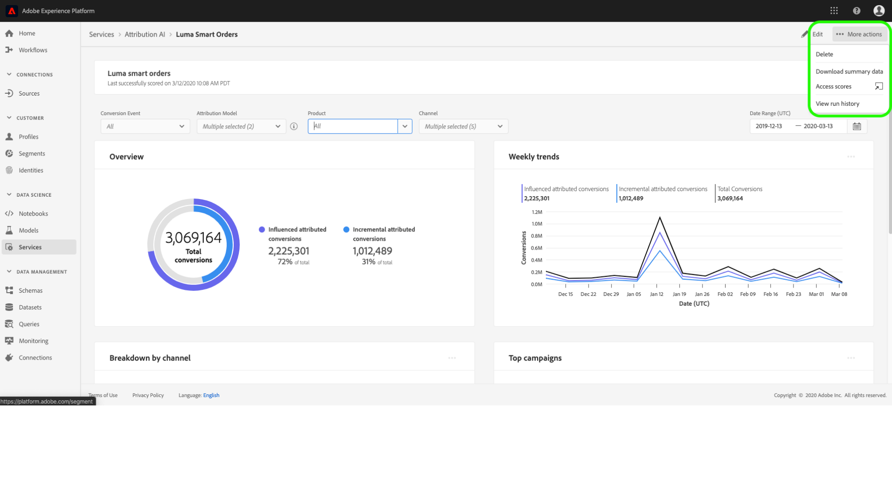
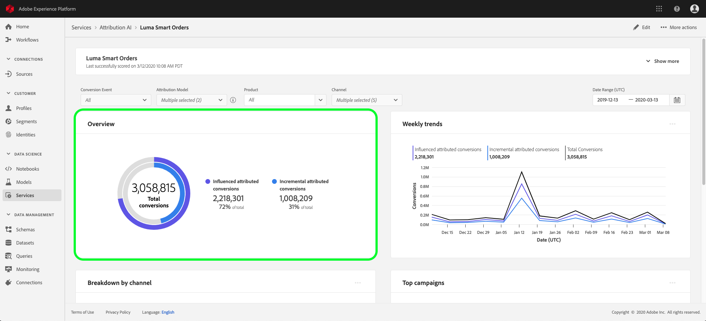

# 在归因人工智能中发现洞察

归因AI服务实例提供的洞察可用于帮助制定和衡量与营销绩效和投资回报相关的营销决策。 选择服务实例可提供可视化和过滤器，帮助您了解客户旅程每个阶段每次客户互动的影响。

此文档可作为与Adobe Intelligent Services用户界面中的服务实例洞察交互的指南。

## 入门指南

为了利用归因AI的洞察，您需要有一个运行状态成功的服务实例。 要创建新服务实例，请访 [问Attribution AI用户界面指南](./user-guide.md)。 如果您最近创建了一个服务实例，但它仍在培训和评分中，请允许24小时，它才能完成运行。

## 服务实例洞察概述

在Adobe Experience Platform UI中，单击左 **侧导** 航中的“服务”。 将显 *示* “服务”浏览器并显示可用的Adobe Intelligent Services。 在归因AI的容器中，单击 **打开**。

此时将显示“归因AI”服务页。 本页列表归因AI的服务实例并显示相关信息，包括实例名称、转换事件、实例运行频率以及上次更新的状态。 单击服务实例名称开始。

>[!NOTE] 只能选择已成功完成评分运行的服务实例。

接下来，将显示该服务实例的洞察页面，其中为您提供可视化信息和大量过滤器以与数据交互。 本指南中对可视化和过滤器进行了更详细的说明。

### 服务实例详细信息

要视图服务实例的其他详细信息， **请单击** 右上角的“显示更多”。

将显示详细列表。 有关所列任何属性的详细信息，请访 [问Attribution AI用户指南](./user-guide.md)。

### 编辑实例

要编辑实例，请单 *击* 右上导航中的“编辑”。

此时会显示编辑对话框，允许您编辑实例的描述和评分频率。 要确认更改并关闭对话框，请 *单击* 右下角的“编辑”。

### 更多操作

“ *更多* ”操作按钮位于“编辑”旁的右上导 *航中*。 单击 **更多操作** ，将打开一个下拉列表，通过该下拉列表可以选择下列操作之一：

- **删除**: 删除实例。
- **下载摘要数据**: 下载包含摘要数据的CSV文件。
- **访问分数**: 单击 *访问得分* ，将您重定向到 [归因AI教程的访问得分](./download-scores.md)。
- **视图运行历史**: 此时会显示一个列表，其中包含与服务实例关联的所有评分运行。

## 筛选数据

归因人工智能洞察允许您过滤数据并根据选定过滤器自动更新UI视觉元素。

>[!NOTE] 默认情况下，每个筛选器都设置为“全部”，但“归 *因模型* ”筛选器设置为“增量和受影响的归因转换”。

### 转换事件

当您在归因AI中创建新实例时，其中一个必填字段是“转换事件”。 转化事件是确定营销活动（如电子商务订单、店内购买和网站访问）影响的业务目标。

在实例中，“转 *换事件* ”下拉菜单允许您选择为实例定义的任何事件，以便筛选数据。 选择特定事件会更改UI可视化，以仅填充属于这些事件的转换。

### 归因模型

单击 *归因模型* ，将打开一个下拉菜单，其中提供所有不同的归因模型。 您可以选择多个模型来比较结果。 有关不同归因模型及其工作方式的更多信息，请访 [问归因](./overview.md) AI概述，其中包含一个表，其中包含有关每个模型的信息。

### 产品

产 *品过滤* 器允许您从创建实例时最初引入的任何产品中进行选择。 单击下拉列表，然后使用搜索功能快速选择要比较的所有产品。

### 地理

“地 *理位置* ”筛选器根据基于区域的模型填充国家代码。 根据您的数据，此过滤器可能存在，也可能不存在。

>[!NOTE] 国家代码长度为两个字符。 ISO 3166-1 alpha-2 [提供完整列表](https://datahub.io/core/country-list)。

### 地区

>[!NOTE] 仅当您在创建服务实例时在Attribution AI用户界面指 [南中执行了可选的基于](./user-guide.md#region-based-modeling-optional) 步骤区域的建模时，才会出现此过滤器。

此过滤器允许您选择在实例创建过程中设置的任何区域。

### Channel

单击 *渠道* 筛选器会显示包含所有可用营销渠道的下拉列表。 您可以选择多个渠道进行比较。

### Date Range

单击日历图标以打开日期范围窗格。 开始和结束转换事件日期决定在UI中填充的数据量。 您可以选择缩小或扩大日期范围，以集中或扩展已填充的数据量。

## 数据概述

概述 *卡按归因* 模型显示您的转化总数。 根据您使用本文档中前面列出的过滤器进行搜索的具体程度，更改总数。 选择更多模型会向“概述”添加其他圆，每个圆都有与图例对应的颜色。

## 每周趋势

“ *Weekly trends* ”卡按您在筛选过程中设置的日期范围细分您的总转化率。

单击“每周趋势”卡右上方 *的省略号* ，将显示一个下拉框，允许您选择每日、每周或每月趋势。

将指针悬停在特定归因模型的数据线上，可创建一个跨距，其中显示该日期的转换总数。

## 按渠道细分

“按 *渠道细分* ”卡用于确定与每个渠道相关的转换总数。 此卡可用于帮助决定每个渠道的有效性和投资回报。

单击按渠道划分卡右上方 *的省略号* ，将打开一个下拉框，允许您根据接触点填充数据。

## 顶级活动

顶 *级活动* 卡显示活动的概述，以及活动在每个渠道中的表现。 此信息卡可以帮助您的团队了解特定活动对特定渠道的有效性，并提供进一步投资的洞察。

## 后续步骤

过滤完数据并能够显示相应的信息后，您便可以选择访问分数。 有关如何获取分数的详细指南，请访问归因AI教 [程中的访问分数](./download-scores.md) 。 此外，您还可以下载摘要数据，如更多操作 [中所示](#more-actions)。 选择“下载摘要数据”将下载按日期聚集的摘要数据。

## Journey Orchestration

以下视频旨在帮助学习如何使用归因人工智能洞察页面了解营销渠道和活动的ROI。

>[!VIDEO](https://video.tv.adobe.com/v/32669?learn=on&quality=12)