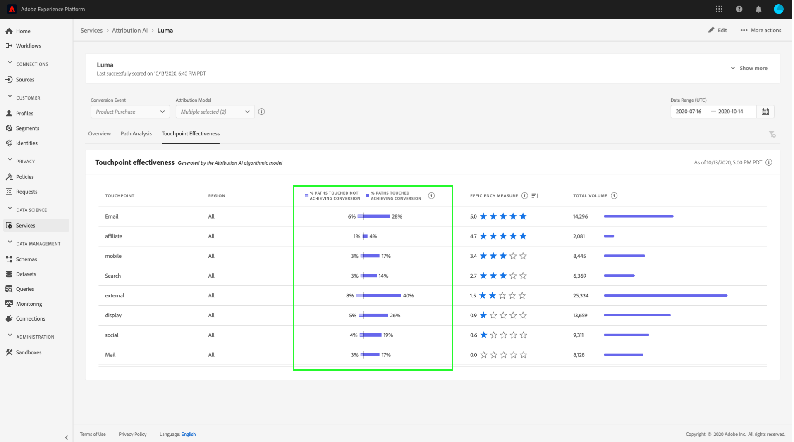

# 在Attribution AI中发现洞察

Attribution AI服务实例提供分析，可用于协助制定和衡量与营销绩效和投资回报相关的营销决策。 选择服务实例可提供可视化图表和过滤器，以帮助您了解客户旅程各个阶段每个客户交互的影响。

本文档是与Adobe智能服务用户界面中的服务实例分析进行交互的指南。

## 快速入门

为了利用Attribution AI分析，您需要有一个运行状态成功的服务实例。 要创建新的服务实例，请访问 [Attribution AI用户界面指南](./user-guide.md). 如果您最近创建了一个服务实例，但该实例仍在培训和评分，请允许24小时才能完成运行。

## 服务实例分析概述

在 [!DNL Adobe Experience Platform] UI，选择 **[!UICONTROL 服务]** 中。 的 **[!UICONTROL 服务]** 浏览器会显示并显示可用的Adobe智能服务。 在Attribution AI容器中，选择 **[!UICONTROL 打开]**.

此时将显示Attribution AI服务页面。 本页列出了Attribution AI的服务实例并显示了有关这些实例的信息，包括实例名称、转化事件、实例运行频率以及上次更新的状态。 选择要开始的服务实例名称。

>[!NOTE]
>
>只能选择已成功完成评分运行的服务实例。

接下来，将显示该服务实例的分析页面，在该页面中，您会获得一些可视化图表和许多过滤器，可用于与数据交互。 在本指南中，将对可视化和过滤器进行更详细的说明。

### 服务实例详细信息

要查看服务实例的其他详细信息，请选择 **[!UICONTROL 显示更多]** 在右上方。

此时将显示详细列表。 有关列出的任何属性的更多信息，请访问 [Attribution AI用户指南](./user-guide.md).

### 编辑实例

要编辑实例，请选择 **[!UICONTROL 编辑]** 中的“隐藏主体”。

此时会出现编辑对话框，允许您编辑实例的名称、描述和评分频率。 如果实例状态被禁用，则无法编辑评分频率。 要确认更改并关闭对话框，请选择 **[!UICONTROL 保存]** 在右下角。

### 更多操作 {#more-actions}

的 **[!UICONTROL 更多操作]** 按钮位于右上方的导航中，位于 **[!UICONTROL 编辑]**. 选择 **[!UICONTROL 更多操作]** 打开一个下拉列表，用于选择以下操作之一：

- **[!UICONTROL 克隆]**:克隆实例。
- **[!UICONTROL 删除]**:删除实例。
- **[!UICONTROL 下载摘要数据]**:下载包含摘要数据的CSV文件。
- **[!UICONTROL 访问分数]**:选择 **[!UICONTROL 访问分数]** 将您重定向到 [“Attribution AI”教程的访问分数](./download-scores.md).
- **[!UICONTROL 查看运行历史记录]**:此时会显示一个弹出窗口，其中包含与服务实例关联的所有评分运行的列表。

## 过滤数据

Attribution AI分析允许您过滤数据，并根据选定的过滤器自动更新UI可视化图表。

### 转化事件

在Attribution AI中创建新实例时，其中一个必填字段是“转化事件”。 转化事件是用于确定营销活动（如电子商务订单、店内购买和网站访问）影响的业务目标。

在实例内， **[!UICONTROL 转化事件]** 下拉列表允许您选择为实例定义的任何事件，以便过滤数据。 选择特定事件会更改UI可视化，以便仅填充属于这些事件的转化。

### 归因模型

选择 **[!UICONTROL 归因模型]** 打开一个包含所有不同归因模型的下拉菜单。 您可以选择多个模型来比较结果。 有关不同归因模型及其工作方式的更多信息，请访问 [Attribution AI](./overview.md) 概述，其中包含一个包含每个模型相关信息的表。

### 地区

>[!NOTE]
>
>仅当您执行了可选步骤时，才会显示此过滤器 [基于区域的建模](./user-guide.md#region-based-modeling-optional) (在“Attribution AI用户界面指南”中)。

此过滤器允许您选择在实例创建过程中设置的任何区域。

### 添加过滤器

您可以通过选择 **过滤器** 图标以打开 **[!UICONTROL 添加过滤器]** 弹出窗口。 的 **[!UICONTROL 添加过滤器]** 弹出窗口允许您按渠道、地理位置、媒体类型和产品进行过滤。 弹出窗口仅填充服务实例的适用过滤器。 例如，如果您没有提供地理数据或媒体类型，则这些过滤器属性将不适用于您的实例。

- **[!UICONTROL 渠道]:** 选择渠道属性后，您可以过滤任何可用的营销渠道。 您可以选择多个渠道来进行比较。
- **[!UICONTROL Geography]:** 选择地理位置属性允许您根据基于区域的模型过滤国家/地区代码。 根据您的数据，此过滤器可能存在，也可能不存在。 国家/地区代码有两个字符长。 请参阅完整的国家/地区代码列表 [此处](https://datahub.io/core/country-list).
- **[!UICONTROL 媒体类型]:** 通过选择媒体类型属性，可以过滤任何定义的媒体类型。
- **[!UICONTROL 产品]:** 选择产品属性后，您可以从创建实例时最初摄取的任何产品中进行筛选。

### Date Range

选择日历图标以打开日期范围弹出窗口。 开始和结束转化事件日期决定了在UI中填充的数据量。 您可以选择缩小或扩大日期范围，以集中或扩展填充的数据量。

## 数据概述

的 **[!UICONTROL 概述]** 卡片会按归因模型显示总转化。 总数会根据您使用本文档中先前概述的过滤器进行搜索的具体方式而发生更改。 选择更多模型会向“概述”中添加其他圆，每个圆的颜色与图例对应。

## 每周趋势

的 **[!UICONTROL 每周趋势]** 卡片会按您在筛选过程中设置的日期范围来划分总转化。

选择 **每周趋势** 卡片会显示一个下拉列表，允许您选择每日、每周或每月趋势。

将鼠标悬停在特定归因模型的数据线上，会创建一个弹出窗口，显示该日期的转化总数。

## 按渠道划分

的 **[!UICONTROL 按渠道划分]** 卡片用于确定与每个渠道相关的转化总数。 此卡可用于帮助就每个渠道的有效性和投资回报做出决策。

选择 **[!UICONTROL 按渠道划分]** 卡片会打开一个下拉菜单，允许您根据接触点填充数据。

## 热门营销活动

的 **[!UICONTROL 热门营销活动]** 卡片显示营销活动的概述以及营销活动在每个渠道中的执行情况。 此卡可帮助您的团队了解特定渠道促销活动的有效性，并提供您应进一步投资的促销活动等洞察信息。

## 按接触点位置划分

选择 **[!UICONTROL 路径分析]** 选项卡加载 **[!UICONTROL 按接触点位置划分]** 和 **[!UICONTROL 热门转化路径]** 图形。

的 **[!UICONTROL 按接触点位置划分]** 图表是按所有转化路径中所比较接触点位置划分的归因转化。 此图表可帮助您了解哪些接触点在转化路径的不同阶段更有效。 舞台是开始人、玩家和更近的人。

- **入门：** 表示接触点是转化路径中的首次接触。
- **播放器：** 表示接触点不是导致转化的首次或最近联系。
- **近点：** 表示接触点是转化前的最后接触。

>!![NOTE]
所有接触点和位置中归因模型的贡献百分比总和应等于100。

## 热门转化路径

的 **[!UICONTROL 热门转化路径]** 图表显示选定区域排名最前的转化路径上的受影响得分和算法得分。 此图表允许您可视化哪些接触点对转化有贡献以及每个接触点的归因得分。 您可以使用此信息查看特定区域中最频繁的路径，并查看不同接触点集之间是否存在任何模式。

## 接触点有效性

选择 **[!UICONTROL 接触点有效性]** 选项卡加载 **[!UICONTROL 接触点有效性]** 卡。 此卡使用Attribution AI的分发数据来显示每个接触点的信息。 此表的数据仅针对 **[!UICONTROL 截至]** 日期。

您可以使用 **[!UICONTROL 接触点有效性]** 卡信息，以了解接触点对转化的贡献。 您还可以通过以下性能量度查看每个接触点的有效性：

**接触的路径**:此量度显示接触点实现/未实现转化的路径百分比。 如果实现转化的路径与未实现转化的路径的比率较高，则会看到较高的归因转化。

**效率度量**:此量度以1到5的比例显示星体。 刻度指示接触点在进行转化时的相对重要性。

>[!NOTE]
较高的接触点容量不能保证更高的效率测量。

**总量**:用户接触接触点的总次数。 这包括在实现转化的路径上显示的接触点以及不导致转化的路径。

## 后续步骤

过滤完数据并显示相应信息后，即可选择访问分数。 有关如何访问分数的深入指南，请访问 [在Attribution AI中访问得分](./download-scores.md) 教程。 此外，您还可以下载摘要数据，如 [更多操作](#more-actions). 选择“下载概要数据”会下载按日期聚合的概要数据。

## 其他资源

以下视频旨在帮助了解如何使用Attribution AI分析页面了解营销渠道和营销活动的ROI。

>[!VIDEO](https://video.tv.adobe.com/v/32669?learn=on&quality=12)
