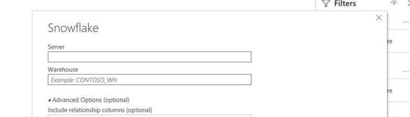

# 在归因人工智能中访问得分

>[!IMPORTANT] 有关批量导出数据所需的原始分数下载的更多详细信息，请与attributionai-support@adobe.com联系。

通过雪花访问归因AI的得分。 目前，您需要通过电子邮件将Adobe支持部门发送到attributionai-support@adobe.com，以便设置Snowflake的读者帐户并将凭据接收到该帐户。

在Adobe支持部门处理您的请求后，您将获得Snowflake的Reader帐户URL以及下面的相应凭据：

- 雪花URL
- 用户名
- 密码

>[!NOTE] Reader帐户用于使用支持JDBC连接器的SQL客户端、工作表和BI解决方案查询数据。

拥有凭据和URL后，您便可以查询模型表（其原始格式），按接触点日期或转换日期进行汇总。

## 在雪花里寻找模式

使用提供的凭据，登录到雪花。 单击左 **上角的** “工作表”选项卡，然后导航到左面板中的数据库目录。

然后，单 **击屏幕右上角的** “选择模式”。 在出现的弹出窗口中，确认您选择了正确的数据库。 接下来，单击 *模式* 下拉列表，然后选择您列出的模式之一。 您可以直接从选定查询下列出的得分表中进行模式。

## 下载原始分数

有关Raw得分下载的更多详细信息，请与attributionai-support@adobe.com联系。

## 将PowerBI连接到雪花（可选）

您的雪花凭据可用于在PowerBI桌面数据库和雪花数据库之间建立连接。

首先，在“服 *务器* ”框下，键入雪花URL。 然后，在“ *仓库*”下键入“XSMALL”。 然后，键入您的用户名和密码。

建立连接后，选择Snowflake数据库，然后选择相应的模式。 您现在可以加载所有表。

选择模式后，将显示包含您的归因分数的表。

| 表 | 描述 |
| ----- | ----------- |
| APP_{APP_ID} | 原始归因得分。 |
| APP_{APP_ID}_BY_CONV_DATE | 在转化日期级别汇总的原始归因得分。 |
| APP_{APP_ID}_BY_TP_DATE | 在接触点日期级别汇总的原始归因得分。 |

## 后续步骤

本文档概述了查询数据和访问归因AI的得分所需的步骤。 您现在可以继续浏览提供的 [其他智能服务](../home.md) 和指南。