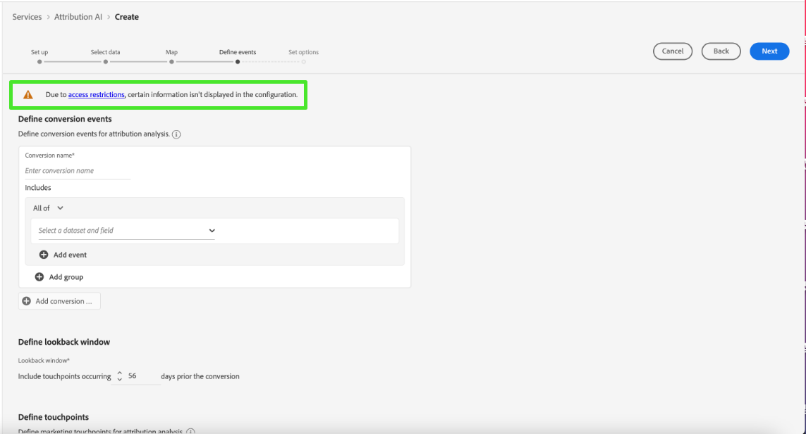

# Attribution AIUI指南

Attribution AI，作为智能服务的一部分，是一种多渠道的算法归因服务，用于计算客户交互对特定结果的影响和增量影响。 利用 Attribution AI，营销人员可以通过了解客户旅程各个阶段每个客户互动的影响来衡量和优化营销和广告支出。

本文档是与Intelligent Services用户界面中的Attribution AI交互的指南。

## 创建实例

在 [!DNL Adobe Experience Platform] UI，选择 **[!UICONTROL 服务]** 中。 的 **[!UICONTROL 服务]** 浏览器会显示并显示可用的Adobe智能服务。 在Attribution AI容器中，选择 **[!UICONTROL 打开]**.

此时将显示Attribution AI服务页面。 本页列出了Attribution AI的服务实例并显示了有关这些实例的信息，包括实例名称、转化事件、实例运行频率以及上次更新的状态。

您可以在 **[!UICONTROL 得分的转化事件总数]** 位于 **[!UICONTROL 创建实例]** 容器。 此量度跟踪当前日历年中由Attribution AI评分的转化事件总数，包括所有沙盒环境和任何已删除的服务实例。

可以使用UI右侧的控件来编辑、克隆和删除服务实例。 要显示这些控件，请从现有的 **[!UICONTROL 服务实例]**. 控件包含以下信息：

- **[!UICONTROL 编辑]**:选择 **[!UICONTROL 编辑]** 用于修改现有服务实例。 您可以编辑实例的名称、描述、状态和评分频率。
- **[!UICONTROL 克隆]**:选择 **[!UICONTROL 克隆]** 复制所选服务实例。 然后，您可以修改工作流以进行细微调整，并将其重命名为新实例。
- **[!UICONTROL 删除]**:您可以删除包含任何历史运行的服务实例。
- **[!UICONTROL 数据源]**:指向所用数据集的链接。 如果Attribution AI使用多个数据集，则会显示“多个”，然后显示数据集的数量。 选择超链接后，将显示数据集预览弹出窗口。
- **[!UICONTROL 上次运行详细信息]**:仅当运行失败时，才会显示该设置。 此处显示了有关运行失败原因（如错误代码）的信息。

- **[!UICONTROL 转化事件]**:为此实例配置的转化事件的快速概述。
- **[!UICONTROL 回顾窗口]**:您定义的时间范围，用于指示转化事件接触点之前包含的天数。
- **[!UICONTROL 接触点]**:创建此实例时定义的所有接触点的列表。

选择 **[!UICONTROL 创建实例]** 开始。

接下来，将显示Attribution AI的设置页面，您可以在该页面中为服务实例提供名称和可选描述。

## 选择数据 {#select-data}

<!-- https://www.adobe.com/go/aai-select-data -->

根据设计，Attribution AI可以使用Adobe Analytics、体验事件和消费者体验事件数据来计算归因得分。 在选择数据集时，只会列出与Attribution AI兼容的数据集。 要选择数据集，请选择&#x200B;**+**)符号或选中复选框以一次添加多个数据集。 您还可以使用搜索选项快速查找您感兴趣的数据集。

选择要使用的数据集后，选择 **[!UICONTROL 添加]** 按钮将数据集添加到数据集预览窗格。

选择信息图标  数据集旁边会打开数据集预览弹出窗口。

数据集预览包含数据，如上次更新时间、源架构以及前十列的预览。

### 数据集完整性 {#dataset-completeness}

<!-- https://www.adobe.com/go/aai-dataset-completeness -->

在数据集预览中，是一个数据集完整性百分比值。 此值提供数据集中有多少列为空/空的快照。 如果一个数据集包含大量缺失值，并且这些值在其他位置被捕获，则强烈建议您包含包含缺失值的数据集。

>[!NOTE]
>
>使用Attribution AI的最大培训窗口（一年）计算数据集完整性。 这意味着在显示数据集完整性值时，不会考虑一年以上的数据。

### 选择标识 {#identity}

现在，您可以根据身份映射（字段）将多个数据集相互连接。 您必须选择标识类型（也称为“标识命名空间”）以及该命名空间中的标识值。 如果您在同一命名空间下为架构内的多个字段分配了身份，则所有分配的身份值都会显示在由命名空间前面的身份下拉菜单中，例如 `EMAIL (personalEmail.address)` 或 `EMAIL (workEmail.address)`.

>[!IMPORTANT]
>
>必须为您选择的每个数据集使用相同的身份类型（命名空间）。 标识列中的标识类型旁边会显示一个绿色复选标记，指示数据集兼容。 例如，使用电话命名空间和 `mobilePhone.number` 作为标识符，其余数据集的所有标识符必须包含并使用Phone命名空间。

要选择身份，请选择位于身份列中的带下划线的值。 此时会出现选择标识弹出窗口。

如果命名空间中有多个标识可用，请确保为用例选择正确的标识字段。 例如，电子邮件命名空间中提供了两个电子邮件标识，即工作电子邮件和个人电子邮件。 根据用例的不同，个人电子邮件更有可能被填写，并且在单个预测中更有用。 这意味着您将选择 `EMAIL (personalEmail.address)` 作为您的身份。

>[!NOTE]
>
> 如果数据集不存在有效的标识类型（命名空间），则必须设置主标识，并使用 [架构编辑器](../../xdm/schema/composition.md#identity). 要了解有关命名空间和身份的更多信息，请访问 [身份服务命名空间](../../identity-service/namespaces.md) 文档。

## 映射媒体渠道和营销活动字段 {#aai-mapping}

<!-- https://www.adobe.com/go/aai-mapping -->

选择和添加数据集后， **地图** 配置步骤。 Attribution AI要求您为上一步中选择的每个数据集映射“媒体渠道”字段。 这是因为如果没有Attribution AI集之间的媒体渠道映射，则从数据派生的分析可能无法正确显示，从而导致分析页面难以解释。 尽管只需要媒体渠道，但强烈建议您映射一些可选字段，如媒体操作、促销活动名称、促销活动组和促销活动标记。 这样可让Attribution AI提供更清晰的洞察和最佳结果。

## 定义事件 {#define-events}

<!-- https://www.adobe.com/go/aai-define-events -->

有三种不同类型的输入数据用于定义事件：

- **转化事件：** 确定营销活动影响的业务目标，例如电子商务订单、店内购买和网站访问。
- **回顾窗口：** 提供一个时间范围，指示在转化事件接触点之前应包含的天数。
- **接触点：** 收件人、个人或cookie级别的营销事件，用于评估转化的数值或基于收入的影响。

### 定义转化事件 {#define-conversion-events}

要定义转化事件，您需要为该事件提供一个名称，并通过从 **选择数据集和字段** 下拉菜单。

选择事件后，其右侧会显示一个新的下拉菜单。 第二个下拉列表用于通过使用操作为事件提供更多上下文。 对于此转化事件，默认操作 *存在* 中，将使用。

>[!NOTE]
>
>下面的字符串 *转化名称* 将在您定义事件时更新。

接下来，您可以选择通过组合上一步中所有输入数据集而生成的组合数据集。 或者，您也可以根据 **选择数据集和字段** 下拉菜单。

的 **[!UICONTROL 添加事件]** 和 **[!UICONTROL 添加组]** 按钮用于进一步定义转化。 根据您定义的转化，您可能需要使用 **[!UICONTROL 添加事件]** 和 **[!UICONTROL 添加群组]** 按钮以提供更多上下文。

选择 **[!UICONTROL 添加事件]** 创建可使用与上面所述相同的方法填充的其他字段。 这样做会在转换名称下方的字符串定义中添加AND语句。 选择 **x** 删除已添加的事件。

选择 **[!UICONTROL 添加组]** 提供了用于创建与原始字段不同的其他字段的选项。 加入组后，蓝色 *和* 按钮。 选择 **和** 提供了一个选项，可将参数更改为包含“Or”。 “或”用于定义多个成功的转化路径。 “和”扩展了转化路径以包含其他条件。

如果需要多次转化，请选择 **添加转化** 创建新的转化卡。 您可以重复上述过程以定义多个转化。

### 定义回顾窗口 {#lookback-window}

定义完转化后，需要确认回顾窗口。 使用箭头键或选择默认值(56)，指定您希望在转化事件发生前的多少天加入接触点。 接触点在下一步中定义。

### 定义接触点

在定义接触点之前，会执行类似的工作流 [定义转化](#define-conversion-events). 最初，您需要命名接触点，并从 *输入字段名称* 下拉菜单。 选择后，将显示运算符下拉列表，其默认值为“存在”。 选择下拉菜单以显示运算符列表。

为此接触点的目的，请选择 **等于**.

选择接触点的运算符后， *输入字段值* 中的“隐藏主体”。 的下拉值 *输入字段值* 根据您之前选择的运算符和接触点值进行填充。 如果某个值未在下拉菜单中填充，则您可以在中手动键入该值。 选择下拉菜单并选择 **单击**.

>[!NOTE]
>
>运算符“存在”和“不存在”没有与其关联的字段值。

的 **添加事件** 和 **添加组** 按钮用于进一步定义接触点。 由于接触点周围是复杂的，因此在单个接触点中有多个事件和组的情况并不罕见。

选择后， **添加事件** 允许添加其他字段。 选择 **x** 删除已添加的事件。

选择 **添加群组** 允许您选择创建与原始字段不同的其他字段。 加入组后，蓝色 *和* 按钮。 选择 **和** 要更改参数，可使用新参数“Or”定义多个成功路径。 此特定接触点仅具有一个成功路径，因此不需要“或”。

>[!NOTE]
>
>在下使用字符串 *接触点名称* 以快速了解您的接触点。 请注意，字符串与接触点的名称匹配。

您可以通过选择 **添加接触点** 重复上述过程。

定义完所有必要的接触点后，向上滚动并选择 **下一个** ，以继续执行最终步骤。

## 高级培训和评分设置

Attribution AI的最终页面是 **[!UICONTROL 高级]** 用于设置培训和评分的页面。

### 安排培训

使用 *计划*，您可以选择要进行评分的一周中的日期和时间。

在下选择下拉菜单 *评分频度* 选择每日、每周和每月评分。 接下来，选择您希望在一周中的哪几天进行评分。 可以选择多天。 再次选择同一天会取消选择该日期。

要更改希望打分的一天时间，请选择时钟图标。 在显示的新叠加图中，输入您希望进行评分的时间。 选择叠加外部以将其关闭。

>[!NOTE]
>
>完成每个评分过程可能最多需要24小时。

### 其他分数数据集列（可选）

默认情况下，会为标准架构中的每个服务实例创建一个分数数据集。 您可以选择根据转化事件和接触点配置向评分数据集输出添加其他列。 首先，从输入数据集中选择列，然后拖放列以更改顺序，方法是将鼠标左键按在汉堡包图标上。

### 基于区域的建模（可选） {#region-based-modeling-optional}

客户的行为可能因国家/地区和地理区域而有显着差异。 对于全球企业，使用基于国家/地区或基于区域的模型可以提高归因准确性。 添加的每个区域都使用该区域的数据创建一个新模型。

要定义新区域，请首先选择 **[!UICONTROL 添加区域]**. 在显示的容器中，提供区域的名称。 在 **[!UICONTROL 输入字段名称]** 下拉列表。 选择此值。

接下来，选择一个运算符。

最后，在 **[!UICONTROL 输入字段值]** 下拉列表。

>[!NOTE]
>
>国家/地区代码有两个字符长。 可在此处找到完整列表 [ISO 3166-1 alpha-2](https://datahub.io/core/country-list).

### 培训窗口 {#training-window}

为确保您获得尽可能准确的模型，必须使用代表您业务的历史数据来培训您的模型。 默认情况下，模型会使用2个季度（6个月）的转化事件数据进行培训。 选择下拉菜单以更改默认设置。 您可以选择使用四分之一到四的数据（3-12个月）进行培训。

>[!NOTE]
>
>较短的培训窗口对最近的趋势更敏感，而较长的培训窗口则创建更稳健的模型，对最近的趋势也不那么敏感。

选择培训窗口后，选择 **[!UICONTROL 完成]** 中。 允许一些时间处理数据。 完成后，会显示一个弹出对话框，确认实例设置已完成。 选择 **[!UICONTROL 确定]** 被重定向到 **[!UICONTROL 服务实例]** 页面，您可以在其中查看服务实例。

## 基于属性的访问控制

>[!IMPORTANT]
>
>基于属性的访问控制当前仅在有限版本中可用。

[基于属性的访问控制](../../../help/access-control/abac/overview.md) 是Adobe Experience Platform的一项功能，它使管理员能够根据属性控制对特定对象和/或功能的访问。 属性可以是添加到对象的元数据，如添加到架构字段或区段的标签。 管理员定义包含属性的访问策略以管理用户访问权限。

利用此功能，可为体验数据模型(XDM)架构字段设置标签，以定义组织或数据使用范围。 同时，管理员可以使用用户和角色管理界面来定义围绕XDM架构字段的访问策略，并更好地管理为用户或用户组（内部、外部或第三方用户）授予的访问权限。 此外，基于属性的访问控制允许管理员管理对特定区段的访问。

通过基于属性的访问控制，管理员可以控制用户对所有平台工作流和资源中的敏感个人数据(SPD)和个人身份信息(PII)的访问。 管理员可以定义用户角色，这些用户角色只能访问与这些字段对应的特定字段和数据。

由于基于属性的访问控制，某些字段和功能可能具有访问限制，并且对于某些Attribution AI服务实例不可用。 示例包括“身份”、“得分定义”和“克隆”。

Attribution AI工作区顶部 **分析页面**，侧栏中显示的详细信息具有受限访问权限。

如果您在 **[!UICONTROL 创建实例工作流]** 页面上，数据集名称旁边会显示一个警告标记，并显示一条消息： [!UICONTROL 排除受限信息].

预览 **[!UICONTROL 创建实例工作流]** 页面时，会显示一条警告，告知您 [!UICONTROL 由于访问限制，某些信息未在数据集预览中显示。]

创建具有受限信息的实例后，继续 **[!UICONTROL 定义目标]** 步骤，顶部将显示警告： [!UICONTROL 由于访问限制，某些信息未显示在配置中。]

## 后续步骤

在本教程之后，您已成功地在Attribution AI中创建了服务实例。 实例完成评分（最多允许24小时）后，您就可以 [探索Attribution AI洞察](./discover-insights.md). 此外，如果您希望下载评分结果，请访问 [下载分数](./download-scores.md) 文档。

## 其他资源

以下视频概述了用于在Attribution AI中创建新实例的端到端工作流。

>[!VIDEO](https://video.tv.adobe.com/v/32668?learn=on&quality=12)
