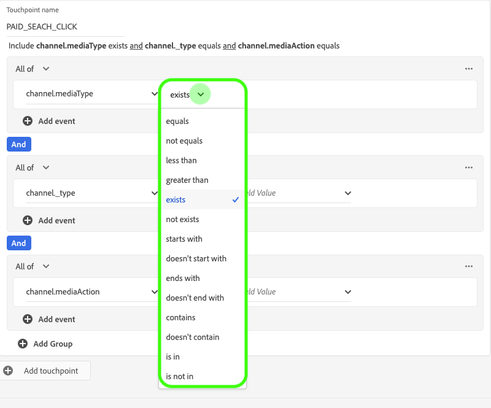
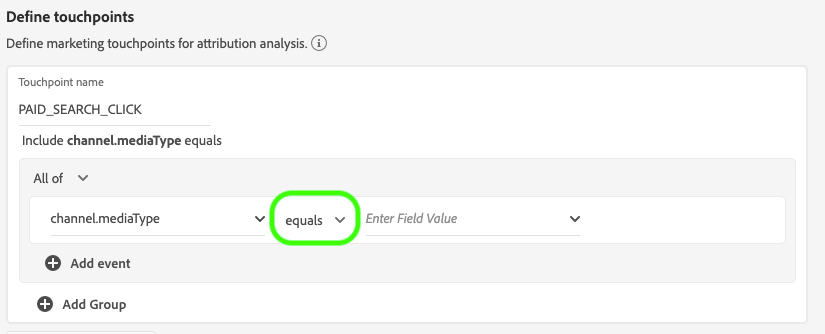

# 归因AI用户指南

归因AI作为智能服务的一部分是一种多渠道、算法归因服务，用于计算客户交互对特定结果的影响和增量影响。 利用归因AI，营销人员可以通过了解客户旅程各个阶段每个客户互动的影响来衡量和优化营销和广告支出。

此文档可作为在智能服务用户界面中与归因AI交互的指南。

## 创建实例

在Adobe Experience Platform UI中，单击左 **侧导** 航中的“服务”。 出现 *服务* 浏览器并显示可用的Adobe智能服务。 在归因AI的容器中，单击 **打开**。

此时将显示“归因AI”服务页。 本页列表归因AI的服务实例并显示相关信息，包括实例名称、转换事件、实例运行频率以及上次更新的状态。 单击 **创建实例** ，开始。

接下来，将显示归因AI的设置页面，您可以在该页面中提供基本信息并为实例指定数据集。

### 命名实例

在“ *基本信息*”下，为服务实例提供名称和可选说明。

### 选择数据集

填写基本信息后，单击标记为“选择数 **据集”的下拉框** ，以选择您的数据集。 数据集用于训练模型并对其生成的后续数据进行评分。 从下拉选择器中选择数据集时，只列出与归因AI兼容并符合体验数据模型(XDM)模式的数据集。 选择数据集后，单击 **右上** 角的“下一步”以继续进入定义事件页。

## 定义事件

有三种不同类型的输入数据用于定义事件:

- **转换事件:** 确定营销活动（如电子商务订单、店内购买和网站访问）影响的业务目标。
- **回顾窗口：** 提供一个时间范围，指明在转换事件接触点之前应包含多少天。
- **触点：** 收件人、个人或cookie级营销事件，用于评估转化的数字或基于收入的影响。

### 定义转换事件

要定义转换事件，您需要为事件指定名称，并通过单击“输入字段名称”下 **拉菜单选择** 事件类型。

选择事件后，其右侧将显示新的下拉列表。 第二个下拉菜单用于通过使用操作为事件提供更多上下文。 对于此转换事件，使用默 *认操* 作。

>[!NOTE] 转换名称下 *的字符串* ，将在您定义事件时更新。

“添 *加事件* ”和“ *添加组* ”按钮用于进一步定义转换。 根据您所定义的转换，您可能需要使用“添加 *事件* ”和“ *添加组* ”按钮来提供更多上下文。

单 **击“添加事件** ”可创建其他字段，这些字段可以使用与上述相同的方法填充。 这样做会向转 *换名* 下的字符串定义中添 *加AND语句*。 单击 **x** ，删除已添加的事件。

单击 **“添加组** ”(Add Group)，可选择创建与原始字段分开的其他字段。 添加组后，将显示蓝色 *的* “和”按钮。 单 **击** “并”提供一个选项，可将参数更改为包含“或”。 “或”用于定义多个成功的转换路径。 “And”扩展了转换路径以包含其他条件。

如果需要多个转换，请单击“添 **加转换** ”以创建新的转换卡。 您可以重复上述过程以定义多个转换。

### 定义回顾窗口

定义完转换后，您需要确认回顾窗口。 使用箭头键或单击默认值(56)，指定您希望包含接触点的转换事件前的天数。 触点在下一步中定义。

### 定义触点

定义触点遵循一个类似的工作流来定 [义转换](#define-conversion-events)。 最初，您需要命名触点，并从“输入字段名称”下 *拉菜单中选择触点* 值。 选中后，将显示运算符下拉列表，默认值为“exists”。 单击下拉列表以显示操作符的列表。

为此触点，请选择“等 **于”**。

选择触点的运算符后，“输 *入字段值* ”即可用。 “输入字段值 *”的下拉值* ，根据您先前选择的运算符和触点值填充。 如果某个值未填充到下拉列表中，则可以手动键入该值。 单击下拉框并选 **择CLICK**。

>[!NOTE] 运算符“exists”和“not exists”没有与它们关联的字段值。

“添 *加事件* ”和“ *添加组* ”按钮用于进一步定义触点。 由于接触点周围环境复杂，对于单个接触点拥有多个事件和组的情况并不少见。

单击“添 **加事件** ”后，可添加其他字段。 单击 **x** ，删除已添加的事件。

单击 **“添加组** ”(Add group)，您可以选择创建与原始组分开的其他字段。 添加组后，将显示蓝色 *的* “和”按钮。 单击 **并** (And)可更改参数，新参数“Or”用于定义多个成功路径。 此特定接触点只有一条成功路径，因此不需要“或”。

>[!NOTE] 使用触点名 *称下的字符* 串，快速了解您的触点。 请注意，该字符串与触点的名称匹配。

您可以通过单击添加触点并重 **复上述过** 程来添加其他触点。

定义完所有必要的触点后，向上滚动 **并** 单击右上角的“下一步”以继续执行最后一步。

## 高级培训和评分设置

归因AI中的最后一页是用 *于设置* 培训和评分的高级页面。

### 计划培训

使用 *计划*，您可以选择要进行评分的一周的日期和时间。

单击“评分频 *率”下* 的下拉菜单，选择每日、每周和每月评分。 接下来，选择您希望进行评分的一周中的天数。 可以选择多天。 再次单击一天可取消选择它。

要更改要进行评分的一天中的时间，请单击时钟图标。 在显示的新叠加中，输入要进行评分的日期。 在叠加外部单击以关闭它。

>[!NOTE] 完成每个评分过程最多可能需要24小时。

### 基于区域的建模（可选）

客户的行为可能因国家／地区和地理区域而有很大不同。 对于全球企业，使用基于国家或基于区域的模型可以提高归因准确性。 添加的每个区域都使用该区域的数据创建新模型。

要定义新区域，请单击“添加区域” **进行开始**。 在显示的容器中，提供该区域的名称。 只有一个值(“placeContext.geo.countryCode”)从“输入字段名称”下 *拉列表中填充* 。 选择此值。

接下来，选择一个运算符。

最后，在“输入字段值”下拉框 *中键入国家／地* 区代码。

>[!NOTE] 国家代码长度为两个字符。 ISO 3166-1 alpha-2 [提供完整列表](https://datahub.io/core/country-list)。

### 培训窗口

为确保您获得尽可能最准确的模型，必须使用代表您业务的历史数据来培训您的模型。 默认情况下，该模型使用2个季度（6个月）的数据进行培训。 选择下拉菜单以更改默认设置。 您可以选择用一到四个季度的数据（3-12个月）进行培训。

>[!NOTE] 较短的培训窗口对近期趋势更敏感，而较长的培训窗口则创建更可靠的模型，对近期趋势更不敏感。

选择培训窗口后，单击 **右上** 角的“完成”。 为数据处理留出一些时间。 完成后，将显示一个弹出窗口对话框，确认实例设置已完成。 单击 **确定** ，以重定向到“服 *务实例* ”页，您可以在该页看到服务实例。

## 后续步骤

通过遵循本教程，您已成功在归因AI中创建了服务实例。 实例完成评分（最多允许24小时）后，您就可以发现归 [因人工智能洞察](./discover-insights.md)。 此外，如果您希望下载评分结果，请访问下载 [原始得分文档](./download-scores.md) 。

## Journey Orchestration

以下视频概述了用于在Attribution AI中创建新实例的端到端工作流程。

>[!VIDEO](https://video.tv.adobe.com/v/32668?learn=on&quality=12)