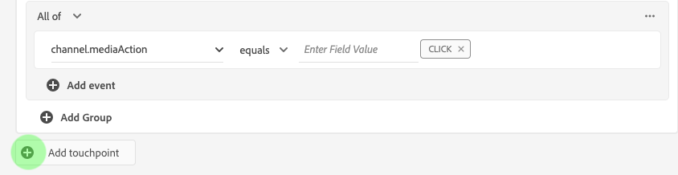

# Attribution AIUI指南

Attribution AI作为智能服务的一部分，是一种多渠道算法归因服务，用于计算客户交互对特定结果的影响和增量影响。 利用 Attribution AI，营销人员可以通过了解客户旅程各个阶段每个客户互动的影响来衡量和优化营销和广告支出。

此文档用作与Intelligent Services用户界面中的Attribution AI交互的指南。

## 创建实例

在[!DNL Adobe Experience Platform] UI中，单击左侧导航中的&#x200B;**[!UICONTROL 服务]**。 出现&#x200B;**[!UICONTROL 服务]**&#x200B;浏览器并显示可用的Adobe智能服务。 在Attribution AI容器中，单击&#x200B;**[!UICONTROL 打开]**。

将显示Attribution AI服务页面。 此页列表Attribution AI的服务实例并显示其相关信息，包括实例名称、转换事件、实例的运行频率以及上次更新的状态。

您可以在&#x200B;**[!UICONTROL 创建实例]**&#x200B;事件的右下侧找到计分的&#x200B;**[!UICONTROL 转换容器总数]**&#x200B;度量。 此度量跟踪当前日历年度中由Attribution AI评分的转换事件总数，包括所有沙箱环境和所有已删除的服务实例。

使用UI右侧的控件可以编辑、克隆和删除服务实例。 要显示这些控件，请从现有&#x200B;**[!UICONTROL 服务实例]**&#x200B;中选择一个实例。 这些控件包含以下信息：

- **[!UICONTROL 编辑]**:选择 **** 编辑允许您修改现有服务实例。您可以编辑实例的名称、描述、状态和评分频率。
- **[!UICONTROL 克隆]**:选择 **** 克隆将复制所选服务实例。然后，您可以修改工作流以进行细微调整，并将其重命名为新实例。
- **[!UICONTROL 删除]**:您可以删除包含任何历史运行的服务实例。
- **[!UICONTROL 数据源]**:指向此实例使用的数据集的链接。
- **[!UICONTROL 上次运行详细信息]**:仅当运行失败时，才显示此选项。此处显示有关运行失败原因的信息，如错误代码。

- **[!UICONTROL 转换事件]**:为此实例配置的转换事件的快速概述。
- **[!UICONTROL 回顾窗口]**:您定义的时间范围，指示转换事件接触点前的天数。
- **[!UICONTROL 触点]**:创建此实例时定义的所有接触点的列表。

选择&#x200B;**[!UICONTROL 创建实例]**&#x200B;开始。

接下来，将显示Attribution AI的设置页面，您可以在该页面提供基本信息并为实例指定数据集。

### 命名实例

在&#x200B;**[!UICONTROL 基本信息]**&#x200B;下，为服务实例提供名称和可选说明。

### 选择数据集

填写基本信息后，单击标记为&#x200B;**选择数据集**&#x200B;的下拉列表以选择您的数据集。 数据集用于训练模型并对其生成的后续数据进行评分。 从下拉选择器中选择数据集时，只列出与Attribution AI兼容且符合体验数据模型(XDM)模式的数据集。 选择数据集后，单击右上角的&#x200B;**Next**&#x200B;以继续进入定义事件页。

## 定义事件

有三种不同类型的输入数据用于定义事件:

- **转化事件:** 确定营销活动影响的业务目标，如电子商务订单、店内购买和网站访问。
- **回顾窗口：** 提供一个时间范围，指明在转换事件接触点之前应包含多少天。
- **接触点：** 收件人、个人或cookie级营销事件，用于评估转化数值或基于收入的影响。

### 定义转换事件{#define-conversion-events}

要定义转换事件，您需要为事件指定名称，并单击&#x200B;**输入字段名称**&#x200B;下拉菜单以选择事件类型。

选择事件后，其右侧将显示新的下拉列表。 第二个下拉菜单用于通过使用操作为事件提供更多上下文。 对于此转换事件，使用默认操作&#x200B;*exists*。

>[!NOTE]
>
>在定义事件时， *转换名称*&#x200B;下的字符串会更新。

**[!UICONTROL 添加事件]**&#x200B;和&#x200B;**[!UICONTROL 添加组]**&#x200B;按钮用于进一步定义转换。 根据您所定义的转换，您可能需要使用&#x200B;**[!UICONTROL 添加事件]**&#x200B;和&#x200B;**[!UICONTROL 添加组]**&#x200B;按钮来提供更多上下文。

单击&#x200B;**[!UICONTROL 添加事件]**&#x200B;可创建其他字段，这些字段可以使用与上述方法相同的方法填充。 这样做会向转换名称下的字符串定义中添加AND语句。 单击&#x200B;**x**&#x200B;以删除已添加的事件。

单击&#x200B;**[!UICONTROL 添加组]**&#x200B;可选择创建与原始组分开的其他字段。 添加组后，将显示蓝色&#x200B;*And*&#x200B;按钮。 单击&#x200B;**And**&#x200B;可以选择将参数更改为包含“Or”。 “或”用于定义多个成功的转换路径。 “And”扩展了转换路径以包含其他条件。

如果需要多个转换，请单击&#x200B;**添加转换**&#x200B;以创建新的转换卡。 您可以重复上述过程以定义多个转换。

### 定义回顾窗口{#lookback-window}

定义完转换后，您需要确认回顾窗口。 使用箭头键或单击默认值(56)，指定您希望包含接触点的转换事件前的天数。 触点在下一步中定义。

### 定义触点

定义触点遵循与定义转换[类似的工作流。 ](#define-conversion-events)最初，您需要命名触点，并从&#x200B;*输入字段名称*&#x200B;下拉菜单中选择触点值。 选中后，将显示运算符下拉列表，默认值为“exists”。 单击下拉列表以显示操作符的列表。

为此触点，请选择&#x200B;**等于**。

选择触点的运算符后，*输入字段值*&#x200B;即可用。 *输入字段值*&#x200B;的下拉值根据您先前选择的运算符和触点值填充。 如果某个值未填充到下拉列表中，则可以手动键入该值。 单击下拉列表并选择&#x200B;**CLICK**。

>[!NOTE]
>
>运算符“exists”和“not exists”没有与它们关联的字段值。

*添加事件*&#x200B;和&#x200B;*添加组*&#x200B;按钮用于进一步定义触点。 由于接触点周围环境复杂，对于单个接触点拥有多个事件和组的情况并不少见。

单击&#x200B;**添加事件**&#x200B;后，可添加其他字段。 单击&#x200B;**x**&#x200B;以删除已添加的事件。

单击&#x200B;**添加组**&#x200B;可以选择创建与原始字段分开的其他字段。 添加组后，将显示蓝色&#x200B;*And*&#x200B;按钮。 单击&#x200B;**和**&#x200B;以更改参数，新参数“Or”用于定义多个成功路径。 此特定接触点只有一条成功路径，因此不需要“或”。

>[!NOTE]
>
>使用&#x200B;*触点名称*&#x200B;下的字符串可快速了解触点。 请注意，该字符串与触点的名称匹配。

单击&#x200B;**添加触点**&#x200B;并重复上述过程，可添加其他触点。

定义完所有必要的触点后，向上滚动并单击右上角的&#x200B;**下一步**&#x200B;以继续执行最后一步。

## 高级培训和评分设置

Attribution AI中的最后一页是用于设置培训和评分的&#x200B;**[!UICONTROL 高级]**&#x200B;页。

### 计划培训

使用&#x200B;*计划*，您可以选择要进行评分的周的日期和时间。

单击&#x200B;*评分频率*&#x200B;下的下拉菜单，在每日、每周和每月评分之间进行选择。 接下来，选择您希望进行评分的一周中的天数。 可以选择多天。 再次单击一天可取消选择它。

要更改要进行评分的一天中的时间，请单击时钟图标。 在显示的新叠加中，输入要进行评分的日期。 在叠加外部单击以关闭它。

>[!NOTE]
>
>完成每个评分过程最多可能需要24小时。

### 其他得分数据集列（可选）

默认情况下，在标准模式中为每个服务实例创建得分数据集。 您可以根据转换事件和触点配置选择向得分数据集输出添加其他列。 开始通过从输入数据集中选择列，您可以拖放这些列以更改顺序，方法是按住汉堡包图标上的鼠标左键。

### 基于区域的建模（可选）{#region-based-modeling-optional}

客户的行为可能因国家／地区和地理区域而有很大不同。 对于全球企业，使用基于国家或基于区域的模型可以提高归因准确性。 添加的每个区域都使用该区域的数据创建新模型。

要定义新区域，请单击&#x200B;**[!UICONTROL 添加区域]**&#x200B;开始。 在显示的容器中，提供该区域的名称。 从&#x200B;**[!UICONTROL 输入字段名称]**&#x200B;下拉列表中只填充一个值(&quot;placeContext.geo.countryCode&quot;)。 选择此值。

接下来，选择一个运算符。

最后，在&#x200B;**[!UICONTROL 输入字段值]**&#x200B;下拉框中键入国家／地区代码。

>[!NOTE]
>
>国家代码长度为两个字符。 在[ISO 3166-1 alpha-2](https://datahub.io/core/country-list)处可找到完整的列表。

### 培训窗口{#training-window}

为确保您获得尽可能最准确的模型，必须使用代表您业务的历史数据来培训您的模型。 默认情况下，该模型使用2个季度（6个月）的转化事件数据进行培训。 选择下拉菜单以更改默认设置。 您可以选择用一到四个季度的数据（3-12个月）进行培训。

>[!NOTE]
>
>较短的培训窗口对近期趋势更敏感，而较长的培训窗口则创建更可靠的模型，对近期趋势更不敏感。

选择培训窗口后，单击右上角的&#x200B;**[!UICONTROL 完成]**。 为数据处理留出一些时间。 完成后，将显示一个弹出窗口对话框，确认实例设置已完成。 单击&#x200B;**[!UICONTROL 确定]**&#x200B;以重定向到&#x200B;**[!UICONTROL 服务实例]**&#x200B;页面，在该页可以看到您的服务实例。

## 后续步骤

按照本教程，您已成功地在Attribution AI中创建了服务实例。 实例完成评分后（最多允许24小时），您可以[发现Attribution AI洞察](./discover-insights.md)。 此外，如果您希望下载评分结果，请访问下载分数[文档。](./download-scores.md)

## Journey Orchestration

以下视频概述了用于在Attribution AI中创建新实例的端到端工作流。

>[!VIDEO](https://video.tv.adobe.com/v/32668?learn=on&quality=12)