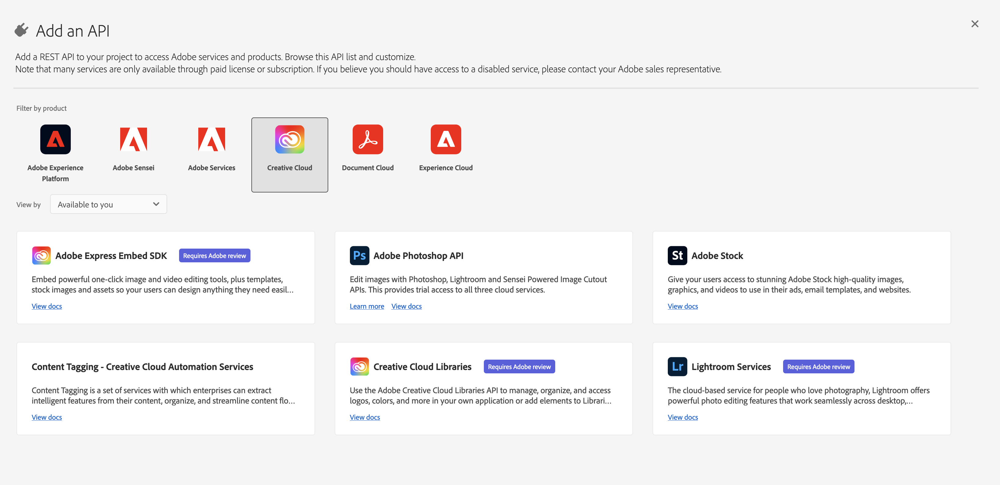
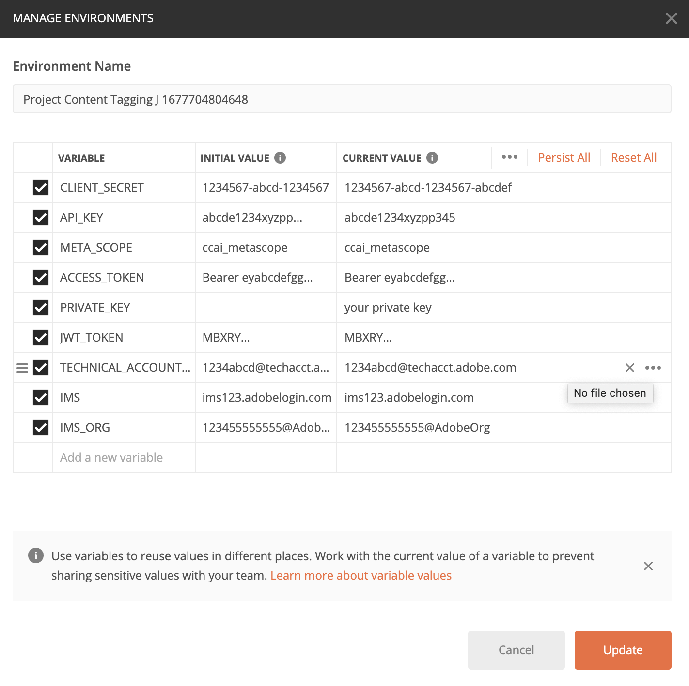

# 内容标记快速入门

[!DNL Content tagging]利用Adobe I/OAPI。 要调用Adobe I/OAPI和I/O控制台集成，您必须先完成[身份验证教程](https://www.adobe.com/go/platform-api-authentication-en)。

但是，在执行&#x200B;**添加API**&#x200B;步骤时，该API位于Creative Cloud下而非Adobe Experience Platform下，如以下屏幕快照所示：

完成身份验证教程将为所有Adobe I/OAPI调用中的每个所需标头提供值，如下所示：

- `Authorization: Bearer {ACCESS_TOKEN}`
- `x-api-key: {API_KEY}`
- `x-gw-ims-org-id: {ORG_ID}`

## 创建Postman环境（可选）

在Adobe Developer Console中设置项目和API后，您可以选择下载Postman的环境文件。 在项目的左边栏&#x200B;**[!UICONTROL API]**&#x200B;下，选择&#x200B;**[!UICONTROL 内容标记]**。 此时将打开一个新选项卡，其中包含标记为“[!DNL Try it out]”的卡片。 选择&#x200B;**下载Postman**&#x200B;以下载用于配置Postman环境的JSON文件。

为postman下载

下载文件后，打开Postman并选择右上角的&#x200B;**齿轮图标**&#x200B;以打开&#x200B;**管理环境**&#x200B;对话框。

接下来，从&#x200B;**管理环境**&#x200B;对话框中选择&#x200B;**导入**。

系统将重定向您并提示您从计算机中选择一个环境文件。 选择您之前下载的JSON文件，然后选择&#x200B;**打开**&#x200B;以加载环境。

您将被重定向回&#x200B;*管理环境*&#x200B;选项卡，并填充了新环境名称。 选择环境名称以查看和编辑Postman中可用的变量。 您仍需要手动填充`JWT_TOKEN`和`ACCESS_TOKEN`。 在完成[身份验证教程](https://www.adobe.com/go/platform-api-authentication-en)时，应该已获得这些值。

完成后，您的变量应当类似于下面的屏幕快照。 选择&#x200B;**更新**&#x200B;以完成环境设置。

您现在可以从右上角的下拉菜单中选择环境，并自动填充保存的任何值。 您只需随时重新编辑这些值，即可更新所有API调用。

有关使用Postman使用Adobe I/OAPI的更多信息，请参阅[上的Medium帖子，在Adobe I/O](https://medium.com/adobetech/using-postman-for-jwt-authentication-on-adobe-i-o-7573428ffe7f)上使用Postman进行JWT身份验证。

## 正在读取示例 API 调用

本指南提供了示例 API 调用来演示如何格式化请求。这些包括路径、必需的标头和格式正确的请求负载。还提供了在 API 响应中返回的示例 JSON。有关示例API调用文档中使用的约定的信息，请参阅Experience Platform疑难解答指南中有关[如何读取示例API调用](../../landing/troubleshooting.md)的部分。

## 后续步骤 {#next-steps}

准备好所有凭据后，即可为[!DNL Content tagging]设置自定义工作程序。 以下文档有助于了解可扩展性框架和环境设置。

要了解有关可扩展性框架的更多信息，请先阅读[可扩展性简介](https://experienceleague.adobe.com/docs/asset-compute/using/extend/understand-extensibility.html)文档。 本文档概述了先决条件和设置要求。

要了解有关为[!DNL Content tagging]设置环境的更多信息，请先阅读[设置开发人员环境](https://experienceleague.adobe.com/docs/asset-compute/using/extend/setup-environment.html)的指南。 本文档提供了允许您为Asset compute服务开发的设置说明。
