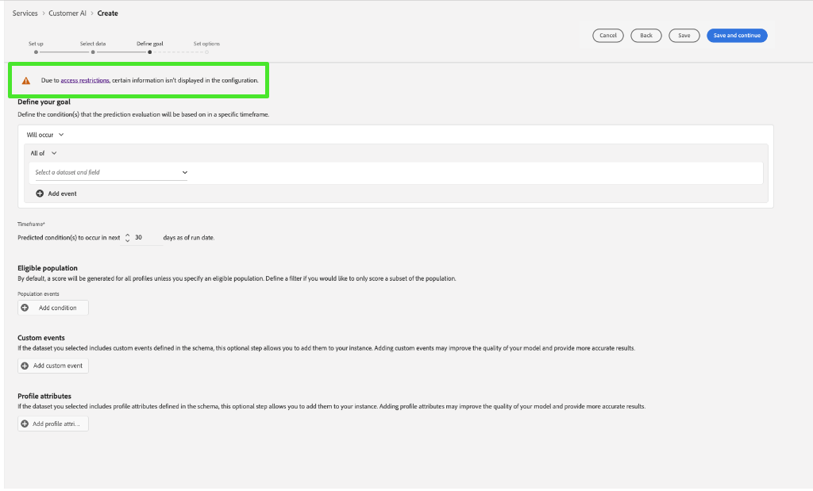

# 客户人工智能中基于属性的访问控制

>[!IMPORTANT]
>
>基于属性的访问控制当前仅在有限版本中可用。

[基于属性的访问控制](../../../access-control/abac/overview.md)是Adobe Experience Platform的一项功能，它使管理员能够根据属性控制对特定对象和/或功能的访问。 属性可以是添加到对象的元数据，例如添加到架构字段或区段的标签。 管理员定义包括管理用户访问权限的属性的访问策略。

此功能允许您使用定义组织或数据使用范围的标签来标记Experience Data Model (XDM)架构字段。 同时，管理员可以使用用户和角色管理界面定义围绕XDM架构字段的访问策略，并更好地管理授予用户或用户组（内部、外部或第三方用户）的访问权限。 此外，基于属性的访问控制允许管理员管理对特定区段的访问。

通过基于属性的访问控制，贵组织的管理员可以控制用户在所有Experience Platform工作流和资源中对敏感个人数据(SPD)和个人身份信息(PII)的访问。 管理员可以定义只能访问特定字段以及与这些字段对应的数据的用户角色。

由于基于属性的访问控制，某些字段和功能将限制访问，并且对于某些客户人工智能服务模型不可用。 示例包括“Identity”、“Score Definition”和“Clone”。

在客户人工智能工作区&#x200B;**分析页面**&#x200B;顶部，请注意，侧栏、得分定义、身份和配置文件属性中的详细信息均显示“访问受限”。

当您在&#x200B;**[!UICONTROL 创建模型工作流]**&#x200B;页面上预览具有受限架构的数据集时，会显示一条警告，让您知道[!UICONTROL 由于访问限制，某些信息不会显示在数据集预览中。]

创建包含受限信息的模型并继续&#x200B;**[!UICONTROL 定义目标]**&#x200B;步骤后，顶部将显示警告： [!UICONTROL 由于访问限制，某些信息不会显示在配置中。]

使用访问控制时，**查看客户人工智能**&#x200B;和&#x200B;**管理客户人工智能**&#x200B;权限授予对客户人工智能不同功能的访问权限。 **管理客户人工智能**&#x200B;权限允许您&#x200B;**创建**、**更新**、**删除**、**启用**&#x200B;或&#x200B;**禁用**&#x200B;模型，而&#x200B;**查看客户人工智能**&#x200B;允许您读取或查看模型。 审核日志记录了&#x200B;**创建**、**更新**&#x200B;和&#x200B;**删除**&#x200B;操作。

请参阅文档以了解[为访问控制](../../../access-control/home.md)分配权限，或如何[使用审核日志来监视访问和活动](../../../landing/governance-privacy-security/audit-logs/overview.md)。

## 后续步骤

通过阅读本指南，您已了解[!DNL Experience Platform]中访问控制的主要原则。 您现在可以继续阅读[访问控制用户指南](../overview.md)，以了解有关如何使用[!DNL Admin Console]创建产品配置文件和为[!DNL Experience Platform]分配权限的详细步骤。
