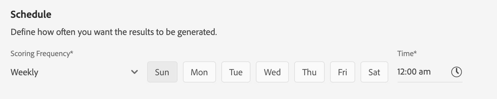

# 客户人工智能用户指南

作为智能服务的一部分，客户人工智能使您能够生成自定义倾向得分，而不必担心机器学习。

本指南介绍了使用客户人工智能的步骤。 为下列主题提供了步骤：

* [配置实例](#configure-an-instance)
* [利用预测得分创建客户细分](#create-customer-segments-with-predicted-scores)

此外，本教程的附录提供了有关客户人工智能 [输出的信息](#customer-ai-output-data)。

## 配置实例

智能服务将客户人工智能作为一种简单易用的Adobe Sensei服务提供，该服务可针对不同的用例进行配置。 以下各节提供了配置客户AI实例的步骤。

### 设置实例

在平台UI中，单击左 **侧导航** 中的“服务”。 出现 **服务浏览器** ，显示您可以使用的所有可用服务。 在客户AI的容器中，单击“打 **开”**。

“客 *户AI* ”屏幕显示所有现有客户AI实例。 单击“ **创建实例**”。

将出现实例创建工作流，从“设置”( *Setup* )步骤开始。

以下是关于必须为实例提供的值的重要信息：

* 实例的名称将用于显示客户AI得分的所有位置。 因此，名称应描述预测分数代表什么，例如，“取消杂志订阅的可能性”。

* 倾向类型决定得分和度量极性的目的。 您可以选择“ **客户流失** ”或 **“转化**”。 有关倾向类型如何影 [响实例的更多信息](./discover-insights.md#scoring-summary) ，请参阅发现洞察文档中评分摘要下的注释。

* 数据源是数据所在的位置。 数据集是用于预测得分的输入数据集。 根据设计，客户人工智能使用消费者体验事件数据来计算倾向得分。 从下拉选择器中选择数据集时，仅列出与客户AI兼容的数据集。

* 默认情况下，将为所有用户档案生成倾向得分，除非指定符合条件的人群。 您可以通过定义条件来指定符合条件的人口，以包括或排除基于用户档案的事件。

提供所需的值，然后单击“下 **一步”**。

### 定义目标

将显 *示定义目标步骤* ，该步骤为您提供了一个交互式环境，以便以可视方式定义目标。 目标由一个或多个事件组成，其中每个事件的发生基于其保持的条件。 客户人工智能实例的目标是确定在给定时间范围内实现其目标的可能性。

单击 **输入字段名称** ，然后从下拉框列表中选择字段。 单击第二个输入，为事件的条件选择一个子句，然后提供目标值以完成事件。 可通过单击“添加事件”配置 **其他事件**。 最后，通过应用以天为单位的预测时间帧来完成目标，然后单击“下 **一步”**。

### 配置计划 *（可选）*

将显 *示高级* 步骤。 此可选步骤允许您配置计划以自动执行预测运行，定义预测排除以过滤某些事件，或者单击 **Finish** （如果不需要）。

通过配置评分频率设置 *评分计划*。 可以计划每周或每月运行自动预测运行。

在计划配置下，您可以定义预测排除，以防止在生成得分时评估满足特定条件的事件。 此功能可用于过滤掉不相关的数据输入。

要排除某些事件，请单 **击“添加排除** ”，然后按与定义目标相同的方式定义事件。 要删除排除，请单击事件容器右上角的省略号(**...**)，然后单击删除 **容器**。

根据需要排除事件，然后单击 **完成** ，以创建实例。

如果实例创建成功，将立即触发预测运行，并根据您定义的计划执行后续运行。

>[!NOTE] 根据输入数据的大小，预测运行最长可能需要24小时。

按照本节所述，您配置了客户AI的实例，并执行了预测运行。 在运行成功完成后，得分的洞察会自动用预测得分填充用户档案。 请等待24小时，然后继续本教程的下一节。

## 利用预测得分创建客户细分

当预测运行完成时，预测倾向得分会由用户档案自动消耗。 利用客户AI得分丰富用户档案，可创建客户细分，以根据其倾向得分查找受众。 本节提供了使用区段生成器创建区段的步骤。 有关创建区段的更强大的教程，请参阅“区 [段生成器”用户指南](../../segmentation/tutorials/create-a-segment.md)。

>[!IMPORTANT] 为了利用此方法，需要为数据集启用实时客户用户档案。

在平台UI中，单击左侧导 **航中的** “区段”，然后单击 **创建区段**。

此时将 *显示“区段生成器* ”。 从左侧的 *字段* (Fields)列和“属性”( *Attributes)选项卡下，单击名为“* XDM Individual用户档案”( **** XDM Individual)的文件夹，然后单击具有单位命名空间的文件夹。 名为 **Customer AI的文件夹包含预测运行的结果** ，并以得分所属的实例命名。 单击实例文件夹可访问其所需实例的结果。

位于区段生成器中心，将“分数”属性拖放 **到规则***生成器画布上以定义规则* 。

在右侧的区段属 *性列下* ，为区段提供名称。

在左侧的“字段 *”列上* ，单击齿轮图 **标** ，然后选择 **“合并策略”**。 Click **Save** to create the segment.

## 后续步骤

通过本教程，您已使用“区段生成器”成功配置了客户AI的一个实例、生成的倾向得分以及根据其倾向得分找到受众。 您现在可以通过将受众激活到目标来目标它们。 有关详细 [信息，请参阅目标](https://docs.adobe.com/content/help/en/experience-platform/rtcdp/destinations/destinations-overview.html) 概述。

## 附录

下节提供有关客户AI输出的其他信息。

### 客户人工智能输出数据

客户人工智能为被认为符合条件的个别用户档案生成多个属性。 这些值由实时客户用户档案消耗，可用于创建和定义区段。 下表描述了在客户AI的输出中找到的各种属性：

| 属性 | 描述 |
| ----- | ----------- |
| 得分 | 客户在定义的时间范围内达到预测目标的相对似然性。 此值不应被视为概率百分比，而应视为个人与整体群体相比的可能性。 此得分的范围为0到100。 |
| 概率 | 该属性是用户档案在定义的时间范围内实现预测目标的真实概率。 在比较不同目标的输出时，建议您考虑百分比或分数以上的概率。 在确定符合条件的群体的平均概率时，应始终使用概率，因为对于不频繁发生的事件，概率往往处于较低的一侧。 概率范围在0到1之间的值。 |
| 百分点 | 此值提供有关用户档案相对于其他类似得分的用户档案的性能的信息。 例如，百分位排名为99的用户档案表示，与所有其他得分的用户档案中的99%相比，客户流失风险更高。 百分比范围从1到100。 |
| 倾向类型 | 所选倾向类型。 |
| 得分日期 | 得分发生的日期。 |
| 影响因素 | 预测了用户档案可能转化或参与的原因。 因素包括以下属性：<ul><li>代码：对用户档案的预测得分有积极影响的用户档案或行为属性。 </li><li>值：用户档案或行为属性的值。</li><li>重要性：指示用户档案或行为属性对预测得分（低、中、高）的权重</li></ul> |