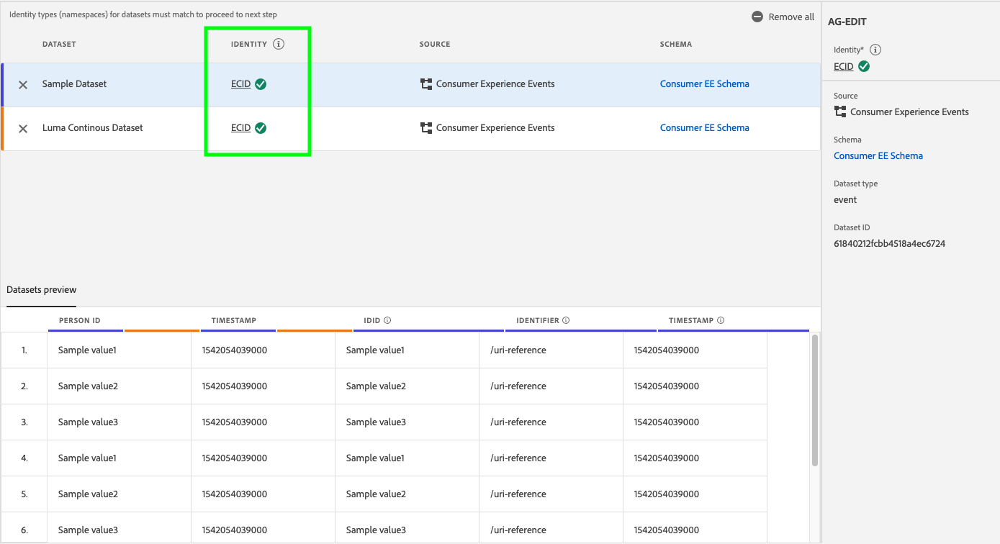
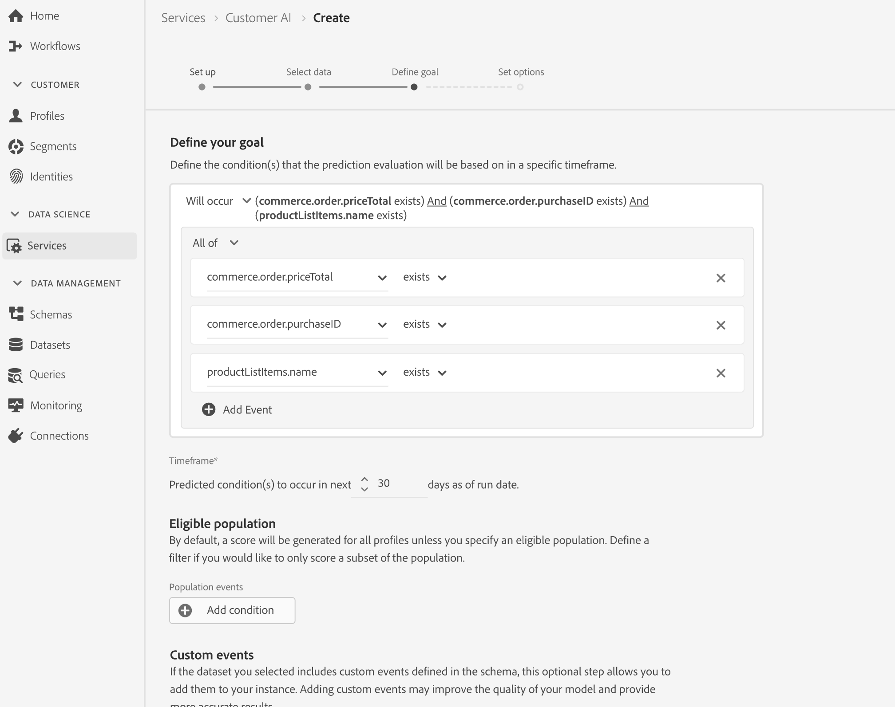
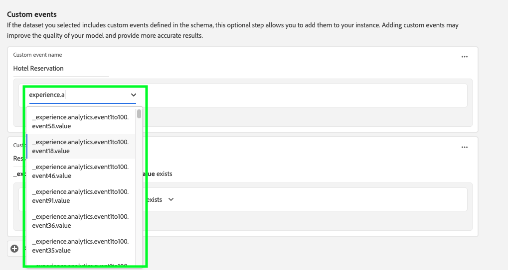

# 配置客户人工智能实例

Customer AI作为AI/ML服务的一部分，使您能够生成自定义倾向分数，而无需担心机器学习。

AI/ML服务将Customer AI作为易于使用的Adobe Sensei服务提供，可以针对不同用例进行配置。 以下部分提供了配置Customer AI实例的步骤。

## 创建实例 {#set-up-your-instance}

在Experience Platform UI的左侧导航中选择&#x200B;**[!UICONTROL 服务]**。 此时会出现&#x200B;**[!UICONTROL 服务]**&#x200B;浏览器，并显示您可以使用的全部可用服务。 在客户人工智能的容器中，选择&#x200B;**[!UICONTROL 打开]**。

出现&#x200B;**Customer AI** UI并显示您的所有服务实例。

- 您可以在&#x200B;**[!UICONTROL 创建实例]**&#x200B;容器的右下角找到&#x200B;**[!UICONTROL 已评分的用户档案总数]**&#x200B;指标。 此量度跟踪客户人工智能在当前日历年评分的用户档案总数，包括所有沙盒环境和任何已删除的服务实例。

通过使用UI右侧的控件，可以编辑、克隆和删除服务实例。 若要显示这些控件，请从现有&#x200B;**[!UICONTROL 服务实例]**&#x200B;中选择一个实例。 这些控件包含以下内容：

- **[!UICONTROL 编辑]**：选择&#x200B;**[!UICONTROL 编辑]**&#x200B;允许您修改现有的服务实例。 您可以编辑实例的名称、描述和评分频率。
- **[!UICONTROL 克隆]**：选择&#x200B;**[!UICONTROL 克隆]**&#x200B;将复制当前选择的服务实例安装程序。 然后，您可以修改工作流以进行细微的调整，并将其重命名为新实例。
- **[!UICONTROL 删除]**：您可以删除包含任何历史运行的服务实例。 相应的输出数据集将从Experience Platform中删除。 但是，同步到实时客户档案的分数不会被删除。
- **[!UICONTROL 数据源]**：此实例使用的数据集的链接。 如果正在使用多个数据集，则选择超链接文本将打开数据集预览弹出框。
- **[!UICONTROL 上次运行详细信息]**：仅当运行失败时才会显示此信息。 有关运行失败原因的信息（如错误代码），将显示在此处。
- **[!UICONTROL 得分定义]**：您为此实例配置的目标快速概述。

要创建新实例，请选择&#x200B;**[!UICONTROL 创建实例]**。

## 设置

此时会出现实例创建工作流，从&#x200B;**[!UICONTROL 设置]**&#x200B;步骤开始。

以下是关于必须向实例提供的值的重要信息：

- **[!UICONTROL 名称]：**&#x200B;将显示客户人工智能得分的所有位置都使用实例的名称。 因此，名称应该描述预测分数表示的内容。 例如，“取消杂志订阅的可能性”。

- **[!UICONTROL 描述]：**&#x200B;指示您试图预测的内容的描述。

- **[!UICONTROL 倾向性类型]：**&#x200B;倾向性类型决定得分和量度极性的意图。 您可以选择&#x200B;**[!UICONTROL 流失]**&#x200B;或&#x200B;**[!UICONTROL 转化]**。 有关倾向类型如何影响您的实例的更多信息，请参阅发现见解文档中[评分摘要](./discover-insights.md#scoring-summary)下的注释。

提供所需的值，然后选择&#x200B;**[!UICONTROL 下一步]**&#x200B;以继续。

## 选择数据 {#select-data}

通过设计，客户人工智能使用Adobe Analytics、Adobe Audience Manager、一般体验事件和消费者体验事件数据来计算倾向分数。 在选择数据集时，仅列出与客户人工智能兼容的数据集。 要选择一个数据集，请选择数据集名称旁边的(**+**)符号，或选中该复选框以一次添加多个数据集。 使用搜索选项快速查找您感兴趣的数据集。

选择您要使用的数据集后，选择&#x200B;**[!UICONTROL 添加]**&#x200B;按钮以将数据集添加到数据集预览窗格。

选择数据集旁边的信息图标将打开数据集预览弹出框。

数据集预览包含上次更新时间、源架构和前十列的预览等数据。

选择&#x200B;**[!UICONTROL 保存]**&#x200B;以在工作流中移动时保存草稿。 您还可以保存草稿模型配置并转到工作流中的下一步。 在模型配置期间使用&#x200B;**[!UICONTROL 保存并继续]**&#x200B;创建和保存草稿。 利用功能，可创建和保存模型配置的草稿，当必须在配置工作流中定义多个字段时特别有用。

### 数据集完整性 {#dataset-completeness}

数据集预览中存在数据集完整性百分比值。 此值提供数据集中有多少列为空/空的快速快照。 如果数据集包含大量缺失值，并且这些值是在其他位置捕获的，则强烈建议您包含包含包含缺失值的数据集。 在此示例中，人员ID为空，但人员ID是在可包含的单独数据集中捕获的。

>[!NOTE]
>
>数据集完整性是使用客户人工智能的最大培训窗口（一年）计算的。 这意味着在显示数据集完整性值时，不会考虑超过一年的数据。

### 选择身份 {#identity}

您现在可以根据标识映射（字段）将多个数据集连接在一起。 您必须选择身份类型（也称为“身份命名空间”）以及该命名空间中的身份值。 如果在同一命名空间下将多个字段指定为架构中的标识，则所有分配的标识值都会显示在由命名空间（如`EMAIL (personalEmail.address)`或`EMAIL (workEmail.address)`）前置的标识下拉列表中。

[选择相同的命名空间](../images/user-guide/cai-identity-map.png)

>[!IMPORTANT]
>
>您选择的每个数据集都必须使用相同的身份类型（命名空间）。 在身份列中，身份类型旁边会显示一个绿色复选标记，指示数据集兼容。 例如，在使用Phone命名空间和`mobilePhone.number`作为标识符时，其余数据集的所有标识符都必须包含并使用Phone命名空间。

要选择标识，请选择位于标识列中的带下划线的值。 此时将显示“选择身份”弹出框。

<!--  -->
[选择相同的命名空间](../images/user-guide/cai-identity-namespace.png)

如果命名空间中有多个可用身份，请确保为您的用例选择正确的身份字段。 例如，电子邮件命名空间中提供了两个电子邮件身份：一个是工作电子邮件，另一个是个人电子邮件。 根据用例，个人电子邮件更有可能被填写，并且在个人预测中更有用。 这意味着将选择`EMAIL (personalEmail.address)`作为标识。

未选择

>[!NOTE]
>
> 如果数据集不存在有效的身份类型（命名空间），则必须使用[架构编辑器](../../../xdm/schema/composition.md#identity)设置主身份并将其分配给身份命名空间。 要了解有关命名空间和身份的详细信息，请访问[Identity Service命名空间](../../../identity-service/features/namespaces.md)文档。

## 定义目标 {#define-a-goal}

<!-- https://www.adobe.com/go/cai-define-a-goal -->

此时将显示&#x200B;**[!UICONTROL 定义目标]**&#x200B;步骤，该步骤为您提供了一个交互式环境，以便直观地定义预测目标。 目标由一个或多个事件组成，其中每个事件的发生均基于其持有的条件。 客户人工智能实例的目标是确定在给定时间框架内实现其目标的可能性。

要创建目标，请选择&#x200B;**[!UICONTROL 输入字段名称]**，然后从下拉列表中选择一个字段。 选择第二个输入（即事件条件的子句），然后根据需要提供目标值以完成事件。 通过选择&#x200B;**[!UICONTROL 添加事件]**，可以配置其他事件。 最后，通过应用预测时间范围（天数）完成目标，然后选择&#x200B;**[!UICONTROL 下一步]**。

<!--  -->

### 将发生，将不发生

定义目标时，您可以选择发生&#x200B;**&#x200B;**&#x200B;或&#x200B;**[!UICONTROL 不发生]**。 选择&#x200B;**[!UICONTROL 将发生]**&#x200B;意味着您定义的事件条件需要得到满足，才能将客户的事件数据包含在分析UI中。

例如，如果要设置应用以预测客户是否会进行购买，则可以选择&#x200B;**[!UICONTROL Will our]**，后跟&#x200B;**[!UICONTROL All of]**，然后输入&#x200B;**commerce.purchases.id**（或类似字段）和&#x200B;**[!UICONTROL exists]**&#x200B;作为运算符。

<!--  -->

但是，在某些情况下，您可能希望预测某个事件在特定时间范围内是否不会发生。 要使用此选项配置目标，请从顶级下拉列表中选择&#x200B;**[!UICONTROL 不会发生]**。

例如，如果您希望预测哪些客户的参与度降低，并且不要在下个月访问您的帐户登录页面。 选择&#x200B;**[!UICONTROL 不会发生]**，后跟&#x200B;**[!UICONTROL 全部]**，然后输入&#x200B;**web.webInteraction.URL**（或类似字段）和&#x200B;**[!UICONTROL equals]**&#x200B;作为运算符，并将&#x200B;**account-login**&#x200B;作为值。

### 所有和任何

在某些情况下，您可能想要预测事件的组合是否将发生，而在其他情况下，您可能想要从预定义集合中预测任何事件的发生。 为了预测客户是否具有事件组合，请从&#x200B;**[!UICONTROL 定义目标]**&#x200B;页面的第二级下拉列表中选择&#x200B;**[!UICONTROL 所有]**&#x200B;选项。

例如，您可能想要预测客户是否购买特定产品。 此预测目标由两个条件定义：`commerce.order.purchaseID` **存在**&#x200B;且`productListItems.SKU` **等于**&#x200B;某个特定值。

为了预测客户是否具有来自给定集的任何事件，您可以使用&#x200B;**[!UICONTROL 任何]**&#x200B;选项。

例如，您可能想要预测客户是访问特定URL还是访问具有特定名称的网页。 此预测目标由两个条件定义：`web.webPageDetails.URL` **以**&#x200B;为特定值开头，`web.webPageDetails.name` **以**&#x200B;为特定值开头。

### 符合条件的群体&#x200B;*（可选）*

默认情况下，除非指定符合条件的群体，否则将为所有用户档案生成倾向分数。 您可以通过定义条件来指定符合条件的群体，以根据事件包含或排除用户档案。

### 自定义事件（*可选*） {#custom-events}

除了客户人工智能用于生成倾向分数的[标准事件字段](../data-requirements.md#standard-events)之外，如果您还有其他信息，则会提供一个自定义事件选项。 使用此选项可添加您认为具有影响力的其他事件，这些事件可能会提高模型的质量，并有助于提供更准确的结果。 如果您选择的数据集包含架构中定义的自定义事件，则可以将其添加到实例。

>[!NOTE]
>
> 有关自定义事件如何影响客户人工智能评分结果的深入说明，请访问[自定义事件示例](#custom-event)部分。

要添加自定义事件，请选择&#x200B;**[!UICONTROL 添加自定义事件]**。 接下来，输入自定义事件名称，然后将其映射到架构中的事件字段。 在查看影响因素和其他见解时，自定义事件名称将代替字段值显示。 这意味着将使用自定义事件名称而不是事件的ID/值。 有关如何显示自定义事件的详细信息，请参阅[自定义事件示例部分](#custom-event)。 客户人工智能使用这些额外的自定义事件来提高模型的质量并提供更准确的结果。

接下来，从可用运算符下拉列表中选择要使用的运算符。 仅列出与事件兼容的运算符。

最后，如果选定的运算符需要一个字段值，请输入该字段值。 在本例中，我们只需要查看是否存在酒店或餐厅预订。 但是，如果我们希望获得更准确的值，则可以使用等于运算符，并在值提示符下输入准确的值。

完成后，选择右上角的&#x200B;**[!UICONTROL 下一步]**&#x200B;继续。

### 自定义配置文件属性（*可选*）

除了客户人工智能用于生成倾向分数的[标准事件字段](../data-requirements.md#standard-events)之外，您还可以在数据中定义重要的用户档案数据集字段（带有时间戳）。 使用此选项可添加您认为具有影响力的其他配置文件属性，这些配置文件属性可提高模型的质量并提供更准确的结果。 此外，添加自定义用户档案属性可让客户人工智能更好地展示特定用户档案如何在倾向性存储桶中结束。

>[!NOTE]
>
>添加自定义用户档案属性的工作流程与添加自定义事件的工作流程相同。 与自定义事件类似，自定义用户档案属性也会以相同方式影响模型评分。 有关深入说明，请访问[自定义事件示例](#custom-event)部分。

#### 从配置文件快照导出中选择配置文件属性

您还可以选择从每日配置文件快照导出中包括配置文件属性。 这些属性会同步到配置文件快照导出，并显示最新的可用值。 它们会自动显示，并且不需要在配置步骤中选择数据集。

>[!WARNING]
>
> 请勿选择作为预测目标的结果而更新的配置文件属性或与预测目标高度相关的配置文件属性。 这会导致数据泄露和模型过度拟合。 例如，`total_purchases_in_the_last_3_months`是预测购买转换的属性。

### 添加自定义事件示例 {#custom-event}

在以下示例中，自定义事件和配置文件属性被添加到客户人工智能实例。 客户人工智能实例的目标是预测客户在未来60天内购买其他Luma产品的可能性。 通常，产品数据会链接到产品SKU。 在这种情况下，SKU为`prd1013`。 在培训/评分客户人工智能模型后，此SKU可以链接到事件，并显示为倾向存储段的影响因素。

客户人工智能自动对自定义事件（如&#x200B;**观看购买**）应用“间隔天数”或“计数”等功能生成。 如果此事件被视为对客户具有高倾向性、中倾向性或低倾向性的原因具有影响力的因素，则客户人工智能会将其显示为`Days since prd1013 purchase`或`Count of prd1013 purchase`。 通过将此事件创建为自定义事件，您可以为事件提供一个新名称，使结果更易于阅读。 例如：`Days since Watch purchase`。此外，客户人工智能将使用此事件进行训练和评分，即使该事件不是标准事件。 这意味着，您可以添加多个您认为可能具有影响力的事件，并通过包括预留、访客日志和其他事件等数据来进一步自定义您的模型。 添加这些数据点会进一步提高Customer AI模型的准确性和精确性。

## 设置选项

设置选项步骤允许您配置计划以自动运行预测，定义预测排除以过滤某些事件，以及打开/关闭&#x200B;**[!UICONTROL 配置文件]**。

### 配置计划&#x200B;*（可选）* {#configure-a-schedule}

要设置评分计划，请首先配置&#x200B;**[!UICONTROL 评分频率]**。 可以计划每周或每月运行自动预测运行。

### 预测排除项&#x200B;*（可选）*

如果您的数据集包含作为测试数据添加的任何列，您可以通过选择&#x200B;**[!UICONTROL 添加排除项]**，然后输入要排除的字段，将该列或事件添加到排除项列表中。 这样可防止在生成分数时对符合特定条件的事件进行评估。 此功能可用于过滤掉不相关的数据输入或促销。

要排除事件，请选择&#x200B;**[!UICONTROL 添加排除项]**&#x200B;并定义该事件。 要删除排除项，请选择事件容器右上角的省略号(**[!UICONTROL ...]**)，然后选择&#x200B;**[!UICONTROL 删除容器]**。

### 配置文件切换

用户档案切换允许客户人工智能将评分结果导出到实时客户用户档案。 禁用此切换可防止将模型评分结果添加到用户档案。 禁用此功能后，客户人工智能评分结果仍可用。

首次使用客户人工智能时，您可以关闭此功能，直到对模型输出结果满意为止。 这样可防止在微调模型时将多个评分数据集上传到客户配置文件。 完成校准模型后，可以使用&#x200B;**服务实例**&#x200B;页面中的[克隆选项](#set-up-your-instance)克隆模型。 这允许您创建模型副本并打开配置文件。

设置评分计划、包含预测排除项和配置文件切换后，选择右上角的&#x200B;**[!UICONTROL 完成]**&#x200B;以创建您的客户人工智能实例。

如果实例创建成功，则会立即触发预测运行，并根据您定义的计划执行后续运行。

>[!NOTE]
>
>根据输入数据的大小，预测运行最多可能需要24小时才能完成。

通过遵循此部分，您已配置一个客户人工智能实例并执行预测运行。 成功完成运行后，如果已启用用户档案切换，则得分分析会自动使用预测得分填充用户档案。 请最长等待24小时，然后再继续本教程的下一部分。

## 后续步骤 {#next-steps}

通过学习本教程，您已成功配置了一个客户人工智能实例并生成了倾向分数。 您现在可以选择使用区段生成器[创建具有预测分数的客户区段](./create-segment.md)或[发现客户人工智能见解](./discover-insights.md)。

## 其他资源

以下视频旨在支持您了解客户人工智能的配置工作流。 此外，还提供了最佳实践和用例示例。

>[!IMPORTANT]
>
> 以下视频已过期。 有关最新信息，请参阅文档。

>[!VIDEO](https://video.tv.adobe.com/v/32665?learn=on&quality=12)

<!-- comment -->
