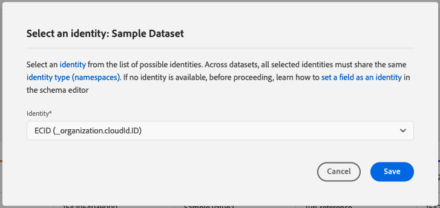
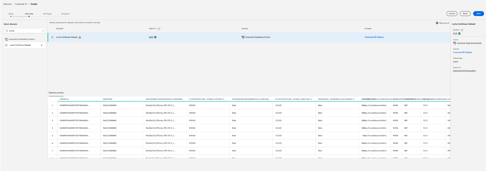

# 配置Customer AI实例

Customer AI是AI/ML服务的一部分，通过它，您可以生成自定义倾向得分，而无需担心机器学习问题。

AI/ML服务将Customer AI作为一项简单易用的Adobe Sensei服务提供，该服务可针对不同用例进行配置。 以下部分提供了配置Customer AI实例的步骤。

## 创建实例 {#set-up-your-instance}

在平台UI中，选择 **[!UICONTROL 服务]** 中。 的 **[!UICONTROL 服务]** 浏览器会显示并显示您可使用的所有可用服务。 在Customer AI的容器中，选择 **[!UICONTROL 打开]**.

的 **客户人工智能** 此时会显示UI，并显示您的所有服务实例。

- 您可以在 **[!UICONTROL 得分的用户档案总数]** 位于 **[!UICONTROL 创建实例]** 容器。 此量度跟踪Customer AI在当前日历年内对包括所有沙盒环境和任何已删除服务实例在内的用户档案进行评分的总数。

可以使用UI右侧的控件来编辑、克隆和删除服务实例。 要显示这些控件，请从现有的 **[!UICONTROL 服务实例]**. 这些控件包含以下内容：

- **[!UICONTROL 编辑]**:选择 **[!UICONTROL 编辑]** 用于修改现有服务实例。 您可以编辑实例的名称、描述和评分频率。
- **[!UICONTROL 克隆]**:选择 **[!UICONTROL 克隆]** 复制当前选定的服务实例设置。 然后，您可以修改工作流以进行细微调整，并将其重命名为新实例。
- **[!UICONTROL 删除]**:您可以删除包含任何历史运行的服务实例。 将从Platform中删除相应的输出数据集。 但是，不会删除已同步到实时客户用户档案的得分。
- **[!UICONTROL 数据源]**:指向此实例使用的数据集的链接。 如果使用多个数据集，则选择超链接文本会打开数据集预览弹出窗口。
- **[!UICONTROL 上次运行详细信息]**:仅当运行失败时，才会显示该设置。 此处显示有关运行失败原因的信息，如错误代码。
- **[!UICONTROL 得分定义]**:您为此实例配置的目标的快速概述。

要创建新实例，请选择 **[!UICONTROL 创建实例]**.

## 设置

此时将显示实例创建工作流，从 **[!UICONTROL 设置]** 中。

以下是关于必须向实例提供的值的重要信息：

- **[!UICONTROL 名称]:** 在显示Customer AI得分的所有位置中，都会使用实例的名称。 因此，名称应描述预测分数表示的内容。 例如，“取消杂志订阅的可能性”。

- **[!UICONTROL 描述]:** 说明您尝试预测的内容的描述。

- **[!UICONTROL 倾向类型]:** 倾向类型确定得分和量度极性的意图。 您可以选择 **[!UICONTROL 流失率]** 或 **[!UICONTROL 转化]**. 请参阅 [评分摘要](./discover-insights.md#scoring-summary) （位于“发现分析”文档中），以了解有关倾向类型如何影响实例的更多信息。

提供所需的值，然后选择 **[!UICONTROL 下一个]** 继续。

## 选择数据 {#select-data}

Customer AI通过设计，一般使用Adobe Analytics、Adobe Audience Manager、体验事件和消费者体验事件数据来计算倾向得分。 选择数据集时，只会列出与Customer AI兼容的数据集。 要选择数据集，请选择&#x200B;**+**)符号或选中复选框以一次添加多个数据集。 使用搜索选项可快速查找您感兴趣的数据集。

选择要使用的数据集后，选择 **[!UICONTROL 添加]** 按钮将数据集添加到数据集预览窗格。

选择信息图标  数据集旁边会打开数据集预览弹出窗口。

数据集预览包含数据，如上次更新时间、源架构以及前十列的预览。

选择 **[!UICONTROL 保存]** 来保存草稿。 您还可以保存草稿模型配置并进入工作流中的下一步。 使用 **[!UICONTROL 保存并继续]** 在模型配置期间创建和保存草稿。 该功能允许您创建和保存模型配置的草稿，当您必须在配置工作流中定义多个字段时，此功能特别有用。

### 数据集完整性 {#dataset-completeness}

数据集预览中有一个数据集完整性百分比值。 此值提供数据集中有多少列为空/空的快照。 如果一个数据集包含大量缺失值，并且这些值在其他位置被捕获，则强烈建议您包含包含缺失值的数据集。 在此示例中，人员ID为空，但是，人员ID是在可包含的单独数据集中捕获的。

>[!NOTE]
>
>使用Customer AI的最大培训窗口（一年）计算数据集完整性。 这意味着在显示数据集完整性值时，不会考虑一年以上的数据。

### 选择标识 {#identity}

现在，您可以根据身份映射（字段）将多个数据集相互连接。 您必须选择标识类型（也称为“标识命名空间”）以及该命名空间中的标识值。 如果您在同一命名空间下为架构内的多个字段分配了身份，则所有分配的身份值都会显示在由命名空间前面的身份下拉菜单中，例如 `EMAIL (personalEmail.address)` 或 `EMAIL (workEmail.address)`.

[选择相同的命名空间](../images/user-guide/cai-identity-map.png)

>[!IMPORTANT]
>
>必须为您选择的每个数据集使用相同的身份类型（命名空间）。 标识列中的标识类型旁边会显示一个绿色复选标记，指示数据集兼容。 例如，使用电话命名空间和 `mobilePhone.number` 作为标识符，其余数据集的所有标识符必须包含并使用Phone命名空间。

要选择身份，请选择位于身份列中的带下划线的值。 此时会出现选择标识弹出窗口。

<!--  -->
[选择相同的命名空间](../images/user-guide/cai-identity-namespace.png)

如果命名空间中有多个标识可用，请确保为用例选择正确的标识字段。 例如，电子邮件命名空间中提供了两个电子邮件标识，即工作电子邮件和个人电子邮件。 根据用例的不同，个人电子邮件更有可能被填写，并且在单个预测中更有用。 这意味着 `EMAIL (personalEmail.address)` 将被选作身份。

>[!NOTE]
>
> 如果数据集不存在有效的标识类型（命名空间），则必须设置主标识，并使用 [架构编辑器](../../../xdm/schema/composition.md#identity). 要了解有关命名空间和身份的更多信息，请访问 [身份服务命名空间](../../../identity-service/namespaces.md) 文档。

## 定义目标 {#define-a-goal}

<!-- https://www.adobe.com/go/cai-define-a-goal -->

的 **[!UICONTROL 定义目标]** 步骤，它为您提供了一个交互式环境，以便您直观地定义预测目标。 目标由一个或多个事件组成，其中每个事件的发生取决于其保留的条件。 Customer AI实例的目标是确定在给定时间范围内实现其目标的可能性。

要创建目标，请选择 **[!UICONTROL 输入字段名称]** ，然后下拉列表中的字段。 选择第二个输入，即事件条件的子句，然后选择提供目标值以完成事件。 通过选择 **[!UICONTROL 添加事件]**. 最后，通过应用以天为单位的预测时间范围来完成目标，然后选择 **[!UICONTROL 下一个]**.

<!--  -->

### 将发生且不发生

在定义目标时，您可以选择 **[!UICONTROL 将发生]** 或 **[!UICONTROL 不会发生]**. 选择 **[!UICONTROL 将发生]** 意味着需要满足您定义的事件条件，才能将客户的事件数据包含在分析UI中。

例如，如果您想设置应用程序来预测客户是否会购买产品，则可以选择 **[!UICONTROL 将发生]** 后跟 **[!UICONTROL 全部]** 然后输入 **commerce.purchases.id** （或类似字段）和 **[!UICONTROL 存在]** 作为运算符。

<!--  -->

但是，在某些情况下，您可能希望预测某个事件是否会在特定时间范围内发生。 要使用此选项配置目标，请选择 **[!UICONTROL 不会发生]** 从顶级下拉菜单中。

例如，如果您有兴趣预测哪些客户的参与度会降低，并且不会在下个月访问您的帐户登录页面。 选择 **[!UICONTROL 不会发生]** 后跟 **[!UICONTROL 全部]** 然后输入 **web.webInteraction.URL** （或类似字段）和 **[!UICONTROL 等于]** 作为 **account-login** 作为值。

### 所有及任何

在某些情况下，您可能想要预测事件的组合是否会发生，而在其他情况下，您可能想要预测预定义集中的任何事件的发生。 要预测客户是否将具有事件组合，请选择 **[!UICONTROL 全部]** 选项 **[!UICONTROL 定义目标]** 页面。

例如，您可能想要预测客户是否购买了特定产品。 此预测目标由两个条件定义：a `commerce.order.purchaseID` **存在** 和 `productListItems.SKU` **等于** 一些特定值。

为了预测客户是否将拥有给定集中的任何事件，您可以使用 **[!UICONTROL 任意]** 选项。

例如，您可能想要预测客户是访问某个特定URL，还是访问具有特定名称的网页。 此预测目标由两个条件定义： `web.webPageDetails.URL` **开头** 特定值和 `web.webPageDetails.name` **开头** 特定值。

### 合格人口 *（可选）*

默认情况下，会为所有用户档案生成倾向得分，除非指定了符合条件的群体。 您可以通过定义条件以根据事件包含或排除用户档案来指定符合条件的群体。

### 自定义事件(*可选*) {#custom-events}

除 [标准事件字段](../input-output.md#standard-events) Customer AI用于生成倾向得分，提供了自定义事件选项。 使用此选项可添加您认为具有影响力的其他事件，这可能会提高模型的质量并有助于提供更准确的结果。 如果您选择的数据集包含在架构中定义的自定义事件，则可以将它们添加到实例中。

>[!NOTE]
>
> 有关自定义事件如何影响Customer AI评分结果的深入说明，请访问 [自定义事件示例](#custom-event) 中。

要添加自定义事件，请选择 **[!UICONTROL 添加自定义事件]**. 接下来，输入自定义事件名称，然后将其映射到架构中的事件字段。 在查看影响因素和其他分析时，会显示自定义事件名称来代替字段值。 这表示将使用自定义事件名称，而不是事件的ID/值。 有关如何显示自定义事件的更多信息，请参阅 [自定义事件示例部分](#custom-event). Customer AI使用这些其他自定义事件来提高模型质量并提供更准确的结果。

接下来，从可用的运算符下拉列表中选择您希望使用的运算符。 只列出与事件兼容的运算符。

最后，如果所选运算符需要一个字段值，请输入该字段值。 在本例中，我们只需要查看酒店或餐厅是否存在预订。 但是，如果我们想要更精确，可以使用等于运算符，并在值提示符中输入精确值。

完成后，选择 **[!UICONTROL 下一个]** 来继续。

### 自定义配置文件属性(*可选*)

除了 [标准事件字段](../input-output.md#standard-events) Customer AI用于生成倾向得分。 通过使用此选项，您可以添加其他您认为具有影响力的配置文件属性，这些属性可能会提高模型质量并提供更准确的结果。 此外，通过添加自定义用户档案属性，Customer AI可以更好地展示特定用户档案是如何在倾向存储段中结束的。

>[!NOTE]
>
>添加自定义配置文件属性的工作流程与添加自定义事件的工作流程相同。 与自定义事件类似，自定义用户档案属性也会以相同方式影响模型评分。 有关深入的说明，请访问 [自定义事件示例](#custom-event) 中。

#### 从配置文件快照导出中选择配置文件属性

您还可以选择在每日配置文件快照导出中包含配置文件属性。 这些属性将同步到配置文件快照导出并显示最新可用值。

>[!WARNING]
>
> 请注意，不要选择因预测目标而更新或与预测目标高度相关的配置文件属性。 这会导致数据泄漏和模型过拟合。 此类属性的一个示例是 `total_purchases_in_the_last_3_months` 用于预测购买转化。

>[!NOTE]
>
>根据请求，UI中支持使用UPS快照导出中的配置文件属性。

### 添加自定义事件示例 {#custom-event}

在以下示例中，将自定义事件和配置文件属性添加到Customer AI实例。 Customer AI实例的目标是预测客户在未来60天内购买其他Luma产品的可能性。 通常，产品数据会关联到产品SKU。 在这种情况下，SKU为 `prd1013`. 在培训/打分客户AI模型后，此SKU可以关联到事件，并显示为倾向存储段的一个影响因素。

Customer AI会自动对自定义事件（例如，）应用功能生成，如“天数”或“计数” **观看购买**. 如果将此事件视为影响客户为何倾向高、中或低的因素，则Customer AI会将其显示为 `Days since prd1013 purchase` 或 `Count of prd1013 purchase`. 通过将此创建为自定义事件，可以为事件提供一个新名称，从而更便于阅读结果。 例如：`Days since Watch purchase`。此外，即使该事件不是标准事件，Customer AI仍会在其培训和评分中使用此事件。 这意味着您可以添加多个您认为可能具有影响力的事件，并通过包含保留、访客日志和其他事件等数据进一步自定义模型。 添加这些数据点会进一步提高Customer AI模型的准确性和精度。

## 设置选项

设置选项步骤允许您配置计划以自动执行预测运行、定义预测排除以过滤某些事件以及切换 **[!UICONTROL 用户档案]** 开/关。

### 配置计划 *（可选）* {#configure-a-schedule}

要设置评分计划，请首先配置 **[!UICONTROL 评分频度]**. 可以计划每周或每月运行自动预测运行。

### 预测排除 *（可选）*

如果您的数据集包含作为测试数据添加的任何列，则可以通过选择 **[!UICONTROL 添加排除项]** 然后输入要排除的字段。 这样可防止在生成得分时评估满足特定条件的事件。 此功能可用于过滤掉不相关的数据输入或促销活动。

要排除事件，请选择 **[!UICONTROL 添加排除项]** 并定义事件。 要删除排除项，请选择省略号(**[!UICONTROL ...]**)，然后选择 **[!UICONTROL 删除容器]**.

### 配置文件切换

“用户档案”切换开关允许Customer AI将评分结果导出到“实时客户档案”。 禁用此切换开关会阻止将模型评分结果添加到用户档案。 禁用此功能后，仍可使用客户AI评分结果。

首次使用Customer AI时，您可以关闭此功能，直到您对模型输出结果满意为止。 这样可防止在微调模型时将多个评分数据集上传到客户用户档案。 标定完模型后，可以使用 [克隆选项](#set-up-your-instance) 从 **服务实例** 页面。 这允许您创建模型副本并打开配置文件。

设置评分计划、包含预测排除项以及在您希望的位置切换用户档案后，选择 **[!UICONTROL 完成]** ，以创建Customer AI实例。

如果成功创建实例，则会立即触发预测运行，并根据您定义的计划执行后续运行。

>[!NOTE]
>
>根据输入数据的大小，预测运行可能需要长达24小时才能完成。

通过执行本节，您配置了Customer AI的实例并执行了预测运行。 成功完成运行后，如果启用了用户档案切换，则得分分析会自动使用预测的得分填充用户档案。 请最多等待24小时，然后再继续阅读本教程的下一部分。

## 治理政策

完成创建实例并提交模型配置的工作流后， [策略实施](/help/data-governance/enforcement/auto-enforcement.md) 检查是否存在任何违规。 如果发生策略违规，则会出现一个弹出窗口，指示已违反一个或多个策略。 这是为了确保您的Platform中的数据操作和营销操作符合数据使用策略。

弹出窗口提供有关违规的特定信息。 您可以通过策略设置和其他与配置工作流无直接关联的措施来解决这些违规问题。 例如，您可以更改标签，以便允许将某些字段用于数据科学目的。 或者，您也可以修改模型配置本身，使其不使用带有标签的任何内容。 请参阅相关文档，了解有关如何设置 [策略](/help/data-governance/policies/overview.md).

## 基于属性的访问控制

>[!IMPORTANT]
>
>基于属性的访问控制当前仅在有限版本中可用。

[基于属性的访问控制](../../../access-control/abac/overview.md) 是Adobe Experience Platform的一项功能，它使管理员能够根据属性控制对特定对象和/或功能的访问。 属性可以是添加到对象的元数据，如添加到架构字段或区段的标签。 管理员定义包含属性的访问策略以管理用户访问权限。

利用此功能，可为体验数据模型(XDM)架构字段设置标签，以定义组织或数据使用范围。 同时，管理员可以使用用户和角色管理界面来定义围绕XDM架构字段的访问策略，并更好地管理为用户或用户组（内部、外部或第三方用户）授予的访问权限。 此外，基于属性的访问控制允许管理员管理对特定区段的访问。

通过基于属性的访问控制，贵组织的管理员可以控制用户对所有平台工作流和资源中敏感个人数据(SPD)和个人身份信息(PII)的访问。 管理员可以定义用户角色，这些用户角色只能访问与这些字段对应的特定字段和数据。

由于基于属性的访问控制，某些字段和功能将受限访问，并且对于某些Customer AI服务实例不可用。 示例包括“身份”、“得分定义”和“克隆”。

位于Customer AI工作区顶部 **分析页面**，请注意侧栏、得分定义、身份和用户档案属性中的详细信息都显示“访问受限”。

<!-- If you select datasets with restricted schemas on the **[!UICONTROL Create instance workflow]** page, a warning sign appears next to the dataset name with the message: [!UICONTROL Restricted information is excluded].

 -->

预览 **[!UICONTROL 创建实例工作流]** 页面时，会显示一条警告，告知您 [!UICONTROL 由于访问限制，某些信息未在数据集预览中显示。]

创建具有受限信息的实例后，继续 **[!UICONTROL 定义目标]** 步骤，顶部将显示警告： [!UICONTROL 由于访问限制，某些信息未显示在配置中。]

## 后续步骤 {#next-steps}

通过阅读本教程，您成功配置了Customer AI的实例并生成了倾向得分。 现在，您可以选择使用区段生成器来 [创建预测分数的客户区段](./create-segment.md) 或 [通过Customer AI发现洞察](./discover-insights.md).

## 其他资源

以下视频旨在支持您了解Customer AI的配置工作流。 此外，还提供了最佳实践和用例示例。

>[!IMPORTANT]
>
> 以下视频已过期。 有关最新信息，请参阅此文档。

>[!VIDEO](https://video.tv.adobe.com/v/32665?learn=on&quality=12)
