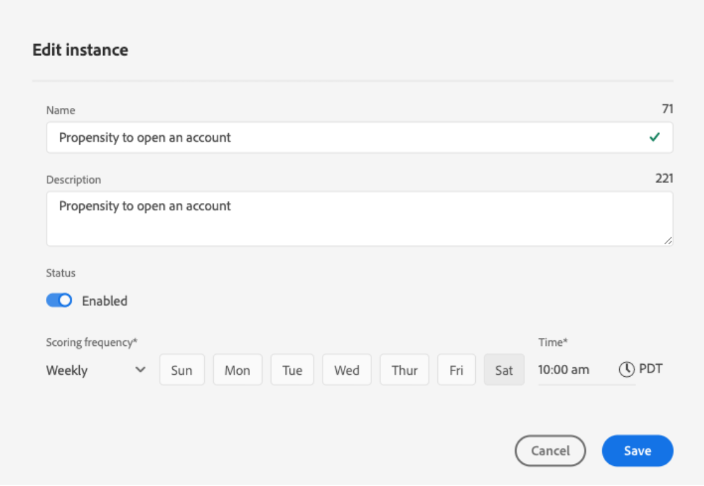

# 通过客户人工智能发现洞察

Customer AI作为Intelligent Services的一部分，为营销人员提供了利用Adobe Sensei预测客户下一步行动的能力。 Customer AI 用于生成自定义倾向分数，如个人档案大规模的流失率和转化率。实现此目的无需将业务需求转换为机器学习问题、选择算法、培训或部署。

本文档是与Intelligent Services Customer AI用户界面中的服务实例分析交互的指南。

## 快速入门

为了利用Customer AI的分析，您需要有一个运行状态成功的服务实例。 要创建新的服务实例访问 [配置Customer AI实例](./configure.md). 如果您最近创建了一个服务实例，但该实例仍在培训和评分，请允许24小时才能完成运行。

## 服务实例概述

在 [!DNL Adobe Experience Platform] UI，选择 **[!UICONTROL 服务]** 中。 的 *服务* 浏览器会显示并显示可用的智能服务。 在Customer AI的容器中，选择 **[!UICONTROL 打开]**.

此时将显示Customer AI服务页面。 本页列出了Customer AI的服务实例并显示了有关这些实例的信息，包括实例名称、倾向类型、实例运行频率以及上次更新的状态。

>[!NOTE]
>
>只有已完成成功评分运行的服务实例才具有洞察力。

选择要开始的服务实例名称。

接下来，将显示该服务实例的分析页面，并提供用于选择 **[!UICONTROL 最新得分]** 或 **[!UICONTROL 性能摘要]**. 默认选项卡 **[!UICONTROL 最新得分]** 提供数据的可视化。 在本指南中，将更详细地说明可视化图表以及您可以使用数据执行的操作。

的 **[!UICONTROL 性能摘要]** 选项卡显示每个倾向存储段的实际流失率或转化率。 要了解更多信息，请参阅 [性能概要量度](#performance-metrics).

## 服务实例详细信息

有两种方法可查看服务实例详细信息：从功能板或服务实例中。

### 服务实例仪表板

要查看功能板中服务实例详细信息的概述，请选择服务实例容器，以避免附加到名称的超链接。 此时会打开一个右边栏，其中提供了更多详细信息。 这些控件包含以下内容：

- **[!UICONTROL 编辑]**:选择 **[!UICONTROL 编辑]** 用于修改现有服务实例。 您可以编辑实例的名称、描述和评分频率。
- **[!UICONTROL 克隆]**:选择 **[!UICONTROL 克隆]** 复制当前选定的服务实例设置。 然后，您可以修改工作流以进行细微调整，并将其重命名为新实例。
- **[!UICONTROL 删除]**:您可以删除服务实例，包括任何历史运行。
- **[!UICONTROL 数据源]**:指向此实例使用的数据集的链接。
- **[!UICONTROL 运行频率]**:打分运行的频率和时间。
- **[!UICONTROL 得分定义]**:您为此实例配置的目标的快速概述。

>[!NOTE]
>
>如果评分运行失败，则会提供错误消息。 错误消息列在 **上次运行详细信息** 在右边栏中，仅对失败运行可见。

### 显示更多分析下拉列表

查看服务实例的其他详细信息的第二种方法位于分析页面中。 选择 **[!UICONTROL 显示更多]** 来填充下拉菜单。 其中列出了详细信息，如得分定义、创建时间、倾向类型和使用的数据集。 有关所列任何属性的更多信息，请访问 [配置Customer AI实例](./configure.md).

### Customer AI数据集预览弹出窗口

如果Customer AI使用了多个数据集，则会显示一个标有 **[!UICONTROL 多个]** 后跟括号中数据集的数量 `()` 中的“隐藏主体”。

选择多个数据集链接会打开Customer AI数据集预览弹出窗口。 预览中的每种颜色都表示一个数据集，如数据集列左侧的颜色键所示。 在此示例中，您只能看到 **数据集1** 包含 `PROP1` 列。

### 编辑实例

要编辑实例，请选择 **[!UICONTROL 编辑]** 中的“隐藏主体”。

此时会出现编辑对话框，允许您编辑实例的名称、描述、状态和评分频率。 要确认更改并关闭对话框，请选择 **[!UICONTROL 保存]** 在右下角。

### 更多操作

的 **[!UICONTROL 更多操作]** 按钮位于右上方的导航中，位于 **[!UICONTROL 编辑]**. 选择 **[!UICONTROL 更多操作]** 打开一个下拉列表，用于选择以下操作之一：

- **[!UICONTROL 克隆]**:选择 **[!UICONTROL 克隆]** 复制服务实例设置。 然后，您可以修改工作流以进行细微调整，并将其重命名为新实例。
- **[!UICONTROL 删除]**:删除实例。
- **[!UICONTROL 访问分数]**:选择 **[!UICONTROL 访问分数]** 打开一个对话框，其中提供指向的链接 [下载客户AI的分数](./download-scores.md) 教程中，该对话框还提供了进行API调用所需的数据集id。
- **[!UICONTROL 查看运行历史记录]**:此时将显示一个对话框，其中包含与服务实例关联的所有评分运行的列表。

## 评分摘要 {#scoring-summary}

评分摘要显示已评分的用户档案总数，并将其分类为包含高倾向、中倾向和低倾向的分段。 倾向时段根据得分范围确定，低小于24，中为25到74，高大于74。 每个存储段都具有与图例对应的颜色。

>[!NOTE]
>
>如果它是转化倾向得分，则高分以绿色显示，低分以红色显示。 如果您预测的流失倾向是相反的，则高分为红色，低分为绿色。 无论您选择哪种倾向类型，中段均保持黄色。

您可以将鼠标悬停在环上的任何颜色上以查看其他信息，例如属于存储段的用户档案的百分比和总数。

## 分数分布

的 **[!UICONTROL 分数分布]** 卡片会根据得分直观地汇总群体。 您在 [!UICONTROL 分数分布] 卡片表示生成的倾向得分类型。 将鼠标悬停在任何评分分配上可提供属于该分配的确切计数。

## 影响因素

对于每个分数存储段，都会生成一个卡片，其中显示了该存储段的前10个影响因素。 这些影响因素为您提供了有关客户为何属于各种分数时段的更多详细信息。

### 影响因素深化

将鼠标悬停在任何主要影响因素上会进一步划分数据。 我们为您提供了有关某些用户档案为何属于倾向存储段的概述。 根据因素，可以为您指定数字、类别或布尔值。 以下示例按区域显示类别值。

此外，使用明细，您可以比较在两个或多个倾向时段内出现的分配系数，并使用这些值创建更具体的区段。 以下示例说明了第一个用例：

您可以看到，转化倾向较低的用户档案最近访问adobe.com网页的可能性较小。 “上次web访问间隔天数”因子的覆盖率仅为8%，而中等倾向用户档案的覆盖率为26%。 使用这些数字，您可以比较因子在每个存储段中的分布。 此信息可用于推断在低倾向存储段中网络访问的最近度没有在中等倾向存储段中的影响。

### 创建区段

选择 **[!UICONTROL 创建区段]** 中、高倾向的任何存储段中的按钮，可将您重定向到区段生成器。

>[!NOTE]
>
>的 **[!UICONTROL 创建区段]** 按钮仅在为数据集启用“实时客户配置文件”时可用。 有关如何启用实时客户用户档案的更多信息，请访问 [实时客户资料概述](../../../rtcdp/overview.md).

区段生成器用于定义区段。 选择 **[!UICONTROL 创建区段]** 从分析页面中， Customer AI会自动将选定的分段信息添加到区段。 要完成区段的创建，只需在 **名称** 和 **描述** 容器。 在为区段提供名称和描述后，选择 **[!UICONTROL 保存]** 在右上方。

>[!NOTE]
>
>由于倾向得分会写入到单个配置文件中，因此与任何其他配置文件属性一样，区段生成器中也提供了倾向得分。 在导航到区段生成器以创建新区段时，您可以在命名空间Customer AI下看到所有不同的倾向得分。

要在Platform UI中查看新区段，请选择 **[!UICONTROL 区段]** 中。 的 **[!UICONTROL 浏览]** 页面，并显示所有可用的区段。

## 历史性能 {#historical-performance}

的 **[!UICONTROL 性能摘要]** 选项卡显示实际流失率或转化率，并按客户AI评分的每个倾向分段进行划分。

最初只显示预期的比率（虚线）。 当未进行评分运行且数据尚不可用时，将显示预期比率。 但是，一旦结果窗口通过，预期比率将被实际比率（实线）替换。

将鼠标悬停在行上会显示该时段中该日的日期和实际/预期费率。

您可以过滤显示的预期费率和实际费率的时间范围。 选择 **日历图标** 然后，选择新的日期范围。 每个时段中的结果都会更新，以在新日期范围内显示。

### 个人评分运行率

下半部分 **[!UICONTROL 性能摘要]** 选项卡显示每个评分运行的结果。 选择右上角的下拉日期以显示其他评分运行的结果。

根据您是预测客户流失率还是转化， [!UICONTROL 分数分布] 图表显示在每次增量中更改/转换和未更改/未转换的配置文件的分布。

## 模型评估 {#model-evaluation}

除了在“历史绩效”选项卡中跟踪一段时间内的预测结果和实际结果之外，营销人员还通过“模型评估”选项卡在模型质量方面具有更高的透明度。 您可以使用提升图和增益图来确定使用预测模型与随机定位之间的差异。 此外，您还可以确定在每个分数截止时将捕捉多少个积极结果。 这对于细分客户群，以及将投资回报与营销活动相协调非常有用。

### 提升图

提升图衡量了使用预测模型而不是随机定位的改进。

高质量的示范指标包括：

- 前10年的提升度值较高。 这意味着该模型能够很好地识别最有可能采取相关操作的用户。
- 提升度值降序。 这意味着分数较高的客户比分数较低的客户更有可能采取感兴趣的操作。

### 增益图

累积增益图衡量通过将分数定位到超过某个阈值而获得的积极结果的百分比。 按倾向得分从高到低对客户进行排序后，群体将被拆分为10个大小相等的组。 完美的模型能够捕捉到十年中所有积极结果。 基线随机定位方法可根据组的大小按比例捕捉正结果 — 定位30%的用户将捕获30%的结果。

高质量的示范指标包括：

- 累积增益快速接近100%。
- 模型的累积增益曲线更接近图表的左上角。
- 累积增益图可用于确定分段和定位的得分截断。 例如，如果模型在前2个得分十年中捕捉了70%的正面结果，则定位PercentileScore大于80的用户，预期会捕捉约70%的正面结果。

### AUC（曲线下的区域）

AUC反映按分数排名与预测目标发生之间关系的强度。 安 **AUC** 0.5表示该模型并不比随机猜测好。 安 **AUC** 1表示模型能准确预测出谁将采取相关行动。

## 后续步骤

本文档概述了Customer AI服务实例提供的分析。 您现在可以继续阅读 [在Customer AI中下载分数](./download-scores.md) 或浏览另一个 [Adobe智能服务](../../home.md) 提供的指南。

## 其他资源

以下视频概述了如何使用Customer AI查看模型的输出以及影响因素。

>[!VIDEO](https://video.tv.adobe.com/v/32666?learn=on&quality=12)
