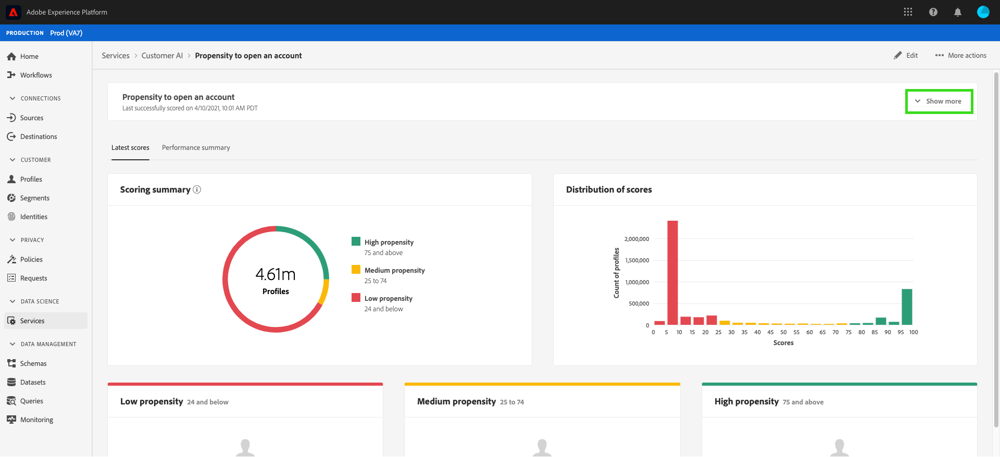
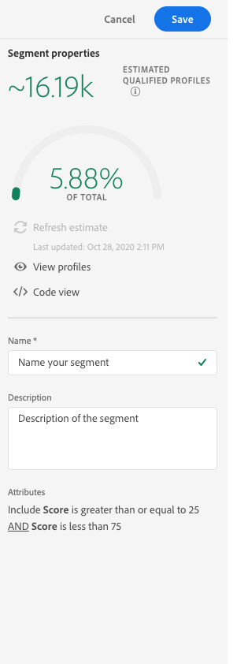

# 利用客户人工智能发掘洞察

作为智能服务的一部分，客户人工智能为营销人员提供了利用Adobe Sensei预测客户下一步行动的能力。 客户人工智能用于生成自定义倾向得分，如大规模个人用户档案的流失和转化。 这无需将业务需求转变为机器学习问题、选择算法、培训或部署即可完成。

此文档可作为与智能服务客户人工智能用户界面中的服务实例洞察交互的指南。

## 入门指南

为了利用客户人工智能的洞察，您需要有一个运行状态成功的服务实例。 要创建新的服务实例，请 [访问配置客户AI实例](./configure.md)。 如果您最近创建了一个服务实例，但该实例仍在培训和评分中，请允许24小时以便它完成运行。

## 服务实例概述

在Adobe Experience Platform UI中，单击左 **[!UICONTROL Services]** 侧导航中的。 将显 *示“服务* ”浏览器并显示可用的“智能服务”。 在客户AI的容器中，单击 **[!UICONTROL Open]**。

出现“Customer AI service（客户AI服务）”页面。 此页列表客户AI的服务实例并显示相关信息，包括实例名称、倾向类型、实例的运行频率以及上次更新的状态。

>[!NOTE] 只有已成功完成评分运行的服务实例才具有洞察。

单击服务实例名称开始。

接下来，将显示该服务实例的洞察页面，其中为您提供了数据可视化信息。 本指南中将详细说明可视化以及您可以如何处理数据。

### 服务实例详细信息

有两种方法可视图服务实例详细信息，第一种是仪表板，第二种是服务实例内部。

要从视图中仪表板详细信息，请单击服务实例容器，避免附加到名称的超链接。 这将打开一个右侧边栏，其中提供了其他详细信息，如说明、评分频率、预测目标和合格人群。 此外，您还可以选择通过单击或来编辑和删除实 **[!UICONTROL Edit]** 例 **[!UICONTROL Delete]**。

>[!NOTE] 在评分运行失败的事件中，会提供错误消息。 错误消息列在右边栏的 *上次运行详细信息* （仅对失败的运行可见）下。

视图服务实例的其他详细信息的第二种方法位于分析页面中。 您可以 **[!UICONTROL Show more]** 单击右上角的以填充下拉列表。 详细信息列出，如得分定义、创建时间和倾向类型。 有关列出的任何属性的详细信息，请访 [问配置客户AI实例](./configure.md)。

### 编辑实例

要编辑实例，请在右 **[!UICONTROL Edit]** 上方的导航中单击。

此时将显示编辑对话框，允许您编辑实 *例的“说**明”和“评分频率* ”。 要确认更改并关闭对话框，请 **[!UICONTROL Edit]** 单击右下角的。

### 更多操作

按 **[!UICONTROL More actions]** 钮位于右上方导航的旁边 **[!UICONTROL Edit]**。 单击 **[!UICONTROL More actions]** 可打开一个下拉框，通过该下拉框可以选择以下操作之一：

- **[!UICONTROL Delete]**:删除实例。
- **[!UICONTROL Access scores]**:单击 *访问得分* ，将打开一个对话框，其中提供指向客户AI教  程的下载得分的链接，该对话框还提供进行API调用所需的数据集ID。
- **[!UICONTROL View run history]**:将显示一个对话框，其中包含与服务实例关联的所有评分运行的列表。

## 评分摘要 {#scoring-summary}

评分汇总显示得分的用户档案总数，并将其分类为包含高倾向、中倾向和低倾向的时段。 倾向桶根据得分范围确定，低小于24，中为25-74，高大于74。 每个桶都有与图例相对应的颜色。

>[!NOTE] 如果是转化倾向得分，则高分以绿色显示，低分以红色显示。 如果您预测客户流失倾向，则此倾向会反转，高分为红色，低分为绿色。 无论您选择哪种倾向类型，中等时段都保持黄色。

## 得分分布

“分 *配分数* ”卡可以根据分数直观地汇总人口。 您在“分配分数”卡中 *看到的颜色* ，表示生成的倾向得分类型。

## 影响因素

对于每个分数桶，都会生成一张卡片，其中显示该分数桶的前10个影响因素。 这些影响因素为您提供了更多关于客户为何属于不同得分等级的详细信息。

### 创建区段

单击“ **[!UICONTROL Create Segment]** 低”、“中”和“高”任意桶中的按钮会将您重定向到区段生成器。

>[!NOTE]
>仅 **[!UICONTROL Create Segment]** 当为数据集启用实时客户用户档案时，此按钮才可用。 有关如何启用实时客户用户档案的更多信息，请访 [问实时客户用户档案概述](../../../rtcdp/overview.md)。

区段生成器用于定义区段。 从“分 **[!UICONTROL Create Segment]** 析”页面中进行选择时，客户AI会自动将选定的时段信息添加到区段。 要完成区段的创建，只需填写位于区段 *构建器用户界面右边栏**的“名称”和“说明* ”容器。 在为区段指定名称和说明后， **[!UICONTROL Save]** 单击右上方的。

>!![NOTE] 由于倾向得分会写入单个用户档案，因此在“区段生成器”中，这些得分与任何其他用户档案属性一样可用。 当您导航到区段生成器以创建新区段时，您可以在命名空间客户AI下查看所有各种倾向得分。

要在平台UI中视图新区段，请单击 **[!UICONTROL Segments]** 左侧导航。 此时将 *显示* “浏览”页面，并显示所有可用区段。

## 后续步骤

本文档概述了客户AI服务实例提供的洞察。 您现在可以继续阅读有关在客户AI [中下载分数的教程](./download-scores.md) ，或浏览提供的其他  Adobe Intelligent Services指南。