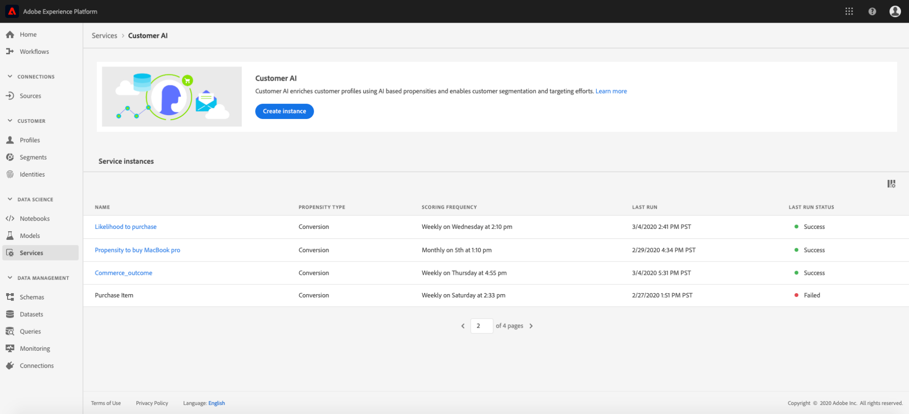

# 通过客户人工智能发掘洞察

作为智能服务的一部分，客户人工智能为营销人员提供了利用Adobe Sensei预测客户下一步行动的能力。 Customer AI 用于生成自定义倾向分数，如个人档案大规模的流失率和转化率。无需将业务需求转换为机器学习问题、选择算法、培训或部署即可实现。

此文档可作为与智能服务客户人工智能用户界面中的服务实例洞察交互的指南。

## 入门指南

为了利用客户人工智能的洞察，您需要有一个运行状态成功的服务实例。 要创建新服务实例，请访问[配置客户AI实例](./configure.md)。 如果您最近创建了一个服务实例，但它仍在培训和得分，请允许24小时以完成运行。

## 服务实例概述

在[!DNL Adobe Experience Platform] UI中，单击左侧导航中的&#x200B;**[!UICONTROL Services]**。 将显示&#x200B;*服务*&#x200B;浏览器，并显示可用的智能服务。 在客户AI的容器中，单击&#x200B;**[!UICONTROL Open]**。

将显示“客户人工智能”服务页面。 本页列表了客户AI的服务实例并显示了相关信息，包括实例名称、倾向类型、运行实例的频率以及上次更新的状态。

>[!NOTE]
>
>只有已完成成功评分运行的服务实例具有洞察。

选择要开始的服务实例名称。

接下来，将显示该服务实例的分析页面，其中包含选择&#x200B;**[!UICONTROL Latest scores]**&#x200B;或&#x200B;**[!UICONTROL Performance summary]**&#x200B;的选项。 默认选项卡&#x200B;**[!UICONTROL Latest scores]**&#x200B;提供数据的可视化。 本指南中将更详细地说明可视化情况以及您可以对数据做什么。

**[!UICONTROL Performance summary]**&#x200B;选项卡显示每个倾向存储段的实际订户数或转化率数。 要了解更多信息，请参阅[性能摘要量度](#performance-metrics)一节。

### 服务实例详细信息

有两种方法可视图服务实例详细信息：从仪表板或服务实例中。

要视图仪表板中服务实例详细信息的概述，请选择服务实例容器，避免附加到名称的超链接。 这将打开一个右侧边栏，其中提供了更多详细信息。 这些控件包含以下内容：

- **[!UICONTROL Edit]**:选择 **[!UICONTROL Edit]** 后，您可以修改现有服务实例。您可以编辑实例的名称、说明和评分频率。
- **[!UICONTROL Clone]**:选择 **[!UICONTROL Clone]** 将复制当前选定的服务实例设置。然后，您可以修改工作流以进行细微调整，并将其重命名为新实例。
- **[!UICONTROL Delete]**:您可以删除服务实例，包括任何历史运行。
- **[!UICONTROL Data source]**:指向此实例使用的数据集的链接。
- **[!UICONTROL Run Frequency]**:打分的频率和时间。
- **[!UICONTROL Score definition]**:您为此实例配置的目标的快速概述。

>[!NOTE]
>
>在评分运行失败的事件中，提供错误消息。 错误消息列在右边栏的&#x200B;**上次运行详细信息**&#x200B;下，该边栏仅对失败运行可见。

视图服务实例附加详细信息的第二种方法位于分析页面中。 您可以单击右上角的&#x200B;**[!UICONTROL Show more]**&#x200B;来填充下拉列表。 将列出详细信息，如得分定义、创建时间和倾向类型。 有关列出的任何属性的详细信息，请访问[配置客户AI实例](./configure.md)。

### 编辑实例

要编辑实例，请单击右上方导航中的&#x200B;**[!UICONTROL Edit]**。

此时会显示编辑对话框，允许您编辑实例的名称、说明、状态和评分频率。 要确认更改并关闭对话框，请选择右下角的&#x200B;**[!UICONTROL Save]**。

### 更多操作

**[!UICONTROL More actions]**&#x200B;按钮位于&#x200B;**[!UICONTROL Edit]**&#x200B;旁边的右上导航中。 单击&#x200B;**[!UICONTROL More actions]**&#x200B;可打开一个下拉框，允许您选择下列操作之一：

- **[!UICONTROL Clone]**:选择 **[!UICONTROL Clone]** 将复制设置的服务实例。然后，您可以修改工作流以进行细微调整，并将其重命名为新实例。
- **[!UICONTROL Delete]**:删除实例。
- **[!UICONTROL Access scores]**:选择 **[!UICONTROL Access scores]** 后将打开一个对话框，其中提供指向 [客户AI教程的](./download-scores.md) 下载得分的链接，该对话框还提供进行API调用所需的数据集ID。
- **[!UICONTROL View run history]**:将显示一个对话框，其中包含与服务实例关联的所有评分运行的列表。

## 评分摘要{#scoring-summary}

评分摘要显示得分的用户档案总数，并将其分类到包含高倾向、中倾向和低倾向的时段。 倾向桶基于得分范围确定，低小于24，中小于25至74，高大于74。 每个桶都有与图例对应的颜色。

>[!NOTE]
>
>如果是转化倾向得分，则高分以绿色显示，低分以红色显示。 如果您预测客户流失倾向，则这会发生反转，高分以红色显示，低分以绿色显示。 无论您选择哪种倾向类型，中型时段都保持黄色。

您可以将鼠标悬停在环上的任何颜色上以视图其他信息，如属于某个存储段的用户档案百分比和总数。

## 分数分布

**[!UICONTROL Distribution of Scores]**&#x200B;卡根据得分显示人口的可视摘要。 您在[!UICONTROL Distribution of Scores]卡中看到的颜色表示生成的倾向得分类型。 将指针悬停在任何评分分布上方，可提供属于该分布的准确计数。

## 影响因素

对于每个分数桶，将生成一个卡片，其中显示该分数桶的前10个影响因素。 这些影响因素为您提供了更多有关客户为何属于不同评分时段的详细信息。

### 影响因素下钻

将指针悬停在任何主要影响因素之上，会进一步破坏数据。 您将获得关于为什么某些用户档案属于倾向时段的概述。 根据因子，可以给您指定数字、分类或布尔值。 以下示例按区域显示分类值。

此外，使用追溯，您可以比较在两个或多个倾向时段中出现的分配系数，并使用这些值创建更具体的区段。 以下示例说明了第一个用例：

您可以看到，转换倾向较低的用户档案最近访问adobe.com网页的可能性较小。 “自上次webVisit之后的天数”因子只有8%的覆盖率，而中等倾向用户档案为26%。 使用这些数字，您可以比较因子的每个时段内的分配。 该信息可用于推断，在低倾向桶中，网络访问的最近度没有中等倾向桶中的影响。

### 创建区段

在任意存储段中选择&#x200B;**[!UICONTROL Create Segment]**&#x200B;按钮，可将您重定向到区段生成器。

>[!NOTE]
>
>**[!UICONTROL Create Segment]**&#x200B;按钮仅在为数据集启用实时客户用户档案时可用。 有关如何启用实时客户用户档案的详细信息，请访问[实时客户用户档案概述](../../../rtcdp/overview.md)。

区段生成器用于定义区段。 从“分析”页面选择&#x200B;**[!UICONTROL Create Segment]**&#x200B;时，客户人工智能会自动将选定的时段信息添加到区段。 要完成区段的创建，只需填写位于区段生成器用户界面右边栏中的&#x200B;*名称*&#x200B;和&#x200B;*说明*&#x200B;容器。 为区段指定名称和说明后，单击右上角的&#x200B;**[!UICONTROL Save]**。

>[!NOTE]
>
>由于倾向得分会写入单个用户档案，因此在区段生成器中，它们与任何其他用户档案属性一样可用。 当您导航到区段生成器以创建新区段时，您可以在命名空间客户人工智能下查看所有不同的倾向得分。

要在平台UI中视图新区段，请单击左侧导航中的&#x200B;**[!UICONTROL Segments]**。 将显示&#x200B;**[!UICONTROL Browse]**&#x200B;页面，其中显示所有可用区段。

## 性能摘要指标{#performance-metrics}

**[!UICONTROL Performance summary]**&#x200B;选项卡显示由客户AI评分的每个倾向群组中分隔的实际订户流失或转化率。

最初只显示预期费率（虚线）。 当未进行评分运行且数据尚不可用时，将显示预期费率。 但是，一旦结果窗口通过，预期费率将替换为实际费率（实线）。

将指针悬停在行上时，将显示该时段中该日的日期和实际/预期费率。

您可以过滤所显示的预期和实际费率的时间范围。 选择&#x200B;**日历图标** ，然后选择新的日期范围。 每个时段中的结果将更新为在新日期范围内显示。

### 个人评分运行率

**[!UICONTROL Performance summary]**&#x200B;选项卡的下半部分显示每个得分运行的结果。 选择右上角的下拉日期，以显示其他评分运行的结果。

根据您是否预测客户流失或转化，[!UICONTROL Distribution of Scores]图表显示每个增量中已变更/转化而非变更/未转换的用户档案的分布。

## 后续步骤

本文档概述了客户人工智能服务实例提供的洞察。 您现在可以继续阅读教程，内容是[下载客户AI](./download-scores.md)中的得分，或浏览提供的其他[Adobe智能服务](../../home.md)指南。

## 其他资源

以下视频概述了如何使用客户人工智能来查看模型的输出和影响因素。

>[!VIDEO](https://video.tv.adobe.com/v/32666?learn=on&quality=12)
