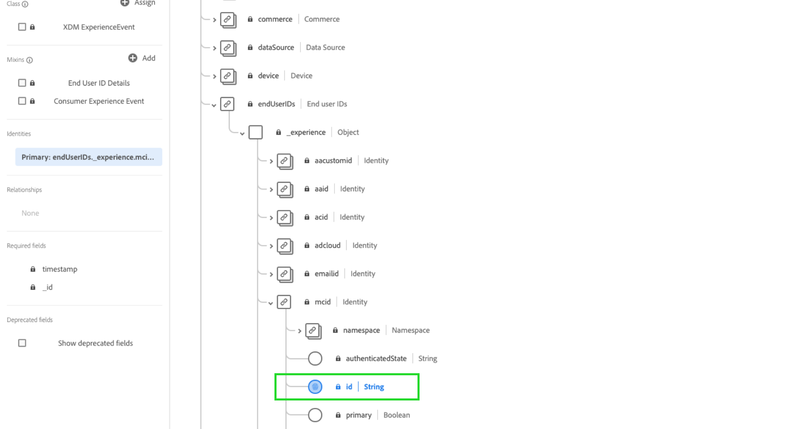

# 准备数据以供使用 [!DNL Intelligent Services]

为了 [!DNL Intelligent Services] 要从营销事件数据中发现洞察，必须在语义上丰富数据并在标准结构中对其进行维护。 [!DNL Intelligent Services] 利用 [!DNL Experience Data Model] (XDM)模式来实现此目的。 具体而言，在以下位置使用的所有数据集 [!DNL Intelligent Services] 必须符合消费者ExperienceEvent (CEE) XDM架构或使用Adobe Analytics连接器。 此外，客户人工智能支持Adobe Audience Manager连接器。

本文档提供有关将营销事件数据从多个渠道映射到CEE架构的一般指导，其中概述了架构中重要字段的信息，以帮助您确定如何有效地将数据映射到其结构。 如果您计划使用Adobe Analytics数据，请查看部分 [Adobe Analytics数据准备](#analytics-data). 如果您计划使用Adobe Audience Manager数据（仅限客户人工智能），请查看部分 [AdobeAudience Manger数据准备](#AAM-data).

## 数据要求

[!DNL Intelligent Services] 根据您创建的目标，需要不同数量的历史数据。 无论如何，您准备的数据 **所有** [!DNL Intelligent Services] 必须包括正面和负面客户历程/事件。 同时具有负事件和正事件可以提高模型的精度和准确性。

例如，如果您使用客户人工智能来预测购买产品的倾向，则客户人工智能模型需要成功购买路径的示例和不成功路径的示例。 这是因为在模型培训期间，客户人工智能会了解哪些事件和历程会导致购买。 这还包括未购买的客户执行的操作，例如个人停止了将商品添加到购物车的历程。 这些客户可能会表现出相似的行为，但客户人工智能可以提供洞察，并深入分析导致更高倾向分数的主要差异和因素。 同样，Attribution AI需要事件和历程这两种类型，才能显示接触点有效性、排名最前的转化路径和按接触点位置划分等量度。

有关历史数据要求的更多示例和信息，请访问 [客户人工智能](./customer-ai/data-requirements.md#data-requirements) 或 [Attribution AI](./attribution-ai/input-output.md#data-requirements) 输入/输出文档中的历史数据要求部分。

### 拼合数据的准则

建议您尽可能跨通用ID拼合用户事件。 例如，您可能拥有10个事件中具有“id1”的用户数据。 稍后，同一用户删除了Cookie ID，并在接下来的20个事件中记录为“id2”。 如果您知道id1和id2对应于同一个用户，则最佳实践是将所有30个事件与同一id拼合在一起。

如果无法执行此操作，则在创建模型输入数据时，应将每组事件视为不同的用户。 这确保在模型训练和评分期间获得最佳结果。

## 工作流摘要

根据您的数据是存储在Adobe Experience Platform中还是存储在外部，准备过程会有所不同。 本部分总结了您在任一情况下需要采取的必要步骤。

### 外部数据准备

如果您的数据存储在Experience Platform之外，则需要将数据映射到 [使用者ExperienceEvent架构](#cee-schema). 此架构可通过自定义字段组进行增强，以更好地捕获您的客户数据。 映射后，您可以使用消费者ExperienceEvent架构创建数据集并 [将数据摄取到Platform](../ingestion/home.md). 然后，在配置 [!DNL Intelligent Service].

根据 [!DNL Intelligent Service] 如果您希望使用，可能需要不同的字段。 请注意，如果数据可用，则最佳实践是向字段添加数据。 要了解有关必填字段的更多信息，请访问 [Attribution AI](./attribution-ai/input-output.md) 或 [客户人工智能](./customer-ai/data-requirements.md) 数据要求指南。

### Adobe Analytics数据准备 {#analytics-data}

客户人工智能和Attribution AI本机支持Adobe Analytics数据。 要使用Adobe Analytics数据，请按照文档中概述的步骤设置 [Analytics源连接器](../sources/tutorials/ui/create/adobe-applications/analytics.md).

一旦源连接器将您的数据流式传输到Experience Platform中，您就可以在实例配置期间选择Adobe Analytics作为数据源，然后选择一个数据集。 在连接设置期间会自动创建所有必需的架构字段组和单个字段。 您不需要将数据集ETL（提取、转换、加载）为CEE格式。

如果将通过Adobe Analytics源连接器传输到Adobe Experience Platform的数据与Adobe Analytics数据进行比较，您可能会注意到一些差异。 Analytics Source Connector在将数据转换到Experience Data Model (XDM)架构的过程中可能会丢弃一些行。 整行不适合转换的原因可能有多种，包括缺少时间戳、缺少人员ID、人员ID无效或过大、分析值无效等。

有关更多信息和示例，请访问文档 [比较Adobe Analytics和Customer Journey Analytics数据](https://www.adobe.com/go/compare-aa-data-to-cja-data). 本文旨在帮助您诊断和解决这些差异，以使您和您的团队可以将Adobe Experience Platform数据用于智能服务，而不受数据完整性问题的影响。

在Adobe Experience Platform查询服务中，按channel.typeAtSource查询运行以下开始和结束时间戳之间的记录总数以按营销渠道查找计数。

```SELECT channel.typeAtSource as typeAtSource,
       Count(_id) AS Records 
FROM  df_hotel
WHERE timestamp>=from_utc_timestamp('2021-05-15','UTC')
        AND timestamp<from_utc_timestamp('2022-01-10','UTC')
        AND timestamp IS NOT NULL
        AND enduserids._experience.aaid.id IS NOT NULL
GROUP BY channel.typeAtSource
```

>[!IMPORTANT]
>
>Adobe Analytics连接器需要长达四周的时间来回填数据。 如果您最近设置了连接，则应验证数据集是否具有客户或Attribution AI所需的最小数据长度。 请查阅历史数据部分，位置在 [客户人工智能](./customer-ai/data-requirements.md#data-requirements) 或 [Attribution AI](./attribution-ai/input-output.md#data-requirements)，并验证您是否有足够的预测目标数据。

### Adobe Audience Manager数据准备（仅限客户人工智能） {#AAM-data}

Customer AI本机支持Adobe Audience Manager数据。 要使用Audience Manager数据，请按照文档中概述的步骤设置 [Audience Manager源连接器](../sources/tutorials/ui/create/adobe-applications/audience-manager.md).

一旦源连接器将您的数据流式传输到Experience Platform中，您就可以在客户人工智能配置期间选择Adobe Audience Manager作为数据源，然后选择一个数据集。 在连接设置期间会自动创建所有架构字段组和单个字段。 您不需要将数据集ETL（提取、转换、加载）为CEE格式。

>[!IMPORTANT]
>
>如果您最近设置了连接器，则应验证数据集是否具有所需的最小数据长度。 请查看 [输入/输出文档](./customer-ai/data-requirements.md) ，并确认您拥有足够的预测目标数据。

### [!DNL Experience Platform] 数据准备

如果您的数据已存储在 [!DNL Platform] 而不是通过Adobe Analytics或Adobe Audience Manager（仅限客户人工智能）源连接器进行流式传输，请执行以下步骤。 仍建议您了解CEE架构。

1. 查看 [使用者ExperienceEvent架构](#cee-schema) 并确定数据是否可以映射到其字段。
2. 联系Adobe咨询服务以帮助将数据映射到架构并将其摄取到 [!DNL Intelligent Services]，或 [按照本指南中的步骤操作](#mapping) 如果您希望自己映射数据。

## 了解CEE模式 {#cee-schema}

消费者ExperienceEvent架构描述个人行为，因为它与数字营销事件（Web或移动设备）以及在线或离线商务活动相关。 以下情况需要使用此架构： [!DNL Intelligent Services] 由于其语义上定义的字段（列），避免使用任何未知名称，否则会使数据变得不那么清晰。

与所有XDM ExperienceEvent架构一样，CEE架构可在事件（或事件集）发生时捕获系统基于时间序列的状态，包括相关主体的时间点和身份。 体验事件是所发生事件的事实记录，因此它们是不变的，表示在没有聚合或解释的情况下发生的事件。

[!DNL Intelligent Services] 利用此架构中的多个关键字段根据营销事件数据生成见解，所有这些可在根级别找到并展开以显示其必需的子字段。


与所有XDM架构一样，CEE架构字段组是可扩展的。 换句话说，可以将其他字段添加到CEE字段组，并且如果需要，可以在多个架构中包含不同的变体。

有关字段组的完整示例，请参见 [公共XDM存储库](https://github.com/adobe/xdm/blob/797cf4930d5a80799a095256302675b1362c9a15/docs/reference/context/experienceevent-consumer.schema.md). 此外，您还可以查看和复制以下内容 [JSON文件](https://github.com/AdobeDocs/experience-platform.en/blob/master/help/intelligent-services/assets/CEE_XDM_sample_rows.json) 有关如何构建数据以符合CEE架构的示例。 了解下节中概述的关键字段时，请参阅这两个示例，以确定如何将您自己的数据映射到架构。

## 关键字段

CEE字段组中有几个关键字段应该用于 [!DNL Intelligent Services] 以生成有用的分析。 此部分介绍了这些字段的使用案例和预期数据，并提供指向参考文档的链接以获取更多示例。

### 必填字段

虽然强烈建议使用所有关键字段，但有两个字段 **必需** 为了 [!DNL Intelligent Services] 要工作，请执行以下操作：

* [主要标识字段](#identity)
* [xdm：timestamp](#timestamp)
* [xdm：channel](#channel) (仅对于Attribution AI是必需的)

#### 主要标识 {#identity}

架构中的某个字段必须设置为主标识字段，该字段允许 [!DNL Intelligent Services] 将时间序列数据的每个实例链接到个人。

您必须根据数据的来源和性质，确定用作主标识的最佳字段。 标识字段必须包括 **身份命名空间** 指示字段预期作为值的身份数据类型。 一些有效的命名空间值包括：

>[!NOTE]
>
>Experience CloudID (ECID)也称为MCID，它将继续用在命名空间中。

* &quot;电子邮件&quot;
* &quot;phone&quot;
* &quot;mcid&quot;(适用于Adobe Audience Manager ID)
* &quot;aaid&quot;(适用于Adobe Analytics ID)

如果您不确定应使用哪个字段作为主要标识，请联系Adobe咨询服务以确定最佳解决方案。 如果未设置主标识，Intelligent Service应用程序将使用以下默认行为：

| 默认 | 归因人工智能 | 客户人工智能 |
| --- | --- | --- |
| 标识列 | `endUserIDs._experience.aaid.id` | `endUserIDs._experience.mcid.id` |
| 命名空间 | AAID | ECID |

要设置主要身份，请从导航到您的架构。 **[!UICONTROL 架构]** 选项卡并选择架构名称超链接以打开 **[!DNL Schema Editor]**.


接下来，导航到要作为主标识的字段并选择它。 此 **[!UICONTROL 字段属性]** 随即会打开该字段的菜单。



在 **[!UICONTROL 字段属性]** 菜单，向下滚动直到找到 **[!UICONTROL 身份]** 复选框。 选中该框后，将选定标识设置为 **[!UICONTROL 主要身份]** 显示。 也选中此框。


接下来，您必须提供 **[!UICONTROL 身份命名空间]** 从下拉菜单中的预定义命名空间列表中。 在此示例中，选择ECID命名空间，因为Adobe Audience Manager ID `mcid.id` 正在使用。 选择 **[!UICONTROL 应用]** 要确认更新，请选择 **[!UICONTROL 保存]** 以保存对架构所做的更改。


#### xdm：timestamp {#timestamp}

此字段表示事件发生时的日期时间。 根据ISO 8601标准，此值必须以字符串形式提供。

#### xdm：channel {#channel}

>[!NOTE]
>
>仅当使用Attribution AI时，此字段为必填字段。

此字段表示与ExperienceEvent相关的营销渠道。 字段包括有关频道类型、媒体类型和位置类型的信息。


**模式示例**

```json
{
  "@id": "https://ns.adobe.com/xdm/channels/facebook-feed",
  "@type": "https://ns.adobe.com/xdm/channel-types/social",
  "xdm:mediaType": "earned",
  "xdm:mediaAction": "clicks"
}
```

有关以下项的每个必填子字段的完整信息： `xdm:channel`，请参阅 [体验渠道架构](https://github.com/adobe/xdm/blob/797cf4930d5a80799a095256302675b1362c9a15/docs/reference/channels/channel.schema.md) 规格 有关一些示例映射，请参见 [下表](#example-channels).

#### 示例渠道映射 {#example-channels}

下表提供了映射到 `xdm:channel` 架构：

| 渠道 | `@type` | `mediaType` | `mediaAction` |
| --- | --- | --- | --- |
| 付费搜索 | https:/<span>/ns.adobe.com/xdm/channel-types/search | 已付 | 点击次数 |
| 社交 — 营销 | https:/<span>/ns.adobe.com/xdm/channel-types/social | 已获取 | 点击次数 |
| 显示 | https:/<span>/ns.adobe.com/xdm/channel-types/display | 已付 | 点击次数 |
| 电子邮件 | https:/<span>/ns.adobe.com/xdm/channel-types/email | 已付 | 点击次数 |
| 内部反向链接 | https:/<span>/ns.adobe.com/xdm/channel-types/direct | 拥有 | 点击次数 |
| 显示显示显示到达 | https:/<span>/ns.adobe.com/xdm/channel-types/display | 已付 | 展示次数 |
| 二维码重定向 | https:/<span>/ns.adobe.com/xdm/channel-types/direct | 拥有 | 点击次数 |
| 移动设备 | https:/<span>/ns.adobe.com/xdm/channel-types/mobile | 拥有 | 点击次数 |

### 推荐字段

本节概述了其余关键字段。 虽然这些字段不一定是 [!DNL Intelligent Services] 为了发挥作用，强烈建议您尽可能多地使用它们以获得更丰富的见解。

#### xdm：productListItems

此字段是一个项目数组，表示客户选择的产品，包括产品SKU、名称、价格和数量。


**模式示例**

```json
[
  {
    "xdm:SKU": "1002352692",
    "xdm:name": "24-Watt 8-Light Chrome Integrated LED Bath Light",
    "xdm:currencyCode": "USD",
    "xdm:quantity": 1,
    "xdm:priceTotal": 159.45
  },
  {
    "xdm:SKU": "3398033623",
    "xdm:name": "16ft RGB LED Strips",
    "xdm:currencyCode": "USD",
    "xdm:quantity": 1,
    "xdm:priceTotal": 79.99
  }
]
```

有关以下项的每个必填子字段的完整信息： `xdm:productListItems`，请参阅 [商务详细信息架构](https://github.com/adobe/xdm/blob/797cf4930d5a80799a095256302675b1362c9a15/docs/reference/context/experienceevent-commerce.schema.md) 规格

#### xdm：commerce

此字段包含有关ExperienceEvent的商务特定信息，包括采购订单号和付款信息。


**模式示例**

```json
{
    "xdm:order": {
      "xdm:purchaseID": "a8g784hjq1mnp3",
      "xdm:purchaseOrderNumber": "123456",
      "xdm:payments": [
        {
          "xdm:transactionID": "transactid-a111",
          "xdm:paymentAmount": 59,
          "xdm:paymentType": "credit_card",
          "xdm:currencyCode": "USD"
        },
        {
          "xdm:transactionId": "transactid-a222",
          "xdm:paymentAmount": 100,
          "xdm:paymentType": "gift_card",
          "xdm:currencyCode": "USD"
        }
      ],
      "xdm:currencyCode": "USD",
      "xdm:priceTotal": 159
    },
    "xdm:purchases": {
      "xdm:value": 1
    }
  }
```

有关以下项的每个必填子字段的完整信息： `xdm:commerce`，请参阅 [商务详细信息架构](https://github.com/adobe/xdm/blob/797cf4930d5a80799a095256302675b1362c9a15/docs/reference/context/experienceevent-commerce.schema.md) 规格

#### xdm：web

此字段表示与ExperienceEvent相关的Web详细信息，例如交互、页面详细信息和反向链接。


**模式示例**

```json
{
  "xdm:webPageDetails": {
    "xdm:siteSection": "Shopping Cart",
    "xdm:server": "example.com",
    "xdm:name": "Purchase Confirmation",
    "xdm:URL": "https://www.example.com/orderConf",
    "xdm:errorPage": false,
    "xdm:homePage": false,
    "xdm:pageViews": {
      "xdm:value": 1
    }
  },
  "xdm:webReferrer": {
    "xdm:URL": "https://www.example.com/checkout",
    "xdm:referrerType": "internal"
  }
}
```

有关以下项的每个必填子字段的完整信息： `xdm:productListItems`，请参阅 [ExperienceEvent Web详细信息架构](https://github.com/adobe/xdm/blob/797cf4930d5a80799a095256302675b1362c9a15/docs/reference/context/experienceevent-web.schema.md) 规格

#### xdm：marketing

此字段包含与通过接触点激活的营销活动相关的信息。


**模式示例**

```json
{
  "xdm:trackingCode": "marketingcampaign111",
  "xdm:campaignGroup": "50%_DISCOUNT",
  "xdm:campaignName": "50%_DISCOUNT_USA"
}
```

有关以下项的每个必填子字段的完整信息： `xdm:productListItems`，请参阅 [营销密码](https://github.com/adobe/xdm/blob/797cf4930d5a80799a095256302675b1362c9a15/docs/reference/context/marketing.schema.md) 规格

## 映射和引入数据 {#mapping}

确定营销事件数据是否可以映射到CEE架构后，下一步是确定要将哪些数据导入 [!DNL Intelligent Services]. 所有历史数据用于 [!DNL Intelligent Services] 必须在四个月的数据最短时间段内，另外加上作为回看时段的天数。

在决定要发送的数据范围后，请联系Adobe咨询服务，帮助将您的数据映射到架构并将其摄取到服务中。

如果您拥有 [!DNL Adobe Experience Platform] 订阅，并且希望自己映射和摄取数据，请按照以下部分中概述的步骤操作。

### 使用Adobe Experience Platform

>[!NOTE]
>
>以下步骤要求订阅Experience Platform。 如果您无权访问Platform，请跳至 [后续步骤](#next-steps) 部分。

此部分概述了将数据映射和摄取到Experience Platform中以供使用的工作流 [!DNL Intelligent Services]，包括指向教程的链接，以了解详细步骤。

#### 创建CEE架构和数据集

当您准备好开始准备数据以进行摄取时，第一步是创建一个采用CEE字段组的新XDM架构。 以下教程介绍了在UI或API中创建新架构的过程：

* [在UI中创建架构](../xdm/tutorials/create-schema-ui.md)
* [在API中创建架构](../xdm/tutorials/create-schema-api.md)

>[!IMPORTANT]
>
>上述教程遵循创建架构的通用工作流。 为架构选择类时，必须使用 **XDM ExperienceEvent类**. 选择此类后，您可以将CEE字段组添加到架构中。

将CEE字段组添加到架构后，您可以根据需要为数据中的其他字段添加其他字段组。

创建并保存架构后，您可以根据该架构创建新数据集。 以下教程介绍了在UI或API中创建新数据集的过程：

* [在UI中创建数据集](../catalog/datasets/user-guide.md#create) （按照工作流使用现有架构）
* [在API中创建数据集](../catalog/datasets/create.md)

创建数据集后，您可以在Platform UI中的 **[!UICONTROL 数据集]** 工作区。


#### 将身份字段添加到数据集

如果您从以下位置引入数据： [!DNL Adobe Audience Manager]， [!DNL Adobe Analytics]，则您可以选择将架构字段设置为标识字段。 要将架构字段设置为标识字段，请查看中有关设置标识字段的部分 [用户界面教程](../xdm/tutorials/create-schema-ui.md#identity-field) 或 [api教程](../xdm/tutorials/create-schema-api.md#define-an-identity-descriptor) 用于创建架构。

如果您从本地CSV文件摄取数据，则可以跳至上的下一部分 [映射和引入数据](#ingest).

#### 映射和摄取数据 {#ingest}

创建CEE架构和数据集后，您可以开始将数据表映射到架构并将该数据摄取到Platform。 请参阅上的教程 [将CSV文件映射到XDM架构](../ingestion/tutorials/map-csv/overview.md) 以了解如何在UI中执行此操作的步骤。 您可以使用以下内容 [示例JSON文件](https://github.com/AdobeDocs/experience-platform.en/blob/master/help/intelligent-services/assets/CEE_XDM_sample_rows.json) 以在使用您自己的数据之前测试摄取过程。

填充数据集后，可使用相同的数据集来摄取其他数据文件。

如果您的数据存储在受支持的第三方应用程序中，您还可以选择创建 [源连接器](../sources/home.md) 将营销事件数据摄取到 [!DNL Platform] 实时。

## 后续步骤 {#next-steps}

本文档提供了有关准备数据以供使用的一般指导 [!DNL Intelligent Services]. 如果您需要根据用例进行其他咨询，请联系Adobe咨询支持。

在成功使用客户体验数据填充数据集后，您可以使用 [!DNL Intelligent Services] 以生成见解。 请参阅以下文档以开始使用：

* [归因人工智能概述](./attribution-ai/overview.md)
* [客户人工智能概述](./customer-ai/overview.md)
