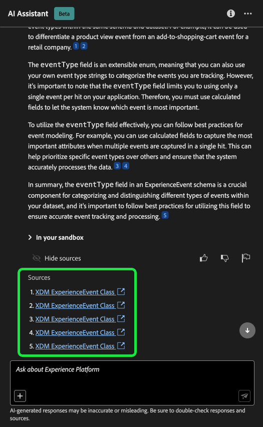
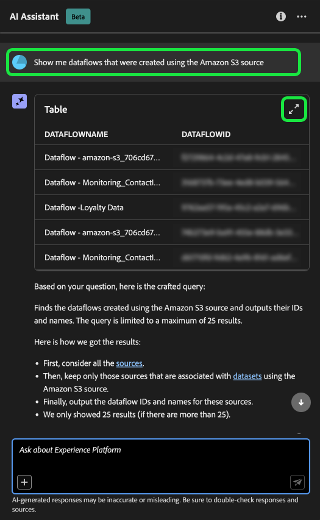

# Adobe Experience Platform的人工智能助手

>[!NOTE]
>
>Adobe Experience Platform的AI助手当前处于Beta测试阶段。 该功能和文档可能会发生更改。

AI助手是一种UI功能，可用于导航和了解Adobe Experience Platform和Real-time Customer Data Platform概念以及有关您的对象的使用信息。

您可以查询AI Assistant以获取以下信息：

* 有关如何执行与数据和受众相关的任务的指南。
* 组织中现有数据对象的状态和量度。
* 用例示例和细微差别以更好地了解您的数据对象，包括属性、受众、数据流、数据集、目标、架构和源。

阅读以下指南，了解如何使用AI Assistant帮助导航和了解您的Experience Platform和Real-Time CDP工作流。

>[!BEGINSHADEBOX]

**AI助手如何工作？**

AI Assistant通过查询数据库，然后将数据库中的数据转换为人类可读的答案来响应您提交的问题。

这种底层数据的内部表示形式也称为知识图 — 一个包含给定答案的概念、数据和元数据的综合网络。

知识图由每次提交查询时引用的子图组成：

* 客户使用情况数据。
* 跨各种元存储区的客户使用情况数据。
* 文档Experience League。

在查询AI Assistant之前，需要考虑两类问题：

* **概念问题**：概念问题与数据或Adobe相关的受众概念有关。 概念问题的一些示例包括：
   * 批量分段与流式分段之间有何区别？
   * 是否有行业数据模型以及如何使用它们？
   * Real-Time CDP的最佳用途是什么？
* **使用问题**：使用问题与组织内的数据对象有关。 使用问题的一些示例包括：
   * 我有多少个数据集？
   * 有多少架构属性从未使用过？
   * 已激活哪些受众？

>[!ENDSHADEBOX]

## 使用AI Assistant可以实现的目标 {#objectives}

可以使用AI助手实现以下目标：

| 目标 | 描述 | 示例 |
| --- | --- | --- |
| 学习概念和持续工作流 | <ul><li>作为新手，您可以使用AI Assistant学习Real-Time CDP和Adobe Journey Optimizer概念，并熟悉不熟悉的产品和功能。</li><li>作为经验丰富的用户，您可以使用AI Assistant解决可能阻止工作流的边缘案例。 | <ul><li>如何在历程分析中设置功能板？</li><li>告诉我Real-Time CDP的一些用例。</li></ul> |
| 故障排除 | 使用AI Assistant了解如何调试工作流中可能遇到的基本错误。 | <ul><li>为什么会出现此错误 {ERROR_MESSAGE} 是刻薄吗？</li><li>为何无法删除名为“Luma：电子邮件受众”的受众？</li></ul> |
| 沙盒卫生 | 使用AI Assistant识别任何重复或未使用的对象，以便您能够有效地维护沙盒。 | <ul><li>能否向我显示类似的受众？</li><li>是否有任何没有关联数据集的架构？</li></ul> |
| 价值分析 | 使用AI Assistant识别您最常用的数据对象，评估任何绩效指标或找到最有价值的数据对象。 | <ul><li>我们的“Luma：电子邮件受众”区段定义中有多少个配置文件？</li><li>何时将受众激活到“Experience Cloud受众”目标？</li></ul> |
| 搜索 | 使用AI Assistant查找支持的Experience Platform对象，如受众、数据集、目标、架构和源。 | <ul><li>在名称中列出包含“Luma”的受众（在上季度创建）。</li><li>“Luma：自定义操作”XDM架构中有哪些属性？</li></ul> |
| 影响分析 | 使用AI Assistant识别某些工作流中使用的数据对象，以便您能够评估任何更改的影响。 | <ul><li>使用哪些受众 `homeAddress.city` 在“Luma：PersonProfiles”架构中？</li><li>哪些数据集是 `consents.marketing.push.val` 配置文件属性存储在中？</li></ul> |

## 在Experience PlatformUI中访问AI助手

要启动AI助手，请选择 **[!UICONTROL AI助手图标]** 从Experience PlatformUI的顶部标题中。

此时将显示AI Assistant界面，它立即为您提供开始使用的信息。 您可以使用下提供的选项 [!UICONTROL 开始使用的想法] 回答问题和命令，例如：

* [!UICONTROL 激活了我的哪些受众？]
* [!UICONTROL 什么是架构？]
* [!UICONTROL 告诉我一些Real-Time CDP的常见用例]

## AI助手UI指南

>[!NOTE]
>
>以下工作流是一个示例，它使用Experience Event架构创建过程来说明在使用Experience PlatformUI时如何使用AI Assistant。

考虑要创建的用例 **设备交易事件架构**. 在体验事件架构创建过程中，您遇到 `eventType` 字段。 “此时，您可以选择退出工作流并参阅 [架构组合的基础知识](../xdm/schema/composition.md) 文档，或者您可以使用AI助手检索问题的答案，并通过AI助手推荐的文档链接查找其他资源。”

首先，在提供的文本框中输入您的问题。 在下面的示例中，AI助手遇到以下问题：“**ExperienceEvent架构中的eventType字段是什么？**&quot;

然后，AI Assistant查询其知识库并计算答案。 片刻后，AI助手会返回一个答案和相关建议，您可以将其用作跟进提示。

从AI助手收到响应后，您可以从多个选项中进行选择，以确定如何继续。

### AI Assistant功能 {#features}

此部分概述在Experience Platform工作流中可以使用的AI Assistant的各种功能。

<!-- 
### Save your query {#save-your-query}

+++Select to view an example of how to save a query

To save your query, select the bookmark icon beside your question.

To access your saved queries, select the bookmark icon below the input box, then select the query you would like to run.

+++ -->

### 在沙盒中查看数据 {#view-data-in-your-sandbox}

根据您的查询，AI Assistant会提供有关沙盒中数据的其他信息。 要查看查询响应如何应用于您的特定沙盒，请选择 **[!UICONTROL 在您的沙盒中].**

在查看与沙盒相关的数据时，AI Assistant可能会提供显示查询数据的特定UI页面的直接链接。

+++选择以查看示例

在此示例中，AI Assistant返回有关沙盒中现有XDM架构的其他信息，包括它们的总计数和五个最常用的字段。

+++

### 查看引文 {#view-citations}

您可以通过查看每个答案中可用的引文来验证AI助手返回给您的响应。

+++选择以查看如何显示源的示例

要查看引文并验证AI助理的响应，请选择 **[!UICONTROL 显示源]**.

AI Assistant会更新界面，并为您提供可证实初始响应的文档的链接。 此外，启用引用后，AI Assistant将更新响应以包含脚注，以指示引用所提供文档的答案的特定部分。

您还可以使用AI Assistant在下提供的查询 **[!UICONTROL 相关建议]** 以进一步浏览与原始查询相关的主题。

+++

### 使用情况数据和可视化图表 {#usage-data-and-visualization}

您必须在活动的沙盒中，以便AI Assistant能够充分响应有关您的使用情况数据的问题。

+++选择以查看使用数据问题和数据可视化的示例

在下面的示例中，AI助手被询问以下查询： **“向我显示使用Amazon S3源创建的数据流”**， AI助手随后会使用一个表进行响应，该表列出了您的数据流及其对应的ID。 要查看整个数据表，请选择右上角的展开图标。

此时将显示表的展开视图，其中会根据查询参数为您提供更加全面的数据流列表。

当收到使用数据问题提示时，AI Assistant会提供它如何计算答案的说明。 在以下示例中，AI Assistant概述了为识别使用创建的数据流而采取的步骤。 [!DNL Amazon S3] 源。

您还可以为查询提供筛选器和修改，并且可以指示AI Assistant根据您包括的筛选器呈现其结果。 例如，您可以要求AI Assistant按区段定义的创建日期顺序显示区段定义计数的趋势，删除总配置文件为零的区段定义，并在显示数据时使用月名称而不是整数。

+++

### 使用自动完成 {#use-auto-complete}

您可以使用自动完成函数接收沙盒中存在的数据对象列表。 自动完成推荐适用于以下域：受众、架构、数据集、源和目标。

+++选择以查看自动完成的示例

您可以通过包含加号(**`+`**)。 作为替代方法，您还可以选择加号(**`+`**)，它位于文本输入框底部。 此时将显示一个窗口，其中包含来自沙盒的推荐数据对象列表。

+++

### 使用多圈 {#use-multi-turn}

您可以使用AI助手的多轮功能在体验期间进行更自然的对话。 给定情况下，AI助手能够回答后续问题。 该上下文可从较早的交互推断。

+++选择以查看多圈示例

在下面的示例中，首先要求AI助手提供数据流的总数，然后要求列出最近的10个数据流。

+++

## 提供反馈 {#feedback}

您可以使用应答中提供的选项针对AI助手体验提供反馈。

要提供反馈，请在从AI助手收到响应后选择向上拇指、向下拇指或标记，然后在提供的文本框中输入反馈。

+++选择以查看更多示例

>[!BEGINTABS]

>[!TAB 竖起大拇指]

选择竖起大拇指图标可就您在AI助手方面的体验提出反馈。

>[!TAB 拇指朝下]

选择向下拇指图标，根据您使用AI助手时的经验提供可改进内容的反馈。 在此步骤中，您还可以提供关于您的体验的特定注释。 评论中提供的反馈每天进行审核。

>[!TAB 标志]

选择标志图标以提供关于您使用AI助手体验的进一步报告。

>[!ENDTABS]

+++

## 文档 {#documentation}

目前，文档索引涵盖Adobe Experience Platform(Real-Time CDP和Audiences)。 索引会定期更新。

文档检索模型是根据Experience Platform(Real-Time CDP和Audiences)进行培训的。 Adobe Experience Platform范围之外的问题，例如，关于Adobe Target和Creative Cloud套件等其他Adobe产品的问题，无法回答。

## 使用情况数据 {#usage-date}

您还可以在以下域中向AI Assistant询问有关您的使用情况数据的问题：

* 属性
* 受众
* 数据流
* 数据集
* 目标 _（有关帐户的问题和有关数据流的某些问题此时无法回答。）_
* 架构 _（有关字段组的问题目前无法回答。）_
* 源 _（有关帐户的问题目前无法回答。）_

对于使用数据查询，答案可能不会反映UI的当前状态。 支持这些问题的数据每24小时更新一次。 例如，用户白天在Real-Time CDP中所做的更改会在晚上与数据存储同步，然后早上就可供用户提问了。 此外，您需要登录沙盒以查询与对象（如受众、架构、数据集、属性和目标）相关的特定数据。

### 使用数据问题示例 {#example-usage-data-questions}

+++选择以查看使用数据问题示例列表

请阅读下表，了解使用数据问题示例及其各自的用例：

| 问题类型 | 用例 | 示例 |
| --- | --- | --- | 
| 数据族系 | 跨其他Experience Platform对象跟踪一个或多个对象的使用情况 | <ul><li>哪些数据集使用“ACME架构”架构？</li><li>使用相同架构摄取了多少数据集？</li><li>激活的受众中使用了哪些数据集？</li><li>列出具有在激活受众中使用的属性的架构。</li><li>显示激活到“ACME目标”且具有1000多个配置文件的受众。</li><li>显示激活的受众中使用的属性，这些受众在2023年1月之后已修改。</li><li>通过“ACME Amazon S3”源摄取的数据集是什么？</li><li>哪些数据流与“ACME忠诚度数据流”相关联？</li><li>列出与已激活受众相关且在过去1年创建的架构。</li></ul> |
| 分发和聚合 | 有关Experience Platform对象使用情况的基于摘要的问题 | <ul><li>激活的受众的百分比是多少？</li><li>区段中使用了多少字段？</li><li>哪些受众激活到的目标数量最多？</li><li>列出重复的受众。</li><li>显示激活到“ACME目标”的受众，并按用户档案大小对其进行排名。</li><li>尚未激活但具有100个以上配置文件的受众的百分比是多少。 给我看看他们的名字。</li><li>列出将数据摄取到我的数据集中的3个源连接器。</li><li>根据活跃受众的发生次数，列出其中使用的前5个属性。</li></ul> |
| 对象查找 | 检索或访问Experience Platform对象或其属性。 | <ul><li>哪些数据集没有与其关联的任何架构</li><li>列出用于“ACME受众”的属性？</li><li>给我已启用配置文件但自创建后未修改的架构列表。</li><li>上周修改了哪些受众？</li><li>列出具有相同区段定义的受众及其创建日期。</li><li>哪些数据集启用了配置文件，并且还包括从每个数据集创建了多少受众。</li><li>哪些源帐户与数据集XYZ关联？</li><li>显示“ACME受众”的区段定义和修改日期。</li></ul> |
| 对象比较 | 识别重复的受众。 | <ul><li>根据其区段定义，列出重复的受众。</li><li>哪些重复受众激活到“ACME目标”。</li></ul> |

+++

## 用短语表述您的问题 {#phrasing-your-questions}

您必须清晰而有条理地向AI Assistant表达您的问题，以便获得尽可能准确的响应。 请参阅以下提示列表，以获取有关如何根据上下文提出明确问题的指导：

* 以简洁的方式陈述您的任务和/或问题。
* 避免使用模糊的语言或过于复杂的语法以促进理解。
* 提供关于您的任务和/或问题的相关上下文，因为上下文可以帮助AI助手生成更相关的响应。

请阅读下表，了解在向AI助手提问时应遵循的最佳实践的进一步指导：

| Do | 示例 |
| --- | --- |
| <ul><li>指定要检索或分析的对象或信息。</li><li>尝试将数据对象名称放在引号中。 如果您只知道对象名称的一部分，则还可以在问题中指定该部分。</li><li>使用 [对象自动完成](./ui-guide.md#use-auto-complete) 以帮助AI Assistant更好地了解查询的上下文。</li></ul> | <ul><li>哪些数据集使用“Luma — 忠诚度”架构？</li><li>显示名称中包含“Luma”的激活区段。 按用户档案计数对其进行排名。</li></ul> |
| <ul><li>避免歧义，使用清晰的语言</li><li>使用准确的术语以确保查询更清晰。</li><li>在询问有关Adobe Experience Platform的问题时，请尝试使用特定于Experience Platform的术语来提高响应的相关性。</li></ul> | <ul><li>“ACME受众”中有多少个人资料。</li><li>显示激活的受众中使用的前5个XDM属性。</li></ul> |
| <ul><li>提供上下文或指定条件以筛选结果。</li><li>在问题中使用过滤条件限制响应中的数据量。</li></ul> | <ul><li>向我显示尚未激活且创建日期超过6个月且从未修改的受众。</li><li>向我显示激活到“ACME目标”并具有超过10000个配置文件的受众。</li></ul> |

{style="table-layout:auto"}

| 不要 | 示例 |
| --- | --- |
| 使用模糊或模糊的语言。 | <ul><li>给我有关数据集的信息。</li><li>“ACME受众”中有多少用户？</li><li>显示区段。</li><li>列表属性。</li></ul> |
| 发出不完整的请求。 | “Luma — 忠诚度数据集” |
| 假设知识没有上下文。 | <ul><li>过去6个月中的受众。</li><li>为我构建查询。</li></ul> |
| 制定过于复杂的查询。 | 提供跨所有对象及其依赖关系的数据谱系的综合分析。 |
| 省略标准或参数。 | 向我显示数据集。 |

{style="table-layout:auto"}

## 其他信息 {#additional-information}

请参阅本节以了解有关AIExperience Platform助手的其他信息。

### 警告和限制 {#caveats-and-limitations}

以下部分概述了使用AI助手时要考虑的当前注意事项和限制。

#### 限时闲聊

您可以与AI助手进行闲谈，但当前此功能有限。

#### 功能问题

AI助手可能会对其功能产生不准确的印象。 它可能会错误地回答以下类型的问题：

| 示例问题 | 注释 |
| --- | --- |
| “您能回答以下问题吗？ {ENTITY}？” | 只要AI助手能够在其索引中找到引用给定实体的单个页面，它就会响应“是”。 |
| “你知道吗 **x** 语言？” | AI助手当前仅支持英语，但可能会回答“是”，因为基础模型能够支持它。 |
| “你能……” | AI助手可能会回答“是”，即使它不能。 |

## 常见问题解答 {#faq}

以下是有关AI Assistant的常见问题解答列表。

### AI助手的信息是实时提供的吗？

AI Assistant响应中显示的数据每天都会更新。 这意味着响应中的数据可能比您在Experience Platform用户界面上看到的响应数据晚24小时。

### AI Assistant支持哪些Adobe应用程序？

AI Assistant支持Adobe Experience Platform、Real-time Customer Data Platform和Adobe Journey Optimizer概念问题。 对于数据使用问题，AI Assistant当前仅支持Real-Time CDP数据对象。

### AI Assistant具有哪些功能？

AI Assistant可以解决Adobe概念查询，并且可以回答与Experience Platform对象使用相关的问题。 （例如，“激活了多少个受众？”）。

### AI Assistant能否提供有关配置文件数据的信息？

不会。AI Assistant无法访问配置文件级别的数据。

### 我的个人信息是否会用于AI助理的培训数据中？

AI助手不使用个人信息进行培训。 请勿向AI助手提供您本人或其他任何参与方的个人信息（包括您的姓名或联系信息）。