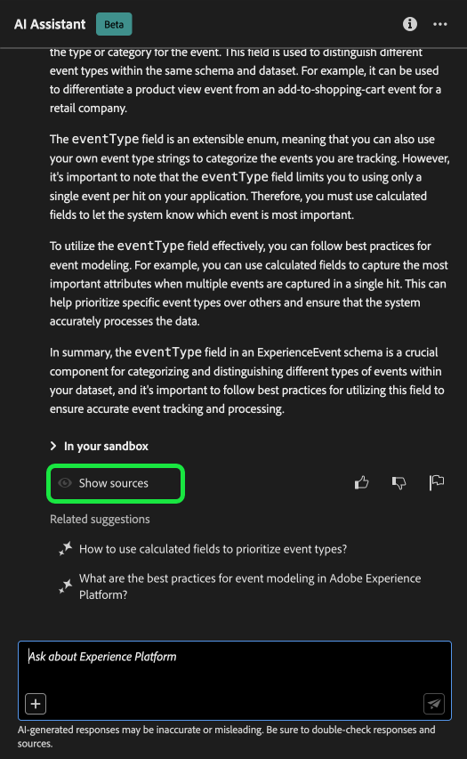
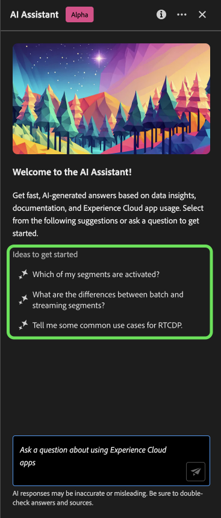

# Adobe Experience Platform的人工智能助手

>[!NOTE]
>
>Adobe Experience Platform的AI助手当前为Alpha版。 该功能和文档可能会发生更改。

Adobe Experience Platform的AI助手是一个UI功能，您可以使用它来导航和了解Experience Platform和Real-time Customer Data Platform概念以及有关对象的使用信息。

您可以查询AI Assistant以获取以下信息：

* 有关如何执行与数据和受众相关的任务的指南。
* 组织中现有数据对象的状态和量度。
* 用例示例和细微差别可更好地了解您的数据对象，包括属性、数据集、目标、架构、区段和源。

本文档提供了有关如何访问和使用AI Assistant询问有关Experience Platform和Real-Time CDP概念的问题并获得答案的信息。

>[!BEGINSHADEBOX]

**AI助手如何工作？**

AI Assistant通过查询数据库，然后将数据库中的数据转换为易于用户识别的答案来响应您提交的问题。

这种底层数据的内部表示形式也称为知识图 — 一个包含给定答案的概念、数据和元数据的综合网络。

知识图由每次提交查询时引用的子图组成：

* 客户使用情况数据。
* 跨各种元存储区的客户使用情况数据。
* 文档Experience League。

在查询AI Assistant之前，需要考虑两类问题：

* **概念问题**：概念问题与数据或Adobe相关的受众概念有关。 概念问题的一些示例包括：
   * 批量分段与流式分段之间有何区别？
   * 是否有行业数据模型以及如何使用它们？
   * Real-Time CDP的最佳用途是什么？
* **使用问题**：使用问题与组织内的数据对象有关。 使用问题的一些示例包括：
   * 我有多少个数据集？
   * 有多少架构属性从未使用过？
   * 已激活哪些区段？

>[!ENDSHADEBOX]

## 访问AI助手以在UI中Experience Platform

您可以从Experience PlatformUI中的标题导航访问AI助手。

选择 **[!UICONTROL AI助手图标]** 以启动AI助手面板。

在此处，您可以在文本框中输入问题，并查询AI Assistant以了解有关数据或受众的概念。 您还可以提出有关数据对象的问题，以便更好地了解如何将其用于各自的用例。

### 示例用例：使用AI Assistant加快模式创建过程

>[!NOTE]
>
>以下示例工作流使用ExperienceEvent架构创建过程来说明在使用Experience PlatformUI时如何使用AI Assistant。

考虑要创建的用例 **设备交易事件架构**. 在ExperienceEvent架构创建过程中，您发现 `eventType` 字段。 此时，您可以离开工作流，并参阅上的文档 [架构组合的基础知识](../xdm/schema/composition.md)，或者您可以使用AI助手检索问题的即时答案。

首先，在提供的文本框中输入您的问题。 在下面的示例中，AI助手被提供以下问题：“**体验事件架构中的eventType字段是什么？**&quot;

然后，AI Assistant查询其知识库并计算答案。 片刻后，AI助手会返回一个答案和相关建议，您可将其用作跟进提示。

您可以通过提出跟进问题来进一步了解有关特定主题的更多信息。 在下一个示例中，询问AI助手如何将eventType用于分段。

您还可以向AI Assistant询问有关数据使用的问题。 在查询数据使用情况时，您必须位于活动沙盒中，以便AI助手回答您的查询。

对于每个答案，AI助手都为您提供了一种通过查看其源来验证答案的方法。 提供了有关概念问题的文档链接，而数据使用问题可以通过演示如何计算答案的SQL查询进行验证。

>[!BEGINSHADEBOX]

**已请求您的反馈**

在此Alpha阶段，邀请您就您从AI助手收到的响应提供反馈。 所有回复和提交的反馈都经过审查，以继续改进人工智能助理的经验。

要提供反馈，请在从AI助手收到响应后选择竖起或竖下大拇指，然后在提供的文本框中输入反馈。 接下来，选择 **[!UICONTROL 提交反馈]** 以提交。

>[!ENDSHADEBOX]

>[!BEGINTABS]

>[!TAB 显示源]

选择 **[!UICONTROL 显示源]** 获取AI Assistant引用以计算其响应的文档的链接列表。

>[!TAB 竖起大拇指]

选择竖起大拇指图标可就您在AI助手方面的体验提出反馈。

>[!TAB 拇指朝下]

选择向下拇指图标，根据您使用AI助手时的经验提供可改进内容的反馈。 在此步骤中，您还可以提供关于您的体验的特定注释。 评论中提供的反馈每天进行审核。

>[!TAB 标志]

选择标志图标以提供关于您使用AI助手体验的进一步报告。

>[!ENDTABS]

### 开始使用的想法

您还可以使用AI Assistant提供的预设提示来开始。

## 其他信息

请参阅本节以了解有关AIExperience Platform助手的其他信息。

### 范围

AI Assistant可以根据文档和数据使用情况回答查询。

#### 文档

您可以根据Real-time Customer Data Platform和Audiences来询问文档问题。 目前，文档索引涵盖Adobe Experience Platform(Real-Time CDP和Audiences)。 索引会定期更新。

文档检索模型是根据Experience Platform(Real-Time CDP和Audiences)进行培训的。 Adobe Experience Platform范围之外的问题，例如，关于Adobe Target和Creative Cloud套件等其他Adobe产品的问题，无法回答。

#### 数据使用

您还可以向AI Assistant询问有关您在以下域中的数据使用情况的问题：

* 属性
* 数据集
* 目标（目前无法回答有关帐户的问题和有关数据流的某些问题。）
* 架构（目前无法回答有关字段组的问题。）
* 区段
* 源 （有关帐户的问题目前无法回答。）

对于使用数据查询，答案可能不会反映UI的当前状态。 支持这些问题的数据每24小时更新一次。 例如，用户白天在Real-Time CDP中所做的更改会在晚上与数据存储同步，然后早上就可供用户提问了。 您可能需要将问题的格式设置为：“标题为的区段是什么时候 {TITLE} 创建时间？” 而不是“什么时候 {TITLE} 是否创建了区段？”

您需要登录沙盒以查询与对象（如架构、数据集、属性、目标和区段）相关的特定数据。

### 支持的数据使用问题

+++选择此选项可查看支持的数据使用问题列表

以下是按域分组的当前支持的数据使用问题列表。

* 列出用于此区段的属性？
* 总共有多少区段？
* 显示上个月最后修改的区段列表。
* 上周修改了哪些区段？
* 配置文件计数是多少 {SEGMENT_NAME} 区段？
* 列出所有重复的区段。
* 显示过去7天内创建或更新的区段。
* 各个区段的用户档案数量分布情况如何？
* 区段中使用了多少字段？
* 激活的区段的总数是多少？
* 激活哪些区段？
* 激活了多少个重复区段？
* 列出去年创建的区段。
* 显示上次修改于以下日期之前的区段： {DATE}.
* 有多少唯一区段名称与 {SCHEMA_NAME} 纲要？
* 哪些架构在区段间最常使用？
* 我有多少个架构？
* 使用哪些数据集 {SCHEMA_NAME} 纲要？
* 列出上周修改的所有架构。
* 有多少个架构启用了配置文件？
* 列出所有体验事件类架构？
* 哪些数据集被摄取到 {SCHEMA_NAME} 纲要？
* 使用相同架构摄取了多少数据集？
* 我有多少个数据集？
* 每个区段中使用哪些数据集？
* 使用哪些区段 {ATTRIBUTE_NAME} 属性？
* 哪些架构具有 {ATTRIBUTE_NAME} 属性中？
* 任何区段中未使用多少XDM架构属性？
* 哪些数据集是/是 {ATTRIBUTE_NAME} 是否已填充XDM字段？
* 哪些数据集包含数据 {ATTRIBUTE_NAME} 属性？
* 每个目标激活了多少区段？
* 哪些区段激活到的目标数量最多？
* 我的任何区段是否有0个配置文件？
* 我有多少数据流？

+++

### 对话体验

在查询AI助手时，必须考虑有关对话体验的几个细微差别。

>[!NOTE]
>
>这些限制是暂时性的，并在整个Alpha过程中不断改进。

>[!BEGINTABS]

>[!TAB 无法从以前的讨论推断上下文]

AI助理目前不能将以前的讨论作为给定问题的上下文。 有关示例，请参阅下表：

| 模棱两可的问题 | 清除问题 | 注意 |
| --- | --- | --- |
| <ul><li>第一个问题：“什么是区段？”</li><li>跟进问题：“它们是否存在不同类型？”</li></ul> | <ul><li>第一个问题：“什么是区段？”</li><li>跟进问题：“是否有不同类型的 **区段**？”</li></ul> | AI助手无法推断“他们”的含义。 |
| <ul><li>第一个问题：“什么是区段？”</li><li>跟进问题：“你能再说一遍吗？”</li></ul> | <ul><li>第一个问题：“什么是区段？”</li><li>跟进问题：“解释什么是深入区段”</li></ul> | AI Assistant无法智能地根据“更多”引用文档。 |
| <ul><li>第一个问题：“什么是区段？”</li><li>回答问题：“可以给我举个例子吗？”</li></ul> | <ul><li>第一个问题：“什么是区段？”</li><li>后续问题：“能否提供区段的示例？”</li></ul> | AI助手无法推断您想要的示例。 |
| <ul><li>第一个问题：“什么是批处理客户细分？”</li><li>跟进问题：“它与流式客户细分有何异同？”</li></ul> | <ul><li>第一个问题：“什么是批处理客户细分？”</li><li>后续问题：“能否将流式客户细分与批处理客户细分进行比较？”</li></ul> | AI Assistant无法推断出“it”所指的是什么，因此无法比较流区段。 |
| <ul><li>第一个问题：“我有多少个区段？”</li><li>后续问题：“有多少客户使用Facebook作为目标？”</li></ul> | <ul><li>第一个问题：“我有多少个区段？”</li><li>后续问题：“我有多少区段正在使用Facebook作为目标？”</li></ul> | AI助手无法推断“他们”指的是什么。 |

{style="table-layout:auto"}

>[!TAB 无法从页面推断上下文]

在向AI助手询问您所在的Experience PlatformUI页面的特定元素时，您必须清楚地定义问题中的特定元素。

| 模棱两可的问题 | 清除问题 | 注意 |
| --- | --- | --- |
| “这有什么用？” | “有什么用？ {PAGE_NAME} 是吗？ | AI助手无法推断“this”指的是什么。 您必须提供要查询的特定页面元素。 |
| “为什么它不省钱？” | “为什么我无法保存一个名为的新沙盒 {NAME}？” | AI助手无法推断“it”指的是什么，也无法知道您与实体之间存在问题。 |

{style="table-layout:auto"}

此外，AI助手只能回答有关错误消息的问题，因为错误记录在Experience League中。

>[!TAB 二义性]

您必须清楚地表达您的问题，并在产品、应用程序或域中规定其范围，因为AI助手当前无法消除歧义。

| 模棱两可的问题 | 清除问题 | 注意 |
| --- | --- | --- |
| “如何创建过滤器？ | 如何以配置文件查询语言创建过滤器？ | 由于各种Experience Platform功能都支持筛选，因此您必须指定筛选所针对的功能。 |
| “我该如何开始？ | 如何开始使用目标？ | 您必须明确说明您的目标和用例，因为过于宽泛的概念可能会导致通用或不必要的具体答案。 |

{style="table-layout:auto"}

>[!ENDTABS]

### 限时闲聊

您可以与AI助手进行闲谈，但当前此功能有限。

### 功能问题

AI助手可能会对其功能产生不准确的印象。 它可能会错误地回答以下类型的问题：

| 示例问题 | 注意 |
| --- | --- |
| “您能回答以下问题吗？ {ENTITY}？” | 只要AI助手能够在其索引中找到引用给定实体的单个页面，它就会响应“是”。 |
| “你知道吗 **x** 语言？” | AI助手当前仅支持英语，但可能会回答“是”，因为基础模型能够支持它。 |
| “你能……” | AI助手可能会回答“是”，即使它不能。 |

### 提示

#### 可能会用错误的信息源回答问题

在某些情况下，您对使用情况数据的疑问会得到基于文档的回答。 这是因为AI Assistant可能会将您的问题错误地路由到错误的信息源。 您可以通过以下方式防止出现这种情况：

* 改写您的问题以使用更多类似于SQL的语言
* 显式调用要使用的信息源。

有关示例，请阅读下表：

| 错误的问题 | 好问题 | 注释 |
| --- | --- | --- |
| 我最大的细分市场是什么？ | 我最大的细分市场是什么？ 使用数据。 | 明确告知AI助手，您希望答案基于数据。 |
| 我最大的细分市场是什么？ | 列出我最大的区段。 | 在某些情况下，“什么……”问题可能会被误认为基于文档的问题。 使用诸如“list”之类的命令更能说明您在上下文中对数据提出疑问。 |
| 我有多少个数据集？ | 计算我的数据集。 | 最初的问题适用于区段，但可能不适用于数据集。 |