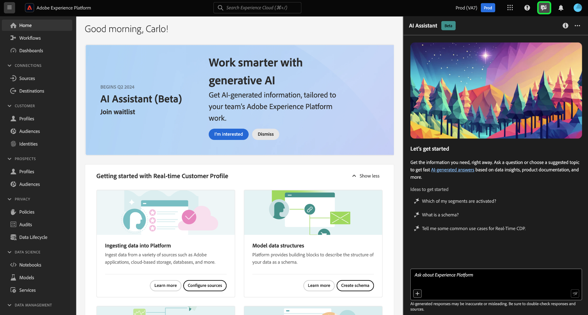
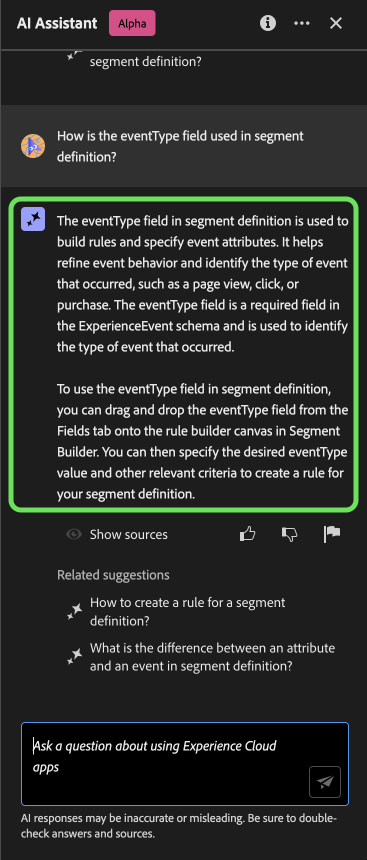
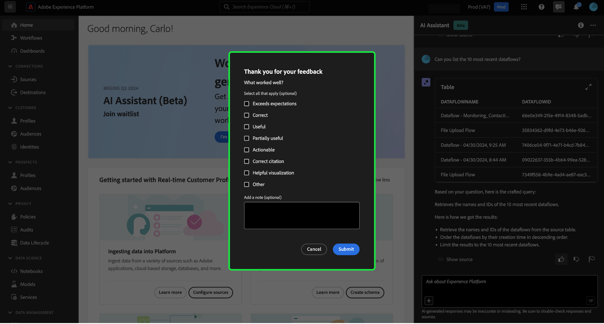

# Adobe Experience Platform助理

>[!NOTE]
>
>Adobe Experience Platform助手当前正在Alpha中。 该功能和文档可能会发生更改。

Adobe Experience Platform助手是一个UI功能，您可以使用它来导航和了解Experience Platform和Real-time Customer Data Platform概念以及有关您的对象的使用信息。

您可以查询“助手”以获取以下信息：

* 有关如何执行与数据和受众相关的任务的指南。
* 组织中现有数据对象的状态和量度。
* 用例示例和细微差别可更好地了解您的数据对象，包括属性、数据集、目标、架构、区段和源。

本文档提供了有关如何访问和使用Assistant来提问并获得有关Experience Platform和Real-Time CDP概念的答案的信息。

>[!BEGINSHADEBOX]

**助理如何工作？**

Assistant通过查询数据库并将数据库中的数据转换为人工可读的答案来回答您提交的问题。

这种底层数据的内部表示形式也称为知识图 — 一个包含给定答案的概念、数据和元数据的综合网络。

知识图由每次提交查询时引用的子图组成：

* 客户使用情况数据。
* 跨各种元存储区的客户使用情况数据。
* 文档Experience League。

在查询Assistant之前，需要考虑两类问题：

* **概念问题**：概念问题与数据或Adobe相关的受众概念有关。 概念问题的一些示例包括：
   * 批量分段与流式分段之间有何区别？
   * 是否有行业数据模型以及如何使用它们？
   * Real-Time CDP的最佳用途是什么？
* **使用问题**：使用问题与组织内的数据对象有关。 使用问题的一些示例包括：
   * 我有多少个数据集？
   * 有多少架构属性从未使用过？
   * 已激活哪些区段？

>[!ENDSHADEBOX]

## 用于在UI中Experience Platform的访问助手

您可以从Experience PlatformUI中的标题导航访问助手。

选择 **[!UICONTROL “助手”图标]** 从标题转到Launch Assistant面板。

+++使用沉浸模式

使用 [!DNL Immersive mode] 在“助手”标题导航中选择焦点图标。

屏幕中央会显示“助理”的专用弹出界面。

+++

在此处，您可以在文本框中输入您的问题，并查询Assistant以了解有关数据或受众的概念。 您还可以提出有关数据对象的问题，以便更好地了解如何将其用于各自的用例。

### 示例用例：使用助理加快模式创建过程

>[!NOTE]
>
>以下示例工作流使用ExperienceEvent架构创建过程来说明在使用Experience PlatformUI时如何使用Assistant。

考虑要创建的用例 **设备交易事件架构**. 在ExperienceEvent架构创建过程中，您发现 `eventType` 字段。 此时，您可以离开工作流，并参阅上的文档 [架构组合的基础知识](../xdm/schema/composition.md)，或者您也可以使用助手即时获取问题的答案。

首先，在提供的文本框中输入您的问题。 在以下示例中，向助理提了一个问题：“**ExperienceEvent架构中的eventType字段是什么？**&quot;

然后，Assistant查询其知识库并计算答案。 几分钟后，助理会返回一个答案和相关建议，您可以将其用作跟进提示。

给定的答案提供指向任何引用实体的超链接。 在以下示例中，选择 **[!UICONTROL 架构]** 查看引用的架构的列表，或者 **[!UICONTROL 区段]** 以查看引用的区段的列表。

Assistant允许您通过查看其源来验证答案。 提供了有关概念问题的文档链接，而数据使用问题可以通过演示如何计算答案的SQL查询进行验证。

#### 相关建议

您还可以通过选择Assistant提供的相关建议之一来更深入地探讨您的查询主题。

#### 跟进问题

您可以通过提出跟进问题来进一步了解有关特定主题的更多信息。 在下一个示例中，将询问助理如何将eventType用于分段。

#### 数据使用问题

您还可以向助理询问有关数据使用的问题。 在查询数据使用情况时，您必须位于活动沙盒中，以便助手回答您的查询。

## 范围

助理可以回答有关Real-Time CDP和Experience Platform概念的问题，以及特定于您用户帐户的数据使用问题。 助理还可以根据您所在的UI页面推断上下文。 它可以识别：

* 您正在使用的用户帐户。
* 您所属的组织。
* 您在屏幕上查看的页面。
* 您在屏幕上查看的资源（包括类型和ID）。
* 鉴于您正在处理特定Experience Platform或Real-Time CDP工作流，因此助理可以推断您的意图。

### 文档

目前，文档索引涵盖Adobe Experience Platform(Real-Time CDP和Audiences)。 索引会定期更新。

文档检索模型是根据Experience Platform(Real-Time CDP和Audiences)进行培训的。 Adobe Experience Platform范围之外的问题，例如，关于Adobe Target和Creative Cloud套件等其他Adobe产品的问题，无法回答。

### 数据使用

您还可以向Assistant询问有关以下域中的数据使用情况的问题：

* 属性
* 数据集
* 目标 _（有关帐户的问题和有关数据流的某些问题此时无法回答。）_
* 架构 _（有关字段组的问题目前无法回答。）_
* 区段
* 源 _（有关帐户的问题目前无法回答。）_

对于使用数据查询，答案可能不会反映UI的当前状态。 支持这些问题的数据每24小时更新一次。 例如，用户白天在Real-Time CDP中所做的更改会在晚上与数据存储同步，然后早上就可供用户提问了。 您可能需要将问题的格式设置为：“标题为的区段是什么时候 {TITLE} 创建时间？” 而不是“什么时候 {TITLE} 是否创建了区段？”

您需要登录沙盒以查询与对象（如架构、数据集、属性、目标和区段）相关的特定数据。

### 示例数据使用问题

+++选择以查看示例数据使用问题列表

| 问题类型 | 描述 | 示例 |
| --- | --- | --- | 
| 数据族系 | 跨其他Experience Platform对象跟踪一个或多个对象的使用情况 | <ul><li>使用哪些数据集 {SCHEMA_NAME} 纲要？</li><li>使用相同架构摄取了多少数据集？</li><li>激活的区段中使用了哪些数据集？</li><li>列出具有激活区段中所用属性的架构。</li><li>显示激活的目标区段 {DESTINATION_ACCOUNT_NAME} 和超过1000个配置文件。</li><li>显示激活的区段中使用的属性，这些区段在2023年1月之后已修改。</li><li>列出与激活的区段相关且在过去1年中创建的架构。</li></ul> |
| 分发和聚合 | 有关Experience Platform对象使用情况的基于摘要的问题 | <ul><li>已激活区段的百分比是多少？</li><li>区段中使用了多少字段？</li><li>哪些区段激活到的目标数量最多？</li><li>列出重复的区段。</li><li>向我显示激活到的区段 {DESTINATION_ACCOUNT_NAME} 并按配置文件大小对其进行排名。</li><li>尚未激活但具有100个以上配置文件的区段的百分比是多少。 给我看看他们的名字。</li><li>根据激活区段中的出现情况，列出其中使用的前5个属性。</li></ul> |
| 对象查找 | 检索或访问Experience Platform对象或其属性。 | <ul><li>哪些数据集没有与其关联的任何架构</li><li>列出用于的属性 {SEGMENT_NAME}？</li><li>给我已启用配置文件但自创建后未修改的架构列表。</li><li>上周修改了哪些区段？</li><li>列出具有相同区段定义的区段及其创建日期。</li><li>哪些数据集启用了配置文件，并且还包括从每个数据集创建了多少区段。</li><li>显示区段定义和修改日期 {SEGMENT_NAME}.</li></ul> |

+++

## 验证响应

可以使用多种不同的方式验证助理返回响应。

### 文档引用

每次响应时，“助理”都会为您提供引文，您可以参考这些引文进行验证或获取更多信息。

选择 **[!UICONTROL 显示源]** 以获取助手引用以计算其响应的文档的链接列表。

对于涉及数据使用信息的响应， Assistant提供指向相关实体的链接。 此外，“助理”还会向您说明它如何计算其答案。

## 提供反馈

>[!BEGINSHADEBOX]

**已请求您的反馈**

在此Alpha阶段，邀请您对从助理收到的响应提供反馈。 所有答复和提出的反馈都经过审查，以继续改善助理的经验。

要提供反馈，请在收到助理的响应后选择竖起或竖下大拇指，然后在提供的文本框中输入反馈。 接下来，选择 **[!UICONTROL 提交反馈]** 以提交。

>[!ENDSHADEBOX]

+++提供反馈

>[!BEGINTABS]

>[!TAB 竖起大拇指]

选择竖起大拇指图标以就您在助手方面的良好体验提供反馈。

>[!TAB 拇指朝下]

选择向下缩略图图标，根据您使用助理的经验，提供可改进内容的反馈。 在此步骤中，您还可以提供关于您的体验的特定注释。 评论中提供的反馈每天进行审核。

>[!TAB 标志]

选择标志图标以提供有关使用助手体验的进一步报告。

>[!ENDTABS]

+++

## 其他信息

请参阅本节以了解有关Experience Platform助理的其他信息。

### 警告和限制

以下部分概述了使用助手时要考虑的当前注意事项和限制。

#### 对话体验

在查询助理时，必须考虑有关对话体验的几个细微差别。

>[!NOTE]
>
>这些限制是暂时性的，并在整个Alpha过程中不断改进。

>[!BEGINTABS]

>[!TAB 无法从以前的讨论推断上下文]

助理目前不能将以前的讨论作为给定问题的背景来引用。 有关示例，请参阅下表：

| 模棱两可的问题 | 清除问题 | 注意 |
| --- | --- | --- |
| <ul><li>第一个问题：“什么是区段？”</li><li>跟进问题：“它们是否存在不同类型？”</li></ul> | <ul><li>第一个问题：“什么是区段？”</li><li>跟进问题：“是否有不同类型的 **区段**？”</li></ul> | 助理无法推断“他们”的含义。 |
| <ul><li>第一个问题：“什么是区段？”</li><li>跟进问题：“你能再说一遍吗？”</li></ul> | <ul><li>第一个问题：“什么是区段？”</li><li>跟进问题：“解释什么是深入区段”</li></ul> | 助理无法智能地根据“更多”引用文档。 |
| <ul><li>第一个问题：“什么是区段？”</li><li>回答问题：“可以给我举个例子吗？”</li></ul> | <ul><li>第一个问题：“什么是区段？”</li><li>后续问题：“能否提供区段的示例？”</li></ul> | 助手无法推断您想要的示例。 |
| <ul><li>第一个问题：“什么是批处理客户细分？”</li><li>跟进问题：“它与流式客户细分有何异同？”</li></ul> | <ul><li>第一个问题：“什么是批处理客户细分？”</li><li>后续问题：“能否将流式客户细分与批处理客户细分进行比较？”</li></ul> | 助手无法推断出“it”引用的内容，因此无法比较流区段。 |
| <ul><li>第一个问题：“我有多少个区段？”</li><li>后续问题：“有多少客户使用Facebook作为目标？”</li></ul> | <ul><li>第一个问题：“我有多少个区段？”</li><li>后续问题：“我有多少区段正在使用Facebook作为目标？”</li></ul> | 助理无法推断“他们”指的是什么。 |

{style="table-layout:auto"}

>[!TAB 无法从页面推断上下文]

在向助手询问您所在的Experience PlatformUI页面的特定元素时，您必须明确定义问题中的特定元素。

| 模棱两可的问题 | 清除问题 | 注意 |
| --- | --- | --- |
| “这有什么用？” | “有什么用？ {PAGE_NAME} 是吗？ | 助理无法推断“this”指的是什么。 您必须提供要查询的特定页面元素。 |
| “为什么它不省钱？” | “为什么我无法保存一个名为的新沙盒 {NAME}？” | 助理无法推断出“it”所指的是什么，也无法知道您与实体之间存在问题。 |

{style="table-layout:auto"}

此外，助理只能回答有关错误消息的问题，因为错误记录在Experience League中。

>[!TAB 二义性]

您必须清楚地表达您的问题，并在产品、应用程序或域中确定问题范围，因为助理目前无法消除歧义。

| 模棱两可的问题 | 清除问题 | 注意 |
| --- | --- | --- |
| “如何创建过滤器？ | 如何以配置文件查询语言创建过滤器？ | 由于各种Experience Platform功能都支持筛选，因此您必须指定筛选所针对的功能。 |
| “我该如何开始？ | 如何开始使用目标？ | 您必须明确说明您的目标和用例，因为过于宽泛的概念可能会导致通用或不必要的具体答案。 |

{style="table-layout:auto"}

>[!ENDTABS]

#### 限时闲聊

您可以与助理进行闲聊，但当前此能力有限。

#### 功能问题

助理可能会对自己的工作产生不准确的印象。 它可能会错误地回答以下类型的问题：

| 示例问题 | 注意 |
| --- | --- |
| “您能回答以下问题吗？ {ENTITY}？” | 只要助理能够在其索引中找到引用给定实体的单个页面，它就会响应“是”。 |
| “你知道吗 **x** 语言？” | 助理目前仅支持英语，但可能会回答“是”，因为底层模型能够支持它。 |
| “你能……” | “助理”可能会回答“是”，即使它不能。 |

### 提示

以下部分概述了使用助理时要考虑的一些提示和解决方法。

#### 可能会用错误的信息源回答问题

在某些情况下，您对使用情况数据的疑问会得到基于文档的回答。 这是因为Assistant可能会将您的问题错误地路由到错误的信息源。 您可以通过以下方式防止出现这种情况：

* 改写您的问题以使用更多类似于SQL的语言
* 显式调用要使用的信息源。

有关示例，请阅读下表：

| 错误的问题 | 好问题 | 注释 |
| --- | --- | --- |
| 我最大的细分市场是什么？ | 我最大的细分市场是什么？ 使用数据。 | 明确告知助理您希望答案基于数据。 |
| 我最大的细分市场是什么？ | 列出我最大的区段。 | 在某些情况下，“什么……”问题可能会被误认为基于文档的问题。 使用诸如“list”之类的命令更能说明您在上下文中对数据提出疑问。 |
| 我有多少个数据集？ | 计算我的数据集。 | 最初的问题适用于区段，但可能不适用于数据集。 |
