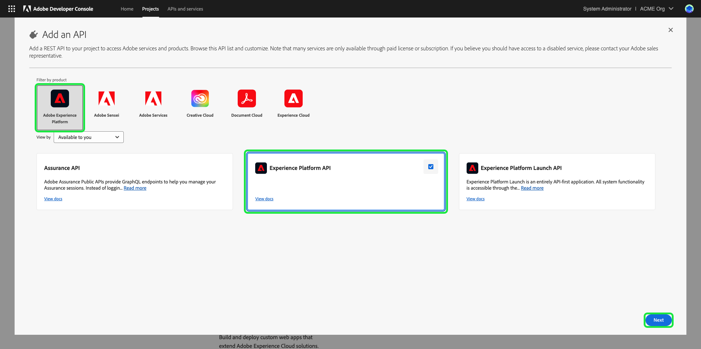
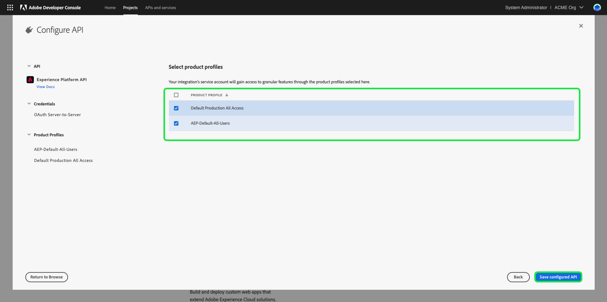
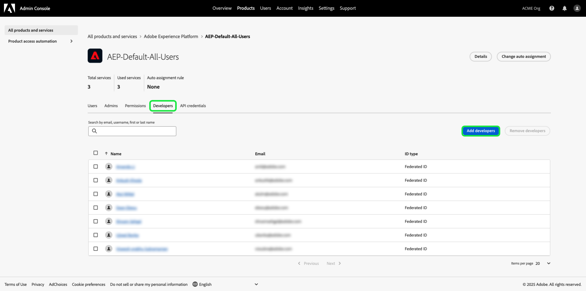

# 验证和访问 Experience Platform API

此文档分步说明了如何获取Adobe Experience Platform开发人员帐户访问权限以调用Experience Platform API。 在本教程结束时，您将生成或收集了所有Experience Platform API调用中作为标头所需的以下凭据：

* `{ACCESS_TOKEN}`
* `{API_KEY}`
* `{ORG_ID}`

>[!TIP]
>
>除了上述三个凭据之外，许多Experience Platform API还要求将有效的`{SANDBOX_NAME}`作为标头提供。 有关沙盒的更多信息，请参阅[沙盒概述](../sandboxes/home.md)；有关列出对您的组织可用的沙盒的信息，请参阅[沙盒管理端点](/help/sandboxes/api/sandboxes.md#list)文档。

为了维护应用程序和用户的安全，对Experience Platform API的所有请求都必须使用OAuth等标准进行身份验证和授权。

本教程介绍如何收集所需的凭据来验证Experience Platform API调用，如下面的流程图中所述。 您可以在初始一次性设置中收集大多数所需的凭据。 但是，必须每24小时刷新一次访问令牌。


## 先决条件 {#prerequisites}

要成功调用Experience Platform API，您必须具备以下条件：

* 有权访问Adobe Experience Platform的组织。
* 能够将您添加为产品配置文件的开发人员和用户的Admin Console管理员。
* Experience Platform系统管理员，可以向您授予必要的基于属性的访问控制，以通过API对Experience Platform的不同部分执行读取或写入操作。

您还必须拥有Adobe ID才能完成本教程。 如果您没有Adobe ID，则可以使用以下步骤创建一个：

1. 转到[Adobe Developer Console](https://console.adobe.io)。
2. 选择&#x200B;**[!UICONTROL 创建新帐户]**。
3. 完成注册过程。

## 获得Experience Platform的开发人员和用户访问权限 {#gain-developer-user-access}

在Adobe Developer Console上创建集成之前，您的帐户必须具有Adobe Admin Console中Experience Platform产品配置文件的开发人员和用户权限。

### 获取开发人员访问权限 {#gain-developer-access}

请联系贵组织中的Admin Console管理员，将您作为开发人员添加到Experience Platform产品配置文件。 有关如何[管理产品配置文件的开发人员访问权限](https://helpx.adobe.com/cn/enterprise/admin-guide.html/enterprise/using/manage-developers.ug.html)的特定说明，请参阅Admin Console文档。

一旦您被指定为开发人员，就可以开始在[Adobe Developer Console](https://www.adobe.com/go/devs_console_ui)中创建集成。 这些集成是从外部应用程序和服务到Adobe API的管道。

### 获得用户访问权限 {#gain-user-access}

您的Admin Console管理员还必须将您作为用户添加到同一产品配置文件。 凭借用户访问权限，您可以在UI中查看您执行的API操作的结果。

有关详细信息，请参阅[在Admin Console中管理用户组](https://helpx.adobe.com/cn/enterprise/admin-guide.html/enterprise/using/user-groups.ug.html)指南。

## 生成API密钥（客户端ID）和组织ID {#generate-credentials}

>[!NOTE]
>
>如果您是从[Privacy Service API指南](../privacy-service/api/getting-started.md)中跟踪此文档，则现在可以返回该指南以生成[!DNL Privacy Service]唯一的访问凭据。

在通过Admin Console授予您Experience Platform的开发人员和用户访问权限后，下一步是在Adobe Developer Console中生成您的`{ORG_ID}`和`{API_KEY}`凭据。 这些凭据只需生成一次，可在未来的Experience Platform API调用中重复使用。

>[!TIP]
>
>您可以直接从API参考文档页面获取使用Experience Platform API所需的所有身份验证凭据，而不是转到Developer Console。 [参阅更多](#get-credentials-functionality)关于该功能的信息。

### 将Experience Platform添加到项目 {#add-platform-to-project}

转到[Adobe Developer Console](https://www.adobe.com/go/devs_console_ui)并使用您的Adobe ID登录。 接下来，按照Adobe Developer Console文档中有关[创建空项目](https://developer.adobe.com/developer-console/docs/guides/projects/projects-empty/)的教程中概述的步骤进行操作。

创建新项目后，请在&#x200B;**[!UICONTROL 项目概述]**&#x200B;屏幕上选择&#x200B;**[!UICONTROL 添加API]**。

>[!TIP]
>
>如果您配置了多个组织，请使用界面右上角的组织选择器，以确保您在所需的组织中。

突出显示了“添加API”选项的

出现&#x200B;**[!UICONTROL 添加API]**&#x200B;屏幕。 选择&#x200B;**[!UICONTROL Adobe Experience Platform]**&#x200B;的产品图标，然后选择&#x200B;**[!UICONTROL Experience Platform API]**，然后再选择&#x200B;**[!UICONTROL 下一步]**。



>[!TIP]
>
>选择&#x200B;**[!UICONTROL 查看文档]**&#x200B;选项可在单独的浏览器窗口中导航到完整的[Experience Platform API参考文档](https://developer.adobe.com/experience-platform-apis/)。

### 选择[!UICONTROL OAuth服务器到服务器]身份验证类型 {#select-oauth-server-to-server}

接下来，选择&#x200B;**[!UICONTROL OAuth服务器到服务器]**&#x200B;身份验证类型以生成访问令牌并访问Experience Platform API。 在选择&#x200B;**[!UICONTROL 下一步]**&#x200B;之前，请在&#x200B;**[!UICONTROL 凭据名称]**&#x200B;文本字段中为凭据指定有意义的名称。

>[!IMPORTANT]
>
>**[!UICONTROL OAuth Server-to-Server]**&#x200B;方法是唯一支持向前发展的令牌生成方法。 以前支持的&#x200B;**[!UICONTROL 服务帐户(JWT)]**&#x200B;方法已弃用，无法为新集成选择此方法。 虽然使用JWT身份验证方法的现有集成将继续工作到2025年6月30日，但Adobe强烈建议在该日期之前将现有集成迁移到新的[!UICONTROL OAuth服务器到服务器]方法。 在[!BADGE Deprecated]部分获取更多信息{type=negative}[生成JSON Web令牌(JWT)](#jwt)。


### 为您的集成选择产品配置文件 {#select-product-profiles}

在&#x200B;**[!UICONTROL 配置API]**&#x200B;屏幕中，选择&#x200B;**[!UICONTROL AEP-Default-All-Users]**&#x200B;以及您希望获得访问权限的任何其他产品配置文件。

>[!IMPORTANT]
>
>要访问Experience Platform中的某些功能，您还需要系统管理员向您授予必要的基于属性的访问控制权限。 请参阅[获取必要的基于属性的访问控制权限](#get-abac-permissions)一节以了解详情。



准备就绪后，选择&#x200B;**[!UICONTROL 保存配置的API]**。

以下视频教程中也提供了上述步骤的演练，以设置与Experience Platform API的集成：

>[!VIDEO](https://video.tv.adobe.com/v/28832/?learn=on)

### 收集凭据 {#gather-credentials}

将API添加到项目后，项目的&#x200B;**[!UICONTROL OAuth服务器到服务器]**&#x200B;页面将显示所有调用Experience Platform API时所需的以下凭据：

在Developer Consle中添加API后

* `{API_KEY}` （[!UICONTROL 客户端ID]）
* `{ORG_ID}` （[!UICONTROL 组织ID]）

<!--


<!--

In addition to the above credentials, you also need the generated **[!UICONTROL Client Secret]** for a future step. Select **[!UICONTROL Retrieve client secret]** to reveal the value, and then copy it for later use.


-->

## 生成访问令牌 {#generate-access-token}

下一步是生成用于Experience Platform API调用的`{ACCESS_TOKEN}`凭据。 与`{API_KEY}`和`{ORG_ID}`的值不同，必须每24小时生成一个新令牌才能继续使用Experience Platform API。 选择&#x200B;**[!UICONTROL 生成访问令牌]**，这将生成您的访问令牌，如下所示。


>[!TIP]
>
>您还可以使用Postman环境和收藏集来生成访问令牌。 有关详细信息，请阅读有关[使用Postman进行身份验证和测试API调用](#use-postman)的部分。

## 直接在API参考文档中创建和检索身份验证凭据 {#get-credentials-functionality}

从2024年11月版的Experience Platform开始，您可以直接从API参考页面获取使用Experience Platform API的凭据，而无需转到[!UICONTROL Developer Console]。 从[流服务API — 目标页面](https://developer.adobe.com/experience-platform-apis/references/destinations/)查看以下示例。


要获取调用Experience Platform API的凭据，请导航到任何Experience Platform API参考页面，然后选择页面顶部的&#x200B;**[!UICONTROL 登录]**。 使用您的&#x200B;**[!UICONTROL 个人帐户]**&#x200B;或&#x200B;**[!UICONTROL 公司或学校帐户]**&#x200B;登录。

登录后，选择&#x200B;**[!UICONTROL 创建新凭据]**&#x200B;以创建新凭据集以访问Experience Platform API。


接下来，使用下拉选择器打开凭据窗口，生成访问令牌，并获取您的API密钥和组织ID。 将凭据复制到API引用页面上的[**[!UICONTROL 尝试]**](/help/release-notes/2024/may-2024.md#interactive-api-documentation)块以开始使用Experience Platform API。


>[!TIP]
>
>当您在Experience Platform API参考文档中的不同端点页面之间导航时，页面顶部凭据块仍会显示。

## [!BADGE 已弃用]{type=negative}生成JSON Web令牌(JWT) {#jwt}

>[!WARNING]
>
>已弃用用于生成访问令牌的JWT方法。 必须使用[OAuth服务器到服务器身份验证方法](#select-oauth-server-to-server)创建所有新集成。 Adobe还要求您在2025年6月30日之前将现有集成迁移到OAuth方法，以便您的集成继续工作。 请阅读以下重要文档：
> 
>* [您的应用程序从JWT迁移到OAuth的迁移指南](https://developer.adobe.com/developer-console/docs/guides/authentication/ServerToServerAuthentication/migration/)
>* [使用OAuth的新旧应用程序的实施指南](https://developer.adobe.com/developer-console/docs/guides/authentication/ServerToServerAuthentication/implementation/)
>* [使用OAuth服务器到服务器凭据方法的优势](https://developer.adobe.com/developer-console/docs/guides/authentication/ServerToServerAuthentication/migration/#why-oauth-server-to-server-credentials)

+++ 查看已弃用的信息

下一步是根据您的帐户凭据生成JSON Web令牌(JWT)。 此值用于生成您的`{ACCESS_TOKEN}`凭据以用于Experience Platform API调用，必须每24小时重新生成一次。

>[!IMPORTANT]
>
>在本教程中，以下步骤概述了如何在Developer Console中生成JWT。 但是，这种生成方法只应用于测试和评估目的。
>
>对于常规使用，必须自动生成JWT。 有关如何以编程方式生成JWT的更多信息，请参阅Adobe Developer上的[服务帐户身份验证指南](https://www.adobe.io/developer-console/docs/guides/authentication/JWT/)。

在左侧导航中选择&#x200B;**[!UICONTROL 服务帐户(JWT)]**，然后选择&#x200B;**[!UICONTROL 生成JWT]**。


在&#x200B;**[!UICONTROL 生成自定义JWT]**&#x200B;下提供的文本框中，粘贴您之前将Experience Platform API添加到服务帐户时生成的私钥的内容。 然后选择&#x200B;**[!UICONTROL 生成令牌]**。


页面将更新以显示生成的JWT，以及一个允许您生成访问令牌的示例cURL命令。 在本教程中，请选择&#x200B;**[!UICONTROL 生成的JWT]**&#x200B;旁边的&#x200B;**[!UICONTROL 复制]**&#x200B;以将令牌复制到剪贴板。


**生成访问令牌**

生成JWT后，您可以在API调用中使用它来生成`{ACCESS_TOKEN}`。 与`{API_KEY}`和`{ORG_ID}`的值不同，必须每24小时生成一个新令牌才能继续使用Experience Platform API。

**请求**

以下请求基于有效负载中提供的凭据生成新的`{ACCESS_TOKEN}`。 此终结点仅接受表单数据作为其有效负载，因此必须为其指定`multipart/form-data`的`Content-Type`标头。

```shell
curl -X POST https://ims-na1.adobelogin.com/ims/exchange/jwt \
  -H 'Content-Type: multipart/form-data' \
  -F 'client_id={API_KEY}' \
  -F 'client_secret={SECRET}' \
  -F 'jwt_token={JWT}'
```

| 属性 | 描述 |
| --- | --- |
| `{API_KEY}` | 您在[上一步骤](#api-ims-secret)中检索到的`{API_KEY}` （[!UICONTROL 客户端ID]）。 |
| `{SECRET}` | 您在[上一步](#api-ims-secret)中检索到的客户端密钥。 |
| `{JWT}` | 您在[上一步](#jwt)中生成的JWT。 |

>[!NOTE]
>
>您可以使用相同的API密钥、客户端密钥和JWT为每个会话生成新的访问令牌。 这允许您在应用程序中自动生成访问令牌。

**响应**

```json
{
  "token_type": "bearer",
  "access_token": "{ACCESS_TOKEN}",
  "expires_in": 86399992
}
```

| 属性 | 描述 |
| --- | --- |
| `token_type` | 类型 of 正在返回令牌。 对于访问令牌，此值始终为`bearer`。 |
| `access_token` | 生成的`{ACCESS_TOKEN}`。 所有Experience Platform API调用都需要将此值作为以`Bearer`为前缀的`Authentication`标头。 |
| `expires_in` | 访问令牌过期前剩余的毫秒数。 此值达到0后，必须生成新的访问令牌才能继续使用Experience Platform API。 |

+++

## 测试访问凭据 {#test-credentials}

收集完所有三个所需的凭据（访问令牌、API密钥和组织ID）后，您可以尝试进行以下API调用。 此调用列出了您的组织可用的所有标准[!DNL Experience Data Model] (XDM)类。 在[Postman](#use-postman)中导入并执行调用。

>[!BEGINSHADEBOX]

**请求**

```SHELL
curl -X GET https://platform.adobe.io/data/foundation/schemaregistry/global/classes \
  -H 'Accept: application/vnd.adobe.xed-id+json' \
  -H 'Authorization: Bearer {{ACCESS_TOKEN}}' \
  -H 'x-api-key: {{API_KEY}}' \
  -H 'x-gw-ims-org-id: {{ORG_ID}}'
```

**响应**

如果您的响应与下面显示的响应类似，则您的凭据有效且有效。 （此响应已因空间而被截断。）

```JSON
{
  "results": [
    {
        "title": "XDM ExperienceEvent",
        "$id": "https://ns.adobe.com/xdm/context/experienceevent",
        "meta:altId": "_xdm.context.experienceevent",
        "version": "1"
    },
    {
        "title": "XDM Individual Profile",
        "$id": "https://ns.adobe.com/xdm/context/profile",
        "meta:altId": "_xdm.context.profile",
        "version": "1"
    }
  ]
}
```

>[!ENDSHADEBOX]

>[!IMPORTANT]
>
>虽然上述调用足以测试您的访问凭据，但请注意，如果没有基于属性的正确访问控制权限，您将无法访问或修改多个资源。 阅读以下&#x200B;**获取必要的基于属性的访问控制权限**&#x200B;部分中的更多信息。

## 获取必要的基于属性的访问控制权限 {#get-abac-permissions}

要访问或修改Experience Platform中的多个资源，您必须具有相应的访问控制权限。 系统管理员可以授予您所需的[权限](/help/access-control/ui/permissions.md)。 在部分中获取有关[管理角色](/help/access-control/abac/ui/permissions.md#manage-api-credentials-for-role)的API凭据的详细信息。

以下视频教程中也提供了有关系统管理员如何授予通过API访问Experience Platform资源所需的权限的详细信息：

>[!VIDEO](https://video.tv.adobe.com/v/28832/?learn=on&t=159)

## 使用Postman验证和测试API调用 {#use-postman}

[Postman](https://www.postman.com/)是一种常用的工具，它允许开发人员探索和测试RESTful API。 您可以使用Experience Platform Postman收藏集和环境来加速使用Experience Platform API。 阅读有关[在Experience Platform](/help/landing/postman.md)中使用Postman以及开始使用收藏集和环境的更多信息。

以下视频教程中也提供了有关将Postman与Experience Platform收藏集和环境结合使用的详细信息：

**下载并导入要与Postman API一起使用的Experience Platform环境**

>[!VIDEO](https://video.tv.adobe.com/v/28832/?learn=on&t=106)

**使用Postman集合生成访问令牌**

下载[Identity Management服务Postman收藏集](https://github.com/adobe/experience-platform-postman-samples/tree/master/apis/ims)并观看以下视频，了解如何生成访问令牌。

>[!VIDEO](https://video.tv.adobe.com/v/29698/?learn=on)

**下载Experience Platform API Postman收藏集并与API交互**

>[!VIDEO](https://video.tv.adobe.com/v/29704/?learn=on)

<!--
This [Medium post](https://medium.com/adobetech/using-postman-for-jwt-authentication-on-adobe-i-o-7573428ffe7f) describes how you can set up Postman to automatically perform JWT authentication and use it to consume Experience Platform APIs.
-->

## 系统管理员：通过Experience Platform权限授予开发人员和API访问控制 {#grant-developer-and-api-access-control}

在Adobe Developer Console上创建集成之前，您的帐户必须具有Experience Platform产品配置文件的开发人员和用户权限。

>[!NOTE]
>
>只有系统管理员才能在“权限”中查看和管理API凭据。

### 将开发人员添加到产品配置文件 {#add-developers-to-product-profile}

导航到[Admin Console](https://adminconsole.adobe.com/)并使用您的Adobe ID登录。

从导航栏中选择&#x200B;**[!UICONTROL 产品]**，然后从产品列表中选择&#x200B;**[!UICONTROL Adobe Experience Platform]**。


从&#x200B;**[!UICONTROL 产品配置文件]**&#x200B;选项卡中，选择&#x200B;**[!UICONTROL AEP-Default-All-Users]**。 或者，使用搜索栏通过输入名称来搜索产品配置文件。


选择&#x200B;**[!UICONTROL 开发人员]**&#x200B;选项卡，然后选择&#x200B;**[!UICONTROL 添加开发人员]**。



出现&#x200B;**[!UICONTROL 添加开发人员]**&#x200B;对话框。 输入开发人员的&#x200B;**[!UICONTROL 电子邮件或用户名]**。 有效的[!UICONTROL 电子邮件或用户名]显示开发人员详细信息。 选择&#x200B;**[!UICONTROL 保存]**。


已成功添加开发人员，该开发人员显示在&#x200B;**[!UICONTROL 开发人员]**&#x200B;选项卡上。


### 将API凭据分配给角色

>[!NOTE]
>
>只有系统管理员才能在Experience Platform UI中将API分配给角色。

要在Experience Platform API上使用并执行操作，系统管理员需要在角色给定的权限集之外添加API凭据。 在部分中获取有关[管理角色](../access-control/abac/ui/permissions.md#manage-api-credentials-for-a-role)的API凭据的详细信息。

以下视频教程还提供了上述步骤的演练，这些步骤用于向产品配置文件添加开发人员并将API分配给角色：

>[!VIDEO](https://video.tv.adobe.com/v/3426407/?learn=on)

## 其他资源 {#additional-resources}

请参阅下面链接的其他资源，以获取开始使用Experience Platform API的更多帮助

* [身份验证和访问Experience Platform API](https://experienceleague.adobe.com/docs/platform-learn/tutorials/platform-api-authentication.html?lang=zh-Hans)视频教程页面
* 用于生成访问令牌的[Identity Management服务Postman收藏集](https://github.com/adobe/experience-platform-postman-samples/tree/master/apis/ims)
* [Experience Platform API Postman收藏集](https://github.com/adobe/experience-platform-postman-samples/tree/master/apis/experience-platform)

## 后续步骤 {#next-steps}

通过阅读本文档，您已收集并成功测试您的Experience Platform API访问凭据。 您现在可以关注在[文档](../landing/documentation/overview.md)中提供的示例API调用。

除了您在本教程中收集的身份验证值之外，许多Experience Platform API还要求将有效的`{SANDBOX_NAME}`作为标头提供。 有关更多信息，请参阅[沙盒概述](../sandboxes/home.md)。
