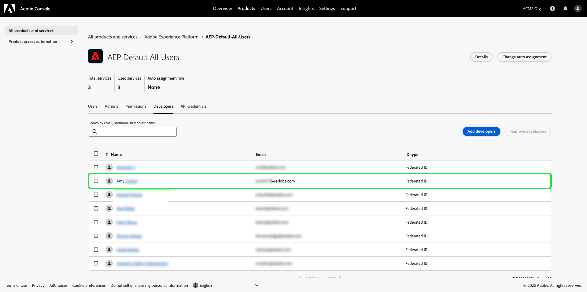
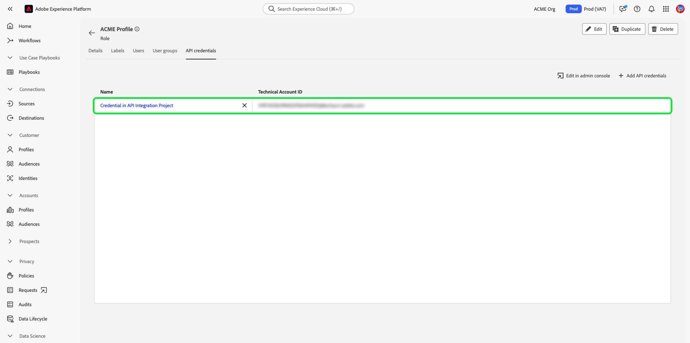

# 验证和访问 Experience Platform API

此文档分步说明了如何获取 Adobe Experience Platform 开发人员帐户访问权限以调用 Experience Platform API。在本教程结束时，您将生成所有平台API调用所需的以下凭据：

* `{ACCESS_TOKEN}`
* `{API_KEY}`
* `{ORG_ID}`

为了维护应用程序和用户的安全性，必须使用OAuth和JSON Web令牌(JWT)等标准对Adobe I/OAPI的所有请求进行身份验证和授权。 JWT与特定于客户端的信息一起使用，以生成您的个人访问令牌。

本教程介绍如何收集所需的凭据来验证Platform API调用，如以下流程图中所述：


## 先决条件

要成功调用Experience PlatformAPI，您必须具备以下条件：

* 有权访问Adobe Experience Platform的组织。
* 能够将您添加为产品配置文件的开发人员和用户的Admin Console管理员。

您还必须具有Adobe ID才能完成本教程。 如果您没有Adobe ID，则可以使用以下步骤创建一个：

1. 转到 [Adobe Developer控制台](https://console.adobe.io).
2. 选择 **[!UICONTROL 创建新帐户]**.
3. 完成注册流程。

## 获取开发人员和用户访问权限以进行Experience Platform

在Adobe Developer Console上创建集成之前，您的帐户必须拥有Adobe Admin Console中Experience Platform产品配置文件的开发人员和用户权限。

### 获取开发人员访问权限

联系 [!DNL Admin Console] 组织中的管理员，可使用 [[!DNL Admin Console]](https://adminconsole.adobe.com/). 请参阅 [!DNL Admin Console] 有关如何操作的特定说明的文档 [管理产品配置文件的开发人员访问权限](https://helpx.adobe.com/cn/enterprise/admin-guide.html/enterprise/using/manage-developers.ug.html).

将您分配为开发人员后，即可在 [Adobe Developer控制台](https://www.adobe.com/go/devs_console_ui). 这些集成是从外部应用程序和服务到AdobeAPI的管道。

### 获取用户访问权限

您的 [!DNL Admin Console] 管理员还必须将您作为用户添加到同一产品配置文件。 请参阅 [管理用户组 [!DNL Admin Console]](https://helpx.adobe.com/enterprise/admin-guide.html/enterprise/using/user-groups.ug.html) 以了解更多信息。

## 生成API密钥、组织ID和客户端密钥 {#api-ims-secret}

>[!NOTE]
>
>如果您从 [Privacy ServiceAPI指南](../privacy-service/api/getting-started.md)，您现在可以返回该指南以生成 [!DNL Privacy Service].

在您通过 [!DNL Admin Console]，下一步是生成 `{ORG_ID}` 和 `{API_KEY}` 凭据。 这些凭据只需生成一次，即可在以后的Platform API调用中重复使用。

### 将Experience Platform添加到项目

转到 [Adobe Developer控制台](https://www.adobe.com/go/devs_console_ui) 然后使用您的Adobe ID登录。 接下来，按照 [创建空项目](https://developer.adobe.com/developer-console/docs/guides/projects/projects-empty/) (在Adobe Developer控制台文档中)。

创建新项目后，选择 **[!UICONTROL 添加API]** 在 **[!UICONTROL 项目概述]** 屏幕。


的 **[!UICONTROL 添加API]** 屏幕。 选择Adobe Experience Platform的产品图标，然后选择 **[!UICONTROL Experience PlatformAPI]** 选择 **[!UICONTROL 下一个]**.


从此处，按照 [使用服务帐户(JWT)向项目添加API](https://www.adobe.io/apis/experienceplatform/console/docs.html#!AdobeDocs/adobeio-console/master/services-add-api-jwt.md) （从“配置API”步骤开始）以完成该过程。

>[!IMPORTANT]
>
>在上述链接过程中，浏览器会按照特定步骤自动下载私钥和关联的公共证书。 请注意，此私钥存储在您的计算机上的位置，因为在本教程的后续步骤中需要它。

### 收集凭据

将API添加到项目后， **[!UICONTROL Experience PlatformAPI]** 项目的页面显示了所有对Experience PlatformAPI的调用所需的以下凭据：

* `{API_KEY}` ([!UICONTROL 客户端ID])
* `{ORG_ID}` ([!UICONTROL 组织 ID])


除了上述凭据之外，您还需要生成 **[!UICONTROL 客户端密钥]** 以备将来之需。 选择 **[!UICONTROL 检索客户端密钥]** 以显示值，然后复制该值以供日后使用。


## 生成JSON Web令牌(JWT) {#jwt}

下一步是根据您的帐户凭据生成JSON Web令牌(JWT)。 此值用于生成 `{ACCESS_TOKEN}` 用于Platform API调用的凭据，必须每24小时重新生成一次。

>[!IMPORTANT]
>
>在本教程中，以下步骤将简要介绍如何在开发人员控制台中生成JWT。 但是，此生成方法只应用于测试和评估目的。
>
>为了正常使用，必须自动生成JWT。 有关如何以编程方式生成JWT的更多信息，请参阅 [服务帐户验证指南](https://www.adobe.io/developer-console/docs/guides/authentication/JWT/) 在Adobe Developer。

选择 **[!UICONTROL 服务帐户(JWT)]** 在左侧导航中，选择 **[!UICONTROL 生成JWT]**.


在 **[!UICONTROL 生成自定义JWT]**，粘贴之前将Platform API添加到服务帐户时生成的私钥的内容。 然后，选择 **[!UICONTROL 生成令牌]**.


页面会更新以显示生成的JWT，以及允许您生成访问令牌的示例cURL命令。 在本教程中，请选择 **[!UICONTROL 复制]** 下一页 **[!UICONTROL 生成的JWT]** 将令牌复制到剪贴板。


## 生成访问令牌

生成JWT后，即可在API调用中使用它来生成 `{ACCESS_TOKEN}`. 与 `{API_KEY}` 和 `{ORG_ID}`，则必须每24小时生成一个新令牌，才能继续使用Platform API。

**请求**

以下请求会生成一个新 `{ACCESS_TOKEN}` 基于有效负载中提供的凭据。 此端点仅接受表单数据作为其有效负载，因此必须为其指定 `Content-Type` 标题 `multipart/form-data`.

```shell
curl -X POST https://ims-na1.adobelogin.com/ims/exchange/jwt \
  -H 'Content-Type: multipart/form-data' \
  -F 'client_id={API_KEY}' \
  -F 'client_secret={SECRET}' \
  -F 'jwt_token={JWT}'
```

| 属性 | 描述 |
| --- | --- |
| `{API_KEY}` | 的 `{API_KEY}` ([!UICONTROL 客户端ID]) [上一步](#api-ims-secret). |
| `{SECRET}` | 您在 [上一步](#api-ims-secret). |
| `{JWT}` | 您在 [上一步](#jwt). |

>[!NOTE]
>
>您可以使用相同的API密钥、客户端密钥和JWT为每个会话生成新的访问令牌。 这允许您在应用程序中自动生成访问令牌。

**响应**

```json
{
  "token_type": "bearer",
  "access_token": "{ACCESS_TOKEN}",
  "expires_in": 86399992
}
```

| 属性 | 描述 |
| --- | --- |
| `token_type` | 返回的令牌类型。 对于访问令牌，此值始终为 `bearer`. |
| `access_token` | 生成的 `{ACCESS_TOKEN}`. 此值前缀为单词 `Bearer`，作为 `Authentication` 所有平台API调用的标头。 |
| `expires_in` | 在访问令牌过期之前的剩余毫秒数。 此值达到0后，必须生成新的访问令牌才能继续使用Platform API。 |

## 测试访问凭据

收集了所有三个必需的凭据后，您可以尝试进行以下API调用。 此调用列出所有标准 [!DNL Experience Data Model] (XDM)类可供您的组织使用。

**请求**

```SHELL
curl -X GET https://platform.adobe.io/data/foundation/schemaregistry/global/classes \
  -H 'Accept: application/vnd.adobe.xed-id+json' \
  -H 'Authorization: Bearer {ACCESS_TOKEN}' \
  -H 'x-api-key: {API_KEY}' \
  -H 'x-gw-ims-org-id: {ORG_ID}'
```

**响应**

如果您的响应与下面显示的响应类似，则您的凭据有效且有效。 （此响应因空格而被截断。）

```JSON
{
  "results": [
    {
        "title": "XDM ExperienceEvent",
        "$id": "https://ns.adobe.com/xdm/context/experienceevent",
        "meta:altId": "_xdm.context.experienceevent",
        "version": "1"
    },
    {
        "title": "XDM Individual Profile",
        "$id": "https://ns.adobe.com/xdm/context/profile",
        "meta:altId": "_xdm.context.profile",
        "version": "1"
    }
  ]
}
```

## 使用Postman验证和测试API调用

[Postman](https://www.postman.com/) 是一款通用工具，允许开发人员探索和测试RESTful API。 此 [中等帖子](https://medium.com/adobetech/using-postman-for-jwt-authentication-on-adobe-i-o-7573428ffe7f) 介绍如何设置Postman以自动执行JWT身份验证，并使用它来使用Platform API。

## 具有Experience Platform权限的开发人员和API访问控制

>[!NOTE]
>
>只有系统管理员才能在“权限”中查看和管理API凭据。

在Adobe Developer Console上创建集成之前，您的帐户必须拥有Adobe Admin Console中Experience Platform产品配置文件的开发人员和用户权限。

### 将开发人员添加到产品配置文件

转至[[!DNL Admin Console]](https://adminconsole.adobe.com/)并使用您的 Adobe ID 登录。

选择 **[!UICONTROL 产品]**，然后选择 **[!UICONTROL Adobe Experience Platform]** 从产品列表中。


从 **[!UICONTROL 产品配置文件]** 选项卡，选择 **[!UICONTROL AEP-Default-All-Users]**. 或者，使用搜索栏通过输入名称来搜索产品配置文件。


选择 **[!UICONTROL 开发人员]** 选项卡，然后选择 **[!UICONTROL 添加开发人员]**.


输入开发人员的 **[!UICONTROL 电子邮件或用户名]**. 有效 [!UICONTROL 电子邮件或用户名] 将显示开发人员详细信息。 选择&#x200B;**[!UICONTROL 保存]**。


开发人员已成功添加，并显示在 [!UICONTROL 开发人员] 选项卡。



### 设置API

开发人员可以在Adobe Developer控制台中在项目内添加和配置API。

选择您的项目，然后选择 **[!UICONTROL 添加API]**.


在 **[!UICONTROL 添加API]** 对话框选择 **[!UICONTROL Adobe Experience Platform]**，然后选择 **[!UICONTROL Experience PlatformAPI]**.


在 **[!UICONTROL 配置API]** 屏幕，选择 **[!UICONTROL AEP-Default-All-Users]**.

### 将API分配给角色

系统管理员可以在Experience PlatformUI中将API分配给角色。

选择 **[!UICONTROL 权限]** 以及要将API添加到的角色。 选择 **[!UICONTROL API凭据]** 选项卡，然后选择 **[!UICONTROL 添加API凭据]**.


选择要添加到角色的API，然后选择 **[!UICONTROL 保存]**.


您将返回到 [!UICONTROL API凭据] 选项卡，其中列出了新添加的API。



## 后续步骤

通过阅读本文档，您收集并成功测试了Platform API的访问凭据。 您现在可以遵循 [文档](../landing/documentation/overview.md).

除了在本教程中收集的身份验证值之外，许多Platform API还需要有效的 `{SANDBOX_NAME}` 将作为标头提供。 有关更多信息，请参阅[沙盒概述](../sandboxes/home.md)。