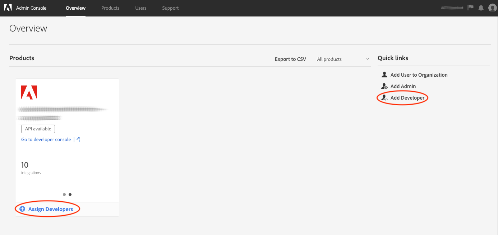

# 验证和访问[!DNL Experience Platform] API

此文档提供了一个分步教程，用于获取对Adobe Experience Platform开发者帐户的访问权，以便调用[!DNL Experience Platform] API。

## 进行身份验证以进行API调用

为了维护应用程序和用户的安全性，对Adobe I/OAPI的所有请求都必须使用OAuth和JSON Web令牌(JWT)等标准进行身份验证和授权。 然后，JWT与客户特定信息一起使用，以生成您的个人访问令牌。

本教程介绍通过创建流程图中概述的访问令牌进行身份验证的步骤：


## 先决条件

为了成功调用[!DNL Experience Platform] API，您需要：

* 一个可进入Adobe Experience Platform的国际管理系统组织
* 注册的Adobe ID帐户
* Admin Console管理员将您添加为产品的&#x200B;**开发人员**&#x200B;和&#x200B;**用户**。

以下部分介绍创建Adobe ID并成为组织的开发人员和用户的步骤。

### 创建Adobe ID

如果您没有Adobe ID，可以使用以下步骤创建一个：

1. 转至[Adobe开发者控制台](https://console.adobe.io)
2. 选择&#x200B;**[!UICONTROL 创建新帐户]**
3. 完成注册过程

## 成为组织[!DNL Experience Platform]的开发人员和用户

在Adobe I/O创建集成之前，您的帐户必须对IMS组织中的某个产品具有开发人员权限。 有关该Admin Console的开发者帐户的详细信息，请参阅[支持文档](https://helpx.adobe.com/cn/enterprise/using/manage-developers.html)，以管理开发者。

**获得开发人员访问权限**

请与组织中的[!DNL Admin Console]管理员联系，将您添加为使用[[!DNL Admin Console]](https://adminconsole.adobe.com/)的贵组织某个产品的开发人员。



管理员必须将您指定为开发人员，以便至少让一个产品用户档案继续。


一旦您被分配为开发人员，您将拥有在[Adobe I/O](https://www.adobe.com/go/devs_console_ui)上创建集成的访问权限。 这些集成是从外部应用程序和服务到AdobeAPI的管道。

**获得用户访问权限**

您的[!DNL Admin Console]管理员还必须以用户身份将您添加到产品中。


与添加开发人员的过程类似，管理员必须将您分配给至少一个产品用户档案才能继续。


## 在Adobe开发人员控制台中生成访问凭据

>[!NOTE]
>
>如果您正在遵循[Privacy Service开发人员指南](../privacy-service/api/getting-started.md)中的此文档，您现在可以返回该指南以生成[!DNL Privacy Service]特有的访问凭据。

使用Adobe开发人员控制台，您必须生成以下三个访问凭据：

* `{IMS_ORG}`
* `{API_KEY}`
* `{ACCESS_TOKEN}`

您的`{IMS_ORG}`和`{API_KEY}`只需生成一次，以后的[!DNL Platform] API调用中即可重用。 但是，您的`{ACCESS_TOKEN}`是临时的，必须每24小时重新生一次。

下面详细介绍了这些步骤。

### 一次性设置

转至[Adobe开发人员控制台](https://www.adobe.com/go/devs_console_ui)并使用您的Adobe ID登录。 接下来，按照Adobe开发者控制台文档中[创建空项目](https://www.adobe.io/apis/experienceplatform/console/docs.html#!AdobeDocs/adobeio-console/master/projects-empty.md)教程中概述的步骤操作。

创建新项目后，在&#x200B;**项目概述**&#x200B;屏幕上选择&#x200B;**[!UICONTROL 添加API]**。


出现&#x200B;**添加API**&#x200B;屏幕。 选择Adobe Experience Platform的产品图标，然后选择&#x200B;**[!UICONTROL Experience PlatformAPI]**，然后选择&#x200B;**[!UICONTROL 下一步]**。


选择[!DNL Experience Platform]作为要添加到项目的API后，请按照教程中所述的使用服务帐户(JWT)](https://www.adobe.io/apis/experienceplatform/console/docs.html#!AdobeDocs/adobeio-console/master/services-add-api-jwt.md)（从“配置API”步骤开始）向项目添加API的步骤完成该过程。[

将API添加到项目后，**项目概述**&#x200B;页面将显示对[!DNL Experience Platform] API的所有调用中所需的以下凭据：

* `{API_KEY}` （客户端ID）
* `{IMS_ORG}` (Organization ID)


### 每个会话的身份验证

您必须收集的最后一个必需凭据是您的`{ACCESS_TOKEN}`。 与`{API_KEY}`和`{IMS_ORG}`的值不同，必须每24小时生成一个新令牌才能继续使用[!DNL Platform] API。

要生成新的`{ACCESS_TOKEN}`，请按照“Developer Console credentials guide（开发人员控制台凭据指南）”中的步骤[生成JWT令牌](https://www.adobe.io/apis/experienceplatform/console/docs.html#!AdobeDocs/adobeio-console/master/credentials.md)。

## 测试访问凭据

收集所有三个必需凭据后，您可以尝试进行以下API调用。 此调用将列表模式注册表`global`容器中的所有[!DNL Experience Data Model](XDM)类：

**API格式**

```http
GET /global/classes
```

**请求**

```SHELL
curl -X GET https://platform.adobe.io/data/foundation/schemaregistry/global/classes \
  -H 'Accept: application/vnd.adobe.xed-id+json' \
  -H 'Authorization: Bearer {ACCESS_TOKEN}' \
  -H 'x-api-key: {API_KEY}' \
  -H 'x-gw-ims-org-id: {IMS_ORG}'
```

**响应**

如果您的响应与下面显示的响应类似，则您的凭据有效且有效。 （此响应已被截断，用于空间。）

```JSON
{
  "results": [
    {
        "title": "XDM ExperienceEvent",
        "$id": "https://ns.adobe.com/xdm/context/experienceevent",
        "meta:altId": "_xdm.context.experienceevent",
        "version": "1"
    },
    {
        "title": "XDM Individual Profile",
        "$id": "https://ns.adobe.com/xdm/context/profile",
        "meta:altId": "_xdm.context.profile",
        "version": "1"
    }
  ]
}
```

## 使用Postman进行JWT身份验证和API调用

[Postman](https://www.postman.com/) 是一款使用REST风格的API的常用工具。此[中型帖子](https://medium.com/adobetech/using-postman-for-jwt-authentication-on-adobe-i-o-7573428ffe7f)介绍如何设置邮递员以自动执行JWT身份验证，并使用它使用Adobe Experience PlatformAPI。

## 后续步骤

通过阅读此文档，您已收集并成功测试了[!DNL Platform] API的访问凭据。 现在，您可以按照[文档](../landing/documentation/overview.md)中提供的示例API调用进行操作。

除了在本教程中收集的身份验证值之外，许多[!DNL Platform] API还要求以有效的`{SANDBOX_NAME}`作为头提供。 有关详细信息，请参阅[沙箱概述](../sandboxes/home.md)。