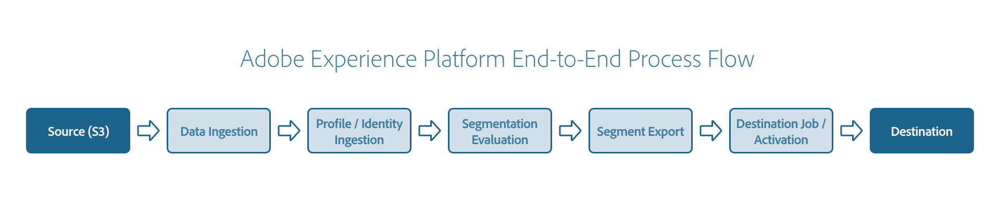

# Adobe Experience Platform端到端示例工作流

Adobe Experience Platform是市场上功能最强大、最灵活、最开放的系统，用于构建和管理可改善客户体验的完整解决方案。 Experience Platform允许组织集中和标准化来自任何系统的客户数据和内容，并应用数据科学和机器学习来显着改进丰富个性化体验的设计和交付。

Experience Platform构建于RESTful API之上，向开发人员公开系统的全部功能，支持使用熟悉的工具轻松集成企业解决方案。 通过Experience Platform，您可以摄取客户数据，将数据分段到要定位的受众，并将这些受众激活到外部目标，从而获得客户的整体视图。 以下教程将显示一个端到端的工作流，其中显示了从通过源摄取到通过目标激活受众的所有步骤。

## 快速入门

此端到端工作流使用多个Adobe Experience Platform服务。 以下是此工作流中使用的服务列表，其中包含指向这些服务概述的链接：

- [[!DNL Experience Data Model (XDM)]](../xdm/home.md)： [!DNL Experience Platform]用于组织客户体验数据的标准化框架。 为了更好地利用分段，请确保根据用于数据建模的[最佳实践](../xdm/schema/best-practices.md)，将您的数据作为配置文件和事件摄取。
- [[!DNL Identity Service]](../identity-service/home.md)：通过跨设备和系统桥接身份，为您提供有关客户及其行为的全面视图。
- [源](../sources/home.md)： [!DNL Experience Platform]允许从各种源摄取数据，同时允许您使用[!DNL Experience Platform]服务来构建、标记和增强传入数据。
- [[!DNL Segmentation Service]](../segmentation/home.md)： [!DNL Segmentation Service]允许您将[!DNL Experience Platform]中存储的与个人（如客户、潜在客户、用户或组织）相关的数据划分为较小的组。
- [[!DNL Real-Time Customer Profile]](../profile/home.md)：根据来自多个源的汇总数据，提供统一的实时使用者个人资料。
- [数据集](../catalog/datasets/overview.md)： [!DNL Experience Platform]中用于数据持久性的存储和管理结构。
- [目标](../destinations/home.md)：目标是预建的与常用应用程序的集成，可无缝激活Experience Platform中的数据，以用于跨渠道营销活动、电子邮件活动、定向广告和许多其他用例。

## 创建 XDM 架构

将数据摄取到Experience Platform之前，必须首先创建一个XDM架构来描述该数据的结构。 在下一步摄取数据时，您会将传入数据映射到此架构。 要了解如何创建示例XDM架构，请阅读有关使用架构编辑器[创建架构](../xdm/tutorials/create-schema-ui.md)的教程。

上述教程将演示如何为架构设置标识字段。 标识字段表示可用于标识与记录或时间序列事件相关的个人人员的字段。 标识字段是如何在Experience Platform中构建客户标识图的关键组件，它最终影响Real-time Customer Profile如何将不同的数据片段合并到一起，从而获得客户的完整视图。 有关如何在Experience Platform中查看身份图的更多详细信息，请参阅有关[如何使用身份图查看器](../identity-service/features/identity-graph-viewer.md)的教程。

您需要启用架构以便在Real-time Customer Profile中使用，以便可以根据架构从数据构建客户配置文件。 有关详细信息，请参阅架构UI指南中有关[为配置文件](../xdm/ui/resources/schemas.md#profile)启用架构的部分。

## 将数据摄取到Experience Platform

创建XDM架构后，您可以开始将数据引入系统。

摄取时，摄取到Experience Platform中的所有数据都会存储到单独的数据集中。 数据集是映射到特定XDM架构的数据记录集合。 在[!DNL Real-Time Customer Profile]可以使用您的数据之前，必须专门配置相关数据集。 有关如何为配置文件启用数据集的完整说明，请参阅[数据集UI指南](../catalog/datasets/user-guide.md#enable-profile)和[数据集配置API教程](../profile/tutorials/dataset-configuration.md)。 配置数据集后，您可以开始将数据摄取到其中。

Experience Platform允许从外部源摄取数据，同时让您能够使用Experience Platform服务来构建、标记和增强传入数据。 您可以从各种源中摄取数据，如 Adobe 应用程序、基于云的存储、数据库和许多其他源。例如，您可以使用[Amazon S3](../sources/tutorials/api/create/cloud-storage/s3.md)摄取您的数据。 可以在[源连接器概述](../sources/home.md)中找到可用源的完整列表。

如果您将Amazon S3用作源连接器，则可以按照有关[创建Amazon S3连接器](../sources/tutorials/api/create/cloud-storage/s3.md)的API教程或有关[创建Amazon S3连接器](../sources/tutorials/ui/create/cloud-storage/s3.md)的UI教程中的说明来了解如何在该连接器内创建、连接和摄取数据。

有关源连接器的更多详细说明，请阅读[源连接器概述](../sources/home.md)。 要了解有关流服务（源所基于的API）的更多信息，请阅读[流服务API参考](https://www.adobe.io/experience-platform-apis/references/flow-service/)。

通过源连接器将数据引入Experience Platform并存储在启用了配置文件的数据集后，将根据您在XDM架构中配置的身份数据自动创建客户配置文件。

首次将数据上载到新数据集时，或者在设置新的ETL流程或数据源时，建议仔细检查数据，以确保已正确上载数据并且生成的配置文件包含您预期的数据。 有关如何在Experience Platform UI中访问客户个人资料的更多信息，请参阅[实时客户个人资料UI指南](../profile/ui/user-guide.md)。 有关如何使用Real-time Customer Profile API访问配置文件的详细信息，请参阅[使用实体端点](../profile/api/entities.md)指南。

## 评估数据

在从摄取的数据中成功生成用户档案后，您可以使用分段评估数据。 分段是定义个人资料存储中由个人子集共享的特定属性或行为的过程，以便区分可营销的人员组和您的客户群。 若要了解有关分段的更多信息，请阅读[分段服务概述](../segmentation/home.md)。

### 创建区段定义

要开始使用此功能，您必须创建区段定义以集群化客户以创建目标受众。 区段定义是规则的集合，可用于定义要定位的受众。 要创建区段定义，您可以按照关于使用[区段生成器](../segmentation/ui/segment-builder.md)的UI指南或[创建区段](../segmentation/tutorials/create-a-segment.md)的API教程中的说明进行操作。

创建区段定义后，请确保记下区段定义ID。

### 评估区段定义

创建区段定义后，您可以创建区段作业以将该区段评估为一次性实例，也可以创建计划以持续评估该区段。

要根据需求评估区段定义，您可以创建区段作业。 区段作业是一个异步进程，它会根据引用的区段定义和合并策略创建新的受众区段。 合并策略是一组规则，Experience Platform使用这些规则来确定哪些数据将用于创建客户配置文件，以及在源之间存在差异时优先考虑哪些数据。 要了解如何使用合并策略，请参阅[合并策略UI指南](../profile/merge-policies/ui-guide.md)。

创建并评估区段作业后，您可以获取有关区段的信息，例如受众规模或处理期间可能发生的错误。 要了解如何创建区段作业，包括您需要提供的所有详细信息，请阅读[区段作业开发人员指南](../segmentation/api/segment-jobs.md)。

要持续评估区段定义，您可以创建和启用计划。 计划是一种可用于在指定时间每天自动运行一次区段作业的工具。 要了解如何创建和启用计划，您可以按照[计划端点](../segmentation/api/schedules.md)的API指南中的说明进行操作。

## 导出评估后的数据

在创建一次性区段作业或持续计划后，您可以创建区段导出作业以将结果导出到数据集，也可以将结果导出到目标。 以下部分提供了有关这两种选项的指南。

### 将评估的数据导出到数据集

在创建一次性区段作业或持续计划后，您可以通过创建区段导出作业来导出结果。 区段导出作业是一种异步任务，用于将有关所评估受众的信息发送到数据集。

在创建导出作业之前，必须首先创建要将数据导出到的数据集。 要了解如何创建数据集，请阅读有关评估区段的教程中有关[创建目标数据集](../segmentation/tutorials/evaluate-a-segment.md#create-dataset)的部分，并确保在创建后记下数据集ID。 创建数据集后，可以创建导出作业。 要了解如何创建导出作业，您可以按照[导出作业端点](../segmentation/api/export-jobs.md)的API指南中的说明进行操作。

### 将评估的数据导出到目标

或者，在创建一次性区段作业或持续计划后，您可以将结果导出到目标。 目标是一个端点，例如外部服务上的Adobe应用程序，可以在其中激活和交付受众。 [目标目录](../destinations/catalog/overview.md)中提供了可用目标的完整列表。

有关如何将数据激活到批处理或电子邮件营销目标的说明，请参阅[有关如何使用Experience Platform UI](../destinations/ui/activate-batch-profile-destinations.md)将受众数据激活到批处理配置文件导出目标的教程，以及如何使用流服务API连接到批处理目标和激活数据的[指南](../destinations/api/connect-activate-batch-destinations.md)。

## 监控Experience Platform数据活动

Experience Platform允许您跟踪如何使用数据流处理数据，数据流表示跨Experience Platform的各种组件移动数据的作业。 这些数据流在不同的服务中配置，有助于将数据从源连接器移动到目标数据集，然后由[!DNL Identity Service]和[!DNL Real-Time Customer Profile]使用它，最后激活到目标。 监视仪表板为您提供数据流历程的可视表示形式。 要了解如何在Experience Platform UI中监视数据流，请参阅有关[监视源的数据流](../dataflows/ui/monitor-sources.md)和[监视目标的数据流](../dataflows/ui/monitor-destinations.md)的教程。

您还可以通过使用[!DNL Observability Insights]的统计指标和事件通知来监视Experience Platform活动。 您可以通过Experience Platform UI订阅警报通知，或将其发送到配置的webhook。 有关如何从Experience Platform UI查看、启用、禁用和订阅可用警报的更多详细信息，请参阅[[!UICONTROL 警报] UI指南](../observability/alerts/ui.md)。 有关如何通过Webhook接收警报的详细信息，请参阅[订阅Adobe I/O事件通知](../observability/alerts/subscribe.md)指南。

## 后续步骤

通过阅读本教程，您已大致了解了Experience Platform的简单端到端流程。 若要了解有关Adobe Experience Platform的更多信息，请阅读[Experience Platform概述](./home.md)。 要了解有关使用Experience Platform UI和Experience Platform API的更多信息，请分别阅读[Experience Platform UI指南](./ui-guide.md)和[Experience Platform API指南](./api-guide.md)。
