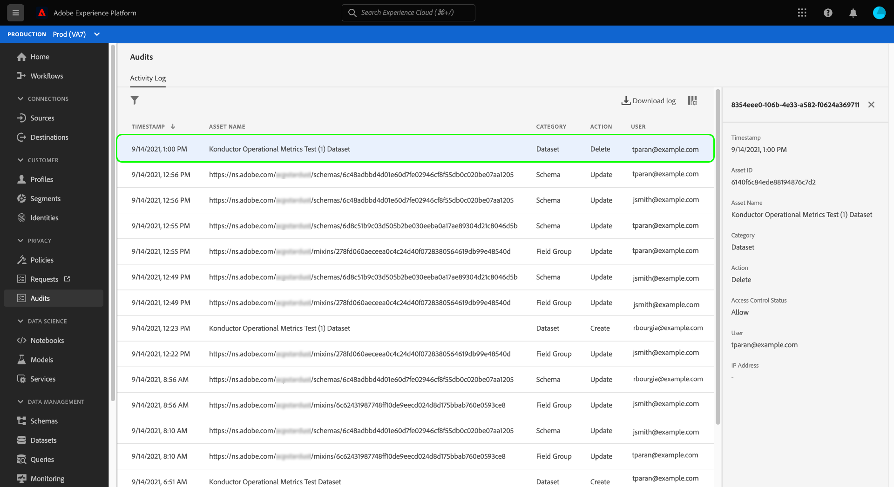

# 审核日志 {#audit-logs}

>[!CONTEXTUALHELP]
>id="platform_audits_privacyconsole_actions"
>title="热门操作"
>abstract="此构件显示在选定时间范围内在 Experience Platform 中执行的最常见操作类型。要查看 Experience Platform 中记录的操作的完整列表，请选择左侧导航中的&#x200B;**审计**。"

>[!CONTEXTUALHELP]
>id="platform_audits_privacyconsole_users"
>title="热门用户"
>abstract="此构件显示在所选时间段内在 Experience Platform 中执行的操作最多的用户。要查看 Experience Platform 中记录的操作的完整列表，请选择左侧导航中的&#x200B;**审计**。"

>[!CONTEXTUALHELP]
>id="platform_privacyConsole_audits_description"
>title="在 Experience Platform 中监测用户活动"
>abstract="<h2>描述</h2>
可按审核日志的形式监测多种 Experience Platform 服务和功能的用户活动。这些日志组成审核记录，其中记录<b>谁</b><b>何时</b>执行了<b>什么</b>。审核日志可帮助解决 Experience Platform 上的问题以及帮助您的企业有效地遵守公司数据管理政策和监管要求。
"

为了提高系统中执行的活动的透明度和可见性，Adobe Experience Platform允许您以“审核日志”的形式审核各种服务和功能的用户活动。 这些日志形成审核记录，可以帮助对Experience Platform问题进行故障诊断，并帮助您的企业有效地遵守公司数据管理政策和法规要求。

从基本意义上说，审核日志可告知&#x200B;**谁**&#x200B;执行了&#x200B;**什么**&#x200B;操作，以及&#x200B;**何时**。 日志中记录的每个操作都包含元数据，这些元数据指示操作类型、日期和时间、执行操作的用户的电子邮件ID以及与操作类型相关的其他属性。

当用户执行操作时，会记录两种类型的审核事件。 核心事件捕获操作[!UICONTROL allow]或[!UICONTROL deny]的授权结果，而增强事件捕获执行结果[!UICONTROL success]或[!UICONTROL failure]。 多个增强事件可以链接到同一个核心事件。 例如，在激活目标时，核心事件记录[!UICONTROL Destination Update]操作的授权，而增强事件记录多个[!UICONTROL Segment Activate]操作。

>[!NOTE]
>
> **角色**&#x200B;资源中操作&#x200B;**添加用户**&#x200B;和&#x200B;**删除用户**&#x200B;的元数据不包含执行该操作的用户的电子邮件ID。 相反，日志将显示系统生成的电子邮件ID (system@adobe.com)。

本文档介绍Experience Platform中的审核日志，包括如何在UI或API中查看和管理它们。

## 审核日志记录的事件类型 {#category}

下表概述了审核日志针对哪些资源记录了哪些操作：

| 资源 | 操作 |
| --- | --- |
| [访问控制策略（基于属性的访问控制）](../../../access-control/home.md) | <ul><li>创建</li><li>更新</li><li>Delete</li></ul> |
| [帐户(Adobe)](../../../sources/connectors/tutorials/ui/../../../tutorials/ui/update.md) | <ul><li>创建</li><li>更新</li><li>Delete</li></ul> |
| [归因人工智能实例](../../../intelligent-services/attribution-ai/overview.md) | <ul><li>创建</li><li>更新</li><li>Delete</li><li>启用</li><li>禁用</li></ul> |
| [审核日志](../../../landing/governance-privacy-security/audit-logs/overview.md) | <ul><li>导出</li></ul> |
| [类](../../../xdm/schema/composition.md#class) | <ul><li>创建</li><li>更新</li><li>Delete</li></ul> |
| 计算属性 | <ul><li>创建</li><li>更新</li><li>Delete</li></ul> |
| [客户人工智能实例](../../../intelligent-services/customer-ai/overview.md) | <ul><li>创建</li><li>更新</li><li>Delete</li><li>启用</li><li>禁用</li></ul> |
| [数据集](../../../catalog/datasets/overview.md) | <ul><li>创建</li><li>更新</li><li>Delete</li><li>为[实时客户个人资料](../../../profile/home.md)启用</li><li>为轮廓禁用</li><li>添加数据</li><li>删除批次</li></ul> |
| [数据流](../../../datastreams/overview.md) | <ul><li>创建</li><li>更新</li><li>Delete</li><li>启用</li><li>禁用</li><li>[编辑映射](../../../datastreams/data-prep.md)</li></ul> |
| [数据类型](../../../xdm/schema/composition.md#data-type) | <ul><li>创建</li><li>更新</li><li>Delete</li></ul> |
| [目标](../../../destinations/home.md) | <ul><li>创建</li><li>更新</li><li>Delete</li><li>启用</li><li>禁用</li><li>数据集激活</li><li>数据集移除</li><li>轮廓激活</li><li>轮廓移除</li></ul> |
| [字段组](../../../xdm/schema/composition.md#field-group) | <ul><li>创建</li><li>更新</li><li>Delete</li></ul> |
| [身份图](../../../identity-service/features/identity-graph-viewer.md) | <ul><li>视图</li></ul> |
| [身份命名空间](../../../identity-service/features/namespaces.md) | <ul><li>创建</li><li>更新</li></ul> |
| [合并策略](../../../profile/merge-policies/overview.md) | <ul><li>创建</li><li>更新</li><li>Delete</li></ul> |
| [产品配置文件](../../../access-control/home.md) | <ul><li>创建</li><li>更新</li><li>Delete</li></ul> |
| [查询](../../../query-service/ui/overview.md) | <ul><li>执行</li></ul> |
| [查询模板](../../../query-service/ui/overview.md) | <ul><li>创建</li><li>更新</li><li>Delete</li></ul> |
| [角色（基于属性的访问控制）](../../../access-control/home.md) | <ul><li>创建</li><li>更新</li><li>Delete</li><li>添加用户</li><li>移除用户</li></ul> |
| [沙盒](../../../sandboxes/home.md) | <ul><li>创建</li><li>更新</li><li>重置</li><li>Delete</li></ul> |
| [计划的查询](../../../query-service/ui/overview.md) | <ul><li>创建</li><li>更新</li><li>Delete</li></ul> |
| [架构](../../../xdm/schema/composition.md) | <ul><li>创建</li><li>更新</li><li>Delete</li><li>为轮廓启用</li></ul> |
| [区段](../../../segmentation/home.md) | <ul><li>创建</li><li>Delete</li><li>区段激活</li><li>区段移除</li></ul> |
| [Source数据流](../../../sources/connectors/tutorials/ui/../../../tutorials/ui/update.md) | <ul><li>创建</li><li>更新</li><li>Delete</li><li>启用</li><li>禁用</li><li>数据集激活</li><li>数据集移除</li><li>配置文件激活</li><li>轮廓移除</li></ul> |
| [工单](../../../hygiene/home.md) | <ul><li>创建</li></ul> |

## 访问审核日志

为您的组织启用该功能后，系统会在活动发生时自动收集审核日志。 您无需手动启用日志收集。

要查看和导出审核日志，您必须具有&#x200B;**[!UICONTROL View User Activity Log]**&#x200B;访问控制权限（可在[!UICONTROL Data Governance]类别下找到）。 要了解如何管理Experience Platform功能的各个权限，请参阅[访问控制文档](../../../access-control/home.md)。

## 在 UI 中管理审核日志 {#managing-audit-logs-in-the-ui}

>[!CONTEXTUALHELP]
>id="platform_privacyConsole_audits_instructions"
>title="说明"
>abstract="<ul><li>在左侧导航中选择<b>审核</b>。“审核”工作区显示记录日志的列表，默认按最新到最旧排序。</li>   <li> 注意：将审核日志保留 365 天，此后将从系统中删除审核日志。因此，只能回溯最长为期 365 天。如果需要回溯超过 365 天之前的数据，则应定期导出日志以满足您的内部政策要求。 </li><li>从列表中选择一个事件以在右边栏中查看其详细信息。 </li><li>选择漏斗图标以显示过滤器控件的列表，帮助缩小结果范围。无论选择什么过滤器，都仅显示最后 1000 条记录。 </li><li>要导出审核日志的当前列表，请选择&#x200B;**下载日志**。</li><li>有关此功能的更多帮助，请参阅 Experience League 上的<a href="https://experienceleague.adobe.com/docs/experience-platform/landing/governance-privacy-security/audit-logs/overview.html?lang=zh-Hans">审核日志概述</a>。</li></ul>"

您可以在Experience Platform UI的&#x200B;**[!UICONTROL Audits]**&#x200B;工作区中查看其他Experience Platform功能的审核日志。 工作区会显示记录的日志列表，默认情况下，这些日志按从最近到最近的顺序排序。

审核日志会保留365天，之后将从系统中将其删除。 如果您需要的数据超过365天，则应定期导出日志以满足内部策略要求。

您请求审计日志的方法会更改允许的时间段以及您将有权访问的记录数。 [导出日志](#export-audit-logs)允许您返回365天（以90天为间隔）至最多10,000个审核日志（核心或增强型），其中Experience Platform中的[活动日志UI](#filter-audit-logs)显示过去90天至最多1000个核心事件，每个事件都具有相应的增强型事件。

从列表中选择一个事件以在右边栏中查看其详细信息。

### 筛选审核日志

选择funnel图标（）以显示筛选器控件列表以帮助缩小结果范围。

>[!NOTE]
>
>Experience Platform UI仅显示过去90天的最多1000个核心事件，每个核心事件具有相应的增强事件，而不管应用了什么过滤器。 如果您需要超过该期限的日志（最多365天），则需要[导出审核日志](#export-audit-logs)。

以下过滤器可用于UI中的审核事件：

| 过滤器 | 描述 |
| --- | --- |
| [!UICONTROL Category] | 使用下拉菜单按[类别](#category)筛选显示的结果。 |
| [!UICONTROL Action] | 按操作筛选。 每项服务的可用操作可在上面的资源表中查看。 |
| [!UICONTROL User] | 输入完整的用户ID（例如，`johndoe@acme.com`）以按用户筛选。 |
| [!UICONTROL Status] | 按结果筛选审核事件：成功、失败、允许或拒绝，因为缺少[访问控制](../../../access-control/home.md)权限。 对于已执行的操作，核心事件显示[!UICONTROL Allow]或[!UICONTROL Deny]。 当核心事件为[!UICONTROL Allow]时，它可能附加了一个或多个显示&#x200B;**[!UICONTROL Success]**&#x200B;或&#x200B;**[!UICONTROL Failure]**&#x200B;的增强型事件。 例如，成功的操作在核心事件上显示[!UICONTROL Allow]，在附加的增强事件上显示[!UICONTROL Success]。 |
| [!UICONTROL Date] | 选择开始日期和/或结束日期，以定义筛选结果的日期范围。 可导出具有90天回顾期的数据（例如，2021-12-15到2022-03-15）。 这可能因事件类型而异。 |

要移除过滤器，请选择相关过滤器的药丸图标上的“X”，或选择&#x200B;**[!UICONTROL Clear all]**&#x200B;以移除所有过滤器。

返回的审核日志数据包含以下关于满足所选筛选条件的所有查询的信息。

| 列名 | 描述 |
|---|---|
| [!UICONTROL Timestamp] | 以`month/day/year hour:minute AM/PM`格式执行的操作的确切日期和时间。 |
| [!UICONTROL Asset Name] | [!UICONTROL Asset Name]字段的值取决于选择作为过滤器的类别。 |
| [!UICONTROL Category] | 此字段与在筛选器下拉列表中选定的类别匹配。 |
| [!UICONTROL Action] | 可用的操作取决于选作过滤器的类别。 |
| [!UICONTROL User] | 此字段提供执行查询的用户ID。 |

### 导出审核日志 {#export-audit-logs}

要导出审核日志的当前列表，请选择&#x200B;**[!UICONTROL Download log]**。

>[!NOTE]
>
>可以每90天请求一次日志，最多可请求过去365天内的日志。 但是，在单个导出期间最多可返回10,000个审核事件（核心或增强型）的日志。

![突出显示[!UICONTROL Download log]的审核仪表板。](../../images/audit-logs/download.png)

在出现的对话框中，选择您首选的格式（**[!UICONTROL CSV]**&#x200B;或&#x200B;**[!UICONTROL JSON]**），然后选择&#x200B;**[!UICONTROL Download]**。 浏览器下载生成的文件，并将其保存到您的计算机。

![突出显示带有[!UICONTROL Download]的文件格式选择对话框。](../../images/audit-logs/select-download-format.png)

## 启用警报 {#enable-alerts}

您可以启用审计警报来接收以下规则的通知：

* 受众创建
* 受众更新
* 受众删除
* 数据集创建
* 数据集更新
* 数据集删除
* 架构创建
* 架构更新
* 架构删除

从列表中选择所需的警报以订阅接收通知。 有关警报的详细信息，请参阅[使用UI订阅警报](../../../observability/alerts/ui.md)指南。

## 在API中管理审核日志

您可以在UI中执行的所有操作也可以使用API调用来完成。 有关详细信息，请参阅[API参考文档](https://www.adobe.io/experience-platform-apis/references/audit-query/)。

## 管理Adobe Admin Console的审核日志

要了解如何管理Adobe Admin Console中的活动的审核日志，请参阅以下[文档](https://helpx.adobe.com/enterprise/using/audit-logs.html)。

## 后续步骤和其他资源

本指南介绍了如何在Experience Platform中管理审核日志。 有关如何监视Experience Platform活动的更多信息，请参阅有关[可观察性分析](../../../observability/home.md)和[监视数据摄取](../../../ingestion/quality/monitor-data-ingestion.md)的文档。

要加深您对Experience Platform中审核日志的了解，请观看以下视频：

>[!VIDEO](https://video.tv.adobe.com/v/341450?quality=12&learn=on)
