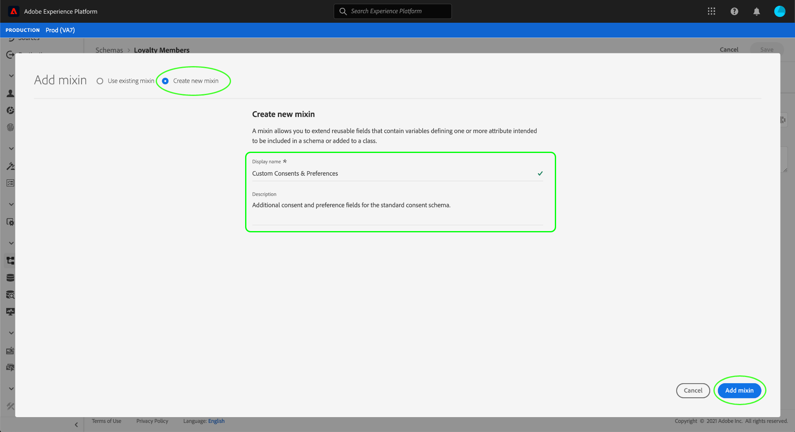

# 配置数据集以捕获同意和偏好设置数据

为了让Adobe Experience Platform处理您的客户同意/偏好设置数据，必须将该数据发送到数据集，其架构包含与同意和其他权限相关的字段。 具体来说，此数据集必须基于[!DNL XDM Individual Profile]类，并启用以便在[!DNL Real-Time Customer Profile]中使用。

本文档提供了配置数据集以在Experience Platform中处理同意数据的步骤。 有关Experience Platform中处理同意/偏好设置数据的完整工作流的概述，请参阅[同意处理概述](./overview.md)。

>[!IMPORTANT]
>
>本指南中的示例使用一组标准化字段来表示客户同意值，这些值由[[!UICONTROL 同意和偏好设置详细信息]架构字段组](../../../../xdm/field-groups/profile/consents.md)定义。 这些字段的结构旨在提供一个高效的数据模型，以涵盖许多常见的同意收集用例。
>
>但是，您也可以定义自己的字段组，以根据自己的数据模型表示同意。 请咨询您的法律团队，以根据以下选项获得批准符合您业务需求的同意数据模型：
>
>* 标准化同意字段组
>* 您的组织创建的自定义同意字段组
>* 标准化同意字段组和自定义同意字段组提供的其他字段的组合

## 先决条件

本教程需要对以下Adobe Experience Platform组件有一定的了解：

* [体验数据模型(XDM)](../../../../xdm/home.md)： [!DNL Experience Platform]用于组织客户体验数据的标准化框架。
   * [架构组合的基础知识](../../../../xdm/schema/composition.md)：了解XDM架构的基本构建块。
* [实时客户资料](../../../../profile/home.md)：将来自不同来源的客户数据整合到一个完整、统一的视图中，同时为每个客户互动提供一个带有时间戳的可操作帐户。

>[!IMPORTANT]
>
>本教程假定您知道Experience Platform中要用于捕获客户属性信息的[!DNL Profile]架构。 无论您使用何种方法收集同意数据，必须为Real-time Customer Profile[&#128279;](../../../../xdm/ui/resources/schemas.md#profile)启用此架构。 此外，架构的主要身份不能是禁止在基于兴趣的广告（如电子邮件地址）中使用的直接可识别字段。 如果您不确定哪些字段受限，请咨询您的法律顾问。

## [!UICONTROL 同意和偏好设置详细信息]字段组结构 {#structure}

[!UICONTROL 同意和偏好设置详细信息]字段组为架构提供标准化的同意字段。 目前，此字段组仅与基于[!DNL XDM Individual Profile]类的架构兼容。

字段组提供单个对象类型字段`consents`，其子属性捕获一组标准化同意字段。 以下JSON是`consents`在数据引入时期望的数据类型的示例：

```json
{
  "consents": {
    "collect": {
      "val": "y",
    },
    "share": {
      "val": "y",
    },
    "personalize": {
      "content": {
        "val": "y"
      }
    },
    "marketing": {
      "preferred": "email",
      "any": {
        "val": "y"
      },
      "push": {
        "val": "n",
        "reason": "Too Frequent",
        "time": "2019-01-01T15:52:25+00:00"
      }
    },
    "idSpecific": {
      "email": {
        "jdoe@example.com": {
          "marketing": {
            "email": {
              "val": "n"
            }
          }
        }
      }
    }
  },
  "metadata": {
    "time": "2019-01-01T15:52:25+00:00"
  }
}
```

>[!NOTE]
>
>有关`consents`中子属性的结构和含义的更多信息，请参阅[[!UICONTROL 同意和偏好设置详细信息]字段组](../../../../xdm/field-groups/profile/consents.md)的概述。

## 将必填字段组添加到您的[!DNL Profile]架构 {#add-field-group}

要使用Adobe标准收集同意数据，您必须具有启用配置文件的架构，该架构包含以下两个字段组：

* [[!UICONTROL 同意和偏好设置详细信息]](../../../../xdm/field-groups/profile/consents.md)
* [[!UICONTROL IdentityMap]](../../../../xdm/field-groups/profile/identitymap.md)(如果使用Experience Platform Web或Mobile SDK发送同意信号，则需要)

在Experience Platform UI中，在左侧导航中选择&#x200B;**[!UICONTROL 架构]**，然后选择&#x200B;**[!UICONTROL 浏览]**&#x200B;选项卡以显示现有架构列表。 在此处，选择要向其添加同意字段的启用了[!DNL Profile]的架构的名称。 本节中的屏幕截图以[架构创建教程](../../../../xdm/tutorials/create-schema-ui.md)中构建的“忠诚会员”架构为例。


>[!TIP]
>
>您可以使用工作区的搜索和筛选功能来帮助更轻松地查找架构。 有关详细信息，请参阅[浏览XDM资源](../../../../xdm/ui/explore.md)指南。

此时将显示[!DNL Schema Editor]，显示画布中架构的结构。 在画布的左侧，选择&#x200B;**[!UICONTROL 字段组]**&#x200B;部分下的&#x200B;**[!UICONTROL 添加]**。


出现&#x200B;**[!UICONTROL 添加字段组]**&#x200B;对话框。 从此处选择&#x200B;**[!UICONTROL 同意和偏好设置详细信息]**。 您可以选择使用搜索栏来缩小结果范围，以便更轻松地查找字段组。


接下来，从列表中查找&#x200B;**[!UICONTROL IdentityMap]**&#x200B;字段组并将其选定。 一旦两个字段组都列在右边栏中，请选择&#x200B;**[!UICONTROL 添加字段组]**。


画布将重新出现，其中显示`consents`和`identityMap`字段已添加到架构结构。 如果您需要标准字段组未捕获的其他同意和偏好设置字段，请参阅[将自定义同意和偏好设置字段添加到架构](#custom-consent)的附录部分。 否则，请选择&#x200B;**[!UICONTROL 保存]**&#x200B;以完成对架构的更改。


>[!IMPORTANT]
>
>如果要创建新架构，或编辑尚未为配置文件启用的现有架构，则保存之前必须[为配置文件](../../../../xdm/ui/resources/schemas.md#profile)启用架构。

如果您编辑的架构由在Experience Platform Web SDK数据流中指定的[!UICONTROL 配置文件数据集]使用，则该数据集现在将包含新的同意字段。 您现在可以返回[同意处理指南](./overview.md#merge-policies)以继续配置Experience Platform以处理同意数据的过程。 如果尚未为此架构创建数据集，请按照下一部分中的步骤操作。

## 根据您的同意模式创建数据集 {#dataset}

创建包含同意字段的架构后，您必须创建一个数据集，该数据集最终将摄取客户的同意数据。 必须为[!DNL Real-Time Customer Profile]启用此数据集。

若要开始，请在左侧导航中选择&#x200B;**[!UICONTROL 数据集]**，然后在右上角选择&#x200B;**[!UICONTROL 创建数据集]**。


在下一页上，选择&#x200B;**[!UICONTROL 从架构]**&#x200B;创建数据集。


出现&#x200B;**[!UICONTROL 从架构]**&#x200B;创建数据集工作流，从&#x200B;**[!UICONTROL 选择架构]**&#x200B;步骤开始。 在提供的列表中，找到您之前创建的同意架构之一。 您可以选择使用搜索栏缩小结果范围并更轻松地找到架构。 选择所需架构旁边的单选按钮，然后选择&#x200B;**[!UICONTROL 下一步]**&#x200B;以继续。


将显示&#x200B;**[!UICONTROL 配置数据集]**&#x200B;步骤。 在选择&#x200B;**[!UICONTROL 完成]**&#x200B;之前，为数据集提供唯一、易于识别的名称和描述。


此时将显示新创建的数据集的详细信息页面。 如果数据集基于您的时间序列架构，则流程已完成。 如果数据集基于您的记录架构，则该过程的最后一步是启用该数据集以在[!DNL Real-Time Customer Profile]中使用。

在右边栏中，选择&#x200B;**[!UICONTROL 配置文件]**&#x200B;切换开关。


最后，在确认弹出框中选择&#x200B;**[!UICONTROL 启用]**&#x200B;以启用[!DNL Profile]的架构。


数据集现已保存并启用以便在[!DNL Profile]中使用。 如果您计划使用Experience Platform Web SDK将同意数据发送到配置文件，则在设置[数据流](../../../../datastreams/overview.md)时，必须选择此数据集作为[!UICONTROL 配置文件数据集]。

## 后续步骤

通过学习本教程，您已向启用了[!DNL Profile]的架构添加同意字段，该架构的数据集将用于使用Experience Platform Web SDK或直接XDM摄取来摄取同意数据。

现在，您可以返回[同意处理概述](./overview.md#merge-policies)，继续配置Experience Platform以处理同意数据。

## 附录

以下部分包含有关创建数据集以摄取客户同意和偏好设置数据的其他信息。

### 将自定义同意和偏好设置字段添加到架构 {#custom-consent}

如果您需要捕获由标准[!UICONTROL 同意和偏好设置详细信息]字段组表示的同意信号以外的其他同意信号，则可以使用自定义XDM组件增强同意模式以满足您的特定业务需求。 此部分概述如何自定义同意模式的基本原则，以便将这些信号摄取到配置文件中。

>[!IMPORTANT]
>
>Experience Platform Web和Mobile SDK在其同意更改命令中不支持自定义字段。 目前，将自定义同意字段摄取到配置文件中的唯一方法是通过[批次摄取](../../../../ingestion/batch-ingestion/overview.md)或[源连接](../../../../sources/home.md)。

强烈建议您使用[!UICONTROL 同意和偏好设置详细信息]字段组作为同意数据结构的基线，并根据需要添加其他字段，而不是尝试从头开始创建整个结构。

要将自定义字段添加到标准字段组的结构中，必须首先创建自定义字段组。 将[!UICONTROL 同意和偏好设置详细信息]字段组添加到架构后，在&#x200B;**[!UICONTROL 字段组]**&#x200B;部分中选择&#x200B;**加号(+)**&#x200B;图标，然后选择&#x200B;**[!UICONTROL 新建字段组]**。 为字段组提供名称和可选说明，然后选择&#x200B;**[!UICONTROL 添加字段组]**。



[!DNL Schema Editor]将在左边栏中选择新的自定义字段组后重新显示。 在画布中显示控件，允许您向架构结构添加自定义字段。 要添加新的同意或偏好设置字段，请选择`consents`对象旁边的&#x200B;**加号(+)**&#x200B;图标。


`consents`对象内将显示一个新字段。 由于您将自定义字段添加到标准XDM对象，因此会在命名为租户ID的对象下创建新字段。


在右边栏的&#x200B;**[!UICONTROL 字段属性]**&#x200B;下，提供字段的名称和描述。 选择字段的&#x200B;**[!UICONTROL 类型]**&#x200B;时，必须为自定义同意或偏好设置字段使用相应的标准数据类型：

* [[!UICONTROL 通用同意字段]](../../../../xdm/data-types/consent-field.md)
* [[!UICONTROL 通用营销偏好设置字段]](../../../../xdm/data-types/marketing-field.md)
* [具有订阅的[!UICONTROL 通用营销偏好设置字段]](../../../../xdm/data-types/marketing-field-subscriptions.md)
* [[!UICONTROL 通用Personalization首选项字段]](../../../../xdm/data-types/personalization-field.md)

完成后，选择&#x200B;**[!UICONTROL 应用]**。


同意或偏好设置字段会添加到架构结构中。 请注意，右边栏中显示的[!UICONTROL 路径]包含`_tenantId`命名空间。 每当您在数据操作中引用此字段的路径时，都必须包含此命名空间。


按照上述步骤继续添加您需要的同意和偏好设置字段。 完成后，选择&#x200B;**[!UICONTROL 保存]**&#x200B;以确认更改。

如果尚未为此架构创建数据集，请继续阅读[创建数据集](#dataset)一节。
