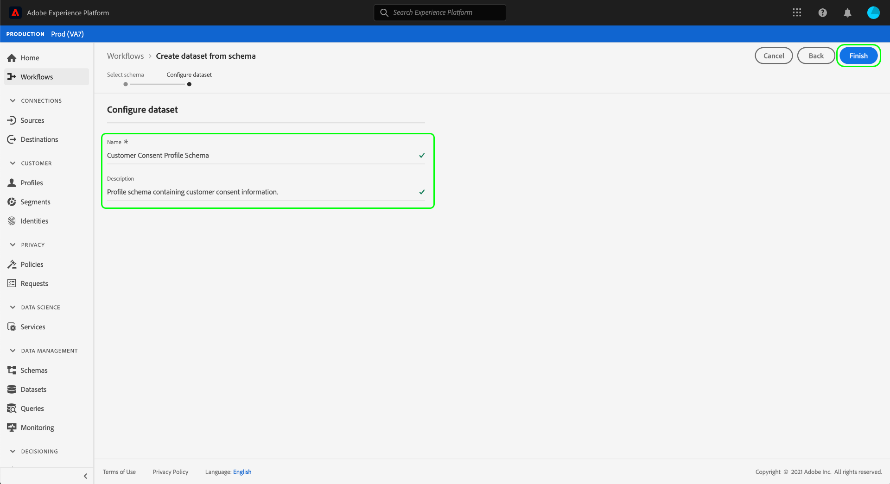

# 配置数据集以捕获同意和首选项数据

要使Adobe Experience Platform处理您的客户同意/首选项数据，必须将该数据发送到其模式包含与同意和其他权限相关字段的数据集。 具体而言，此数据集必须基于[!DNL XDM Individual Profile]类，并且允许在[!DNL Real-time Customer Profile]中使用。

此文档提供了在Experience Platform中配置数据集以处理同意数据的步骤。 有关在平台中处理同意/首选项数据的完整工作流程的概述，请参阅[同意处理概述](./overview.md)。

>[!IMPORTANT]
>
>本指南中的示例使用一组标准化字段来表示客户同意值，如[同意和首选项XDM数据类型](../../../../xdm/data-types/consents.md)所定义。 这些字段的结构旨在提供一个有效的数据模型，以涵盖许多常见的同意收集用例。
>
>但是，您也可以根据自己的数据模型定义自己的字段组来表示同意。 请咨询您的法律团队，以根据以下选项获得符合您业务需要的同意数据模型的批准：
>
>* 标准化同意字段组
>* 您的组织创建的自定义同意字段组
>* 标准化同意字段组和自定义同意字段组提供的其他字段的组合


## 先决条件

本教程需要对Adobe Experience Platform的以下组件有充分的了解：

* [体验数据模型(XDM)](../../../../xdm/home.md):组织客户体验数 [!DNL Experience Platform] 据的标准化框架。
   * [模式合成的基础](../../../../xdm/schema/composition.md):了解XDM模式的基本构建块。
* [实时客户用户档案](../../../../profile/home.md):将来自不同来源的客户数据整合到一个完整、统一的视图中，同时为每次客户互动提供一个可操作、有时间戳的帐户。

>[!IMPORTANT]
>
>本教程假定您了解要用于捕获客户属性信息的平台中的[!DNL Profile]模式。 无论您使用何种方法收集同意模式，对实时客户用户档案](../../../../xdm/ui/resources/schemas.md#profile)必须启用此[。 此外，模式的主要身份不能是禁止在基于兴趣的广告（如电子邮件地址）中使用的直接可识别字段。 如果您不确定哪些字段受限，请咨询您的法律顾问。

## “同意和首选项”字段组结构{#structure}

[!UICONTROL Privacy/Personalization/Marketing Preferences (Consents)]字段组（以下简称“同意和首选项字段组”）为模式提供标准化的同意字段。 当前，此字段组仅与基于[!DNL XDM Individual Profile]类的模式兼容。

字段组提供单个对象类型字段`consents`，其子属性捕获一组标准化同意字段。 以下JSON是`consents`在数据获取时所需的数据类型的示例：

```json
{
  "consents": {
    "collect": {
      "val": "y",
    },
    "share": {
      "val": "y",
    },
    "personalize": {
      "content": {
        "val": "y"
      }
    },
    "marketing": {
      "preferred": "email",
      "any": {
        "val": "y"
      },
      "push": {
        "val": "n",
        "reason": "Too Frequent",
        "time": "2019-01-01T15:52:25+00:00"
      }
    },
    "idSpecific": {
      "email": {
        "jdoe@example.com": {
          "marketing": {
            "email": {
              "val": "n"
            }
          }
        }
      }
    }
  },
  "metadata": {
    "time": "2019-01-01T15:52:25+00:00"
  }
}
```

>[!NOTE]
>
>有关`consents`中子属性的结构和含义的详细信息，请参阅[同意和首选项数据类型](../../../../xdm/data-types/consents.md)的概述。

## 将“同意和首选项”字段组添加到[!DNL Profile]模式{#add-field-group}

在平台UI中，在左侧导航中选择&#x200B;**[!UICONTROL Schemas]**，然后选择&#x200B;**[!UICONTROL Browse]**&#x200B;选项卡以显示现有模式的列表。 在此处，选择要向其添加同意字段的[!DNL Profile]已启用模式的名称。 本节中的截屏使用[模式创建教程](../../../../xdm/tutorials/create-schema-ui.md)中构建的“Loyalty Members”模式作为示例。


>[!TIP]
>
>您可以使用工作区的搜索和筛选功能来帮助更轻松地查找模式。 有关详细信息，请参阅[探索XDM资源](../../../../xdm/ui/explore.md)指南。

出现[!DNL Schema Editor]，显示画布中模式的结构。 在画布的左侧，选择&#x200B;**[!UICONTROL Field groups]**&#x200B;部分下的&#x200B;**[!UICONTROL Add]**。


出现&#x200B;**[!UICONTROL Add field group]**&#x200B;对话框。 从此处，从列表中选择&#x200B;**[!UICONTROL Privacy/Personalization/Marketing Preferences (Consents)]**。 您可以选择使用搜索栏缩小结果范围，以便更轻松地定位字段组。 选择字段组后，选择&#x200B;**[!UICONTROL Add field group]**。


画布将重新出现，显示`consents`对象已添加到模式结构。 如果您需要标准字段组未捕获的其他同意和首选项字段，请参阅[中的附录部分，将自定义同意和首选项字段添加到模式](#custom-consent)。 否则，选择&#x200B;**[!UICONTROL Save]**&#x200B;以完成对模式的更改。


如果您编辑的模式由您的Platform Web SDK边缘配置中指定的[!UICONTROL Profile Dataset]使用，则该数据集现在将包含新的同意字段。 您现在可以返回至[同意处理指南](./overview.md#merge-policies)以继续配置Experience Platform以处理同意数据的过程。

如果尚未为此模式创建数据集，请按照下一节中的步骤操作。

## 根据您的同意模式{#dataset}创建数据集

在创建具有同意字段的模式后，您必须创建一个数据集，以最终摄取客户的同意数据。 必须为[!DNL Real-time Customer Profile]启用此数据集。

要开始，请在左侧导航中选择&#x200B;**[!UICONTROL Datasets]**，然后选择右上角的&#x200B;**[!UICONTROL Create dataset]**。


在下一页，选择&#x200B;**[!UICONTROL Create dataset from schema]**。


将出现&#x200B;**[!UICONTROL Create dataset from schema]**&#x200B;工作流，从&#x200B;**[!UICONTROL Select schema]**&#x200B;步骤开始。 在提供的列表中，找到您之前创建的同意模式之一。 您可以选择使用搜索栏缩小结果范围并更轻松地定位模式。 选择所需模式旁的单选按钮，然后选择&#x200B;**[!UICONTROL Next]**&#x200B;继续。


出现&#x200B;**[!UICONTROL Configure dataset]**&#x200B;步骤。 在选择&#x200B;**[!UICONTROL Finish]**&#x200B;之前，为数据集提供唯一、易于识别的名称和说明。



此时将显示新创建数据集的详细信息页面。 如果数据集基于您的时间序列模式，则该过程已完成。 如果数据集基于您的记录模式，则该过程的最后一步是启用数据集以在[!DNL Real-time Customer Profile]中使用。

在右边栏中，选择&#x200B;**[!UICONTROL Profile]**&#x200B;切换。


最后，在确认窗口中选择&#x200B;**[!UICONTROL Enable]**&#x200B;以启用[!DNL Profile]的模式。


现在已保存数据集，并且允许在[!DNL Profile]中使用。 如果您计划使用Platform Web SDK将同意数据发送到用户档案，则在设置[边缘配置](../../../../edge/fundamentals/edge-configuration.md)时，必须选择此数据集作为[!UICONTROL Profile Dataset]。

## 后续步骤

通过本教程，您已将同意字段添加到启用[!DNL Profile]的模式中，该应用程序的数据集将用于使用Platform Web SDK或直接XDM摄取同意数据。

您现在可以返回至[同意处理概述](./overview.md#merge-policies)以继续配置Experience Platform以处理同意数据。

## 附录

以下部分包含有关创建数据集以获取客户同意和首选项数据的其他信息。

### 在模式{#custom-consent}中添加自定义同意和首选项字段

如果您需要捕获标准[!DNL Consents & Preferences]字段组所表示的字段以外的其他同意信号，则可以使用自定义XDM组件来增强您的同意模式，以满足您的特定业务需求。 本节概述了如何以与Adobe Experience Platform Mobile和Web SDK创建的同意更改命令兼容的方式自定义您的同意模式的基本原则。

>[!IMPORTANT]
>
>您必须使用[!DNL Consents & Preferences]字段组作为同意数据结构的基线，并根据需要添加其他字段，而不是尝试从头开始创建整个结构。

要将自定义字段添加到标准字段组的结构中，必须首先创建自定义字段组。 将[!DNL Consents & Preferences]字段组添加到模式后，在&#x200B;**[!UICONTROL Field groups]**&#x200B;部分选择&#x200B;**加号(+)**&#x200B;图标，然后选择&#x200B;**[!UICONTROL Create new field group]**。 为字段组提供名称和可选说明，然后选择&#x200B;**[!UICONTROL Add field group]**。


将重新显示[!DNL Schema Editor]，并在左边栏中选择新的自定义字段组。 在画布中，将显示允许您向模式结构添加自定义字段的控件。 要添加新的同意或首选项字段，请选择`consents`对象旁边的加号(+)**图标。**


`consents`对象中将显示一个新字段。 由于您将自定义字段添加到标准XDM对象，因此新字段是在与您的租户ID同名的对象下创建的。


在&#x200B;**[!UICONTROL Field properties]**&#x200B;下的右边栏中，提供字段的名称和说明。 在选择字段的&#x200B;**[!UICONTROL Type]**&#x200B;时，您必须对自定义同意或首选项字段使用相应的标准数据类型：

* [[!UICONTROL Generic Consent Field]](../../../../xdm/data-types/consent-field.md)
* [[!UICONTROL Generic Marketing Preference Field]](../../../../xdm/data-types/marketing-field.md)
* [[!UICONTROL Generic Marketing Preference Field with Subscriptions]](../../../../xdm/data-types/marketing-field-subscriptions.md)
* [[!UICONTROL Generic Personalization Preference Field]](../../../../xdm/data-types/personalization-field.md)

完成后，选择&#x200B;**[!UICONTROL Apply]**。


同意或偏好字段被添加到模式结构。 请注意，右边栏中显示的[!UICONTROL Path]包含`_tenantId`命名空间。 只要在命名空间操作中引用此字段的路径，就必须包含此路径。


请按照上述步骤继续添加您需要的同意和首选项字段。 完成后，选择&#x200B;**[!UICONTROL Save]**&#x200B;以确认更改。

如果您编辑的模式由您的Platform Web SDK边缘配置中指定的[!UICONTROL Profile Dataset]使用，则该数据集现在将包含新的同意字段。 您现在可以返回至[同意处理指南](./overview.md#merge-policies)以继续配置Experience Platform以处理同意数据的过程。

如果尚未为此模式创建数据集，请继续[创建数据集](#dataset)的部分。
