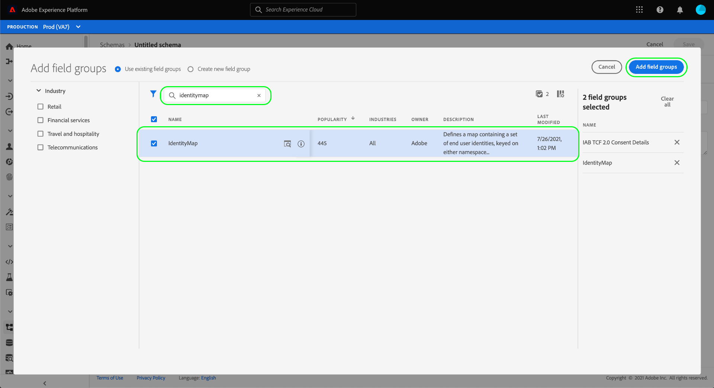
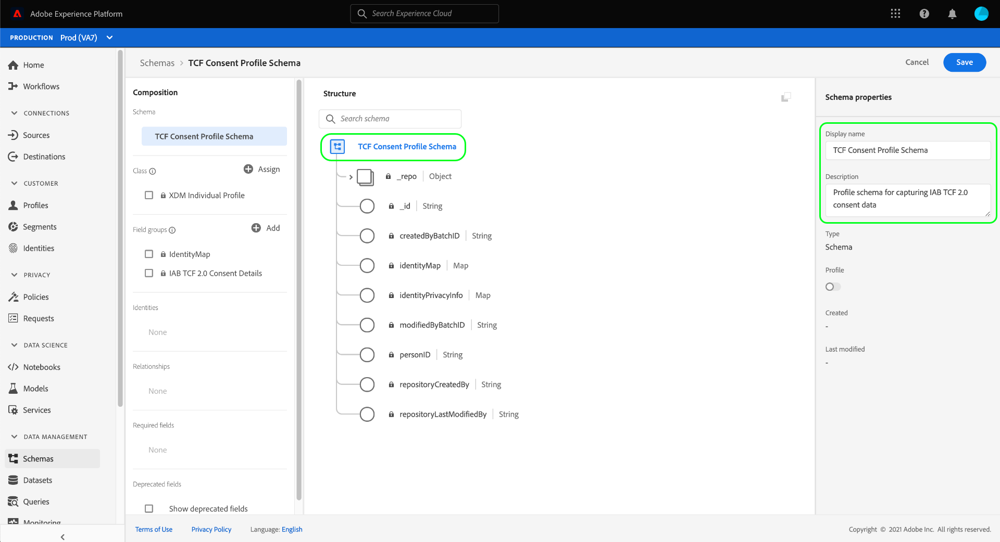

# 创建数据集以捕获IAB TCF 2.0同意数据

为了使Adobe Experience Platform能够根据IAB [!DNL Transparency & Consent Framework] (TCF) 2.0处理客户同意数据，必须将该数据发送到其架构包含TCF 2.0同意字段的数据集。

具体而言，捕获TCF 2.0同意数据需要两个数据集：

* 基于[!DNL XDM Individual Profile]类且已在[!DNL Real-Time Customer Profile]中启用的数据集。
* 基于[!DNL XDM ExperienceEvent]类的数据集。

>[!IMPORTANT]
>
>Experience Platform仅强制在单个配置文件数据集中收集的TCF字符串。 虽然在此工作流中创建数据流仍然需要ExperienceEvent数据集，但您只需将数据摄取到用户档案数据集中。 如果您希望跟踪一段时间内同意更改事件，仍可以使用ExperienceEvent数据集，但在对区段激活实施实施时，不会使用这些值。

本文档提供了设置这两个数据集的步骤。 有关为TCF 2.0配置Experience Platform数据操作的完整工作流的概述，请参阅[IAB TCF 2.0合规性概述](./overview.md)。

## 先决条件

本教程需要对以下Adobe Experience Platform组件有一定的了解：

* [体验数据模型(XDM)](../../../../xdm/home.md)： [!DNL Experience Platform]用于组织客户体验数据的标准化框架。
   * [架构组合的基础知识](../../../../xdm/schema/composition.md)：了解XDM架构的基本构建块。
* [Adobe Experience Platform Identity服务](../../../../identity-service/home.md)：允许您跨设备和系统从不同的数据源桥接客户身份。
   * [身份命名空间](../../../../identity-service/features/namespaces.md)：必须在身份服务识别的特定身份命名空间下提供客户身份数据。
* [实时客户资料](../../../../profile/home.md)：利用[!DNL Identity Service]从数据集实时创建详细的客户资料。 [!DNL Real-Time Customer Profile]从数据湖中提取数据，并将客户配置文件保留在其自己的单独数据存储中。

## TCF 2.0字段组 {#field-groups}

[!UICONTROL IAB TCF 2.0同意详细信息]架构字段组提供了TCF 2.0支持所需的客户同意字段。 此字段组有两个版本：一个与[!DNL XDM Individual Profile]类兼容，另一个与[!DNL XDM ExperienceEvent]类兼容。

以下部分解释了每个字段组的结构，包括它们在引入期间需要的数据。

### 用户档案字段组 {#profile-field-group}

对于基于[!DNL XDM Individual Profile]的架构，[!UICONTROL IAB TCF 2.0同意详细信息]字段组提供了一个映射类型字段`identityPrivacyInfo`，该字段将客户身份映射到其TCF同意首选项。 此字段组必须包含在为实时客户档案启用的基于记录的架构中，才能进行自动实施。

请参阅此字段组的[参考指南](../../../../xdm/field-groups/profile/iab.md)，了解有关其结构和用例的更多信息。

### 事件字段组 {#event-field-group}

如果要跟踪一段时间内同意更改的事件，可将[!UICONTROL IAB TCF 2.0同意详细信息]字段组添加到您的[!UICONTROL XDM ExperienceEvent]架构。

如果您不打算跟踪一段时间内的同意更改事件，则不需要在事件架构中包含此字段组。 在自动强制实施TCF同意值时，Experience Platform仅使用摄取到[配置文件字段组](#profile-field-group)的最新同意信息。 事件捕获的同意值不会参与自动实施工作流。

有关此字段组的结构和用例的更多信息，请参阅该字段组的[参考指南](../../../../xdm/field-groups/event/iab.md)。

## 创建客户同意架构 {#create-schemas}

要创建捕获同意数据的数据集，您必须首先创建XDM架构以作为这些数据集的基础。

如上一节中所述，需要使用[!UICONTROL XDM Individual Profile]类的架构才能在下游Experience Platform工作流中强制同意。 如果您希望跟踪一段时间内同意的更改，还可以选择基于[!UICONTROL XDM ExperienceEvent]创建单独的架构。 两个架构都必须包含`identityMap`字段和适当的TCF 2.0字段组。

在Experience Platform UI中，从左侧导航中选择&#x200B;**[!UICONTROL 架构]**&#x200B;以打开[!UICONTROL 架构]工作区。 从此处，按照以下部分中的步骤创建每个所需的架构。

>[!NOTE]
>
>如果您希望使用现有XDM架构来捕获同意数据，则可以编辑这些架构，而不是创建新架构。 但是，如果已允许在实时客户档案中使用现有架构，则其主要身份不能是禁止在基于兴趣的广告（如电子邮件地址）中使用的直接可识别字段。 如果您不确定哪些字段受限，请咨询您的法律顾问。
>
>此外，在编辑现有架构时，只能进行累加（非中断）更改。 有关详细信息，请参阅架构演变[原则](../../../../xdm/schema/composition.md#evolution)部分。

### 创建配置文件同意模式 {#profile-schema}

选择&#x200B;**[!UICONTROL 创建架构]**，然后从下拉菜单中选择&#x200B;**[!UICONTROL XDM个人配置文件]**。

出现&#x200B;**[!UICONTROL 添加字段组]**&#x200B;对话框，允许您立即开始将字段组添加到架构。 在此处，从列表中选择&#x200B;**[!UICONTROL IAB TCF 2.0同意详细信息]**。 您可以选择使用搜索栏来缩小结果范围，以便更轻松地查找字段组。

接下来，从列表中查找&#x200B;**[!UICONTROL IdentityMap]**&#x200B;字段组并将其选定。 一旦两个字段组都列在右边栏中，请选择&#x200B;**[!UICONTROL 添加字段组]**。

画布将重新出现，其中显示`identityPrivacyInfo`和`identityMap`字段已添加到架构结构。

在将更多字段添加到架构之前，请选择根字段以在右边栏中显示&#x200B;**[!UICONTROL 架构属性]**，您可以在其中提供架构的名称和描述。

提供名称和描述后，您可以通过选择画布左侧&#x200B;**[!UICONTROL 字段组]**&#x200B;部分下的&#x200B;**[!UICONTROL 添加]**，选择向架构添加更多字段。

如果您正在编辑已启用了在[!DNL Real-Time Customer Profile]中使用的现有架构，请选择&#x200B;**[!UICONTROL 保存]**&#x200B;以确认您的更改，然后跳过有关[根据您的同意架构创建数据集](#dataset)的部分。 如果要创建新架构，请继续执行以下子部分中概述的步骤。

#### 启用架构以在[!DNL Real-Time Customer Profile]中使用

为了使Experience Platform将其收到的同意数据与特定客户配置文件相关联，必须启用同意架构以便在[!DNL Real-Time Customer Profile]中使用。

>[!NOTE]
>
>此部分中所示的示例架构使用其`identityMap`字段作为其主要标识。 如果要将另一个字段设置为主标识，请确保您使用的是间接标识符（如Cookie ID），而不是禁止在基于兴趣的广告中使用的直接可识别字段（如电子邮件地址）。 如果您不确定哪些字段受限，请咨询您的法律顾问。
>
>有关如何为架构设置主标识字段的步骤，请参阅[[!UICONTROL 架构] UI指南](../../../../xdm/ui/fields/identity.md)。

要为[!DNL Profile]启用架构，请在左边栏中选择架构名称以打开&#x200B;**[!UICONTROL 架构属性]**&#x200B;部分。 从此处选择&#x200B;**[!UICONTROL 配置文件]**&#x200B;切换按钮。

此时会出现一个弹出窗口，指示缺少主要身份。 选中用于使用备用主标识的复选框，因为主标识将包含在`identityMap`字段中。

最后，选择&#x200B;**[!UICONTROL 保存]**&#x200B;以确认更改。

### 创建事件同意模式 {#event-schema}

>[!NOTE]
>
>事件同意架构仅用于跟踪一段时间内同意更改的事件，不会参与下游实施工作流。 如果您不想跟踪一段时间内同意的更改，则可以跳至[创建同意数据集](#datasets)的下一部分。

在&#x200B;**[!UICONTROL 架构]**&#x200B;工作区中，选择&#x200B;**[!UICONTROL 创建架构]**，然后从下拉列表中选择&#x200B;**[!UICONTROL XDM ExperienceEvent]**。

出现&#x200B;**[!UICONTROL 添加字段组]**&#x200B;对话框。 在此处，从列表中选择&#x200B;**[!UICONTROL IAB TCF 2.0同意详细信息]**。 您可以选择使用搜索栏来缩小结果范围，以便更轻松地查找字段组。

接下来，从列表中查找&#x200B;**[!UICONTROL IdentityMap]**&#x200B;字段组并将其选定。 一旦两个字段组都列在右边栏中，请选择&#x200B;**[!UICONTROL 添加字段组]**。

画布将重新出现，其中显示`consentStrings`和`identityMap`字段已添加到架构结构。

在将更多字段添加到架构之前，请选择根字段以在右边栏中显示&#x200B;**[!UICONTROL 架构属性]**，您可以在其中提供架构的名称和描述。

提供名称和描述后，您可以通过选择画布左侧&#x200B;**[!UICONTROL 字段组]**&#x200B;部分下的&#x200B;**[!UICONTROL 添加]**，选择向架构添加更多字段。

添加所需的字段组后，选择&#x200B;**[!UICONTROL 保存]**&#x200B;以完成操作。

## 根据您的同意模式创建数据集 {#datasets}

对于上述每个必需的架构，您必须创建一个数据集，以便最终摄取客户的同意数据。 必须为[!DNL Real-Time Customer Profile]启用基于记录架构的数据集，而基于时间序列架构&#x200B;**的数据集不应**&#x200B;启用[!DNL Profile]。

若要开始，请在左侧导航中选择&#x200B;**[!UICONTROL 数据集]**，然后在右上角选择&#x200B;**[!UICONTROL 创建数据集]**。

在下一页上，选择&#x200B;**[!UICONTROL 从架构]**&#x200B;创建数据集。

出现&#x200B;**[!UICONTROL 从架构]**&#x200B;创建数据集工作流，从&#x200B;**[!UICONTROL 选择架构]**&#x200B;步骤开始。 在提供的列表中，找到您之前创建的同意架构之一。 您可以选择使用搜索栏缩小结果范围并更轻松地找到架构。 选择所需架构旁边的单选按钮，然后选择&#x200B;**[!UICONTROL 下一步]**&#x200B;以继续。

将显示&#x200B;**[!UICONTROL 配置数据集]**&#x200B;步骤。 在选择&#x200B;**[!UICONTROL 完成]**&#x200B;之前，为数据集提供唯一、易于识别的名称和描述。

此时将显示新创建的数据集的详细信息页面。 如果数据集基于您的时间序列架构，则流程已完成。 如果数据集基于您的记录架构，则该过程的最后一步是启用该数据集以在[!DNL Real-Time Customer Profile]中使用。

在右边栏中，选择&#x200B;**[!UICONTROL 配置文件]**&#x200B;切换开关，然后在确认弹出框中选择&#x200B;**[!UICONTROL 启用]**&#x200B;以启用[!DNL Profile]的架构。

如果您已创建架构，请再次按照上述步骤创建基于事件的数据集。

## 后续步骤

通过遵循本教程，您已创建至少一个现在可用于收集客户同意数据的数据集：

* 允许在实时客户档案中使用的基于记录的数据集。 **（必需）**
* 未为[!DNL Profile]启用的基于时间序列的数据集。 （可选）

您现在可以返回[IAB TCF 2.0概述](./overview.md#merge-policies)以继续配置Experience Platform以符合TCF 2.0。
