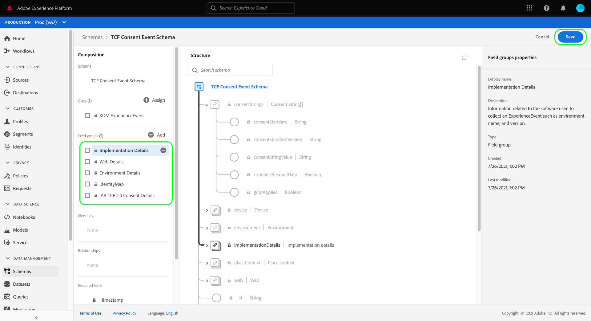

# 创建数据集以捕获IAB TCF 2.0同意数据

为了使Adobe Experience Platform能够根据IAB处理客户同意数据 [!DNL Transparency & Consent Framework] (TCF) 2.0，该数据必须发送到其架构包含TCF 2.0同意字段的数据集。

具体而言，捕获TCF 2.0同意数据需要两个数据集：

* 基于以下项的数据集： [!DNL XDM Individual Profile] 类，启用以用于中 [!DNL Real-Time Customer Profile].
* 基于以下项的数据集： [!DNL XDM ExperienceEvent] 类。

>[!IMPORTANT]
>
>Platform仅强制实施在单个配置文件数据集中收集的TCF字符串。 虽然在此工作流中创建数据流仍然需要ExperienceEvent数据集，但您只需将数据摄取到用户档案数据集中。 如果您希望跟踪一段时间内同意更改事件，仍可以使用ExperienceEvent数据集，但在对区段激活实施实施时，不会使用这些值。

本文档提供了设置这两个数据集的步骤。 有关为TCF 2.0配置Platform数据操作的完整工作流的概述，请参阅 [IAB TCF 2.0合规性概述](./overview.md).

## 先决条件

本教程需要对以下Adobe Experience Platform组件有一定的了解：

* [体验数据模型(XDM)](../../../../xdm/home.md)：用于实现此目标的标准化框架 [!DNL Experience Platform] 组织客户体验数据。
   * [模式组合基础](../../../../xdm/schema/composition.md)：了解XDM架构的基本构建块。
* [Adobe Experience Platform Identity服务](../../../../identity-service/home.md)：用于跨设备和系统从不同的数据源桥接客户身份。
   * [身份命名空间](../../../../identity-service/features/namespaces.md)：客户身份数据必须在由Identity Service识别的特定身份命名空间下提供。
* [Real-time Customer Profile](../../../../profile/home.md)：利用 [!DNL Identity Service] 允许您实时从数据集创建详细的客户配置文件。 [!DNL Real-Time Customer Profile] 从数据湖中提取数据，并将客户配置文件保留在其自己的单独数据存储中。

## TCF 2.0字段组 {#field-groups}

此 [!UICONTROL IAB TCF 2.0同意详细信息] 架构字段组提供了TCF 2.0支持所需的客户同意字段。 此字段组有两种版本：一种与 [!DNL XDM Individual Profile] 类，而另一个具有 [!DNL XDM ExperienceEvent] 类。

以下部分解释了每个字段组的结构，包括它们在引入期间需要的数据。

### 用户档案字段组 {#profile-field-group}

对于基于 [!DNL XDM Individual Profile]， [!UICONTROL IAB TCF 2.0同意详细信息] 字段组提供单个映射类型字段， `identityPrivacyInfo`，可将客户身份映射到其TCF同意偏好设置。 此字段组必须包含在为实时客户档案启用的基于记录的架构中，才能进行自动实施。

请参阅 [参考指南](../../../../xdm/field-groups/profile/iab.md) 以详细了解此字段组的结构和用例。

### 事件字段组 {#event-field-group}

如果要跟踪一段时间内同意更改的事件，可以添加 [!UICONTROL IAB TCF 2.0同意详细信息] 字段组 [!UICONTROL XDM ExperienceEvent] 架构。

如果您不打算跟踪一段时间内的同意更改事件，则不需要在事件架构中包含此字段组。 在自动实施TCF同意值时，Experience Platform仅使用摄取到 [配置文件字段组](#profile-field-group). 事件捕获的同意值不会参与自动实施工作流。

请参阅 [参考指南](../../../../xdm/field-groups/event/iab.md) 以获取有关其结构和用例的更多信息。

## 创建客户同意架构 {#create-schemas}

要创建捕获同意数据的数据集，您必须首先创建XDM架构以作为这些数据集的基础。

如上一节中所述，使用 [!UICONTROL XDM个人资料] 类是在下游平台工作流中强制同意所必需的。 您还可以选择根据以下内容创建单独的架构： [!UICONTROL XDM ExperienceEvent] 如果您希望跟踪同意随时间发生的更改。 两个架构都必须包含 `identityMap` 字段和相应的TCF 2.0字段组。

在Platform UI中，选择 **[!UICONTROL 架构]** 在左侧导航中打开 [!UICONTROL 架构] 工作区。 从此处，按照以下部分中的步骤创建每个所需的架构。

>[!NOTE]
>
>如果您希望使用现有XDM架构来捕获同意数据，则可以编辑这些架构，而不是创建新架构。 但是，如果已允许在实时客户档案中使用现有架构，则其主要身份不能是禁止在基于兴趣的广告（如电子邮件地址）中使用的直接可识别字段。 如果您不确定哪些字段受限，请咨询您的法律顾问。
>
>此外，在编辑现有架构时，只能进行累加（非中断）更改。 请参阅 [模式演化原理](../../../../xdm/schema/composition.md#evolution) 以了解更多信息。

### 创建配置文件同意模式 {#profile-schema}

选择 **[!UICONTROL 创建架构]**，然后选择 **[!UICONTROL XDM个人资料]** 下拉菜单中。

此 **[!UICONTROL 添加字段组]** 此时会出现对话框，允许您立即开始将字段组添加到架构。 从此处选择 **[!UICONTROL IAB TCF 2.0同意详细信息]** 从名单上。 您可以选择使用搜索栏来缩小结果范围，以便更轻松地查找字段组。

接下来，查找 **[!UICONTROL Identitymap]** 字段组并选择它。 一旦两个字段组都列在右边栏中，请选择 **[!UICONTROL 添加字段组]**.

画布将重新出现，并显示 `identityPrivacyInfo` 和 `identityMap` 字段已添加到架构结构。

向架构中添加更多字段之前，请选择要显示的根字段 **[!UICONTROL 架构属性]** 在右边栏中，您可以提供架构的名称和描述。

提供名称和描述后，您可以选择向架构添加更多字段，方法是选择 **[!UICONTROL 添加]** 在 **[!UICONTROL 字段组]** 区域的所有导航图标。

如果您正在编辑已启用以供在中使用的现有架构 [!DNL Real-Time Customer Profile]，选择 **[!UICONTROL 保存]** 以在跳转到上的部分之前确认您的更改 [根据您的同意模式创建数据集](#dataset). 如果要创建新架构，请继续执行以下子部分中概述的步骤。

#### 启用架构以便用于 [!DNL Real-Time Customer Profile]

为了使Platform将其收到的同意数据与特定客户配置文件相关联，必须启用同意模式才能在 [!DNL Real-Time Customer Profile].

>[!NOTE]
>
>本节中显示的示例架构使用其 `identityMap` 字段作为其主要标识。 如果要将另一个字段设置为主标识，请确保您使用的是间接标识符（如Cookie ID），而不是禁止在基于兴趣的广告中使用的直接可识别字段（如电子邮件地址）。 如果您不确定哪些字段受限，请咨询您的法律顾问。
>
>有关如何为架构设置主标识字段的步骤，请参阅 [[!UICONTROL 架构] UI指南](../../../../xdm/ui/fields/identity.md).

要为以下项启用架构 [!DNL Profile]，在左边栏中选择架构的名称以打开 **[!UICONTROL 架构属性]** 部分。 从此处选择 **[!UICONTROL 个人资料]** 切换按钮。

此时会出现一个弹出窗口，指示缺少主要身份。 选中用于使用备用主标识的复选框，因为主标识将包含在 `identityMap` 字段。

最后，选择 **[!UICONTROL 保存]** 以确认更改。

### 创建事件同意模式 {#event-schema}

>[!NOTE]
>
>事件同意架构仅用于跟踪一段时间内同意更改的事件，不会参与下游实施工作流。 如果您不希望跟踪同意随时间发生的更改，则可以跳至上的下一部分 [创建同意数据集](#datasets).

在 **[!UICONTROL 架构]** 工作区，选择 **[!UICONTROL 创建架构]**，然后选择 **[!UICONTROL XDM ExperienceEvent]** 从下拉菜单中查找。

此 **[!UICONTROL 添加字段组]** 出现对话框。 从此处选择 **[!UICONTROL IAB TCF 2.0同意详细信息]** 从名单上。 您可以选择使用搜索栏来缩小结果范围，以便更轻松地查找字段组。

接下来，查找 **[!UICONTROL Identitymap]** 字段组并选择它。 一旦两个字段组都列在右边栏中，请选择 **[!UICONTROL 添加字段组]**.

画布将重新出现，并显示 `consentStrings` 和 `identityMap` 字段已添加到架构结构。

向架构中添加更多字段之前，请选择要显示的根字段 **[!UICONTROL 架构属性]** 在右边栏中，您可以提供架构的名称和描述。

提供名称和描述后，您可以选择向架构添加更多字段，方法是选择 **[!UICONTROL 添加]** 在 **[!UICONTROL 字段组]** 区域的所有导航图标。

添加所需的字段组后，选择 **[!UICONTROL 保存]**.

## 根据您的同意模式创建数据集 {#datasets}

对于上述每个必需的架构，您必须创建一个数据集，以便最终摄取客户的同意数据。 必须为启用基于记录架构的数据集 [!DNL Real-Time Customer Profile]，而数据集基于时间序列架构 **不应该** 是 [!DNL Profile]-enabled。

要开始，请选择 **[!UICONTROL 数据集]** 在左侧导航中，然后选择 **[!UICONTROL 创建数据集]** 在右上角。

在下一页，选择 **[!UICONTROL 从架构创建数据集]**.

此 **[!UICONTROL 从架构创建数据集]** 此时将显示工作流，从 **[!UICONTROL 选择架构]** 步骤。 在提供的列表中，找到您之前创建的同意架构之一。 您可以选择使用搜索栏缩小结果范围并更轻松地找到架构。 选择所需模式旁边的单选按钮，然后选择 **[!UICONTROL 下一个]** 以继续。

此 **[!UICONTROL 配置数据集]** 此时将显示步骤。 在选择之前为数据集提供唯一、易于识别的名称和描述 **[!UICONTROL 完成]**.

此时将显示新创建的数据集的详细信息页面。 如果数据集基于您的时间序列架构，则流程已完成。 如果数据集基于您的记录架构，则该过程的最后一步是启用数据集以用于中 [!DNL Real-Time Customer Profile].

在右边栏中，选择 **[!UICONTROL 个人资料]** 切换，然后选择 **[!UICONTROL 启用]** 在确认弹出框中启用架构 [!DNL Profile].

如果您已创建架构，请再次按照上述步骤创建基于事件的数据集。

## 后续步骤

通过遵循本教程，您已创建至少一个现在可用于收集客户同意数据的数据集：

* 允许在实时客户档案中使用的基于记录的数据集。 **（必需）**
* 未启用的基于时间序列的数据集 [!DNL Profile]. （可选）

您现在可以返回到 [IAB TCF 2.0概述](./overview.md#merge-policies) 继续配置Platform以符合TCF 2.0。
