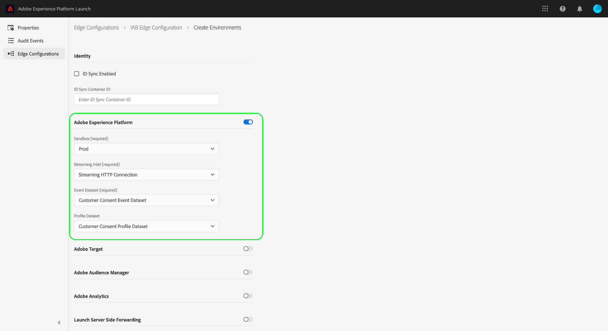

# Experience Platform中的IAB TCF 2.0支持

[!DNL Transparency & Consent Framework] (TCF)，如[!DNL Interactive Advertising Bureau] (IAB)中所述，是一个开放标准的技术框架，旨在使组织能够按照欧盟的[!DNL General Data Protection Regulation] (GDPR)，获取、记录和更新消费者同意处理其个人数据。 该框架的第二个版本TCF 2.0为消费者如何提供或拒绝同意提供了更大的灵活性，包括供应商是否以及如何使用某些数据处理功能，如精确的地理位置。

>[!NOTE]
>
>有关TCF 2.0的更多信息，请访问[IAB Europe网站](https://iabeurope.eu/)，包括支持材料和技术规范。

Adobe Experience Platform是已注册的[IAB TCF 2.0供应商列表](https://iabeurope.eu/vendor-list-tcf/)的一部分，ID为&#x200B;**565**。 为符合TCF 2.0要求，Experience Platform允许您收集客户同意数据并将其集成到存储的客户配置文件中。 然后，可以根据用户档案的用例将此同意数据纳入导出受众区段中是否包含用户档案。

>[!IMPORTANT]
>
>Experience Platform只能遵守TCF版本2.0（或更高版本）。 不支持TCF的早期版本。

本文档概述了如何配置数据操作和配置文件架构，以接受同意管理平台(CMP)生成的客户同意数据。 此外，还介绍了Experience Platform在导出区段时如何传达用户同意选择。

## 先决条件

要遵循本指南，您必须使用集成并与IAB TCF兼容的CMP，商业版或您自己的CMP。 有关详细信息，请参阅兼容CMP的[列表](https://iabeurope.eu/cmp-list/)。

>[!IMPORTANT]
>
>如果CMP的ID无效，Experience Platform将按原样继续处理您的数据。 要实施TCF 2.0，在向Experience Platform发送数据之前，必须确认CMP具有已在IAB TCF 2.0中注册的有效ID。

此外，您还需要实际了解以下Experience Platform服务：

* [体验数据模型(XDM)](/help/xdm/home.md)： Experience Platform用于组织客户体验数据的标准化框架。
* [Adobe Experience Platform Identity Service](/help/identity-service/home.md)：通过跨设备和系统桥接身份，解决了客户体验数据碎片化带来的基本挑战。
* [实时客户个人资料](/help/profile/home.md)：使用[!DNL Identity Service]从您的数据集实时创建详细的客户个人资料。 [!DNL Real-Time Customer Profile]从数据湖中提取数据，并将客户配置文件保留在其自己的单独数据存储中。
* [Adobe Experience Platform Web SDK](/help/collection/js/js-overview.md)：客户端JavaScript库，它允许您将各种Experience Platform服务集成到面向客户的网站上。
   * [SDK同意命令](/help/collection/js/commands/setconsent.md)：本指南中显示的与同意相关的SDK命令的用例概述。
* [Adobe Experience Platform分段服务](/help/segmentation/home.md)：允许您将[!DNL Real-Time Customer Profile]数据划分为共享相似特征并对营销策略做出类似响应的个人组。

除了上面列出的Experience Platform服务之外，您还应熟悉[目标](/help/data-governance/home.md)及其在Experience Platform生态系统中的角色。

## 客户同意流程摘要 {#summary}

以下各节介绍在系统正确配置后如何收集和执行同意数据。

### 同意数据收集

Experience Platform允许您通过下列流程收集客户同意数据：

1. 客户通过网站上的对话框提供其关于数据收集的同意首选项。
1. 您的CMP会检测同意首选项更改，并相应地生成TCF同意数据。
1. 使用Experience Platform Web SDK，生成的同意数据（由CMP返回）发送到Adobe Experience Platform。
1. 收集的同意数据将摄取到启用了[!DNL Profile]的数据集，其架构包含TCF同意字段。

除了CMP同意更改挂接触发的SDK命令之外，同意数据还可以通过任何客户生成的XDM数据流入Experience Platform，这些数据直接上传到启用了[!DNL Profile]的数据集。

如果通过[!DNL Audience Manager]将相应字段应用于由Adobe Audience Manager与Experience Platform共享的任何区段（通过[!DNL Experience Cloud Identity Service]源连接器或其他方式），则这些区段也可能会包含同意数据。 有关在[!DNL Audience Manager]中收集同意数据的更多信息，请参阅适用于IAB TCF的[Adobe Audience Manager插件上的文档](https://experienceleague.adobe.com/docs/audience-manager/user-guide/overview/data-privacy/consent-management/aam-iab-plugin.html?lang=zh-Hans)。

### 下游同意执行

成功摄取TCF同意数据后，下游Experience Platform服务中将执行以下流程：

1. [!DNL Real-Time Customer Profile]更新该客户个人资料的已存储同意数据。
1. 仅当为集群中的每个ID提供了Experience Platform (565)的供应商权限时，Experience Platform才会处理客户ID。
1. 将区段导出到属于TCF 2.0供应商列表成员的目标时，仅当为群集中的每个ID提供了Experience Platform (565) *和*&#x200B;的供应商权限时，Experience Platform才包括配置文件。

本文档中的其余部分提供了有关如何配置Experience Platform和数据操作以满足上述收集和实施要求的指导。

## 确定如何在CMP中生成客户同意数据 {#consent-data}

由于每个CMP系统都是唯一的，因此您必须确定允许客户在与您的服务交互时提供同意的最佳方式。 Cookie同意对话框是获得客户同意的常见方式。 下面显示了CMP对话框示例。


此对话框必须允许客户选择加入或退出以下内容：

| 同意选项 | 描述 |
| --- | --- |
| **目的** | 用途定义品牌可以将客户数据用于哪些广告技术目的。 为了使Experience Platform能够处理客户ID，必须选择实现以下目的： <ul><li>**目的1**：在设备上存储和/或访问信息</li><li>**目的10**：开发和改进产品</li></ul> |
| **供应商权限** | 除了广告技术目的之外，该对话框还必须允许客户选择加入或退出让其数据由特定供应商使用，包括Adobe Experience Platform (565)。 |

### 同意字符串 {#consent-strings}

无论您使用何种方法收集数据，目的都是根据客户选择的同意选项生成一个字符串值，称为同意字符串。

在TCF规范中，同意字符串用于根据策略和供应商定义的特定营销目的，编码有关客户同意设置的相关详细信息。 Experience Platform使用这些字符串来存储每个客户的同意设置，因此，每次这些设置发生更改时，都必须生成一个新的同意字符串。

同意字符串只能由在IAB TCF中注册的CMP创建。 有关如何使用特定CMP生成同意字符串的更多信息，请参阅IAB TCF GitHub存储库中的[同意字符串格式指南](https://github.com/InteractiveAdvertisingBureau/GDPR-Transparency-and-Consent-Framework/blob/master/TCFv2/IAB%20Tech%20Lab%20-%20Consent%20string%20and%20vendor%20list%20formats%20v2.md)。

## 使用TCF同意字段创建数据集 {#datasets}

客户同意数据必须发送到其架构包含TCF同意字段的数据集。 在继续本指南之前，请参阅有关[创建数据集以获取TCF 2.0同意](./dataset.md)的教程，以了解如何创建所需的配置文件数据集（和可选的Experience Event数据集）。

## 更新[!DNL Profile]合并策略以包含同意数据 {#merge-policies}

创建启用[!DNL Profile]的数据集以收集同意数据后，必须确保将合并策略配置为始终在客户配置文件中包含TCF同意字段。 这涉及设置数据集优先级，以使您的同意数据集优先于其他潜在冲突的数据集。

有关如何使用合并策略的更多信息，请参阅[合并策略概述](/help/profile/merge-policies/overview.md)。 在设置合并策略时，必须确保区段包含由[XDM隐私架构字段组](./dataset.md#privacy-field-group)提供的所有必需同意属性，如数据集准备指南中所述。

## 集成Experience Platform Web SDK以收集客户同意数据 {#sdk}

>[!NOTE]
>
>需要使用Experience Platform Web SDK才能直接在Adobe Experience Platform中处理同意数据。 不支持[!DNL Experience Cloud Identity Service]。
>
>在Adobe Audience Manager中仍支持[!DNL Experience Cloud Identity Service]进行同意处理，但只需将库更新到[版本5.0](https://github.com/Adobe-Marketing-Cloud/id-service/releases)才能符合TCF 2.0的要求。

配置CMP以生成同意字符串后，必须集成Experience Platform Web SDK以收集这些字符串并将它们发送到Experience Platform。 Experience Platform SDK提供了两个可用于将TCF同意数据发送到Experience Platform的命令（以下子部分中有说明）。 当客户首次提供同意信息时，以及同意信息在以后任何时候发生更改时，都应使用这些命令。

**SDK未与任何开箱即用的CMP接口**。 您可以自行决定如何将SDK集成到您的网站中，监听CMP中的同意更改，并调用相应的命令。

### 创建数据流

为了让SDK将数据发送到Experience Platform，您必须首先为Experience Platform创建数据流。 [SDK文档](/help/datastreams/overview.md)中提供了有关如何创建数据流的特定步骤。

为数据流提供唯一名称后，选择&#x200B;**[!UICONTROL Adobe Experience Platform]**&#x200B;旁边的切换按钮。 接下来，使用以下值完成表单的其余部分：

| 数据流字段 | 值 |
| --- | --- |
| [!UICONTROL Sandbox] | 包含设置数据流所需的流连接和数据集的Experience Platform [沙盒](/help/sandboxes/home.md)的名称。 |
| [!UICONTROL Streaming Inlet] | Experience Platform的有效流连接。 如果您没有现有的流入口，请参阅有关[创建流连接](/help/ingestion/tutorials/create-streaming-connection-ui.md)的教程。 |
| [!UICONTROL Event Dataset] | 选择在[!DNL XDM ExperienceEvent]上一步[中创建的](#datasets)数据集。 如果您在此数据集的架构中包含[[!UICONTROL IAB TCF 2.0 Consent]字段组](/help/xdm/field-groups/event/iab.md)，则可以使用[`sendEvent`](#sendEvent)命令跟踪一段时间的同意更改事件，并将该数据存储在此数据集中。 请记住，此数据集中存储的同意值&#x200B;**不在自动实施工作流中使用**。 |
| [!UICONTROL Profile Dataset] | 选择在[!DNL XDM Individual Profile]上一步[中创建的](#datasets)数据集。 使用[`setConsent`](#setConsent)命令响应CMP同意更改挂接时，收集的数据将存储在此数据集中。 由于此数据集启用了配置文件，在自动实施工作流期间，将遵循此数据集中存储的同意值。 |



完成后，选择屏幕底部的&#x200B;**[!UICONTROL Save]**，然后按照任何其他提示继续完成配置。

### 发出consent-change命令

创建上一部分所述的数据流后，您可以开始使用SDK命令将同意数据发送到Experience Platform。 以下部分提供了如何在各种场景中使用每个SDK命令的示例。

#### 使用CMP同意更改挂接 {#setConsent}

许多CMP提供开箱即用的挂接，用于侦听同意更改事件。 发生这些事件时，您可以使用[`setConsent`](/help/collection/js/commands/setconsent.md)命令更新该客户的同意数据。

`setConsent`命令需要两个参数：

1. 一个字符串，它指示命令类型（在本例中为“setConsent”）。
1. 包含`consent`数组的负载。 数组必须至少包含一个提供必需同意字段的对象。

`setConsent`命令显示如下：

```js
alloy("setConsent", {
  consent: [{
    standard: "IAB TCF",
    version: "2.0",
    value: "CLcVDxRMWfGmWAVAHCENAXCkAKDAADnAABRgA5mdfCKZuYJez-NQm0TBMYA4oCAAGQYIAAAAAAEAIAEgAA.argAC0gAAAAAAAAAAAA",
    gdprApplies: "true"
  }]
});
```

| 有效负载属性 | 描述 |
| --- | --- |
| `standard` | 使用的同意标准。 对于TCF 2.0同意处理，此值必须设置为`IAB`。 |
| `version` | 在`standard`下指示的同意标准的版本号。 对于TCF 2.0同意处理，此值必须设置为`2.0`。 |
| `value` | CMP生成的base-64编码的同意字符串。 |
| `gdprApplies` | 一个布尔值，指示GDPR是否适用于当前登录的客户。 若要为此客户强制执行TCF 2.0，该值必须设置为`true`。 如果未定义，则默认为`true`。 |

`setConsent`命令应该用作检测同意设置更改的CMP挂接的一部分。 以下JavaScript提供了如何将`setConsent`命令用于OneTrust的`OnConsentChanged`挂接的示例：

```js
OneTrust.OnConsentChanged(function () {
  // Retrieve the TCF 2.0 consent data generated by the CMP, and pass it to Alloy. 
  __tcfapi("getTCData", 2, function (data, success) {
    if (success) {
      var tcString = data.tcString;
      var gdpr = data.gdprApplies;

      alloy("setConsent", {
        consent: [{
          standard: "IAB TCF",
          version: "2.0",
          value: tcString,
          gdprApplies: gdpr
        }]
      });
    }
  });
});
```

#### 使用事件 {#sendEvent}

您还可以使用`sendEvent`命令收集在Experience Platform中触发的每个事件的TCF 2.0同意数据。

>[!NOTE]
>
>要使用此方法，您必须已将“体验事件隐私”字段组添加到已启用[!DNL Profile]的[!DNL XDM ExperienceEvent]架构中。 有关如何配置此架构的步骤，请参阅数据集准备指南中有关[更新ExperienceEvent架构](./dataset.md#event-schema)的部分。

`sendEvent`命令应用作网站上的相应事件侦听器中的回调。 该命令需要两个参数：(1)一个用于指示命令类型的字符串（在本例中为`sendEvent`），以及(2)一个包含`xdm`对象的负载，该对象提供必需的同意字段作为JSON：

```js
alloy("sendEvent", {
  xdm: {
    "consentStrings": [{
      "consentStandard": "IAB TCF",
      "consentStandardVersion": "2.0",
      "consentStringValue": "CLcVDxRMWfGmWAVAHCENAXCkAKDAADnAABRgA5mdfCKZuYJez-NQm0TBMYA4oCAAGQYIAAAAAAEAIAEgAA.argAC0gAAAAAAAAAAAA",
      "gdprApplies": true
    }]
  }
});
```

| 有效负载属性 | 描述 |
| --- | --- |
| `xdm.consentStrings` | 一个数组，必须至少包含一个提供必需同意字段的对象。 |
| `consentStandard` | 使用的同意标准。 对于TCF 2.0同意处理，此值必须设置为`IAB`。 |
| `consentStandardVersion` | 在`standard`下指示的同意标准的版本号。 对于TCF 2.0同意处理，此值必须设置为`2.0`。 |
| `consentStringValue` | CMP生成的base-64编码的同意字符串。 |
| `gdprApplies` | 一个布尔值，指示GDPR是否适用于当前登录的客户。 若要为此客户强制执行TCF 2.0，该值必须设置为`true`。 如果未定义，则默认为`true`。 |

### 处理SDK响应

许多Web SDK命令会返回指示调用是成功还是失败的promise。 然后，您可以将这些响应用于其他逻辑，例如向客户显示确认消息。 有关详细信息，请参阅[命令响应](/help/collection/js/commands/command-responses.md)。

## 导出区段 {#export}

>[!NOTE]
>
>在开始导出区段之前，必须确保区段包括所有必需的同意字段。 有关详细信息，请参阅[配置合并策略](#merge-policies)一节。

一旦您收集了客户同意数据并创建了包含所需同意属性的受众区段，则以后在将这些区段导出到下游目标时，可以强制实施TCF 2.0合规性。

如果一组客户配置文件的同意设置`gdprApplies`设置为`true`，则系统会根据每个配置文件的TCF同意首选项过滤这些配置文件中导出到下游目标的任何数据。 在导出过程中，将跳过任何不符合所需同意首选项的配置文件。

客户必须同意以下目的（如[TCF 2.0策略](https://iabeurope.eu/iab-europe-transparency-consent-framework-policies/#Appendix_A_Purposes_and_Features_Definitions)所述），才能将其配置文件包含在导出到目标的区段中：

* **目的1**：在设备上存储和/或访问信息
* **目的10**：开发和改进产品

TCF 2.0还要求在将数据发送到目标之前，数据源必须检查目标的供应商权限。 因此，在包含绑定到该目标的数据之前，Experience Platform会检查是否针对群集中的所有ID选择加入目标的供应商权限。

>[!NOTE]
>
>与Adobe Audience Manager共享的任何区段都包含与其Experience Platform对应区段相同的TCF 2.0同意值。 由于[!DNL Audience Manager]与Experience Platform (565)共享相同的供应商ID，因此需要相同的目的和供应商权限。 有关详细信息，请参阅适用于IAB TCF的[Adobe Audience Manager插件](https://experienceleague.adobe.com/docs/audience-manager/user-guide/overview/data-privacy/consent-management/aam-iab-plugin.html?lang=zh-Hans)上的文档。

## 测试实施 {#test-implementation}

配置TCF 2.0实施并将区段导出到目标后，任何不符合同意要求的数据都不会导出。 要查看在导出期间是否过滤了正确的客户配置文件，您必须手动检查目标上的数据存储，以查看是否正确强制同意客户。

>[!IMPORTANT]
>
>如果群集由多个ID组成，并且应用TCF 2.0，那么即使单个ID不包含正确的用途和供应商权限，也会排除整个群集。

## 后续步骤

本文档介绍了配置Experience Platform数据操作以履行TCF 2.0概述的业务义务的过程。有关Experience Platform隐私相关功能的更多信息，请参阅[治理、隐私和安全性](../../overview.md)概述。
