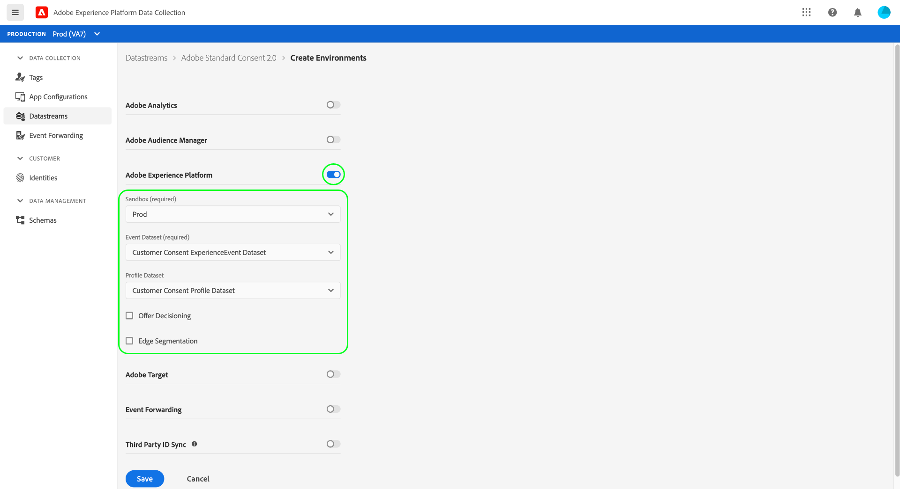
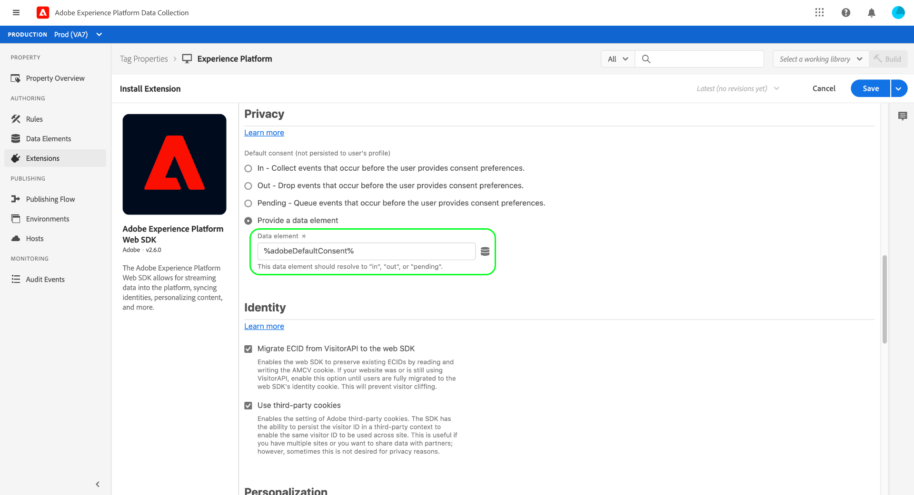

# 集成Experience Platform Web SDK以处理客户同意数据

Adobe Experience Platform Web SDK允许您检索同意管理平台(CMP)生成的客户同意信号，并在发生同意更改事件时将其发送到Adobe Experience Platform。

**SDK未与任何开箱即用的CMP接口**。 您可以自行决定如何将SDK集成到您的网站中，监听CMP中的同意更改，并调用相应的命令。 本文档提供了有关如何将CMP与Experience Platform Web SDK集成的一般指导。

## 先决条件 {#prerequisites}

本教程假定您已经确定了如何在CMP中生成同意数据，并创建了一个数据集，其中包含符合Adobe标准或IAB透明度和同意框架(TCF) 2.0标准的同意字段。 如果尚未创建此数据集，请在返回本指南之前参阅以下教程：

* [使用Adobe标准创建数据集](./adobe/dataset.md)
* [使用TCF 2.0标准创建数据集](./iab/dataset.md)

本指南遵循使用UI中的标记扩展设置SDK的工作流。 如果您不想使用扩展，并且希望直接在您的网站上嵌入SDK的独立版本，请参阅以下文档而不是本指南：

* [配置数据流](/help/datastreams/overview.md)
* [安装SDK](/help/collection/js/install/overview.md)
* [为同意命令配置SDK](/help/collection/js/commands/configure/defaultconsent.md)

本指南中的安装步骤需要您实际了解标记扩展及其在Web应用程序中的安装方式。 有关更多信息，请参阅以下文档：

* [标记概述](/help/tags/home.md)
* [快速入门指南](/help/tags/quick-start/quick-start.md)
* [发布概述](/help/tags/ui/publishing/overview.md)

## 设置数据流

为了让SDK将数据发送到Experience Platform，您必须首先配置数据流。 在数据收集UI或Experience Platform UI中，从左侧导航中选择&#x200B;**[!UICONTROL Datastreams]**。

创建新数据流或选择要编辑的现有数据流后，选择&#x200B;**[!UICONTROL Adobe Experience Platform]**&#x200B;旁边的切换按钮。 接下来，使用下面列出的值完成表单。



| 数据流字段 | 值 |
| --- | --- |
| [!UICONTROL Sandbox] | 包含设置数据流所需的流连接和数据集的Experience Platform [沙盒](/help/sandboxes/home.md)的名称。 |
| [!UICONTROL Event Dataset] | 您计划使用SDK将事件数据发送到的[!DNL XDM ExperienceEvent]数据集。 虽然您需要提供事件数据集才能创建Experience Platform数据流，但请注意，下游实施工作流程不会处理通过事件发送的同意数据。 |
| [!UICONTROL Profile Dataset] | 已启用[!DNL Profile]且包含您之前创建[earter](#prerequisites)的客户同意字段的数据集。 |

完成后，选择屏幕底部的&#x200B;**[!UICONTROL Save]**，然后按照任何其他提示继续完成配置。

## 安装和配置Experience Platform Web SDK

创建数据流（如上一节所述）后，必须配置Experience Platform Web SDK扩展，您最终将在网站上部署该扩展。 如果您的标记属性上未安装SDK扩展，请在左侧导航中选择&#x200B;**[!UICONTROL Extensions]**，然后选择&#x200B;**[!UICONTROL Catalog]**&#x200B;选项卡。 然后，在可用扩展列表中，选择Experience Platform SDK扩展下的&#x200B;**[!UICONTROL Install]**。


配置SDK时，在&#x200B;**[!UICONTROL Edge Configurations]**&#x200B;下，选择您在上一步中创建的数据流。


选择&#x200B;**[!UICONTROL Save]**&#x200B;以安装扩展。

### 创建数据元素以设置默认同意

安装SDK扩展后，您可以选择创建一个数据元素来表示用户的默认数据收集同意值(`collect.val`)。 如果您希望根据用户的不同使用不同的默认值，例如`pending`对于欧盟用户，`in`对于北美用户，此功能非常有用。

在此使用案例中，您可以实施以下内容以根据用户的区域设置默认同意：

1. 确定Web服务器上的用户所在区域。
1. 在网页上的`script`标记（嵌入代码）之前，呈现一个单独的`script`标记，该标记根据用户的区域设置一个`adobeDefaultConsent`变量。
1. 设置使用`adobeDefaultConsent` JavaScript变量的数据元素，并将此数据元素用作用户的默认同意值。

如果用户的区域由CMP确定，则可以改用以下步骤：

1. 处理页面上的“CMP loaded”事件。
1. 在事件处理程序中，根据用户的区域设置一个`adobeDefaultConsent`变量，然后使用JavaScript加载标记库脚本。
1. 设置使用`adobeDefaultConsent` JavaScript变量的数据元素，并将此数据元素用作用户的默认同意值。

要在UI中创建数据元素，请在左侧导航中选择&#x200B;**[!UICONTROL Data Elements]**，然后选择&#x200B;**[!UICONTROL Add Data Element]**&#x200B;以导航到数据元素创建对话框。

从此处，您必须基于[!UICONTROL JavaScript Variable]创建一个`adobeDefaultConsent`数据元素。 完成后，选择 **[!UICONTROL Save]**。


创建数据元素后，导航回Web SDK扩展配置页面。 在[!UICONTROL Privacy]部分下，选择&#x200B;**[!UICONTROL Provided by data element]**，然后使用提供的对话框选择您之前创建的默认同意数据元素。



### 在您的网站上部署该扩展

配置完该扩展后，可以将其集成到您的网站中。 有关如何部署更新的库内部版本的详细信息，请参阅标记文档中的[发布指南](/help/tags/ui/publishing/overview.md)。

## 发出consent-change命令 {#commands}

将SDK扩展集成到您的网站中后，您可以开始使用Experience Platform Web SDK `setConsent`命令将同意数据发送到Experience Platform。

`setConsent`命令执行两个操作：

1. 直接在配置文件存储中更新用户的配置文件属性。 这不会向数据湖发送任何数据。
1. 创建一个[体验事件](/help/xdm/classes/experienceevent.md)，用于记录同意更改事件的带有时间戳的帐户。 此数据直接发送到数据湖，并可用于跟踪同意偏好设置随时间发生的变化。

### 何时调用`setConsent`

在以下两种情况下，应在您的网站上调用`setConsent`：

1. 在页面上加载同意时（换句话说，在每次加载页面时）
1. 作为CMP挂接或事件侦听器的一部分，可检测同意设置中的更改

### `setConsent`语法

[`setConsent`](/help/collection/js/commands/setconsent.md)命令需要包含单个数组类型属性的有效负荷对象： `consent`。 `consent`数组必须至少包含一个对象，该对象提供Adobe标准所需的同意字段。

以下示例`setConsent`调用中显示了Adobe标准所需的同意字段：

```js
alloy("setConsent", {
  consent: [{
    standard: "Adobe",
    version: "2.0",
    value: {
      collect: {
        val: "y"
      },
      share: {
        val: "y"
      },
      personalize: {
        content: {
          val: "y"
        }
      },
      metadata: {
        time: "YYYY-10-12T15:52:25+00:00"
      }
    }
  }]
});
```

| 有效负载属性 | 描述 |
| --- | --- |
| `standard` | 使用的同意标准。 对于Adobe标准，此值必须设置为`Adobe`。 |
| `version` | 在`standard`下指示的同意标准的版本号。 对于Adobe标准同意处理，此值必须设置为`2.0`。 |
| `value` | 客户的更新同意信息，作为XDM对象提供，符合启用配置文件的数据集的同意字段的结构。 |

>[!NOTE]
>
>如果您正在使用其他同意标准与`Adobe` （如`IAB TCF`）一起使用，则可以为每个标准将其他对象添加到`consent`数组。 每个对象必须包含它们所代表的同意标准的`standard`、`version`和`value`的相应值。

以下JavaScript提供了一个函数示例，该函数处理网站上的同意首选项更改，可用作事件侦听器或CMP挂接中的回调：

```js
var setConsent = function () {

  // Retrieve the current consent data.
  var categories = getConsentData();

  // If the script is running on a consent change, generate a new timestamp.
  // If the script is running on page load, set the timestamp to when the consent values last changed.
  var now = new Date();
  var collectedAt = consentChanged ? now.toISOString() : categories.collectedAt;

  //  Map the consent values and timestamp to XDM
  var consentXDM = {
    collect: {
      val: categories.collect !== -1 ? "y" : "n"
    },
    personalize: {
      content: {
        val: categories.personalizeContent !== -1 ? "y" : "n"
      }
    },
    share: {
      val: categories.share !== -1 ? "y" : "n"
    },
    metadata: {
      time: collectedAt
    }
  };

  // Pass the XDM object to the Experience Platform Web SDK
  alloy("setConsent", {
    consent: [{
      standard: "Adobe",
      version: "2.0",
      value: consentXDM
    }]
  });
});
```

## 处理SDK响应

所有[!DNL Experience Platform SDK]命令都将返回指示调用成功或失败的承诺。 然后，您可以将这些响应用于其他逻辑，例如向客户显示确认消息。 有关详细信息，请参阅[命令响应](/help/collection/js/commands/command-responses.md)。

成功使用SDK进行`setConsent`调用后，您可以在Experience Platform UI中使用配置文件查看器验证数据是否登录在配置文件存储中。 有关详细信息，请参阅有关[按身份浏览配置文件](/help/profile/ui/user-guide.md#browse-identity)的部分。

## 后续步骤

按照本指南，您已将Experience Platform Web SDK扩展配置为将同意数据发送到Experience Platform。 有关测试实施的指导，请参阅您正在实施的同意标准的文档：

* [Adobe standard](./adobe/overview.md#test)
* [TCF 2.0标准](./iab/overview.md#test)
