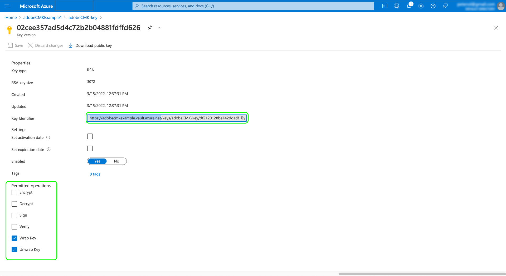

# Adobe Experience Platform中的客户管理密钥

存储在Adobe Experience Platform上的数据在静态时使用系统级别密钥进行加密。 如果您使用的是基于平台构建的应用程序，则可以选择使用您自己的加密密钥，从而更好地控制数据安全。

>[!NOTE]
>
>Adobe Experience Platform数据湖和配置文件存储(CosmosDB)中的数据使用CMK进行加密。

本文档介绍了在平台中启用客户管理的密钥(CMK)功能的过程。

## 先决条件

要启用CMK，您的 [!DNL Azure] 密钥保管库必须配置以下设置：

* [启用清除保护](https://learn.microsoft.com/en-us/azure/key-vault/general/soft-delete-overview#purge-protection)
* [启用软删除](https://learn.microsoft.com/en-us/azure/key-vault/general/soft-delete-overview)
* [使用配置访问 [!DNL Azure] 基于角色的访问控制](https://learn.microsoft.com/en-us/azure/role-based-access-control/)

## 流程摘要

CMK包含在医疗保健盾和隐私和安全盾产品中，免受Adobe。 在贵组织为其中一项服务购买许可证后，您可以开始设置该功能的一次性流程。

>[!WARNING]
>
>设置CMK后，无法还原到系统管理的密钥。 您负责安全管理您的密钥，并在 [!DNL Azure] 以防止丢失对数据的访问权限。

具体过程如下：

1. [配置 [!DNL Azure] 密钥保管库](#create-key-vault) 根据贵组织的政策， [生成加密密钥](#generate-a-key) 最终将与Adobe共享。
1. 使用API调用 [设置CMK应用程序](#register-app) 与 [!DNL Azure] 租户。
1. 使用API调用 [将您的加密密钥ID发送到Adobe](#send-to-adobe) 并启动该功能的启用过程。
1. [检查配置的状态](#check-status) 来验证CMK是否已启用。

完成设置过程后，所有沙箱中载入到平台的所有数据都将使用 [!DNL Azure] 键设置。 要使用CMK，您将利用 [!DNL Microsoft Azure] 功能 [公共预览程序](https://azure.microsoft.com/en-ca/support/legal/preview-supplemental-terms/).

## 配置 [!DNL Azure] 密钥保管库 {#create-key-vault}

CMK仅支持 [!DNL Microsoft Azure] 钥匙库。 要开始使用，您必须使用 [!DNL Azure] 要创建新的企业帐户，或使用现有的企业帐户，请按照以下步骤创建密钥保管库。

>[!IMPORTANT]
>
>仅适用于 [!DNL Azure] 支持密钥保管库。 [!DNL Azure Managed HSM], [!DNL Azure Dedicated HSM] 和 [!DNL Azure Payments HSM] 不受支持。 请参阅 [[!DNL Azure] 文档](https://learn.microsoft.com/en-us/azure/security/fundamentals/key-management#azure-key-management-services) 以了解有关已提供关键管理服务的更多信息。

>[!NOTE]
>
>以下文档仅介绍创建密钥保管库的基本步骤。 在本指南之外，您应根据贵组织的策略配置密钥保管库。

登录到 [!DNL Azure] 门户，并使用搜索栏查找 **[!DNL Key vaults]** 列表。


的 **[!DNL Key vaults]** 页面。 从此处选择 **[!DNL Create]**.


使用提供的表格，填写密钥保管库的基本详细信息，包括名称和分配的资源组。

>[!WARNING]
>
>虽然大多数选项都可保留为其默认值， **确保启用软删除和清除保护选项**. 如果不打开这些功能，则在删除密钥保管库时，可能会丢失对数据的访问权限。
>
>

从此处，继续完成密钥保管库创建工作流，并根据贵组织的策略配置不同的选项。

一旦您到达 **[!DNL Review + create]** 步骤中，您可以在密钥保管库进行验证时查看其详细信息。 验证通过后，选择 **[!DNL Create]** 以完成该过程。


### 配置网络选项

如果您的密钥保管库配置为限制对特定虚拟网络的公共访问或完全禁用公共访问，则必须授予Microsoft防火墙例外。

选择 **[!DNL Networking]** 中。 在 **[!DNL Firewalls and virtual networks]**，选中复选框 **[!DNL Allow trusted Microsoft services to bypass this firewall]**，然后选择 **[!DNL Apply]**.


### 生成键 {#generate-a-key}

创建密钥保管库后，即可生成新密钥。 导航到 **[!DNL Keys]** 选项卡，选择 **[!DNL Generate/Import]**.


使用提供的表单为键提供名称，然后选择 **RSA** 键类型。 至少， **[!DNL RSA key size]** 必须至少 **3072** 所需位数 [!DNL Cosmos DB]. [!DNL Azure Data Lake Storage] 也与RSA 3027兼容。

>[!NOTE]
>
>请记住您为密钥提供的名称，因为该名称将在后续步骤中使用， [将密钥发送到Adobe](#send-to-adobe).

使用其余的控件根据需要配置要生成或导入的键值。 完成后，选择 **[!DNL Create]**.


已配置的密钥将显示在存储库的密钥列表中。


## 设置CMK应用程序 {#register-app}

配置密钥保管库后，下一步是注册CMK应用程序，该应用程序将链接到 [!DNL Azure] 租户。

### 快速入门

注册CMK应用程序需要调用平台API。 有关如何收集进行这些调用所需的身份验证标头的详细信息，请参阅 [Platform API身份验证指南](../../landing/api-authentication.md).

而身份验证指南则提供有关如何为所需的 `x-api-key` 请求标头中，本指南中的所有API操作都使用静态值 `acp_provisioning` 中。 您仍必须为 `{ACCESS_TOKEN}` 和 `{ORG_ID}`但是。

在本指南显示的所有API调用中， `platform.adobe.io` 用作根路径，默认为VA7区域。 如果贵组织使用不同的区域， `platform` 必须后跟短划线和分配给贵组织的区域代码： `nld2` 用于NLD2或 `aus5` (例如： `platform-aus5.adobe.io`)。 如果您不知道贵组织所在的地区，请联系您的系统管理员。

### 获取身份验证URL

要开始注册流程，请向应用程序注册端点发出GET请求，以获取贵组织所需的身份验证URL。

**请求**

```shell
curl -X GET \
  https://platform.adobe.io/data/infrastructure/manager/byok/app-registration \ 
  -H 'Authorization: Bearer {ACCESS_TOKEN}' \
  -H 'x-api-key: acp_provisioning' \
  -H 'x-gw-ims-org-id: {ORG_ID}'
```

**响应**

成功的响应会返回 `applicationRedirectUrl` 属性，包含身份验证URL。

```json
{
    "id": "byok",
    "name": "acpebae9422Caepcmkmultitenantapp",
    "applicationUri": "https://adobe.com/acpebae9422Caepcmkmultitenantapp",
    "applicationId": "e463a445-c6ac-4ca2-b36a-b5146fcf6a52",
    "applicationRedirectUrl": "https://login.microsoftonline.com/common/oauth2/authorize?response_type=code&client_id=e463a445-c6ac-4ca2-b36a-b5146fcf6a52&redirect_uri=https://adobe.com/acpebae9422Caepcmkmultitenantapp&scope=user.read"
}
```

复制并粘贴 `applicationRedirectUrl` 地址到浏览器以打开身份验证对话框。 选择 **[!DNL Accept]** 向 [!DNL Azure] 租户。


### 将CMK应用程序分配给角色 {#assign-to-role}

完成身份验证过程后，导航回您的 [!DNL Azure] 密钥保管库并选择 **[!DNL Access control]** 中。 从此处选择 **[!DNL Add]** 后跟 **[!DNL Add role assignment]**.


下一个屏幕会提示您为此分配选择角色。 选择 **[!DNL Key Vault Crypto Service Encryption User]** 选择 **[!DNL Next]** 继续。


在下一个屏幕上，选择 **[!DNL Select members]** 打开右边栏中的对话框。 使用搜索栏可找到CMK应用程序的服务主体，并从列表中选择它。 完成后，选择 **[!DNL Save]**.

>[!NOTE]
>
>如果您在列表中找不到您的应用程序，则您的服务主体尚未被接受到您的租户中。 请与 [!DNL Azure] 管理员或代表，以确保您拥有正确的权限。

## 在Experience Platform上启用加密密钥配置 {#send-to-adobe}

在上安装CMK应用程序后 [!DNL Azure]，则可以将加密密钥标识符发送到Adobe。 选择 **[!DNL Keys]** ，后跟要发送的键的名称。


选择密钥的最新版本，此时将显示其详细信息页面。 在此，您可以选择为键配置允许的操作。 至少，该密钥须授予 **[!DNL Wrap Key]** 和 **[!DNL Unwrap Key]** 权限。

的 **[!UICONTROL 键标识符]** 字段中显示键的URI标识符。 复制此URI值以在下一步中使用。



获取密钥保管库URI后，可以使用POST请求将其发送到CMK配置端点。

>[!NOTE]
>
>只有密钥保管库和密钥名称与Adobe一起存储，而不是密钥版本。

**请求**

```shell
curl -X POST \
  https://platform.adobe.io/data/infrastructure/manager/customer/config \ 
  -H 'Authorization: Bearer {ACCESS_TOKEN}' \
  -H 'x-api-key: acp_provisioning' \
  -H 'x-gw-ims-org-id: {ORG_ID}' \
  -d '{
        "name": "Config1",
        "type": "BYOK_CONFIG",
        "imsOrgId": "{ORG_ID}",
        "configData": {
          "providerType": "AZURE_KEYVAULT",
          "keyVaultKeyIdentifier": "https://adobecmkexample.vault.azure.net/keys/adobeCMK-key/7c1d50lo28234cc895534c00d7eb4eb4"
        }
      }'
```

| 属性 | 描述 |
| --- | --- |
| `name` | 配置的名称。 请确保记住此值，因为在 [后续步骤](#check-status). 值区分大小写。 |
| `type` | 配置类型。 必须设置为 `BYOK_CONFIG`. |
| `imsOrgId` | 您的IMS组织ID。 此值必须与 `x-gw-ims-org-id` 标题。 |
| `configData` | 包含有关配置的以下详细信息：<ul><li>`providerType`:必须设置为 `AZURE_KEYVAULT`.</li><li>`keyVaultKeyIdentifier`:您复制的密钥保管库URI [更早](#send-to-adobe).</li></ul> |

**响应**

成功的响应会返回配置作业的详细信息。

```json
{
  "id": "4df7886b-a122-4391-880b-47888d5c5b92",
  "config": {
    "configData": {
      "keyVaultUri": "https://adobecmkexample.vault.azure.net",
      "keyVaultKeyIdentifier": "https://adobecmkexample.vault.azure.net/keys/adobeCMK-key/7c1d50lo28234cc895534c00d7eb4eb4",
      "keyVersion": "7c1d50lo28234cc895534c00d7eb4eb4",
      "keyName": "Config1",
      "providerType": "AZURE_KEYVAULT"
    },
    "name": "acpcf978863Aaepcmkmultitenantapp",
    "type": "BYOK_CONFIG",
    "imsOrgId": "{IMS_ORG}",
    "status": "NEW"
  },
  "status": "CREATED"
}
```

作业应在几分钟内完成处理。

## 验证配置的状态 {#check-status}

要检查配置请求的状态，您可以发出GET请求。

**请求**

您必须附加 `name` 要检查到路径(`config1` )并包含 `configType` 查询参数设置为 `BYOK_CONFIG`.

```shell
curl -X GET \
  https://platform.adobe.io/data/infrastructure/manager/customer/config/config1?configType=BYOK_CONFIG \ 
  -H 'Authorization: Bearer {ACCESS_TOKEN}' \
  -H 'x-api-key: acp_provisioning' \
  -H 'x-gw-ims-org-id: {ORG_ID}'
```

**响应**

成功的响应会返回作业的状态。

```json
{
  "name": "acpcf978863Aaepcmkmultitenantapp",
  "type": "BYOK_CONFIG",
  "status": "COMPLETED",
  "configData": {
    "keyVaultUri": "https://adobecmkexample.vault.azure.net",
    "keyVaultKeyIdentifier": "https://adobecmkexample.vault.azure.net/keys/adobeCMK-key/7c1d50lo28234cc895534c00d7eb4eb4",
    "keyVersion": "7c1d50lo28234cc895534c00d7eb4eb4",
    "keyName": "Config1",
    "providerType": "AZURE_KEYVAULT"
  },
  "imsOrgId": "{IMS_ORG}",
  "subscriptionId": "cf978863-7325-47b1-8fd9-554b9fdb6c36",
  "id": "4df7886b-a122-4391-880b-47888d5c5b92",
  "rowType": "BYOK_KEY"
}
```

的 `status` 属性可以具有以下含义的四个值之一：

1. `RUNNING`:验证平台是否能够访问密钥和密钥保管库。
1. `UPDATE_EXISTING_RESOURCES`:系统正在将密钥保管库和密钥名称添加到组织内所有沙箱的数据存储中。
1. `COMPLETED`:密钥保管库和密钥名称已添加到数据存储中。
1. `FAILED`:出现问题，主要与密钥、密钥保管库或多租户应用程序设置有关。

## 后续步骤

完成上述步骤后，您便为贵组织成功启用了CMK。 现在，摄取到平台中的数据将使用 [!DNL Azure] 钥匙库。 如果要撤消对数据的平台访问权限，可以从 [!DNL Azure].

在禁用对应用程序的访问后，可能需要几分钟到24小时的时间，才能使数据在Platform中不再可访问。 在重新启用对应用程序的访问时，同一时间延迟会使数据再次变得可用。

>[!WARNING]
>
>禁用密钥保管库、密钥或CMK应用程序并且数据在平台中不再可访问后，将无法再执行与该数据相关的任何下游操作。 在对配置进行任何更改之前，请确保您了解撤销对数据的平台访问权所带来的下游影响。
