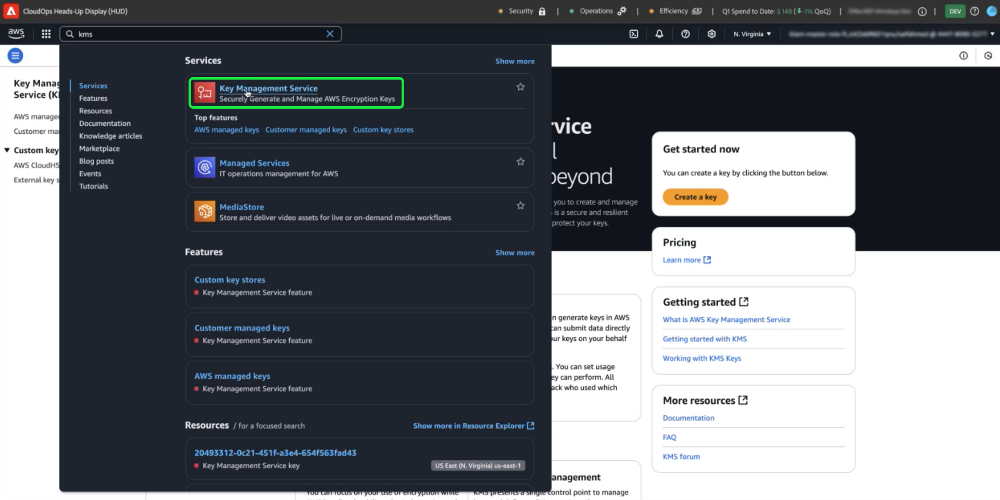

# 为客户管理的密钥配置AWS KMS

>[!AVAILABILITY]
>
>本文档适用于在Amazon Web Services (AWS)上运行的Experience Platform的实施。 在AWS上运行的Experience Platform当前仅对有限数量的客户可用。 要了解有关支持的Experience Platform基础架构的更多信息，请参阅[Experience Platform multi-cloud概述](https://experienceleague.adobe.com/en/docs/experience-platform/landing/multi-cloud)。
>
>AWS上的[客户管理的密钥](../overview.md) (CMK)支持Privacy and Security Shield，但不适用于Healthcare Shield。 Privacy和Security Shield以及Healthcare Shield均支持Azure上的CMK。

使用本指南，通过创建、管理和控制Amazon Web Services (AWS)的加密密钥，使用Adobe Experience Platform (KMS)密钥管理服务(KMS)保护您的数据。 此集成简化了法规遵从性，通过自动化简化了操作，并且消除了维护您自己的关键管理基础架构的需要。

有关特定于Customer Journey Analytics的说明，请参阅[Customer Journey Analytics CMK文档](https://experienceleague.adobe.com/en/docs/analytics-platform/using/cja-privacy/cmk)

>[!IMPORTANT]
>
>默认情况下，Adobe Experience Platform使用系统管理的密钥加密静态数据。 通过启用客户管理的密钥(CMK)，您可以完全控制数据安全。 但是，此更改是不可逆的，一旦启用CMK，您就无法还原到系统管理的密钥。 您有责任安全地管理您的密钥，以确保对数据的访问不会出现中断，并防止潜在的不可访问性。

使用AWS KMS通过Adobe Experience Platform的集成式加密密钥管理增强数据安全性。 按照本指南创建和管理加密密钥，确保您的数据始终受到保护。

## 先决条件 {#prerequisites}

在继续阅读本文档之前，您应该充分了解以下关键概念和功能：

- **AWS密钥管理服务(KMS)**：了解AWS KMS的基础知识，包括如何创建、管理和轮换加密密钥。 有关详细信息，请参阅[KMS官方文档](https://docs.aws.amazon.com/kms/)。
- AWS中的&#x200B;**身份和访问管理(IAM)策略**： IAM是一项允许您安全管理对AWS服务和资源的访问权限的服务。 使用IAM可以：
   - 定义哪些用户、组和角色有权访问特定资源。
   - 指定允许或拒绝用户执行的操作。
   - 通过使用IAM策略分配权限来实施细粒度访问控制。
有关详细信息，请参阅[适用于AWS KMS的IAM策略官方文档](https://docs.aws.amazon.com/kms/latest/developerguide/iam-policies.html)。
- **Experience Platform中的数据安全**：了解Experience Platform如何确保数据安全并与AWS KMS等外部服务集成以进行加密。 Experience Platform使用HTTPS TLS v1.2保护数据以便传输、云提供商静态加密、隔离存储以及可自定义的身份验证和加密选项。 有关如何保持数据安全的更多信息，请参阅[治理、隐私和安全概述](../overview.md)或有关Experience Platform[&#128279;](../../encryption.md)中数据加密的文档。
- **AWS管理控制台**：一个中心中心，您可以从基于Web的应用程序访问和管理所有AWS服务。 使用搜索栏快速查找工具、检查通知、管理您的帐户和账单，以及自定义您的设置。 有关详细信息，请参阅[官方的AWS管理控制台文档](https://docs.aws.amazon.com/awsconsolehelpdocs/latest/gsg/what-is.html)。

## 快速入门 {#get-started}

本指南要求您已经拥有Amazon Web Services帐户的访问权限和管理控制台的访问权限。 请按照以下步骤开始：

### 选择支持的区域 {#select-supported-region}

AWS KMS在特定地区提供。 确保您在支持KMS的区域中运行。 您可以在[AWS KMS端点和配额列表](https://aws.amazon.com/about-aws/global-infrastructure/regional-product-services/)中查看受支持地区的完整列表。

确保您的AWS KMS加密密钥与Adobe Experience Platform实例位于同一区域，以保持对数据派驻要求的遵守，优化性能，并避免额外的跨区域成本。 未对齐区域可能会导致数据不可访问和集成失败。

### 验证权限 {#verify-permissions}

确保您拥有必要的AWS Identity and Access Management (IAM)权限，以便在KMS中创建、管理和使用加密密钥。 要验证您的权限，请执行以下操作：

1. 访问[IAM策略模拟器](https://policysim.aws.amazon.com/)。
2. 选择您的用户帐户或角色。
3. 模拟KMS操作，如`kms:CreateKey`或`kms:Encrypt`。

如果模拟返回错误或您不确定自己的权限，请联系AWS管理员以获取帮助。

### 检查您的AWS帐户配置

确认已允许您的AWS帐户使用AWS KMS服务。 大多数帐户默认启用KMS访问权限，但您可以通过访问[AWS管理控制台](https://aws.amazon.com/console/)来查看帐户设置。 有关详细信息，请参阅[AWS Key Management Service开发人员指南](https://docs.aws.amazon.com/kms/latest/developerguide/overview.html)。

### 导航到AWS KMS以开始设置键

要开始设置和管理加密密钥，请登录到您的AWS帐户，然后导航到AWS密钥管理服务(KMS)。 从AWS Management Console中，从服务菜单中选择&#x200B;**密钥管理服务(KMS)**。

## 创建新密钥 {#create-a-key}

>[!IMPORTANT]
>
>确保加密密钥的安全存储、访问和可用性。 您负责管理密钥并防止对Experience Platform操作造成中断。

在[!DNL Key Management Service (KMS)]工作区中选择&#x200B;**[!DNL Create a key]**。

## 配置密钥设置 {#configure-key}

出现[!DNL Configure Key]工作流。 默认情况下，密钥类型设置为&#x200B;**[!DNL Symmetric]**，密钥用法设置为&#x200B;**[!DNL Encrypt and Decrypt]**。 在继续之前，请确保已选择这些选项。

展开&#x200B;**[!DNL Advanced options]**&#x200B;下拉菜单。 建议您使用&#x200B;**[!DNL KMS]**&#x200B;选项，该选项允许AWS创建和管理密钥资料。 默认情况下已选中&#x200B;**[!DNL KMS]**&#x200B;选项。

>[!NOTE]
>
>如果您已经拥有现有的密钥，则可以导入外部密钥资料或使用AWS [!DNL CloudHSM]密钥库。 这些选项不在本文档的范围之内。

接下来，选择[!DNL Regionality]设置，该设置指定键的区域范围。 选择&#x200B;**[!DNL Single-Region key]**，然后选择&#x200B;**[!DNL Next]**&#x200B;以继续执行步骤2。

>[!IMPORTANT]
>
>AWS对KMS密钥实施区域限制。 此区域限制意味着密钥必须位于与您的Adobe帐户相同的区域中。 Adobe只能访问位于您帐户所在地区的KMS密钥。 确保您选择的区域与Adobe单租户帐户的区域相匹配。

## 为密钥添加标签和标记 {#add-labels-and-tags-to-key}

此时将显示工作流的第二个[!DNL Add labels]阶段。 在此，您可以配置[!DNL Alias]和[!DNL Tags]字段以帮助您从AWS KMS控制台管理和查找加密密钥。

在&#x200B;**[!DNL Alias]**&#x200B;输入字段中输入键的描述性标签。 别名充当用户友好标识符，以使用AWS KMS控制台中的搜索栏快速找到密钥。 为避免混淆，请选择一个可反映密钥目的的有意义的名称，如“Adobe-Experience-Platform-Key”或“Customer-Encryption-Key”。 如果键别名不足以描述其用途，您还可以包含键的说明。

最后，通过在[!DNL Tags]部分中添加键值对来为键分配元数据。 此步骤是可选的，但您应该添加标记以对AWS资源进行分类和筛选，从而更便于管理。 例如，如果贵组织使用多个Adobe相关资源，则可以使用“Adobe”或“Experience-Platform”标记它们。 通过这个额外的步骤，可以轻松地在AWS Management Console中搜索和管理所有关联的资源。 选择&#x200B;**[!DNL Add tag]**&#x200B;开始该进程。

<!-- I do not have an AWS account with which to document the Add tag process as yet. -->

如果您对设置感到满意，请选择&#x200B;**[!DNL Next]**&#x200B;以继续工作流。

## 定义关键管理权限 {#define-key-admins}

此时会显示密钥创建工作流的步骤3。 为确保访问安全和受控，您可以选择哪些IAM用户和角色可以管理密钥。 此阶段有两个选项，[!DNL Key administrators]和[!DNL Key deletion]。 在&#x200B;**[!DNL Key administrators]**&#x200B;部分中，选中您要授予此密钥的管理员权限的任何用户或角色名称旁边的一个或多个复选框。

>[!NOTE]
>
>您无法在此工作流阶段创建管理员。

在&#x200B;**[!DNL Key deletion]**&#x200B;部分中，启用该复选框以允许密钥管理员删除此密钥。 如果不选中该复选框，则不允许管理用户执行该操作。

选择&#x200B;**[!DNL Next]**&#x200B;以继续工作流。

## 向关键用户授予访问权限 {#assign-key-users}

在工作流的第四步，您可以[!DNL Define key usage permissions]。 从&#x200B;**[!DNL Key users]**&#x200B;列表中，选中要拥有使用此密钥的权限的所有IAM用户和角色的复选框。

从这种观点来看，您也可以[!DNL Add another AWS account]；但是，强烈建议不要添加其他AWS帐户。 添加另一个帐户可能会带来风险，并使加密和解密操作的权限管理复杂化。 通过保持与单个AWS帐户关联的密钥，Adobe可确保与AWS KMS的安全集成，从而最大程度地降低风险并确保可靠的操作。

选择&#x200B;**[!DNL Next]**&#x200B;以继续工作流。

## 查看关键配置 {#review}

此时将显示关键配置的审核阶段。 验证[!DNL Key configuration]和[!DNL Alias and description]部分中的键详细信息。

>[!NOTE]
>
>确保关键区域与AWS帐户相同。

选择&#x200B;**[!DNL Confirm]**&#x200B;以完成该过程。 您将返回到KMS客户管理的密钥工作区，该工作区列出了所有可用的密钥。

## 后续步骤

配置AWS KMS后，继续使用[!UICONTROL 平台加密配置] UI或Adobe Experience Platform API设置集成。 要继续设置客户管理的密钥功能的一次性过程，请继续[UI设置指南](./ui-set-up.md)。
