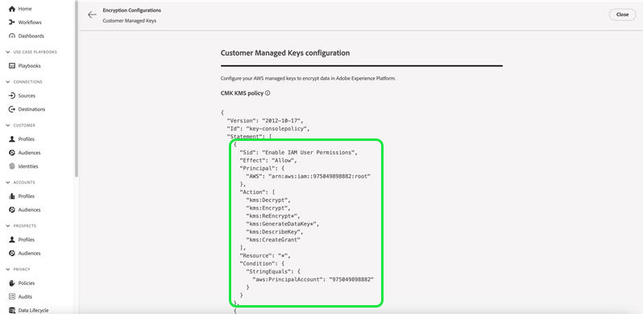
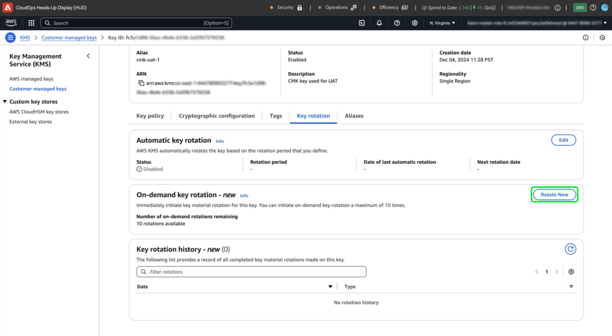

# 使用Experience Platform UI在AWS中设置并配置客户管理的密钥

使用本指南可通过Experience Platform UI为AWS上托管的Experience Platform实例启用客户管理的密钥(CMK)。

>[!IMPORTANT]
>
>在继续本指南之前，请确保您已完成[“为CMK配置AWS KMS”](./configure-kms.md)文档中详述的设置。

## 更新AWS密钥策略以将该密钥与Experience Platform集成

要将AWS密钥与Experience Platform集成，必须在KMS工作区的&#x200B;**[!DNL Key Policy]**&#x200B;部分中编辑JSON。 默认密钥策略类似于下面的JSON。

<!-- The AWS ID below is fake. Q) Can I refer to it simply as AWS_ACCOUNT_ID ? Is that suitable? -->

```JSON
{
  "Id": "key-consolepolicy-3",
  "Version": "2012-10-17",
  "Statement": [
    {
      "Sid": "Enable IAM User Permissions",
      "Effect": "Allow",
      "Principal": {
        "AWS": "arn:aws:iam::123464903283:root" // this is a mock AWS Principal ID, your ID will differ
      },
      "Action": "kms:*",
      "Resource": "*"
    }
  ]
}
```

在上述示例中，同一帐户(`Principal.AWS`)中的所有资源(`"Resource": "*"`)都可以访问该密钥。 此策略允许帐户中的服务执行加密和解密操作，但仅限于指定的帐户。 要授予您的Experience Platform单租户帐户对此密钥的访问权限，请向默认AWS策略添加新语句。 您可以从Experience Platform UI获取所需的JSON策略，并将其应用于AWS KMS密钥，以与Adobe Experience Platform建立安全连接。

在Experience Platform UI中，转到左侧导航边栏中的&#x200B;**[!UICONTROL 管理]**&#x200B;部分，然后选择&#x200B;**[!UICONTROL 加密]**。 在[!UICONTROL 加密配置]工作区中，选择[!UICONTROL 客户托管密钥]卡片中的&#x200B;**[!UICONTROL 配置]**。


出现[!UICONTROL 客户托管密钥配置]。 从[!UICONTROL 客户管理的密钥] [!UICONTROL 加密配置]中显示的CMK KMS策略复制`statement`对象。

<!-- Select the copy icon () to copy the CMK KMS policy to your clipboard. A green pop-up notification confirms that the policy was copied.  -->

<!-- I cannot add the 'and the copy icon highlighted.' to the alt text below as i do not have access to this UI. -->



<!-- This part of the workflow was in contention at the time of the demo.  -->

接下来，返回到AWS KMS工作区并更新下面显示的密钥策略。


将[!UICONTROL 平台加密配置]工作区中的四个语句添加到默认策略中，如下所示： `Enable IAM User Permissions`、`CJA Flow IAM User Permissions`、`CJA Integrity IAM User Permissions`、`CJA Oberon IAM User Permissions`。

```json
{
    "Version": "2012-10-17",
    "Id": "key-consolepolicy",
    "Statement": [
        {
            "Sid": "Enable IAM User Permissions",
            "Effect": "Allow",
            "Principal": {
                "AWS": "arn:aws:iam::975049898882:root" // this is a mock AWS Principal ID, your ID will differ
            },
            "Action": [
                "kms:Decrypt",
                "kms:Encrypt",
                "kms:ReEncrypt*",
                "kms:GenerateDataKey*",
                "kms:DescribeKey",
                "kms:CreateGrant"
            ],
            "Resource": "*",
            "Condition": {
                "StringEquals": {
                    "aws:PrincipalAccount": "975049898882" // this is a mock AWS Principal ID, your ID will differ
                }
            }
        },
        {
            "Sid": "CJA Flow IAM User Permissions",
            "Effect": "Allow",
            "Principal": {
                "AWS": "arn:aws:iam::767397686373:root"
            },
            "Action": [
                "kms:Decrypt",
                "kms:Encrypt",
                "kms:ReEncrypt*",
                "kms:GenerateDataKey*",
                "kms:DescribeKey",
                "kms:CreateGrant"
            ],
            "Resource": "*",
            "Condition": {
                "StringEquals": {
                    "aws:PrincipalAccount": "767397686373"
                }
            }
        },
        {
            "Sid": "CJA Integrity IAM User Permissions",
            "Effect": "Allow",
            "Principal": {
                "AWS": "arn:aws:iam::730335345392:root"
            },
            "Action": [
                "kms:Decrypt",
                "kms:Encrypt",
                "kms:ReEncrypt*",
                "kms:GenerateDataKey*",
                "kms:DescribeKey",
                "kms:CreateGrant"
            ],
            "Resource": "*",
            "Condition": {
                "StringEquals": {
                    "aws:PrincipalAccount": "730335345392"
                }
            }
        },
        {
            "Sid": "CJA Oberon IAM User Permissions",
            "Effect": "Allow",
            "Principal": {
                "AWS": "arn:aws:iam::891377157113:root"
            },
            "Action": [
                "kms:Decrypt",
                "kms:Encrypt",
                "kms:ReEncrypt*",
                "kms:GenerateDataKey*",
                "kms:DescribeKey",
                "kms:CreateGrant"
            ],
            "Resource": "*",
            "Condition": {
                "StringEquals": {
                    "aws:PrincipalAccount": "891377157113"
                }
            }
        }
    ]
}
```

选择&#x200B;**[!DNL Finish]**&#x200B;以确认更新的策略并创建密钥。 现在，配置包含五个语句，以使您的AWS帐户能够与Adobe Experience Platform通信。 更改将立即生效。

将显示AWS [!DNL Key Management Service]的已更新[!DNL Customer Managed Keys]工作区。

### 将AWS加密密钥详细信息添加到Experience Platform

接下来，要启用加密，请将该密钥的Amazon资源名称(ARN)添加到您的Experience Platform [!UICONTROL 客户托管密钥配置]。 在AWS的[!DNL Customer Managed Keys]部分中，从[!DNL Key Management Service]的列表中选择新密钥的别名。


此时将显示键的详细信息。 AWS中的所有内容都有一个Amazon资源名称(ARN)，该名称包含
是用于跨AWS服务指定资源的唯一标识符。 它遵循标准化格式： `arn:partition:service:region:account-id:resource`。

选择复制图标以复制您的ARN。 将显示确认对话框。


现在，导航回Experience Platform [!UICONTROL 客户托管密钥配置] UI。 在&#x200B;**[!UICONTROL 添加AWS加密密钥详细信息]**&#x200B;部分中，添加从AWS UI复制的&#x200B;**[!UICONTROL 配置名称]**&#x200B;和&#x200B;**[!UICONTROL KMS密钥ARN]**。


接下来，选择&#x200B;**[!UICONTROL SAVE]**&#x200B;以提交配置名称、KMS密钥ARN，并开始验证密钥。


返回[!UICONTROL 加密配置]工作区。 加密配置的状态显示在&#x200B;**[!UICONTROL 客户管理的密钥]**&#x200B;卡的底部。


验证密钥后，密钥保管库标识符将添加到所有沙盒的数据湖和配置文件数据存储中。

>[!NOTE]
>
>该过程的持续时间取决于您的数据大小。 通常，该过程在24小时内完成。 每个沙盒通常在2到3分钟内更新。

## 密钥撤销 {#key-revocation}

>[!IMPORTANT]
>
>在撤销任何访问之前，请了解密钥撤销对下游应用程序的影响。

以下是密钥撤销的关键注意事项：

- 撤销或禁用密钥将导致无法访问您的Experience Platform数据。 此操作不可逆，应谨慎执行。
- 在撤销对加密密钥的访问时，请考虑传播时间线。 在几分钟到24小时内无法访问主数据存储。 缓存或临时数据存储在7天内变得不可访问。

要撤销密钥，请导航到AWS KMS工作区。 **[!DNL Customer managed keys]**&#x200B;部分显示您的AWS帐户的所有可用密钥。 从列表中选择密钥的别名。


此时将显示键的详细信息。 要禁用该键，请从下拉菜单中选择&#x200B;**[!DNL Key actions]**，然后选择&#x200B;**[!DNL Disable]**。


将显示确认对话框。 选择&#x200B;**[!DNL Disable key]**&#x200B;以确认您的选择。 禁用键的影响应在大约5分钟内反映在Experience Platform应用程序和UI中。

>[!NOTE]
>
>禁用密钥后，如果需要，可以使用上述相同方法再次启用密钥。 此选项可从&#x200B;**[!DNL Key actions]**&#x200B;下拉菜单中获取。


或者，如果您的密钥在其他服务中使用，您可以直接从密钥策略中删除Experience Platform的访问权限。 在&#x200B;**[!DNL Key Policy]**&#x200B;部分中选择&#x200B;**[!UICONTROL 编辑]**。


此时会显示&#x200B;**[!DNL Edit key policy]**&#x200B;页面。 突出显示并删除从Experience Platform UI复制的策略语句，以删除客户管理的密钥应用程序的权限。 然后，选择&#x200B;**[!DNL Save changes]**&#x200B;以完成该过程。


## 密钥轮替 {#key-rotation}

AWS提供自动和按需密钥轮替。 为了降低密钥泄露的风险或满足安全合规性要求，您可以根据需要或定期自动生成新的加密密钥。 计划自动密钥轮换以限制密钥的生命周期，并确保如果密钥受损，其在轮换后不可用。 虽然现代加密算法高度安全，但密钥轮换是一项重要的安全合规性措施，并表明遵守了安全最佳实践。

### 自动密钥轮替 {#automatic-key-rotation}

默认情况下禁用自动密钥轮替。 要从KMS工作区计划自动密钥轮替，请选择&#x200B;**[!DNL Key rotation]**&#x200B;选项卡，然后在&#x200B;**[!DNL Automatic key rotation section]**&#x200B;中选择&#x200B;**[!DNL Edit]**。


出现&#x200B;**[!DNL Edit automatic key rotation]**&#x200B;工作区。 在此处，选择单选按钮以启用或禁用自动密钥轮替。 然后，使用文本输入字段或下拉菜单为键旋转选择时间段。 选择&#x200B;**[!DNL Save]**&#x200B;以确认您的设置并返回密钥详细信息工作区。

>[!NOTE]
>
>密钥轮换的最小周期为90天，最大周期为2560天。


### 按需密钥轮换 {#on-demand-key-rotation}

选择&#x200B;**[!DNL Rotate Now]**&#x200B;以在当前密钥被泄露时执行立即密钥轮替。 AWS限制此功能为10次轮换。 对于定期维护，请安排自动轮换键。



## 后续步骤

阅读本文档后，您已了解如何在AWS KMS for Adobe Experience Platform中创建、配置和管理加密密钥。 接下来，审查您组织的安全性和法规遵从性策略以实施最佳做法，如安排密钥轮换和确保密钥存储安全。
