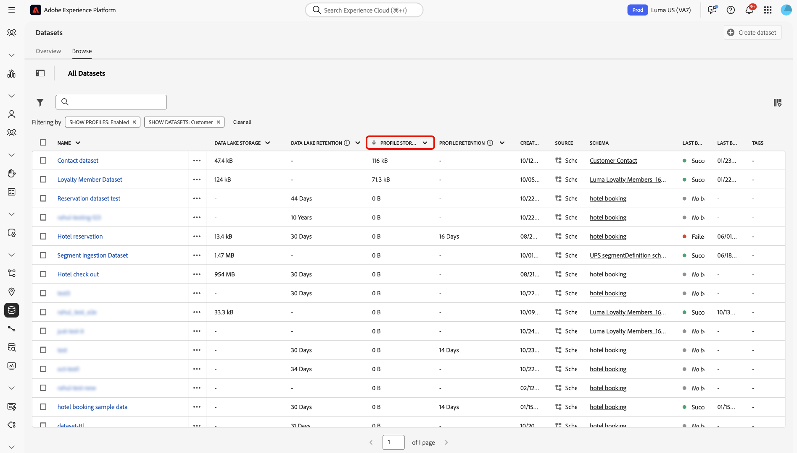

# 数据管理许可证权利最佳实践

Adobe Experience Platform是一个开放系统，可将您的数据转换为强大的客户档案以实时更新，并使用AI驱动的见解来帮助您在每个渠道中提供正确的体验。 您可以使用源将不同类型、卷和历史记录的数据引入Experience Platform，然后满足从分段和个性化到分析和机器学习等用例的需求。

Experience Platform提供许可证，用于建立可创建的配置文件数以及可引入的数据量。 由于能够引入任何源、数量或历史数据，因此随着数据量的增长，可能会超出许可权限。

请阅读本指南，以了解可以遵循的最佳实践以及可用来更好地管理Experience Platform许可证权利的工具。

## 功能摘要 {#summary-of-features}

使用本文档中概述的最佳实践和工具更好地管理Experience Platform中的许可证权利使用情况。 本文档在发布附加功能时进行了更新，以帮助向所有Experience Platform客户显示和控制。

下表列出了您目前可以使用的功能，以便更好地管理您的许可证使用授权。

| 功能 | 描述 |
| --- | --- |
| [数据集UI — 体验事件数据保留](../../catalog/datasets/user-guide.md#data-retention-policy) | 为数据湖和配置文件存储中的数据配置固定保留期。 在配置的保留期结束时，将删除记录。 |
| [启用/禁用实时客户资料的数据集](../../catalog/datasets/user-guide.md) | 启用或禁用数据集摄取到Real-time Customer Profile的功能。 |
| 配置文件存储区中的[体验事件过期时间](../../profile/event-expirations.md) | 为引入到启用配置文件的数据集中的所有事件应用过期时间。 请联系您的Adobe客户团队或客户关怀团队以启用此功能。 |
| [Adobe Analytics数据准备筛选器](../../sources/tutorials/ui/create/adobe-applications/analytics.md#filtering-for-real-time-customer-profile) | 应用[!DNL Kafka]筛选器以从摄取中排除不必要的数据。 |
| [Adobe Audience Manager源连接器筛选器](../../sources/tutorials/ui/create/adobe-applications/audience-manager.md) | 应用Audience Manager源连接筛选器以从摄取中排除不必要的数据。 |
| [事件转发数据筛选器](../../tags/ui/event-forwarding/overview.md) | 应用服务器端[!DNL Kafka]筛选器以从摄取中排除不必要的数据。  有关更多信息，请参阅有关[标记规则](../../tags/ui/managing-resources/rules.md)的文档。 |
| [许可证使用情况仪表板UI](../../dashboards/guides/license-usage.md#license-usage-dashboard-data) | 根据许可的权利监控贵组织对Experience Platform产品的使用情况。 访问每日使用情况快照、预测趋势和详细的沙盒级别数据，以支持主动许可证管理。 |
| [数据集重叠报表API](../../profile/tutorials/dataset-overlap-report.md) | 输出对可寻址受众贡献最大的数据集。 |
| [身份重叠报表API](../../profile/api/preview-sample-status.md#generate-the-identity-namespace-overlap-report) | 输出对可寻址受众贡献最大的身份命名空间。 |
| [假名配置文件数据过期](../../profile/pseudonymous-profiles.md) | 为假名配置文件配置数据过期时间，并自动从配置文件存储中删除数据。 |

{style="table-layout:auto"}

## 了解Experience Platform数据存储

Experience Platform主要由两个数据存储库组成：数据湖和配置文件存储。

数据湖主要具有以下用途：

* 充当将数据载入Experience Platform的暂存区；
* 充当所有Experience Platform数据的长期数据存储；
* 启用数据分析和数据科学等用例。

**配置文件存储**&#x200B;是创建客户配置文件的位置，主要用途如下：

* 充当用于支持实时体验的用户档案的数据存储；
* 支持分段、激活和个性化等用例。

>[!NOTE]
>
>您对[!DNL data lake]的访问权限取决于您购买的产品SKU。 有关产品SKU的更多信息，请联系Adobe代表。

## 许可证使用 {#license-usage}

在许可Experience Platform时，您获得的许可使用权利因SKU而异：

**[!DNL Addressable Audience]**： Experience Platform中按照合同允许的客户配置文件总数，包括已知和假名配置文件。

**[!DNL Total Data Volume]**：在参与工作流中可供实时客户配置文件使用的总数据量。

这些指标的可用性和每个指标的特定定义因贵组织购买的许可而异。

## 许可证用量仪表板

Adobe Experience Platform UI提供了一个功能板，通过该功能板，您可以查看组织的Experience Platform许可证相关数据的快照。 仪表板中的数据与拍摄快照的特定时间点完全相同。 快照既不是近似值，也不是数据示例，并且仪表板没有实时更新。

有关详细信息，请参阅Experience Platform UI[上的](../../dashboards/guides/license-usage.md#license-usage-dashboard-data)使用许可证使用情况仪表板指南。

## 数据管理最佳实践

以下各节概述了更好地管理数据可遵循的最佳实践。

### 了解您的数据

在Adobe Experience Platform中，并非所有数据都是相同的。 某些数据可能密集，但值较低，而其他数据可能稀疏，但值较高。 一些数据可能在生成后立即失去价值，而其他数据可能在几个月（甚至几年）内失去价值。

在了解数据的价值时，需要考虑三个维度：

| 维度 | 描述 | 示例 |
| --- | --- | --- |
| 数量 | 表示所摄取的数据的数量和总数。 | Web点击量 — 高流量，中等保真。 值可能会迅速减小。 |
| 时间跨度 | 表示引入的数据继续保持有价值的时间长度。 | 离线购买 — 在数量和保真度方面适度，但可能在较长时间内很有价值。 |
| 保真度 | 表示数据包含信息的丰富程度。 | 客户账户 — 交易量低但保真度高。 在客户的生命周期之外可能很有价值。 |

### 数据管理工具 {#data-management-tools}

在确保您的数据使用量保持在许可证权利限制内时，需要考虑两种主要方案：

### 要将哪些数据引入Experience Platform？

数据可以摄取到Experience Platform的一个或多个系统中，即[!DNL data lake]和/或配置文件存储。 这意味着，在不同的用例中，两个系统中可以存在不同的数据。 例如，您可能希望将历史数据保存在[!DNL data lake]中，但不保存在“配置文件存储”中。 您可以通过启用用于配置文件摄取的数据集来选择要发送到配置文件存储的数据。

>[!NOTE]
>
>您对[!DNL data lake]的访问权限取决于您购买的产品SKU。 有关产品SKU的更多信息，请联系Adobe代表。

除了将查找数据集用于常规查找之外，您还必须决定是否为实时客户配置文件启用查找数据集。 请遵循以下指南以避免超出许可证限制。

#### 为查找数据集启用配置文件 {#profile-enablement-lookup-datasets}

查找数据集是您在Experience Platform中启用的数据集，因此应用程序可在运行时引用它。 使用查找数据集存储相对静态的键控信息，如产品详细信息、存储元数据或优惠配置，而不是其主要目的是贡献配置文件属性（例如，名称、电子邮件或忠诚度级别）或体验事件（例如，页面查看或购买）的数据集。

Experience Platform应用程序（如[!DNL Journey Optimizer]和其他决策应用程序）使用这些数据集根据密钥（例如，产品ID或存储ID）检索其他字段，并丰富个性化、决策和编排工作流。 为Real-time Customer Profile启用查找数据集会影响您的配置文件数据量，因此请遵循以下指南以符合您的许可授权。

在配置数据集以进行查找时，请考虑数据集可以在Experience Platform中扮演的两个角色：

* **查找数据集**：允许应用程序检索[!DNL Journey Optimizer]中个性化和决策等服务的引用数据。
* **启用配置文件的数据集**：将属性和事件贡献给实时客户配置文件中的统一客户配置文件。 这些数据集使其字段可用于分段和激活用例。

>[!IMPORTANT]
>
>只有在必须在实时客户档案中使用来自实时客户档案数据集的字段时（例如，用于受众定义、激活或多实体分段），才为实时客户档案启用查找数据集。 为Real-time Customer Profile启用查找数据集会增加您的配置文件数据量。 有关详细信息，请参阅[多实体分段](../../segmentation/tutorials/multi-entity-segmentation.md)教程。

**何时启用实时客户资料的数据集：**

在以下情况下，为实时客户资料启用数据集：

* 该数据集包含您需要统一到客户配置文件中的客户属性（例如，忠诚度级别、偏好设置、帐户信息）。
* 数据集包含有助于客户行为分析和细分的体验事件。
* 数据集包含您必须在受众定义（包括多实体分段或下游激活）中使用的引用或扩充属性（例如，产品、商店或帐户属性）。

**如果不启用实时客户资料的数据集：**

在以下情况下，请避免为实时客户资料启用数据集：

* 数据集包含参考数据，例如产品目录、SKU详细信息、商店位置或其他非客户数据，您不需要在实时客户配置文件中利用这些属性进行分段或激活，包括多实体分段。
* 数据集包含仅在运行时在查找中使用的扩充数据，客户身份或受众定义中不需要该数据。

### 要保留哪些数据？

您可以同时应用数据摄取过滤器和过期规则，以删除对于用例已过时的数据。 通常，行为数据（如Analytics数据）使用的存储空间远远多于记录数据（如CRM数据）。 例如，与记录数据相比，许多Experience Platform用户有超过90%的用户档案仅由行为数据填充。 因此，管理行为数据对于确保许可证权利范围内的合规性至关重要。

您可以利用许多工具来保持您的许可证使用授权：

* [摄取筛选器](#ingestion-filters)
* [配置文件存储](#profile-service)

### 身份服务和可寻址受众 {#identity-service}

身份图不计入可寻址受众权利总数，因为可寻址受众是指客户配置文件总数。

但是，由于拆分身份，身份图限制可能会影响可寻址受众。 例如，如果从图表中删除了最早的ECID，则ECID将继续作为假名配置文件存在于实时客户配置文件中。 您可以设置[假名配置文件数据有效期](../../profile/pseudonymous-profiles.md)以规避此行为。 若要了解更多信息，请阅读[身份标识服务数据的护栏](../../identity-service/guardrails.md)。

### 摄取筛选器 {#ingestion-filters}

通过摄取过滤器，您可以仅引入用例所需的数据，并过滤掉所有不需要的事件。

| 摄取筛选器 | 描述 |
| --- | --- |
| Adobe Audience Manager源筛选 | 在创建Adobe Audience Manager源连接时，您可以选择将哪些区段和特征引入[!DNL data lake]和实时客户个人资料中，而不是摄取整个Audience Manager数据。 有关详细信息，请参阅[创建Audience Manager源连接](../../sources/tutorials/ui/create/adobe-applications/audience-manager.md)指南。 |
| Adobe Analytics数据准备 | 在创建Analytics源连接时，您可以使用[!DNL Data Prep]功能来过滤掉用例不需要的数据。 通过[!DNL Data Prep]，您可以定义哪些属性/列需要发布到配置文件。 您还可以提供条件语句，以告知Experience Platform数据是应发布到配置文件，还是仅发布到[!DNL data lake]。 有关详细信息，请参阅[创建Analytics源连接](../../sources/tutorials/ui/create/adobe-applications/analytics.md)指南。 |
| 支持为配置文件启用/禁用数据集 | 要将数据摄取到Real-time Customer Profile，您必须启用要在配置文件存储中使用的数据集。 这样做会将添加到您的[!DNL Addressable Audience]和[!DNL Total Data Volume]权利。 一旦客户个人资料用例不再需要某个数据集，您可以禁用该数据集与个人资料的集成，以确保您的数据仍然符合许可证要求。 有关详细信息，请参阅[启用和禁用配置文件](../../catalog/datasets/enable-for-profile.md)的数据集指南。 |
| Web SDK和Mobile SDK数据排除 | Web和移动SDK收集的数据有两种类型：自动收集的数据和开发人员明确收集的数据。 为了更好地管理许可证合规性，您可以通过上下文设置在SDK的配置中禁用自动数据收集。 您的开发人员也可以删除或设置自定义数据。 |
| 服务器端转发数据排除 | 如果您使用服务器端转发将数据发送到Experience Platform，则可以通过以下方法排除发送的数据：在规则操作中删除映射以在所有事件中排除该数据，或者向规则添加条件，以便数据仅针对某些事件触发。 有关详细信息，请参阅有关[事件和条件](/help/tags/ui/managing-resources/rules.md#events-and-conditions-if)的文档。 |
| 在源级别过滤数据 | 在创建连接并将数据摄取到Experience Platform之前，您可以使用逻辑和比较运算符过滤源中的行级数据。 有关详细信息，请阅读有关使用[API [!DNL Flow Service] 筛选源的行级数据的指南](../../sources/tutorials/api/filter.md)。 |

{style="table-layout:auto"}

### 配置文件存储 {#profile-service}

配置文件存储由以下组件组成：

| 配置文件存储组件 | 描述 |
| --- | --- |
| 轮廓片段 | 每个客户配置文件均由多个&#x200B;**配置文件片段**&#x200B;组成，这些片段已合并为该客户的单一视图。 例如，如果某个客户跨多个渠道与您的品牌互动，则贵组织将在多个数据集中显示与该单个客户相关的多个&#x200B;**配置文件片段**。 将这些片段摄取到Experience Platform后，使用身份图将它们拼合在一起，以为该客户创建单个配置文件。 **配置文件片段**&#x200B;包含作为标识符的身份命名空间，其中包含关联的记录数据和/或时间序列数据。 |
| 记录数据（属性） | 个人资料是主题、组织或个人的表示形式，由多个&#x200B;**属性**（也称为&#x200B;**记录数据**）组成。 例如，产品的配置文件可能包括SKU和描述，而人员的配置文件包含名字、姓氏和电子邮件地址等信息。 **记录数据**&#x200B;的卷通常为低/中等，但长期很有价值。 |
| 时间序列数据（行为） | **时间序列数据**&#x200B;提供有关用户行为的信息。 时间序列数据由标准架构类Experience Data Model (XDM) [!DNL ExperienceEvent]表示，它可以描述添加到购物车的项目、点击的链接以及查看的视频等事件。 行为的价值可能会随着时间的推移而降低。 |
| 身份命名空间（身份） | 当客户数据汇集在一起时，会通过使用&#x200B;**身份命名空间**&#x200B;将其合并到单个配置文件中，并且当更多有关用户的信息变得已知时，可以将这些身份拼合在一起。 有关详细信息，请参阅[身份命名空间概述](../../identity-service/features/namespaces.md)。 |

{style="table-layout:auto"}

### 配置文件存储构成报表

有许多报告可帮助您了解配置文件存储区的组成。 这些报告可帮助您针对如何以及在何处设置体验事件过期以更好地优化许可证使用做出明智的决策：

* **数据集重叠报表API**：公开对可寻址受众贡献最大的数据集。 您可以使用此报告来确定要为其设置过期时间的[!DNL ExperienceEvent]数据集。 有关详细信息，请参阅有关[生成数据集重叠报表](../../profile/tutorials/dataset-overlap-report.md)的教程。
* **身份重叠报表API**：公开对可寻址受众贡献最大的身份命名空间。 有关详细信息，请参阅有关[生成身份重叠报表](../../profile/api/preview-sample-status.md#generate-the-identity-namespace-overlap-report)的教程。
<!-- * **Unknown Profiles Report API**: Exposes the impact of applying pseudonymous expirations for different time thresholds. You can use this report to identify which pseudonymous expirations threshold to apply. See the tutorial on [generating the unknown profiles report](../../profile/api/preview-sample-status.md#generate-the-unknown-profiles-report) for more information.
-->

### 假名配置文件数据过期 {#pseudonymous-profile-expirations}

使用假名配置文件数据过期功能，从配置文件存储中自动删除对您的用例不再有效或有用的数据。 假名配置文件数据过期会删除事件和配置文件记录。 因此，此设置将减少可寻址受众卷。 有关此功能的详细信息，请阅读[假名配置文件数据过期概述](../../profile/pseudonymous-profiles.md)。

### 数据集UI — 体验事件数据集保留 {#data-retention}

配置数据集到期和保留设置，以对Data Lake和配置文件存储中的数据强制执行固定保留期。 保留期结束后，数据将被删除。 Experience Event数据过期仅删除事件而不删除配置文件类数据，这将减少许可证使用量度中的[总数据量](total-data-volume.md)。 有关详细信息，请参阅[设置数据保留策略](../../catalog/datasets/user-guide.md#data-retention-policy)指南。

### 配置文件体验事件过期时间 {#event-expirations}

配置过期时间，以便在行为数据不再可用于用例时，自动将其从启用配置文件的数据集中删除。 有关详细信息，请阅读有关[体验事件过期时间](../../profile/event-expirations.md)的概述。

## 许可证使用合规性最佳实践摘要 {#best-practices}

以下是您可以遵循的一些建议最佳实践列表，以确保更好地遵守您的许可证使用授权：

* 使用[许可证使用情况仪表板](../../dashboards/guides/license-usage.md)跟踪和监控客户使用情况趋势。 这样，您就可以提前了解可能会产生的任何潜在使用过量。
* 通过识别分段和个性化用例所需的事件来配置[引入过滤器](#ingestion-filters)。 这样，您就可以仅发送用例所需的重要事件。
* 确保您只有分段和个性化用例所需的配置文件[的](#ingestion-filters)启用的数据集。
* 为Web数据等高频数据配置[体验事件过期时间](../../catalog/datasets/user-guide.md#data-retention-policy)和[假名配置文件数据过期时间](../../profile/pseudonymous-profiles.md)。
* 为数据湖中的体验事件数据集[配置](../../catalog/datasets/experience-event-dataset-retention-ttl-guide.md)生存时间(TTL)保留策略，以根据您的许可证权利自动删除过期的记录并优化存储使用情况。
* 定期检查[配置文件构成报告](#profile-store-composition-reports)以了解您的配置文件存储构成。 这使您能够了解对许可证使用量消耗贡献最大的数据源。

## 用例：许可证使用合规性

### 为什么考虑此用例

通过确保您遵守&#x200B;**针对数据湖和配置文件存储的“许可证使用规定”**，您可以放心地防止使用过量、优化成本并根据业务要求调整数据保留策略。

### 先决条件和规划

在计划流程中考虑以下先决条件：

* **访问权限**：
   * 确保您具有&#x200B;**管理数据集**&#x200B;权限以使用体验事件TTL。
   * 确保您拥有&#x200B;**管理配置文件设置**&#x200B;以使用假名配置文件TTL。
* **了解数据保留策略**：
   * 关于数据保留和法规遵从性的组织策略
   * 数据分析和区段回顾时间范围的业务需求

### 用户界面功能、Experience Platform组件以及您将使用的Experience Cloud产品

要成功实施此用例，您必须使用Adobe Experience Platform的多个区域。 确保您具有所有这些区域所需的基于属性的访问控制权限，或要求系统管理员授予这些权限。

* 许可证使用情况仪表板 — 在沙盒级别查看当前授权使用情况。
* 数据集管理 — 监视和管理数据集级别的保留策略。
* 受众（实时客户个人资料） — 确保分段规则回顾窗口与数据保留窗口一致。
* 监控和警报 — 跟踪更新并接收有关数据集保留操作的洞察。

### 如何实现用例：分步说明

请阅读以下部分（包括指向更多文档的链接），以完成上述高级概述中的每个步骤。

**检查您当前的许可证使用情况**

首先，导航到&#x200B;**许可证使用情况仪表板**，并在沙盒级别检查您的权利使用情况。

>[!BEGINTABS]

>[!TAB 生产沙盒]

使用[!UICONTROL Metrics]界面查看您的许可证使用量度。 默认情况下，界面会显示生产沙盒的信息。

>[!TAB 开发沙盒]

选择[!UICONTROL Development]以查看与开发沙盒相关的许可证使用量度。

>[!ENDTABS]

有关详细信息，请使用许可证使用情况仪表板[阅读有关](../../dashboards/guides/license-usage.md)的文档。

**分析数据集级别的存储使用情况**

使用&#x200B;**数据集浏览视图**&#x200B;查看数据湖和实时客户配置文件的数据集使用量度。 选择&#x200B;**[!UICONTROL Data Lake Storage]**&#x200B;或&#x200B;**[!UICONTROL Profile Storage]**&#x200B;的列标题，然后从弹出式面板中选择&#x200B;**[!UICONTROL Sort Descending]**。

>[!BEGINTABS]

>[!TAB 数据湖存储]

数据湖中的数据集按存储大小排序。 使用此功能可标识数据湖中存储的最大使用者。

>[!TAB 配置文件存储]

配置文件中的数据集按存储大小排序。 使用此功能可标识配置文件中存储的最大使用者。

>[!ENDTABS]

**评估和配置保留规则**

接下来，根据Analytics和Segmentation的许可证限制和业务要求，确定您的数据集是否具有适当的保留策略。 要查看数据集的保留策略，请选择数据集旁边的省略号(`...`)，然后选择&#x200B;**[!UICONTROL Set data retention policy]**。

出现&#x200B;*[!UICONTROL Set dataset retention]*&#x200B;接口。 使用此界面可为数据集配置保留策略。 您还可以用它来查看数据集在数据湖或配置文件中占用的存储空间。

您可以使用影响预测器进一步分析数据集的保留影响。 选择&#x200B;**[!UICONTROL View ExperienceEvent data distribution]**&#x200B;可查看一个图表，该图表显示您的保留窗口以及设置为过期的存储的总百分比。

完成后，选择&#x200B;**[!UICONTROL Save]**

**验证保留更改**

应用保留策略后，可以使用以下工具来验证所做的更改：

* 在数据集浏览视图中[数据集使用量度](../../catalog/datasets/user-guide.md#enhanced-visibility-of-retention-periods-and-storage-metrics)。
* [监视仪表板](../../dataflows/ui/monitor.md)以查看和分析保留的影响。
* [许可证使用情况仪表板](../../dashboards/guides/license-usage.md)用于查看每日快照、预测趋势和沙盒级别的洞察。
