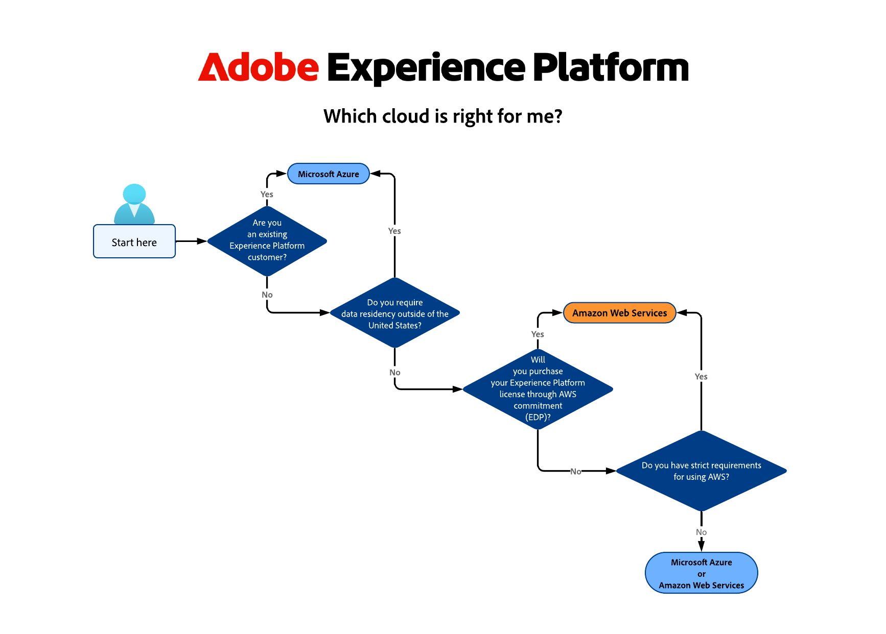

# Adobe Experience Platform multi-cloud概述

Adobe Experience Platform是一个多云产品，允许您选择在[[!DNL Microsoft Azure]](https://azure.microsoft.com/en-us)上运行还是[[!DNL Amazon Web Services (AWS)]](https://aws.amazon.com/)上运行。 这种灵活性允许您选择最适合您的业务和技术要求的最佳方案。

>[!AVAILABILITY]
>
>在Amazon Web Services (AWS)上运行的Adobe Experience Platform当前仅对有限数量的客户可用。 要了解有关AWSExperience Platform的更多信息，请联系您的Adobe客户团队。

本页提供了两种可用云基础架构的高级概述，并包含有关如何为您的企业选择合适云基础架构的指导。

## 哪个云实施适合我？ {#which-cloud-is-right}

在Azure或AWS上的Experience Platform之间进行选择取决于您业务特有的几个因素：

* **业务和技术需求**：评估您组织的需求和长期云策略。
* **现有基础架构**：考虑您当前的云基础架构和集成需求。
* **云技术依赖**：如果您的业务严重依赖于Microsoft技术，Azure可能更适合。 如果您更依靠Amazon服务，AWS可能是更好的选择。
* **数据驻留注意事项**：评估您组织的数据驻留要求，并确保所选的云平台提供符合这些法规的地区。

考虑到上述因素，使用此简化的决策树有助于根据您的业务需求确定正确的云实施。

{align="center" zoomable="yes"}

## 托管位置 {#available-cloud-regions}

选择正确的云区域对于满足数据驻留要求和确保最佳性能至关重要。

{align="center" zoomable="yes"}

Experience Platform位于六个Microsoft Azure托管位置、一个Amazon Web Services (AWS)托管位置，并通过分布在全球的七个[Edge Network节点](../collection/home.md#edge)将数据路由到Adobe服务。

### Microsoft Azure地区 {#azure-regions}

下表指示托管Experience Platform的Microsoft Azure区域。

| 国家/地区 | 区域代码 | 位置 |
|---------|-------------|----------|
| 美利坚合众国 | VA7 | 维吉尼亚 |
| 英国 | GBR9 | 伦敦 |
| 荷兰 | NDL2 | 阿姆斯特丹 |
| 加拿大 | CAN2 | 多伦多 |
| 印度 | IND2 | 马哈拉施特拉邦 |
| 澳大利亚 | AUS5 | 新南威尔士 |

{style="table-layout:auto"}

### Amazon Web Services (AWS)地区 {#aws-regions}

下表显示了托管Experience Platform的AWS区域。 请定期回来查看是否添加了其他位置。

| 国家/地区 | 区域代码 | 位置 |
|---------|-------------|----------|
| 美利坚合众国 | VA6 | 维吉尼亚 |

{style="table-layout:auto"}

## 功能等同性 {#feature-parity}

Adobe致力于为在Experience Platform上运行的所有应用程序提供跨云平台的功能对等性，例如：

* [Real-Time Customer Data Platform](../rtcdp/home.md)
* [Adobe Journey Optimizer](https://experienceleague.adobe.com/zh-hans/docs/journey-optimizer/using/ajo-home)
* [Customer Journey Analytics](https://experienceleague.adobe.com/zh-hans/docs/analytics-platform/using/cja-landing)

但是，Azure实施和AWS实施中的某些功能可能有所不同。 以下部分以及产品文档的其他部分中概述了这些差异（如果适用）。

### 在Microsoft Azure和AWS上运行Experience Platform之间的区别 {#azure-aws-differences}

下表重点介绍了在Microsoft Azure上运行Experience Platform与在AWS上运行受众之间的主要区别。

| 特性/功能 | Microsoft Azure | Amazon Web Services |
| --- | --- | --- |
| [HIPAA合规性](https://www.adobe.com/trust/compliance/hipaa-ready.html) | 支持 | 不支持 |
| [源连接器的目录](/help/sources/home.md) | 支持源目录中的所有连接器 | 可用的源连接器数量有限。 适用于AWS实施的任何源连接器都将在各自文档页面的页面顶部注释中标出。 |

{style="table-layout:auto"}

<!-- To be determined if we need to add this part about the AI Assistant 

| [Experience Platform AI Assistant](/help/ai-assistant/home.md) | Supported | Not supported |

-->

## 结论 {#conclusion}

通过为您提供在Microsoft Azure或Amazon Web Services上运行的选项，Experience Platform提供了灵活性和选择。 评估您的业务需求和现有基础架构，以便针对使用哪个云平台做出明智的决策。
