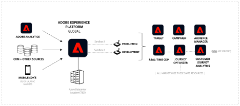

# Adobe Experience Platform面向多地区、多品牌企业

## 简介

Adobe Experience Platform在变革性解决方案方面处于领先地位，能够让您充分利用客户数据和内容的潜力。 借助Experience Platform，您可以集中和标准化来自不同系统的数据，并应用数据科学和机器学习的强大功能。 结果是增强了个性化体验的创建和交付，从而引起消费者的共鸣。

Experience Platform使您能够表示结构并管理您的业务数据，以实现可扩展、灵活的实施。 实施Platform应用程序需要战略规划和仔细的考虑，尤其是当您跨全球、区域和品牌特定的域或所有这些方面的组合进行操作时。

本白皮书提供了产品观点和一套指南，可作为参考。 其主要目标是为您和您的实施团队提供有效导航Experience Platform的复杂性所需的工具和见解。 它提供了一个用于评估您的特定要求、注意事项和实际用例的结构化框架，从而为您提供了充分发挥Experience Platform和基于平台的应用程序的潜力所需的知识。 在阅读以下各节时，您将找到宝贵的见解和推荐，以简化实施过程，提升贵组织向受众提供卓越体验的能力，同时提供治理和控制以维护隐私和合规性。


## 了解多品牌、多区域企业

如果您运营的是多品牌、多地区的企业，那么您可能对Experience Platform有独特的数据管理要求。 了解您的独特要求对于定制Experience Platform实施以最好地满足您的特定需求至关重要。

在浏览部署选项时，您需要了解并考虑将与Experience Platform和基于平台的应用程序交互的角色。 根据客户的角色和兴趣设计客户体验可确保成功实施。 探索选项时，您应该考虑以下三个关键角色：

**Mary，营销人员：**

- 重点：大规模客户获取和体验个性化。
- 目标：创建全面的用户档案，提高媒体效率。

**Ted，技术人员**

- 重点：组织数据管理。
- 目标：确保法规遵从性，管理数据孤岛，为各种业务提供服务。

**丹，数据架构师**

- 重点：数据的准确性和质量。
- 目标：确保数据隐私和信任，设计架构和数据模型，管理数据源。

### 以有限的数据隔离进行运营的企业

Experience Platform中的一个关键架构原则是，根据治理策略和要求，将客户数据限制到特定的生产沙盒。

如果您的组织需要单一的数据环境来大规模运营营销体验，您可能希望将所有数据整合到具有最低数据隔离要求的单个Experience Platform沙盒中。 在此设置中，数据被摄取到沙盒中，所有相关身份都表示为单个统一配置文件，无论是否由假名或已知身份进行标识。 这意味着您的营销人员可以在整个企业内访问Experience Platform中的所有配置文件属性和体验事件数据。 他们可以将这些数据与基于平台的应用程序结合使用，以创建受众和历程，而无需限制营销人员使用所有数据，而无论品牌或地区如何。 这种方法有助于将受众无缝分段和激活到Experience Platform应用程序支持的目标。 如果您希望利用整个客户群，而不考虑区域或品牌特定的差异，来进行统一且有凝聚力的营销工作，则此策略可很好地发挥作用。



#### 工作原理

让我们从规划实施和配置顶级环境开始。 接下来，您将决定以最佳方式为企业运行Experience Platform和基于平台的应用程序所需的沙箱、角色和权限数量。

##### 实施的一般设置

- 配置沙盒以生成统一的客户配置文件。
- 设置角色和访问控制以管理沙盒，并访问每个角色的功能。
- 使用开发沙盒和沙盒工具管理开发生命周期。

**沙盒**

沙盒是Experience Platform单个实例中的虚拟分区，允许与数字体验应用程序的开发过程无缝集成。 在沙盒内执行的所有内容和操作都限于该沙盒，不影响任何其他沙盒，包括数据和数据访问。 Experience Platform支持两种沙盒：

- **生产沙盒**：生产沙盒应该与生产环境中的用户档案一起使用。 Experience Platform允许您创建多个生产沙盒，以提供正确的数据功能，同时保持操作隔离。

- **开发沙盒**：开发沙盒可专门用于开发和测试非生产配置文件。

您可以创建任何类型的多个沙盒，对于此类型的企业，我们将使用一个生产和一个开发沙盒来说明如何运行和操作此类型的企业。


在生产沙盒中，我们期望您摄取生产配置文件和体验事件数据，为您的营销活动构建统一配置文件。 有关如何合并来自多个企业来源的已知和匿名数据以创建可用于实时跨所有渠道和设备提供个性化客户体验的客户配置文件的更多详细信息，请参阅[Adobe Real-Time Customer Data Platform文档](https://experienceleague.adobe.com/zh-hans/docs/experience-platform/rtcdp/home)。

**访问控制**

您可以定义具有角色和权限的访问控制，以根据角色及其所需功能来控制对应用程序资源的访问。 此外，您还可以选择限制对配置文件数据的特定字段的访问。 您应该深入思考此步骤，以便更好地管理Experience Platform、基于平台的应用程序和客户数据的使用。

考虑一位数据工程师，他可能不需要访问所有Experience Platform和基于平台的应用程序功能。 他们通常负责创建数据定义（架构）、配置数据源以摄取数据和创建数据集。 但是，他们可能与创建和激活受众以实现个性化客户体验的角色不同。 对于此角色，创建角色，添加适当的权限，并仅授予对所需功能的访问权限。 相反，营销人员角色不会创建架构和摄取数据，而是专注于创建和激活受众以实现个性化的客户体验。

如果需要，请考虑添加粒度访问控制，以限制对具有基于属性的访问控制/字段级访问控制功能的统一客户配置文件上特定字段的访问。 Experience Platform中的这些治理机制允许您根据预定义标签限制对数据属性的访问。 通过字段级访问控制，可以管理个人身份数据，并且所有Experience Platform和应用程序工作流的访问都受到限制。 有关访问控制功能的更多详细信息，请参阅[访问控制文档](https://experienceleague.adobe.com/en/docs/experience-platform/access-control/home)。


**使用开发沙盒的开发生命周期**

开发沙盒在所有功能方面的行为与生产沙盒的行为相同。 不同之处在于，它将提供一些合同保障，以使您保持在许可限制之内。 它专门针对具有非生产用户档案的开发和测试而设计，支持最多10%的许可用户档案承诺（在所有授权的开发沙盒中累积测量）。 有关其他详细信息和护栏，请参阅[沙盒概述文档](https://experienceleague.adobe.com/zh-hans/docs/experience-platform/sandbox/home)和[产品描述页面](https://helpx.adobe.com/legal/product-descriptions.html)以了解权利详细信息。

在开发和测试生命周期中，您可以有多个开发沙盒（在此企业示例中，最多有4个，因为我们正在使用一个生产沙盒）。

**使用沙盒工具导出和导入包**

沙盒工具功能允许具有适当权限的用户从开发沙盒打包其工作并将其导出到存储库。 其他用户可访问此存储库，可以将这些包导入其指定的沙盒中。 此功能可确保沙盒之间的配置保持一致，从而促进无缝的导出和导入过程。

使用沙盒工具可显着增强配置准确性并减少实施所需的时间。 它支持在不同的沙盒之间高效地移动成功的配置。

利用沙盒工具功能，您可以选择各种对象并将它们导出到包中。 一个包可以包含单个对象或多个对象，但所有对象必须源自同一沙盒。

**通过API实现沙盒自动化**

您可以选择使用Experience Platform API来自动执行沙盒部署和配置任务。 API允许对重复任务（如导出、导入或修改沙盒配置）进行可编程控制，如果您希望使用自动化工作流，则提供了灵活性。

有关沙盒工具的其他详细信息，请参阅[沙盒工具文档](https://experienceleague.adobe.com/en/docs/experience-platform/sandbox/ui/sandbox-tooling)。

|  |  |
| --- | --- |

### 区域或品牌特定数据隔离

如果您需要完全隔离（例如，区域或基于品牌），则可能需要遵循严格的数据访问策略或法律要求来操作，以限制品牌团队访问特定于其各自区域或品牌的数据。 您可以根据特定于区域或品牌的数据定义访问模式，以确保遵守内部、法规和数据治理协议。 如果您在高度管控的行业中运营（例如，处理PII数据），或者需要为不同的地理区域或品牌标识维护不同的分段数据，则此方法至关重要。


#### 工作原理

让我们从规划实施、配置顶级环境以及确定以最佳方式为企业运行Experience Platform和基于平台的应用程序所需的沙盒、角色和权限数量开始。

##### 多沙盒实施的常规设置

- 配置多个生产沙盒，以便能够在每个沙盒中构建统一的客户配置文件。

- 设置角色和访问控制以管理沙盒，并访问每个角色的功能。

- 使用沙盒工具管理开发生命周期。

- 全局报告和激活(聚合多个沙盒中的数据，以便使用Customer Journey Analytics进行跨组织分析)。

**沙盒**

与使用单个生产沙盒进行设置不同，如果您需要完全隔离数据和工作流，则可能需要更复杂的方法。 这是多个生产沙盒发挥作用的地方，每个沙盒代表根据您的特定需求定制的隔离单元。

如前所述，每个沙盒都是单个平台实例中的虚拟分区。 这些沙盒允许您在不干扰其他沙盒的控制环境中管理数据、工作流和流程。 虽然开发沙盒适用于具有非生产配置文件的测试和开发活动，但生产沙盒是实时操作的主干，支持为真实世界的营销活动摄取实际生产数据。

生产沙盒中清洁隔离的主要优势：

1. **数据治理和合规性：**&#x200B;如果您在受管控行业或具有严格数据隐私法律的区域运营，则需要确保来自一个区域或品牌的数据保持隔离。 利用多个生产沙盒，您可以确保仅在相应的沙盒内访问数据，从而遵守治理要求或特定于行业的标准。

2. **运营效率：**&#x200B;通过隔离数据和工作流，您可以更高效地管理您的运营。 您负责不同地区或品牌的团队可以在各自的专用沙盒中独立工作，无需担心意外数据泄露或未经授权的访问。

3. **自定义工作流：**&#x200B;您可以根据您所在地区的特定需求或它所代表的品牌定制每个生产沙盒。 这样，您就可以实施针对该区段优化的自定义工作流、数据模型和营销策略。

4. **可扩展性：**&#x200B;随着规模的增长，您可以轻松创建其他生产沙盒以适应新的地区或品牌。 这种可扩展性确保平台能够适应您不断变化的需求，而不会影响数据完整性或性能。

5. **增强控制：**&#x200B;使用多个生产沙盒，管理员可以更精细地控制访问权限、数据摄取和工作流的执行。 这使您能够采用更安全、更有条理的方法来管理全球企业中的复杂操作。

**访问控制**

在多个生产沙盒的上下文中，访问控制仍是Experience Platform中管理数据和工作流的关键组件。 但是，复杂性会增加，因为管理员必须确保用户只能访问与其角色相关的沙盒，同时仍然为需要跨沙盒操作的用户（例如跨越多个区域的营销团队或负责全局数据摄取和数据建模的数据工程师）启用跨沙盒操作。

**跨沙盒定义角色和权限：**

就像在单个生产沙盒场景中一样，您可以使用根据不同角色的需求定制的角色和权限来定义访问控制策略。 但是，您必须考虑在多沙盒环境中这些角色如何跨不同的沙盒扩展。

例如：

- **区域营销人员：**&#x200B;如果您的营销人员在多个区域运营，则其角色可能需要跨越多个沙盒。 您可以向他们授予跨多个沙盒访问资源的必要权限，同时确保他们的访问仍然限于每个沙盒内的相应数据和工作流。

- **数据工程师：**&#x200B;负责创建数据模型、定义架构和管理数据摄取的数据工程师可能需要访问所有沙盒。 您可以将他们的角色设计为允许他们在整个平台上操作，同时限制他们仅访问与其任务相关的功能和数据。 例如，您负责欧洲和北美数据模型的数据工程师可以访问这些地区的生产沙盒，并有权修改架构和摄取数据。 但是，他们将无法访问营销功能，例如创建和激活受众。

**粒度访问控制注意事项：**

在多沙盒环境中，粒度访问控制变得更为关键。 基于属性的访问控制（字段级访问控制/对象级访问控制）允许您进一步限制对配置文件或特定受众中特定数据字段的访问，确保敏感或个人身份信息(PII)在所有沙盒中受到保护。 例如：

- 您可以将访问沙盒中某些数据字段限制为该区域内的用户。 这可确保PII或敏感数据仅对需要它的人可见，并与隐私法规和内部治理策略保持一致。

- 对于具有跨沙盒访问的用户，基于属性的访问控制可确保，即使他们有权访问多个沙盒，他们对敏感数据的可见性也受其角色和知情需要基础的限制。

基于角色和基于属性的访问控制的好处：

1. 通过基于角色和属性来控制访问，可以显着降低未经授权的数据访问风险，确保只有具有适当权限的用户才能查看或操纵敏感信息。

2. 明确定义的角色和权限可简化操作，因为每个角色都可以访问所需的功能和数据，而不会出现不必要的混乱或风险。 此清晰度支持高效的工作流并减少摩擦。

3. 随着企业的发展和进步，可以调整访问控制以适应新的地区、品牌或角色。 在不中断现有工作流程的情况下灵活修改访问权限对于扩展操作至关重要。

4. 管理员可以保持对所有沙盒的集中控制，从而确保在企业中应用访问控制的一致性并允许对不同区域或品牌进行自定义。

**使用开发沙盒的开发生命周期**

在Experience Platform中跨多个地区和品牌管理您的开发生命周期，需要一种可靠的方法确保一致性、效率和可扩展性。 开发沙盒支持具有大量生产沙盒的复杂环境中的开发生命周期。 沙盒工具功能增强了配置共享和部署，实现了在不同环境之间的无缝配置共享和部署。

开发沙盒在开发生命周期中起着至关重要的作用。 这些沙盒提供了一个独立的环境，开发人员和数据工程师可以在其中构建、测试和迭代配置，而不会影响生产数据。 虽然开发沙盒在功能上与生产沙盒相似，但它们有所不同，因为它们用于测试非生产配置文件，并受合同限制约束，例如，在所有授权的开发沙盒中支持最多10%的许可配置文件承诺。

您可以创建多个开发沙盒以支持不同的团队或区域。 这使您的每个团队都可以试验特定于其区域或品牌的工作流，确保生产环境在开发期间保持稳定和安全。 如果您有许多生产沙盒，我们建议使用开发沙盒池来支持多个区域/品牌。

**使用沙盒工具导出和导入包**

如果您正在管理多个沙盒，则沙盒工具功能是一个功能强大的工具。 它允许开发人员、数据工程师和营销人员将其工作打包到一个开发沙盒中，包括架构、数据模型和其他配置，然后将它们导出到存储库。 从该位置，其他用户可以访问这些资源包并将其导入到其指定的沙盒中，从而促进在整个业务中无缝共享和部署成功的配置。

例如，在北美区域开发沙盒中工作的数据工程师可以创建架构并将其与所有依赖项打包。 其他地区（如欧洲）的另一位数据工程师可以访问此包，并将其导入到他们的地区沙盒中。 此过程可确保整个企业的数据建模和配置的一致性，从而降低错误风险并提高运营效率。

多沙盒环境中沙盒工具的好处：

1. 沙盒工具通过允许在多个沙盒之间轻松共享成功的配置，简化了开发生命周期。 这减少了重复工作，并确保在所有区域或品牌中一致地实施最佳实践。

2. 能够跨不同沙盒导出和导入资源包增强了企业内的互操作性。 不同地区的团队可以更有效地协作，确保他们的配置与总体企业目标一致，同时满足区域或品牌特定的要求。

3. 随着企业不断发展并添加更多沙盒以适应新的区域或品牌，沙盒工具提供了高效管理这些环境所需的可扩展性。 新沙盒可以使用现有包快速配置，加快载入流程并减少上线所需的时间。

4. 通过将配置和依赖项打包到开发沙盒中，然后部署到生产沙盒中，企业可以确保其配置准确且全面一致。 这降低了出现错误的可能性，并提高了平台的整体可靠性。

5. 使用沙盒工具，可以顺利和控制从开发到生产的过渡。 一旦在开发沙盒中测试并验证配置，即可将其导出并导入生产沙盒，并确信它们会按预期执行。

**全局报告和激活**

这需要从多个沙盒中聚合数据以获得跨组织见解，通常需要专用报表沙盒才能与Customer Journey Analytics集成。

虽然多生产沙盒方法明显为地区和品牌特定的操作提供了隔离优势，但它也带来了需要创新解决方案的挑战。 一个关键挑战是能够跨沙盒分析数据以进行全局报告和全局营销活动。 企业通常需要在全球级别了解客户历程，其中涉及集成来自多个沙盒的数据并启用跨沙盒营销工作。 我们将在下面概述应对这些挑战的方法。

**跨沙盒的全局报告**

当企业使用多个生产沙盒（每个沙盒代表一个地区或品牌）运行时，跨所有沙盒分析客户数据变得复杂。 例如，跨不同品牌创建客户历程的统一视图需要整合来自这些独立环境的数据。

**专用全局沙盒**


此沙盒用作中央存储库，其中合并来自各个区域或品牌特定沙盒的数据。 一种常见解决方案是在每个沙盒中使用查询服务来提取相关的客户数据。 这可能包括需要跨不同区域或品牌分析的用户档案和体验事件。 从每个沙盒中准备好数据后，该数据会被摄取到全局报告沙盒中，用于分析和创建受众。

使用Customer Journey Analytics对全球沙盒中的聚合数据执行跨市场和跨品牌分析，全面了解所有品牌和地区的客户互动。 这使得他们可以生成有价值的洞察，例如识别与多个品牌互动的客户，以及创建跨品牌或跨区域受众。 这些见解可用于各种目的，包括激活营销策略、个性化客户体验以及推动企业增长。

**受众共享**

全球沙盒还使全球营销团队能够在更广泛的范围内定义和管理受众。 使用沙盒工具，这些全局受众（仅限定义，而非数据）可以从全局沙盒导出到单个品牌或区域沙盒，从而允许本地营销团队在其各自的市场中评估和激活它们。

此外，您可以利用Experience Platform区段匹配，这是Platform中的一项功能，支持在不同组织单位或业务实体之间进行跨沙盒区段共享（符合条件的受众）。

该区段共享服务允许两个或更多用户以安全、受管且有利于隐私的方式交换区段数据。

有关区段匹配功能的更多详细信息，请参阅[区段匹配文档](https://experienceleague.adobe.com/en/docs/experience-platform/segmentation/ui/segment-match/overview)。

### 针对全球运营、地区和品牌的特定方法组合

许多多品牌企业都在全球范围内运营，因此往往寻求统一和独立的数据管理方法相结合的解决方案。 在此场景中，他们尝试为多个区域或国家分离数据。 组织内的品牌可以期望仅对与其特定品牌关联的数据进行操作，而所有这些操作都在地理区域或国家/地区的相同数据边界内。 这种方法允许集中管理区域或国家/地区数据，同时仍便于特定品牌的营销和数据操作。 它是一种将统一数据管理的优势与特定于品牌和区域的隔离的必要性相结合的模型。

认识到这些不同的需求，可以将Experience Platform配置为为您提供高度适应性和灵活的数据管理解决方案，确保多品牌、多区域企业能够有效地在平台中展示您的业务。 无论目标是最大化客户集体数据，保持严格的数据隔离，还是实现两者之间的平衡，Experience Platform都能满足您企业的各种需求。


#### 工作原理

让我们从规划您的实施、配置您的顶级环境，以及确定为此企业以最佳方式运行Experience Platform和基于平台的应用程序所需的沙箱、角色和权限的数量开始。

##### 此企业的一般设置

- 配置多个生产沙盒以生成统一的客户配置文件。

- 设置角色和访问控制以管理沙盒，并访问每个角色的功能。

- 设置基于属性的访问控制：字段级访问控制/对象级访问控制，可对配置文件属性和受众进行细粒度控制。

- 使用开发沙盒和沙盒工具管理开发生命周期。

- 全局报告。

**沙盒**

为每个品牌/区域设置沙盒。 请参阅以上部分，了解如何创建多个生产沙箱。

**访问控制**

角色和用户权限：

- 创建角色“**营销人员 — 全局**”，并授予创建、查看和管理受众的权限。 此外，此角色将获得查看所有客户数据的权限。

- 创建角色并仅向正确的角色授予对某些功能的访问权限。 例如，用户角色“**Marketer—Germany**”和“**Marketer—France**”将仅获得创建、查看和管理国家/地区数据受众的权限，而国家/地区数据是通过字段级访问控制、对象级访问控制和默认受众的组合启用的。

- 创建角色“**技术专家 — 全局**”，并授予创建和管理架构、数据集、策略、源等的正确权限。 此角色将负责所有必要的管理和配置。

###### 架构设计和基于属性的访问控制：字段级访问控制

**体验数据模型(XDM)**

Experience Platform中的标准化数据架构，确保所有基于平台的应用程序的数据结构和互操作性保持一致。

**基于属性的访问控制：字段级访问控制和数据建模选项：**

- 创建数据模型以包含应为各个国家/地区限制的特定于租户的XDM字段(PII)。

- 创建国家/地区标签并将其应用于XDM字段。 标签=德国、法国、爱尔兰、荷兰等

- 将标签添加到适当的角色。 例如，将标签Germany添加到角色“Marketer—Germany”中。

XDM Individual Profile架构：

```
\- PII
\- Germany
    \- name --> Label: "Germany"
    \- email --> Label: "Germany"
    \- birthdate --> Label: "Germany"

\- France
    \- name --> Label: "France"
    \- email --> Label: "France"
    \- birthdate --> Label: "France"

\- Netherland
    \- name --> Label: "Netherland", "Germany"
    \- email --> Label: "Netherland", "Germany"
    \- birthdate --> Label: "Netherland", "Germany"

\- Loyalty
    \- member
    \- registrationDate
```

###### 受众：使用基于属性的访问控制：对象级别访问控制对特定于品牌/国家/地区的受众的访问

**基于属性的访问控制：受众的对象级访问控制：**

- 创建受众并控制可查看这些受众的人员。

- 创建国家/地区标签并将其应用于受众。 标签=德国、法国、爱尔兰、荷兰等。

- 将标签添加到适当的角色。 例如，将标签“Germany”添加到角色“Marketer—Germany”中。


###### 在创建特定于品牌/国家/地区的受众时包含默认受众

**默认受众：行级访问控制的替代项：**

- 目前，通过受众生成器，您可以在受众创建过程中将现有受众作为构建块包含在内。

- 结果将派生自受众，其后是属性和事件。

- 在组合时没有自动添加一个或多个受众的机制。


###### 激活和品牌/国家/地区级别配置文件过滤

**自定义同意策略选项：**

这允许您在激活时控制或筛选用户档案：

- 创建营销活动。

- 创建目标并关联营销操作。

- 创建自定义同意策略。

>[!NOTE]
>
> 需要Privacy and Security Shield SKU才能创建同意策略。


多品牌激活和同意策略复杂性：

跨多个品牌管理受众激活需要对同意策略进行详细治理，确保满足每个品牌的独特要求。 此外，Adobe Privacy and Security Shield(Experience Platform中的合规功能，可实施数据保护策略并确保跨不同激活渠道的合规性)可能会对如何跨不同激活渠道实施同意策略施加特定限制。 您应仔细评估这些考虑因素，并实施治理框架，以保持合规性和运营效率。

您还必须仔细浏览有关同意策略配置和特定于渠道的激活的复杂性。 为每个地区或品牌明确定义同意策略并一致地管理这些配置对于合规性和运营效率至关重要。

## 一般注意事项

在某些情况下，您可能会选择跨多个组织ID部署Experience Platform和基于平台的应用程序，而不是使用具有多个沙盒的单个组织ID。 此方法可以在数据驻留、安全性和管理方面带来好处，但也会带来复杂性。 以下是确定多组织方法何时适用的关键考虑因素。

### 什么是组织ID

- 组织ID是Adobe对Federated ID和OAuth 2.0协议的实施。

- 组织ID是组织根据其Adobe合同条款有权访问的所有应用程序、用户和权限的集合。

- 用户帐户和权限通过每个组织的Admin Console进行管理。

- 组织ID还可管理Adobe解决方案如何相互交互。 同一组织内的解决方案可以具有互操作性。

- 通常，组织ID部署在单个地理区域中。


**多个组织ID：优点和注意事项&#x200B;**

| 优点 | 注意事项 |
| -------- | -------------- |
| 以下是拥有多个组织ID的好处列表： <ul><li>在特定全球区域灵活地存储数据。</li><li>每&#x200B;个实例单独的用户登录 — 即Wholefoods无法登录Audible&#x200B;。</li><li>专用API端点，使每个市场/业务部能够根据需要在其自己的环境中构建自定义连接&#x200B;。</li><li>每个业务部门都有自己的客户管理密钥&#x200B;。</li><li>GDPR请求可以按业务部门发&#x200B;出。</li><li>业务部门之间完全隔离的存储和计算&#x200B;。</li><li>减轻一些组织级别的性能护栏/限制&#x200B;。</li><li>在业务部门之间调配和混合SKU的灵活性更高。 例如，一个组织可以具有与其他组织不同的Adobe Journey Optimizer SKU。</li></ul> | 以下是拥有多个组织ID时应考虑的事项： <ul><li>要管理的多个组织ID，而不是一个ID&#x200B;。</li><li>要管理的多个单独实例/环境（集成、数据加载等）。</li><li>每个组织的&#x200B;ECID都是唯一的，因此很难在业务部门之间匹配数据&#x200B;。</li><li>需要为每个组织迁移/重新实施Analytics和Target — 失去全局汇总（如果当前正在使用中）&#x200B;。</li><li>跨业务部门发出GDPR请求需要进行更多编排&#x200B;。</li><li>某些基于Experience Platform的应用程序集成在组织级别存储元数据。 并非所有东西都被“沙箱”所“沙箱”&#x200B;。</li><li>组织ID已固定到区域。 Adobe AWS托管位置当前仅位于美国。 Adobe不支持从一个托管区域迁移到另一个托管区域。&#x200B;</li><li>Edge不识别沙盒（用于事件转发）。</li></ul> |

**单个组织ID：优点和注意事项**


| 优点 | 注意事项 |
| -------- | -------------- |
| 以下是拥有单个组织ID的好处列表： <ul><li>配置单个沙盒以在已部署区域中的业务单元之间创建逻辑分离</li><li>IT部门可以管理单个组织ID以用于用户、资源调配等。</li><li>如果保持相同的组织ID，则不会迁移Adobe Tags、Target、Analytics等。</li><li>现有ECID无需重置 — 防止Adobe Analytics数据中的“断涯式变化”。</li><li>全局营销资源的单点登录。</li><li>用户访问权限，以控制谁有权访问哪些沙盒，并提供基于角色的访问控制的适当级别。</li><li>利用Global Analytics和Target实例以及报表包数据。</li></ul> | 以下是拥有单个组织ID时应考虑的事项： <ul><li>数据将存储在单个区域中。</li><li>可能需要将数据整合到单个组织ID中。</li><li>所有业务部门都将跨应用程序(核心Experience Platform、Real-Time CDP、Adobe Journey Optimizer、Customer Journey Analytics)共享相同的基础架构。</li><li>护栏：某些护栏是每个组织的全局护栏，例如流式客户细分，即1.5k RPS。</li><li>GDPR请求在组织级别运行，不能以特定沙盒为目标。</li><li>客户管理的密钥在组织ID级别设置 — 所有业务部门沙盒将使用此方法共享相同的加密密钥。</li><li>需要明确跨DX和CC的企业许可，以确保以正确的组织ID配置应用程序。</ul></li> |

**优点和注意事项**

多个组织ID在组织级别控制用户访问、权限和数据分离，而单个组织ID在沙盒级别控制。

| 方案/要求 | 多个组织ID | 多个沙盒（单个组织ID） |
| ----------------------------------- | --------------------------------------------------- | ----------------------------------------------- |
| 数据驻留 | 完全隔离和特定于区域的组织ID | 单一区域部署 |
| 数据治理和隔离 | 完全分离和隔离 | 操作隔离，共享组织ID |
| 合规性管理（例如GDPR） | 每个组织ID的单独请求 | 单个请求适用于多个沙盒 |
| 基础架构成本和许可 | 由于设置重复，可能更高 | 通常使用集中管理降低 |
| 全局报告和激活 | 由于环境孤立，难以应对 | 更轻松的跨区域报告和激活 |
| 管理复杂性 | 由于多个独立的组织ID，其数量会更高 | 更低级、集中化的管理 |

## 总结性结论

Experience Platform为企业提供了一个强大的框架，用于跨多品牌、多区域业务模型集中、管理和激活客户数据。 本白皮书探讨了关键部署策略、治理模型和最佳实践，以优化具有不同数据隔离和运营需求的组织的Experience Platform实施。

## 主要要点

1. **灵活的部署模型**

   - 企业可以根据其运营、合规性和治理要求，选择&#x200B;**单沙盒、多沙盒或混合方法**。

   - **全球组织**&#x200B;可能需要多个生产沙盒以符合治理要求，同时保持运营效率。

2. **数据治理和访问控制**

   - **基于属性的访问控制、字段级访问控制和对象级访问控制**&#x200B;可以精确管理数据访问。

   - 您必须为不同角色（例如，营销人员、数据架构师和IT团队）定义&#x200B;**清除角色和权限**，以确保正确使用数据。

3. **沙盒工具和自动化**

   - **沙盒工具**&#x200B;简化了配置管理，允许团队高效地导出和导入设置。

   - **基于API的自动化**&#x200B;是希望大规模简化沙盒部署和治理的企业可用的选项。

4. **全局报告和激活策略**

   - 利用&#x200B;**Customer Journey Analytics**&#x200B;的企业在合并全球报表时必须考虑数据同步和商业影响。

   - **区段匹配**&#x200B;为跨沙盒受众共享提供了符合隐私的机制，从而确保无缝营销激活。

5. **多组织ID与多沙盒注意事项**

   - 您必须根据数据驻留、法规遵从性和操作需要，仔细评估是部署&#x200B;**多个组织ID还是部署多个沙盒**。

   - **组织ID**&#x200B;提供完全隔离&#x200B;**，而多沙盒设置可在共享治理框架中提供操作灵活性**。

## 最后想法

随着企业扩展其数字体验功能，Experience Platform将成为推动数据驱动营销、客户情报和跨渠道激活的基础平台。 成功实施需要仔细规划&#x200B;**沙盒治理、合规性策略和操作工作流**，以确保长期效率和可扩展性。

通过利用本白皮书概述的最佳实践，您可以&#x200B;**优化Experience Platform以实现多品牌和多区域操作**，从而确保无缝的数据管理、合规性和大规模个性化客户体验。

## 确认

本白皮书是在各团队的主题专家提供见解和反馈后撰写的，旨在确保准确性、清晰性和实用性指导。 我们感谢所有同事的宝贵贡献和评论。 他们的专业知识帮助完善了此文档，以更好地服务于在多品牌、多区域环境中实施Adobe Experience Platform的企业。
