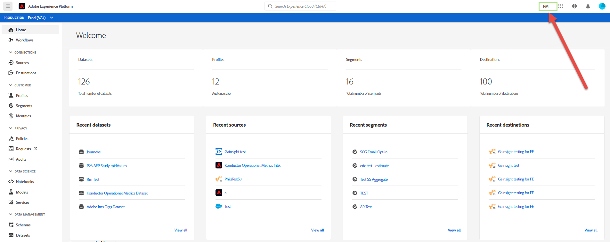

# Adobe Experience PlatformUI指南

本指南介绍如何使用Adobe Experience Platform用户界面(UI)，说明各个组件的用途，并提供指向进一步文档的链接以了解更多信息。

要了解有关Adobe Experience Platform的更多信息，请阅读 [Experience Platform概述](./home.md)。

## 主屏幕

登录Adobe Experience Platform后，您将进入主 [!UICONTROL 页] ，主页包括度量仪表板、最近数据和推荐的学习部分。

### 指标仪表板

量度仪表板提供卡，可为您提供有关组织内数据集、用户档案、细分和目标的信息。

“数 **[!UICONTROL 据集]** ”部分显示IMS组织内的数据集数。 此数字在创建新数据集时更新。 有关数据集的更多信息，请参阅 [数据集概述](../catalog/datasets/overview.md)。

用户档案 **[!UICONTROL 部分]** 显示IMS组织内具有用户档案的人员总数，不包括用户档案片段。 此总人数代表可寻址受众总数，每24小时更新一次。 有关用户档案的更多信息，请参 [阅实时用户档案概述](../profile/home.md)。

“ **[!UICONTROL 区段]** ”部分显示在IMS组织内创建的区段总数。 此编号在创建新区段时更新。 有关区段的更多信息，请参阅 [分段服务概述](../segmentation/home.md)。

“目 **[!UICONTROL 标]** ”部分显示为IMS组织创建的目标总数。 此编号在创建新目标时更新。 有关目标的更多信息，请参阅目 [标概述](../rtcdp/destinations/destinations-overview.md)。

### 最近数据

最近的数据仪表板提供有关最近创建的数据集、源、区段和目标的信息。

“最 **[!UICONTROL 近的数据集]** ”部分列表了IMS组织中最近创建的五个数据集。 每次创建新列表集时，都会更新此数据集。 您可以从列表中选择数据集以视图有关指定数据集的更多信息，或选择 **[!UICONTROL 全部视图]** 以查看所有创建数据集的列表。 有关数据集的更多信息，请参阅 [数据集概述](../catalog/datasets/overview.md)。

“最 **[!UICONTROL 近源]** ”部分列表您IMS组织中最近创建的五个源连接器。 每次创建新的源连接器时，都会更新此列表。 您可以从列表中选择源连接以视图有关指定连接器的更多信息，或选择 **[!UICONTROL 全部视图]** 以查看所有已创建源连接的列表。 有关源的详细信息，请参阅源 [概述](../sources/home.md)。

“最 **[!UICONTROL 近区段]** ”部分列表了IMS组织中最近创建的五个区段定义。 此列表在每次创建新的区段定义时更新。 您可以从列表中选择区段定义以视图有关指定区段定义的更多信息，或选择 **[!UICONTROL 全部视图]** ，以查看所有创建的区段定义的列表。 有关区段的更多信息，请参阅 [分段服务概述](../segmentation/home.md)。

“最 **[!UICONTROL 近目标]** ”部分列表您IMS组织内最近创建的五个目标。 每次创建新目标时，都会更新此列表。 您可以从列表中选择目标，以视图有关指定目标的更多信息，或选择全 **[!UICONTROL 部视图]** ，以查看所有已创建目标的列表。 有关目标的更多信息，请参阅目 [标概述](../rtcdp/destinations/destinations-overview.md)。

### 推荐学习

推荐 **[!UICONTROL 的学习部分]** ，提供有用文档的链接，以便开始学习Adobe Experience Platform。

## 顶部导航栏

平台UI中的顶部导航栏显示您当前登录的IMS组织，并提供几个重要控件。

导航栏的左侧是Adobe Experience Platform徽标。 选择此选项将返回平台UI主屏幕。

### IMS组织切换程序

导航栏右侧的第一个项目是IMS组 **织切换程序**。

选择切换器将打开您有权访问的IMS组织的下拉菜单（如果有）。 选择列出的选项以切换到该IMS组织。

### 切换应用程序

右侧的下一个项目是应用程 **序切换器**，由应用程序  表示。 选择此图标后，您可以在Experience Platform、资产、交换和启动之间切换。

### 帮助

应用程序切换器右侧是“帮 **助和支持”菜单**，该菜单由问  。 选择此图标时，将显示一个弹出菜单，其中包含多个帮助和支持资源。 “ **[!UICONTROL 帮助]** ”选项卡显示当前所在页面的相关文档列表。 “支 **[!UICONTROL 持]** ”选项卡允许您与Adobe支持团队一起创建支持票证。 反馈 **[!UICONTROL 选项卡]** ，允许您向Adobe提交有关平台的反馈。

### 通知和通知

帮助和支持菜单后，将显示 **通知部分**，该部分由铃  。 “通 **[!UICONTROL 知]** ”选项卡显示有关产品和其他相关更新的重要信息，而“ **[!UICONTROL 通知]** ”选项卡显示有关服务维护的通知。

### 用户用户档案

顶部导航栏上的最后一项是用户 **设置**，它由用户设  。 选择此图标可编辑您的首选项或注销。

### 沙盒

顶部导航栏的正下方是沙箱栏。 此栏显示您当前正在为平台使用的沙箱。 有关沙箱的更多信息，请参阅 [沙箱概述](../sandboxes/home.md)。

## 左侧导航 {#left-nav}

屏幕左侧的导航将列表平台UI中支持的所有不同服务。

>[!IMPORTANT]
>
>左侧导航栏上的某些部分可能不显示或灰显。 这是因为您无权访问这些功能。 如果您认为您应有权访问这些部分，请与系统管理员联系。

“主 **[!UICONTROL 页]** ”部分允许您返回平台UI主页。

工作流 **[!UICONTROL 部分]** 显示了在平台内执行操作的多步骤工作流的列表。 有关工作流的更多信息，请参阅 [工作流概述](./workflows.md)。

### [!UICONTROL 连接]

“ **[!UICONTROL 源]** ”部分允许您创建、更新和删除源连接，允许您将外部源的数据引入平台。 有关源的详细信息，请参阅源 [概述](../sources/home.md)。

“目 **[!UICONTROL 标]** ”部分允许您创建、更新和删除目标，允许您将数据从平台导出到许多外部目标。 有关目标的更多信息，请参阅目 [标概述](../rtcdp/destinations/destinations-overview.md)。

### [!UICONTROL 客户]

通过 **[!UICONTROL 用户档案]** 部分，您可以浏览客户用户档案、视图用户档案指标、创建和管理合并策略以及视图合并模式。 要进一步了解如何使用 [!UICONTROL 用户档案] ，请阅读 [[!DNL Profile] 用户指南](../profile/ui/user-guide.md)。 有关实时客户用户档案的更多信息，请参 [阅实时客户用户档案概述](../profile/home.md)。

通过 **[!UICONTROL 区段]** ，您可以创建和管理区段定义。 要了解有关使用“区段” [!UICONTROL 部分的更] 多信息，请阅读 [分段用户指南](../segmentation/ui/overview.md)。 有关Segmentation Service的更多信息，请参阅Segmentation Service [概述](../segmentation/home.md)。

通过 **[!UICONTROL “身份]** ”部分，您可以创建和管理身份命名空间。 有关“身份”部 [!UICONTROL 分的更多信息] ，包括有关身份命名空间以及如何在平台UI中使用身份的信息，请参阅 [身份命名空间概述](../identity-service/namespaces.md)。

### [!UICONTROL 隐私权]

“策 **[!UICONTROL 略]** ”部分允许您创建和管理数据使用策略。 要进一步了解如何使用“策略”部分，请阅读 [数据使用策略用户指南](../data-governance/policies/user-guide.md)。 有关数据使用策略的详细信息，请参阅数 [据使用策略概述](../data-governance/policies/overview.md)。

通过 **[!UICONTROL “请求]** ”部分，您可以创建和管理隐私请求。 请注意，必须列入允许列表您才能访问Privacy ServiceUI。 要进一步了解如何使用“请求”部分，请阅读 [Privacy Service用户指南](../privacy-service/ui/user-guide.md)。 有关Privacy Service的更多信息，请参阅 [Privacy Service概述](../privacy-service/home.md)。

### [!UICONTROL 数据科学]

笔记 **[!UICONTROL 本电脑]** (Notebooks)部分提供对JupyterLab的访问，JupyterLab是一个交互式开发环境，它允许您探索、分析和模拟数据。 要进一步了解如何使用“笔记本”部分，请阅 [读JupyterLab用户指南](../data-science-workspace/jupyterlab/overview.md)。 有关数据科学工作区的更多信息，请参 [阅数据科学工作区](../data-science-workspace/home.md)

“模 **[!UICONTROL 型]** ”部分允许您利用机器学习和人工智能创建、开发、培训和调整模型以进行预测。 有关“模型”(Models)部分的更多信息，请参 [阅培训和评估模型的教程](../data-science-workspace/models-recipes/train-evaluate-model-ui.md)。

“服 **[!UICONTROL 务]** ”部分允许您管理已发布的模型以进行定期培训和评分，或利用Adobe的智能服务，这是一组AI服务，可提供实时、个性化的客户体验。 有关“服务”部分的更多信息，请参 [阅将模型作为服务发布教程](../data-science-workspace/models-recipes/publish-model-service-ui.md)。

### [!UICONTROL 数据管理]

模式 **[!UICONTROL 部分]** ，允许您创建和管理模式。 要进一步了解如何使用模式部分，请阅读有关创建 [模式的教程](../xdm/tutorials/create-schema-ui.md)。 有关体验数据模型(XDM)的更多信息，请参 [阅XDM概述](../xdm/home.md)。

数据 **[!UICONTROL 集]** (Datasets)部分允许您创建和管理数据集。 有关“数据集”部分的更多信息，请参 [阅数据集用户指南](../catalog/datasets/user-guide.md)。

通过 **[!UICONTROL 查询]** 部分，可以创建和管理查询，记录查询服务创建的SQL查询，并视图PostgreSQL凭据。 有关查询部分的更多信息，请参阅 [查询服务用户指南](../query-service/ui/overview.md)。

“监 **[!UICONTROL 视]** ”部分允许您监视批处理和流摄取。 有关“监视”部分的更多信息，请参阅“监 [视数据获取用户指南”](../ingestion/quality/monitor-data-flows.md)。

## 后续步骤

阅读本指南后，您现在已介绍平台UI的主页和主要导航元素。 有关在用户界面中工作的更多详细信息，请参阅每个平台服务的相关文档。 指向此文档的链接位于此文档 [前面的左](#left-nav) 侧导航部分中。